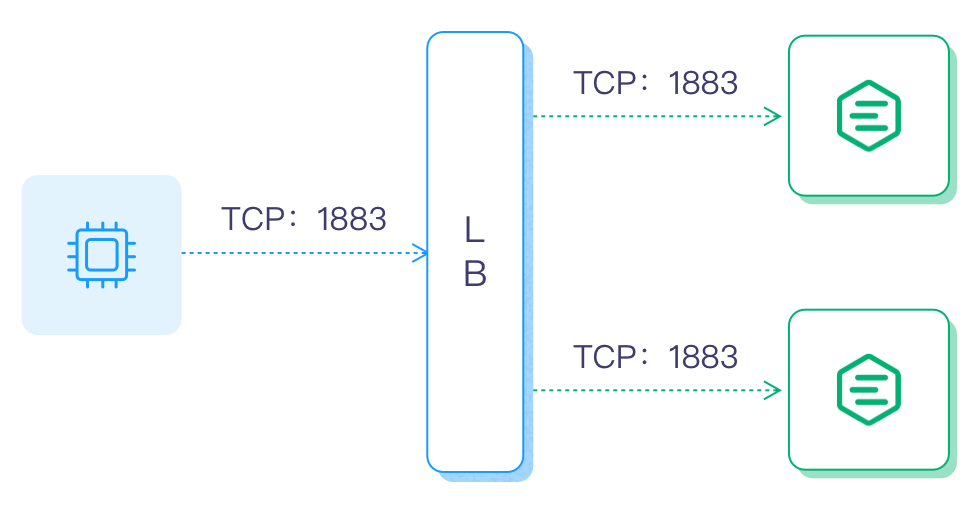
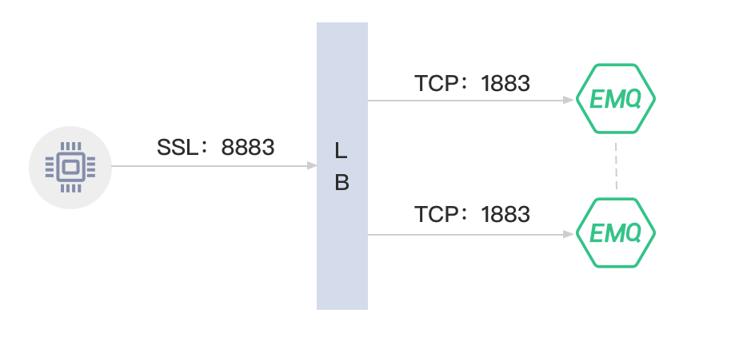

# Configure Load Balancer

Load Balancer (LB) balances the load among multiple network components and optimizes resource usage to avoid system malfunctions caused by overload. LB is not a mandatory component in EMQX, but it can bring some obvious system benefits, for example:

- Balance the load of EMQX to avoid single node overload;
- Simplify client configuration, the client only needs to connect to the LB and need not worry about the scaling within the cluster;
- TLS/SSL termination, to reduce the load of EMQX clusters;
- Improve cluster security, with LB configured at the front end of the cluster, unwanted traffic can be blocked to protect the EMQX cluster from malicious attacks. 

This chapter introduces how to configure LB in EMQX. 

## Architecture

For an EMQX cluster configured with LB, the LB will handle the incoming TCP traffic and then distribute the received MQTT connection requests and messages to different EMQX nodes. The typical deployment architecture is as follows:




If SSL/TLS is enabled, it is recommended to terminate the SSL/TLS connection at LB, that is, to use SSL/TLS to secure the connection between clients and LB and then use TCP connection between LB and EMQX nodes, maximizing the performance of the EMQX cluster. The architecture is as follows:




:::tip

You can also use DNS polling for load balancing for test or development purposes. 

:::

## Select an LB Product

Many load-balancing products are currently available, including open-source and commercial editions, and public cloud providers also have their load-balancing services.

LB products for public cloud:

| Cloud provider                            | SSL Termination | LB Product                                                  |
| ----------------------------------------- | --------------- | ----------------------------------------------------------- |
| [AWS](https://aws.amazon.com)             | Yes             | <https://aws.amazon.com/elasticloadbalancing/?nc1=h_ls>     |
| [Azure](https://azure.microsoft.com)      | Unknown         | <https://azure.microsoft.com/en-us/products/load-balancer/> |
| [Google Cloud](https://cloud.google.com/) | Yes             | <https://cloud.google.com/load-balancing>                   |

 LB products for private cloud:

| Open-Source LB                     | SSL Termination | DOC/URL                                                 |
| ---------------------------------- | --------------- | ------------------------------------------------------- |
| [HAProxy](https://www.haproxy.org) | Yes             | <https://www.haproxy.com/solutions/load-balancing.html> |
| [NGINX](https://www.nginx.com)     | Yes             | <https://www.nginx.com/solutions/load-balancing/>       |

The following section takes the HAProxy or NGINX as an example to illustrate how to configure an LB in EMQX cluster. 

## Configure HAProxy/NGINX in EMQX

Suppose you have a cluster with 2 EMQX nodes, with emqx1 on `192.168.0.2` and emqx2 on `192.168.0.3`, you can follow the steps below to add HAProxy or NGINX as the LB.

### Enable Proxy Protocol

To configure the HAProxy or Nginx on port 1883, you first need to enable the configuration item `proxy_protocol` in `emqx.conf` by setting it to `true`, also specify the true source IP and the port number of the client:

**Code Example**:

```
listeners.tcp.default {
  bind = "0.0.0.0:1883"
  max_connections = 1024000

  proxy_protocol = true
}
```

Where:  <!--the explanations need a review-->

- `listeners.tcp.default` is the name or identifier of the TCP listener configuration.
- `bind` is the network interface and port the LB is bound, default: `1883`
- `max_connections` is the maximum number of concurrent connections allowed by the listener, default: `infinity`
- `proxy_protocol` is to enable/disable the proxy protocol, it is a boolean, default: `false`. 

:::tip

For proxy protocols and that used in Nginx, see: 

- Proxy protocol: https://www.haproxy.com/blog/haproxy/proxy-protocol

- Nginx: [https://docs.nginx.com/nginx/admin-guide/load-balancer/using-proxy-protocol/](https://docs.nginx.com/nginx/admin-guide/load-balancer/using-proxy-protocol/)

  :::

### Configure HAProxy/NGINX

:::: tabs type:card

::: tab Configure HAProxy 

**Prerequisite**: HAProxy installed. For detailed introduction and installation of HAProxy, see [HAProxy website](http://www.haproxy.org/).

To configure HAProxy as the LB for EMQX and terminate the SSL connection, you can modify `/etc/haproxy/haproxy.cfg` following the code example below. 

In this example, you have a cluster that handles a maximum of 50,000 concurrent connections (`maxconn`). You want to configure the HAProxy to monitor all incoming traffic encrypted in SSL (with SSL certificate located at `/etc/ssl/emqx/emq.pem`) on port `8883` and also to terminate the SSL connectoin, using the `source` load balancing algorithm. <!--the explanation to be reviewed -->

```bash
listen mqtt-ssl
  bind *:8883 ssl crt /etc/ssl/emqx/emq.pem no-sslv3
  mode tcp
  maxconn 50000
  timeout client 600s
  default_backend emqx_cluster

backend emqx_cluster
  mode tcp
  balance source
  timeout server 50s
  timeout check 5000
  server emqx1 192.168.0.2:1883 check inter 10000 fall 2 rise 5 weight 1
  server emqx2 192.168.0.3:1883 check inter 10000 fall 2 rise 5 weight 1
```

Note: The file path may differ based on your installation mode. <!--should we also add the parameter explanation? -->

:::

::: tab Configure NGINX

**Prerequisite**: NGINX installed. For detailed introduction and installation of HAProxy, see [Nginx website](https://www.nginx.com/).

In this example, you want to configure the NGINX LB that listens for incoming connections on port `8883` encrypted in SSL and also to terminate the SSL connection, and then it will forward those connections to one of two upstream servers using the `stream` module. <!--the explanation to be reviewed and whether it is sufficient-->

To configure NGINX as the LB for EMQX and terminate the SSL connection, you can modify `/etc/nginx/nginx.conf` following the code example below. 

```bash
stream {
  upstream stream_backend {
      zone tcp_servers 64k;
      hash $remote_addr;
      server 192.168.0.2:1883 max_fails=2 fail_timeout=30s;
      server 192.168.0.3:1883 max_fails=2 fail_timeout=30s;
  }

  server {
      listen 8883 ssl;
      status_zone tcp_server;
      proxy_pass stream_backend;
      proxy_buffer_size 4k;
      ssl_handshake_timeout 15s;
      ssl_certificate     /etc/emqx/certs/cert.pem;
      ssl_certificate_key /etc/emqx/certs/key.pem;
  }
}
```

Note: The file path may differ based on your installation mode. <!--should we also add the parameter explanation? -->

:::

::::
