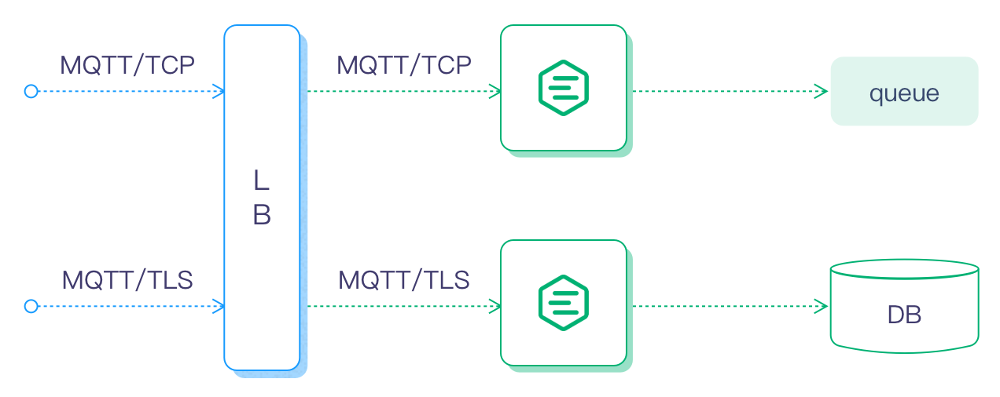
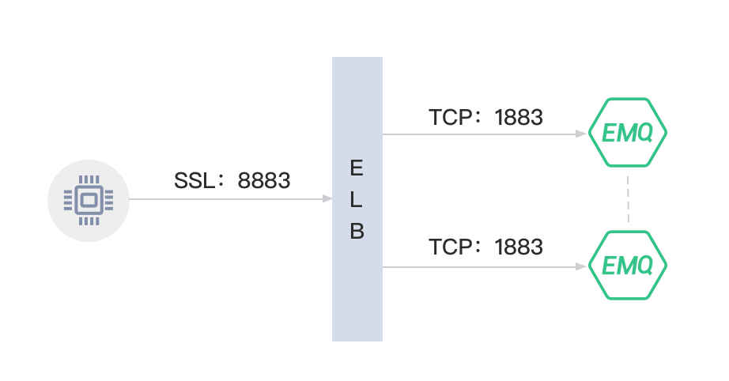

# Load Balancing

During development, we usually use compressed packages to start services in the form of a single node. However, production operation requires a more robust way of deployment. This page focuses on deploying your EMQX service using best practices for production deployment.

::: tip

If the EMQX cluster is deployed behind HAProxy or Nginx, and you need to get the real source IP address and port of the clients, you need to turn on the Proxy Protocol configuration with the following configuration item: [EMQX listener proxy_protocol](../../configuration/configuration-manual.md)

`Proxy Protcol` Reference: [https://www.haproxy.com/blog/haproxy/proxy-protocol](https://www.haproxy.com/blog/haproxy/proxy-protocol).
Nginx uses Proxy Prorcol Reference: [https://docs.nginx.com/nginx/admin-guide/load-balancer/using-proxy-protocol/](https://docs.nginx.com/nginx/admin-guide/load-balancer/using-proxy-protocol/)

:::

## Deployment Architecture

EMQX cluster can be deployed as an IoT access service (IoT Hub). Currently, EMQ provides free software images out of the box on cloud service providers such as QingCloud, Aliyun, and AWS. For special hardware platforms and system versions such as Raspberry Pi and Linux ARM, source code compilation and installation can be used.

Typical deployment architecture:



## Load Balancer (LB)

The Load Balancer (LB) distributes MQTT connections and traffic from devices across the *EMQX* clusters. LB enhances the HA of the clusters, balances the loads among the cluster nodes, and makes dynamic expansion possible.

It is recommended that SSL connections are terminated by an LB. The links between devices and the LB are secured by SSL, while the links between the LB and *EMQX* cluster nodes are plain TCP connections. With this setup, a single *EMQX* cluster can serve a million devices.

LB products of public cloud providers:

| Cloud provider                     | SSL Termination | LB Product DOC/URL                                         |
| ---------------------------------- | --------------- | ---------------------------------------------------------- |
| [QingCloud](https://qingcloud.com) | Yes             | <https://docs.qingcloud.com/product/network/loadbalancer/> |
| [AWS](https://aws.amazon.com)      | Yes             | <https://aws.amazon.com/cn/elasticloadbalancing/>          |
| [Aliyun](https://www.aliyun.com)   | No              | <https://www.aliyun.com/product/slb>                       |
| [UCloud](https://ucloud.cn)        | Unknown         | <https://ucloud.cn/site/product/ulb.html>                  |
| [QCloud](https://www.qcloud.com)   | Unknown         | <https://www.qcloud.com/product/clb>                       |

 LBs for Private Cloud:

| Open-Source LB                     | SSL Termination | DOC/URL                                                 |
| ---------------------------------- | --------------- | ------------------------------------------------------- |
| [HAProxy](https://www.haproxy.org) | Yes             | <https://www.haproxy.com/solutions/load-balancing.html> |
| [NGINX](https://www.nginx.com)     | Yes             | <https://www.nginx.com/solutions/load-balancing/>       |


::: tip
QingCloud(EMQX partner) is recommended for domestic public cloud deployments, AWS for foreign deployments, and HAProxy for private deployments.
:::

### EMQX Ports

*EMQX* cluster nodes are deployed behind LB. It is suggested that the nodes be deployed on VPCs or private networks. Cloud providers, such as AWS, Azure, or QingCloud, usually provide a VPC network.

*EMQX* provides the MQTT service on the following TCP ports by default:

| Port  | Description              |
| ----- | -------------------------|
| 1883  | MQTT                     |
| 8883  | MQTT/SSL                 |
| 8083  | MQTT/WebSocket           |
| 8084  | MQTT/WebSocket/SSL       |
| 8081  | Management API           |
| 18083 | Dashboard/Management API |

Firewalls should make the relevant ports accessible for the public according to the MQTT access method.

TCP ports used by EMQX node cluster:

| Port | Description                    |
|------|--------------------------------|
| 4370 | Cluster node distribution port |
| 5370 | Cluster RPC                    |

If a firewall is deployed for the security of inter-cluster communication, it should be configured that the above ports are accessible between the nodes.


## Deploying on QingCloud

1. Create a VPC network.
2. Create a ‘private network’ for the *EMQX* cluster inside the VPC network, e.g. `192.168.0.0/24`
3. Create 2 *EMQX* hosts inside the private network, like:

| Node  | IP address  |
| ----- | ----------- |
| emqx1 | 192.168.0.2 |
| emqx2 | 192.168.0.3 |


4. Install and cluster *EMQX* on these two hosts. Please refer to the sections of cluster installation for details.
5. Create LB and assign the public IP address.
6. Create an MQTT TCP listener:


 Or create an SSL listener and terminate the SSL connections on LB:


7. Connect the MQTT clients to the LB using the public IP address and test the deployment.


## Deploying on AWS

1. Create a VPC network.
2. Create a ‘private network’ for the *EMQX* cluster inside the VPC network, e.g., 192.168.0.0/24
3. Create 2 hosts inside the private network, like:

| Node  | IP address  |
| ----- | ----------- |
| emqx1 | 192.168.0.2 |
| emqx2 | 192.168.0.3 |


4. Open the TCP ports for MQTT services (e.g., 1883,8883) on the security group.
5. Install and cluster *EMQX* on these two hosts. Please refer to the sections on cluster installation for details.
6. Create ELB (Classic Load Balancer), assign the VPC network, and assign the public IP address.
7. Create an MQTT TCP listener on the ELB:


 Or create an SSL listener and terminate the SSL connections on the ELB:



8. Connect the MQTT clients to the ELB using the public IP address and test the deployment.


## Deploying on a Private Network

### Direct Connection to an EMQX Cluster

 *EMQX* cluster should be DNS-resolvable, and the clients access the cluster via domain name or IP list:

1. Deploy *EMQX* cluster. Please refer to the sections ‘Installation’ and ‘*EMQX* nodes clustering’ for details.
2. Enable access to the MQTT ports on the firewall (e.g., 1883, 8883).
3. Client devices access the *EMQX* cluster via domain name or IP list.

::: tip
 This kind of deployment is NOT recommended.
:::

### HAProxy LB

 HAProxy serves as an LB for the *EMQX* cluster and terminates the SSL connections:

1. Create *EMQX* Cluster nodes like the following:

| node  | IP          |
| ----- | ----------- |
| emqx1 | 192.168.0.2 |
| emqx2 | 192.168.0.3 |

2. Configure /etc/haproxy/haproxy.cfg:

```
listen mqtt-ssl
  bind *:8883 ssl crt /etc/ssl/emqx/emq.pem no-sslv3
  mode tcp
  maxconn 50000
  timeout client 600s
  default_backend emqx_cluster

backend emqx_cluster
  mode tcp
  balance source
  timeout server 50s
  timeout check 5000
  server emqx1 192.168.0.2:1883 check inter 10000 fall 2 rise 5 weight 1
  server emqx2 192.168.0.3:1883 check inter 10000 fall 2 rise 5 weight 1
```

### Nginx LB

NGINX Plus serves as an LB for the *EMQX* cluster and terminates the SSL connections.

1. Create *EMQX* cluster nodes like the following:

| Node  | IP          |
| ----- | ----------- |
| emqx1 | 192.168.0.2 |
| emqx2 | 192.168.0.3 |

3. Configure /etc/nginx/nginx.conf:

```bash
stream {
  upstream stream_backend {
      zone tcp_servers 64k;
      hash $remote_addr;
      server 192.168.0.2:1883 max_fails=2 fail_timeout=30s;
      server 192.168.0.3:1883 max_fails=2 fail_timeout=30s;
  }

  server {
      listen 8883 ssl;
      status_zone tcp_server;
      proxy_pass stream_backend;
      proxy_buffer_size 4k;
      ssl_handshake_timeout 15s;
      ssl_certificate     /etc/emqx/certs/cert.pem;
      ssl_certificate_key /etc/emqx/certs/key.pem;
  }
}
```
