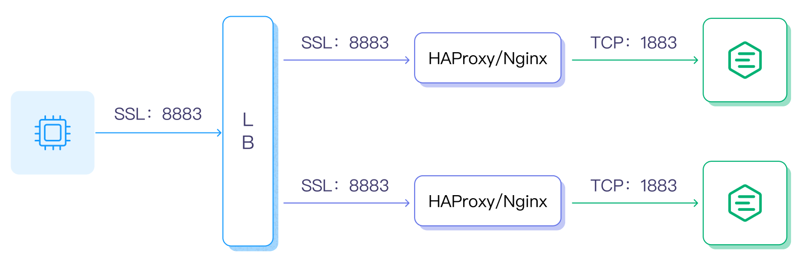

# Configure Load Balancer

Load Balancer (LB) balances the load among multiple network components and optimizes resource usage to avoid system malfunctions caused by overload. LB is not a mandatory component in EMQX, but it can bring some obvious system benefits, for example:

- Balance the load of EMQX to avoid single node overload;
- Simplify client configuration, the client only needs to connect to the LB and need not worry about the scaling within the cluster;
- Reduce the load of EMQX clusters by TLS/SSL termination;
- Improve cluster security, with LB configured at the front end of the cluster, unwanted traffic can be blocked to protect the EMQX cluster from malicious attacks. 

This section introduces how to configure LB in EMQX. 

## Deployment Architecture

This section introduces three different load balancer deployment architectures.

### TCP Load Balancer

For an EMQX cluster configured with LB, the LB handles the incoming TCP traffic and then distributes the received MQTT connection requests and messages to different EMQX nodes. The typical deployment architecture is as follows:


### TLS Termination and Load Balancer

If SSL/TLS is enabled, it is recommended to terminate the SSL/TLS connection at LB, that is, to use SSL/TLS to secure the connection between clients and LB and then use TCP connection between LB and EMQX nodes, maximizing the performance of the EMQX cluster. The architecture is as follows:


### Hybrid Deployment

If you want to use a cloud service provider's LB as the connection and load balancing layer but it does not support TLS termination or lacks certain TLS features (such as proxy protocol), you can select a hybrid deployment architecture: deploy HAProxy or NGINX in front of EMQX to terminate SSL/TLS connections.

Compared to directly using EMQX to handle TLS connections, this approach can get greater performance benefits. The deployment architecture is as follows:



In addition to load balancing deployment clusters, you can also use DNS round-robin to connect directly to the EMQX cluster, which involves adding all nodes to the DNS round-robin list. Devices access the cluster via domain names or IP address lists. However, it is generally not recommended to use DNS round-robin for production environments.

## Obtain Real IP and TLS Certificate Information

After deploying LB, EMQX typically needs to obtain the actual source IP of the client or TLS certificate information. You will need to enable [Proxy Protocol](https://www.haproxy.com/blog/haproxy/proxy-protocol) configuration on the LB or enable relevant configurations to retrieve the real IP.

If Proxy Protocol is enabled on the LB, the `proxy_protocol` configuration option must also be enabled on the corresponding listener in EMQX. For example, for a TCP 1883 listener, you can add the following configuration in `etc/emqx.conf`:

```bash
listeners.tcp.default {
  bind = "0.0.0.0:1883"
  max_connections = 1024000

  proxy_protocol = true
}
```

For information on enabling Proxy Protocol on your LB, refer to the respective documentation for your LB. Some LB products do not support Proxy Protocol but still allow the backend service to obtain the actual client IP. Configure accordingly based on the specific requirements of your LB and cloud service provider.

### Client TLS Certificate Information

Only Proxy Protocol v2 support extracting client certificate information, such as Common Name (CN) and Subject. If the load balancer sends client certificate information to the TCP listener, ensure that Proxy Protocol v2 is in use.

## Select an LB Product

Many LB products are currently available, including open-source and commercial editions, and public cloud providers also have their load-balancing services.

LB products for the public cloud:

| Cloud provider                            | SSL Termination | Support Proxy Protocol | LB Product                                                  |
| ----------------------------------------- | --------------- | ---------------------- | ----------------------------------------------------------- |
| [AWS](https://aws.amazon.com)             | Yes             | Yes                    | <https://aws.amazon.com/elasticloadbalancing/?nc1=h_ls>     |
| [Azure](https://azure.microsoft.com)      | Unknown         | Unknown                | <https://azure.microsoft.com/en-us/products/load-balancer/> |
| [Google Cloud](https://cloud.google.com/) | Yes             | Yes                    | <https://cloud.google.com/load-balancing>                   |

 LB products for private cloud:

| Open-Source LB                     | SSL Termination | Support Proxy Protocol | DOC/URL                                                 |
| ---------------------------------- | --------------- | ---------------------- | ------------------------------------------------------- |
| [HAProxy](https://www.haproxy.org) | Yes             | Yes                    | <https://www.haproxy.com/solutions/load-balancing.html> |
| [NGINX](https://www.nginx.com)     | Yes             | Yes                    | <https://www.nginx.com/solutions/load-balancing/>       |

The following two pages will use a privately deployed LB server as an example to introduce how to configure and load balance an EMQX cluster:

- [Load Balance EMQX Cluster with NGINX](./lb-nginx.md)
- [Load Balance EMQX Cluster with HAProxy](./lb-haproxy.md)

