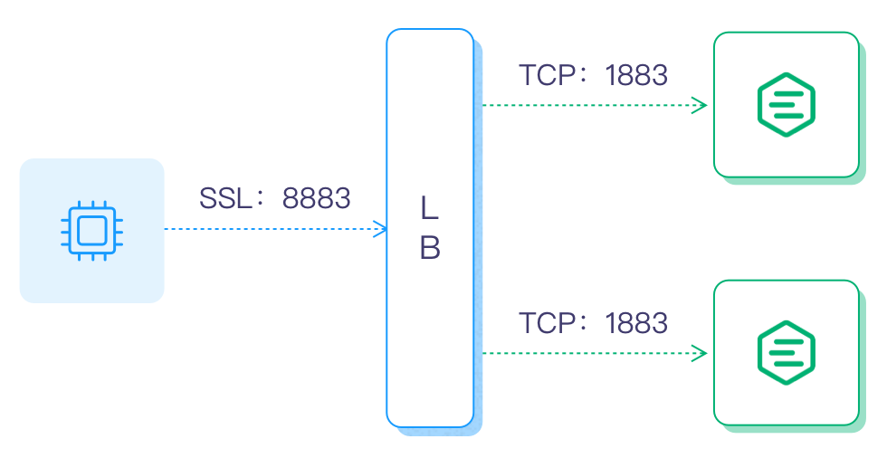

# Configure Load Balancer

Load Balancer (LB) balances the load among multiple network components and optimizes resource usage to avoid system malfunctions caused by overload. LB is not a mandatory component in EMQX, but it can bring some obvious system benefits, for example:

- Balance the load of EMQX to avoid single node overload;
- Simplify client configuration, the client only needs to connect to the LB and need not worry about the scaling within the cluster;
- Reduce the load of EMQX clusters by TLS/SSL termination;
- Improve cluster security, with LB configured at the front end of the cluster, unwanted traffic can be blocked to protect the EMQX cluster from malicious attacks. 

This chapter introduces how to configure LB in EMQX. 

## Architecture

For an EMQX cluster configured with LB, the LB handles the incoming TCP traffic and then distributes the received MQTT connection requests and messages to different EMQX nodes. The typical deployment architecture is as follows:

If SSL/TLS is enabled, it is recommended to terminate the SSL/TLS connection at LB, that is, to use SSL/TLS to secure the connection between clients and LB and then use TCP connection between LB and EMQX nodes, maximizing the performance of the EMQX cluster. The architecture is as follows:

:::tip

You can also use DNS polling for load balancing for test or development purposes. 

:::

## Select an LB Product

Many load-balancing products are currently available, including open-source and commercial editions, and public cloud providers also have their load-balancing services.

LB products for public cloud:

| Cloud provider                            | SSL Termination | LB Product                                                  |
| ----------------------------------------- | --------------- | ----------------------------------------------------------- |
| [AWS](https://aws.amazon.com)             | Yes             | <https://aws.amazon.com/elasticloadbalancing/?nc1=h_ls>     |
| [Azure](https://azure.microsoft.com)      | Unknown         | <https://azure.microsoft.com/en-us/products/load-balancer/> |
| [Google Cloud](https://cloud.google.com/) | Yes             | <https://cloud.google.com/load-balancing>                   |

 LB products for private cloud:

| Open-Source LB                     | SSL Termination | DOC/URL                                                 |
| ---------------------------------- | --------------- | ------------------------------------------------------- |
| [HAProxy](https://www.haproxy.org) | Yes             | <https://www.haproxy.com/solutions/load-balancing.html> |
| [NGINX](https://www.nginx.com)     | Yes             | <https://www.nginx.com/solutions/load-balancing/>       |

The following two pages will use a privately deployed LB server as an example to introduce how to configure and load balance an EMQX cluster:

- [Load Balance EMQX Cluster with Nginx](./lb-nginx.md)
- [Load Balance EMQX Cluster with HAProxy](./lb-haproxy.md)

