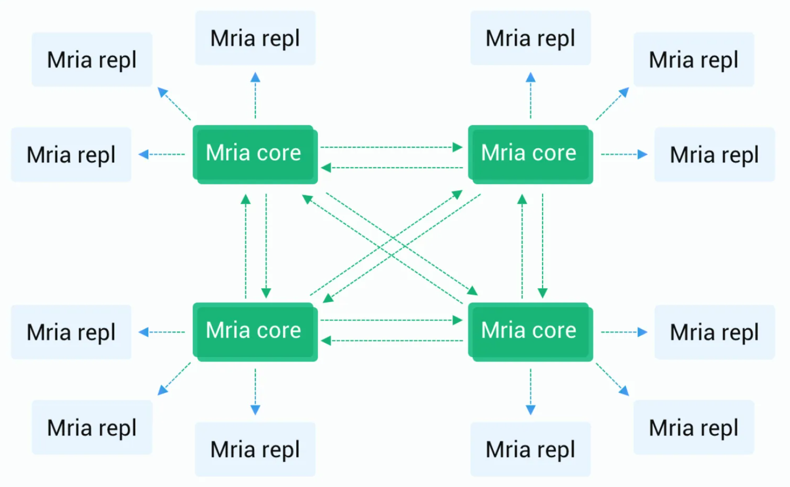

# Deploy structure and requirement

In EMQX 5.0, we redesign the cluster architecture with [Mria](https://github.com/emqx/mria) + RLOG, which significantly improves EMQX's horizontal scalability and is also the key behind 100M MQTT connection support with a single cluster. 

This chapter will introduce how to deploy EMQX clusters under this new architecture. You can also use [EMQX Operator](https://www.emqx.com/en/emqx-kubernetes-operator) to realize automatic cluster deployment. For details, see [Deploy with K8s](../install-k8s.md).

:::tip Prerequisites:

- Knowledge of [Distributed clusters](./introduction.md)。
  :::

## Mria + RLOG architecute

<!-- TODO 展开介绍 RLOG -->

[Mria](https://github.com/emqx/mria) is an open source extension to Mnesia that adds eventual consistency to clusters. With RLOG mode enabled, Mria switched from **a full mesh** topology to a **mesh+star** topology. Each node assumes one of two roles: **core node** or **replicant node**.

### Core nodes and Replicant nodes

#### **Core node**

Core nodes serve as a data layer for the database. Core nodes form a cluster in a fully connected manner, and each node contains an up-to-date replica of the data. Therefore, the data is safe as long as one active node remains alive.

Core nodes are expected to be static and persistent. Autoscaling the core cluster is not recommended, including frequent node addition, removal or replacement actions. 

#### Replicant nodes

Replicant nodes connect to Core nodes and passively replicate data updates from Core nodes. Replicant nodes are not allowed to perform any write operations. Instead, they hand the write operation over to the Core node for execution. In addition, because Replicants will replicate data from Core nodes, they have a complete local copy of data to achieve the highest read operations efficiency, which helps reduce the latency of EMQX routing.

### Advantages of the new architecture

This data replication model is a mix of **masterless and master-slave replication**. This cluster topology solves two problems:

- Horizontal scalability (as verified with tests of an EMQX cluster with 23 nodes)
- Easier cluster auto-scaling without risk of data loss.

Since Replicant nodes do not participate in write operations, the latency of write operations will not be affected when more Replicant nodes join the cluster. This allows creation of larger EMQX clusters.

EMQX 4.x adopts a full mesh mode, with synchronization costs increasing with node numbers. In EMQX 5.0, since replicant nodes don't participate in writes, the efficiency of table updates doesn't suffer when more replicants are added to the cluster. This allows the creation of larger EMQX clusters.

Also, replicant nodes are designed to be ephemeral.
Adding or removing them won't change the data redundancy, so they can be placed in an autoscaling group, thus enabling better DevOps practices.

Note that initial replication of the data from the core nodes is a relatively heavy operation, depending on the data size, so the autoscaling policy must be moderate.

## Deploy EMQX clusters

In EMQX 5.0 all nodes assume the Core node role by default, so the cluster behaves like that in EMQX 4.x if you keep the default setting. 

The Core + Replicant mode is only recommended if you have more than 3 nodes in your cluster. 

<!-- TODO 确认最终的建议值，原文出现 5 个节点，3 个节点两种数值 -->

To use this new replication protocol, you can set the node as a Replicant node by setting the `emqx.conf` `node.db_role` parameter or the `EMQX_NODE__DB_ROLE` environment variable, and `cluster.core_nodes` to specify the Core nodes to connect. 

:::tip

Note that there must be at least one core node in the cluster. We recommend starting with the 3 cores + N replicants setup.

:::

Core nodes may accept MQTT traffic or disable all MQTT listeners to serve as the replicants' database servers. Therefore, we suggest:

- In a small cluster (3 nodes or less), it is not necessary to use the Core + Replicant replication mode, we can just let the core nodes take all the traffic.
- In a very large cluster (10 nodes or more), moving the MQTT traffic from the Core nodes is recommended, which is more stable and horizontally scalable.
- In a medium cluster, some tests are recommended to compare the performance under different scenarios. 

## Network and hardware

### Network

The network latency between Core nodes is recommended to be below 10ms, and the cluster will not be available if the latency is higher than 100ms. Please deploy Core nodes under the same private network. Deploying the Replicant and Core nodes under the same private network is also recommended, but the network requirements can be slightly lower.

### CPU and memory

Core nodes require a large amount of memory, and the CPU consumption is low when there are no connections; the hardware specification of Replicant nodes is the same as with EMQX 4.x, and you can configure it as your connection and throughput needs.

## Exception handling

Core nodes are transparent to Replicant nodes; when a Core node is down, the Replicant nodes can automatically connect to other Core nodes. The client connection will not be interrupted, but routing updates may be delayed.

When a Replicant node is down, all clients connected to that node will be disconnected. However, because Replicant is stateless, it does not affect the stability of other nodes. If the clients are configured with the reconnection mechanism available on most client libraries, the client can automatically reconnect to another Replicant node. 

## Monitoring and debugging

<!-- TODO 后续补充数值类型 Gauge or Counter -->

The Mria performance can be monitored using Prometheus metrics or Erlang console.

### Prometheus indicators

#### Core nodes
- `emqx_mria_last_intercepted_trans`: Number of transactions received by the shard since the node started. Note that this value can be different on different Core nodes.
- `emqx_mria_weight`: A value used for load balancing. It varies with the instantaneous load of the Core node.
- `emqx_mria_replicants`: Number of replicants connected to the core node. Numbers are grouped per shard.
- `emqx_mria_server_mql`: Number of pending transactions waiting to be sent to the replicants. Less is better.  If this indicator shows a growing trend, more Core nodes are needed.

#### Replicant nodes

- `emqx_mria_lag`: Replicant lag, indicating how far the upstream Core node lags behind the Replicant nodes. Less is better.
- `emqx_mria_bootstrap_time`: Time spent during replica startup. This value remains the same during the regular operation of the Replicant nodes. 
- `emqx_mria_bootstrap_num_keys`: Number of database records copied from the core node during boot. This value doesn't change during the regular operation of the Replicant nodes.
- `emqx_mria_message_queue_len`: Message queue length of the replication process. It should be around 0 all the time.
- `emqx_mria_replayq_len`: Length of the internal replay queue on the Replicant nodes. Less is better.

### Console commands

Run `emqx eval 'mria_rlog:status().'` command to get more information about the running status of the embedded Mira database.
