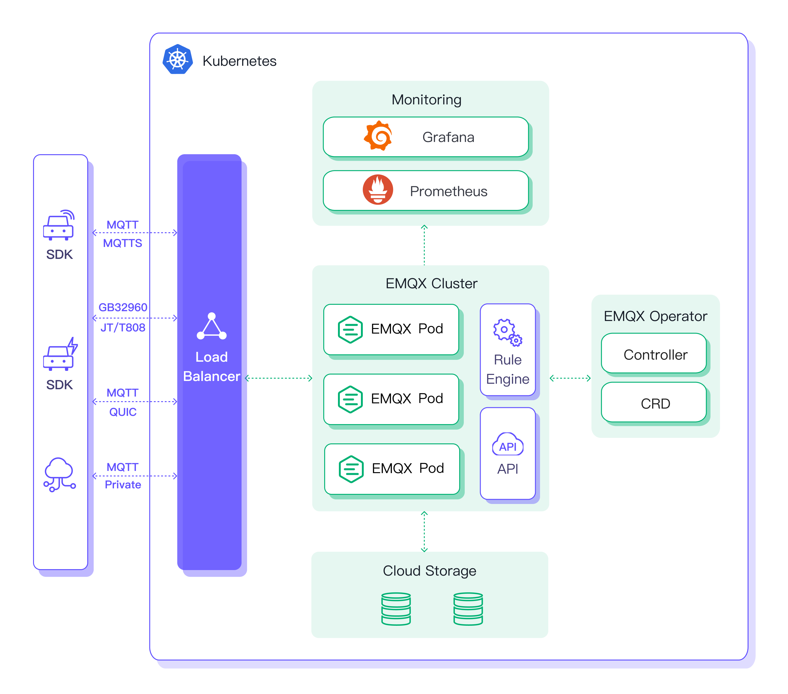

## Overview

The EMQX Operator provides [Kubernetes](https://kubernetes.io/) native deployment and management of [EMQX](https://www.emqx.io/), including EMQX Broker and EMQX Enterprise. The purpose of this project is to simplify and automate the configuration of the EMQX cluster.

The EMQX Operator includes, but is not limited to, the following features:

* **Simplified Deployment**: Declare EMQX clusters with EMQX custom resources and deploy them quickly. For more details, please check [Getting Started](./getting-started.md).

* **Manage EMQX Cluster**: Automate operations and maintenance for EMQX, including cluster upgrades, runtime data persistence, updating Kubernetes resources based on the status of EMQX, etc. For more details, please check [Manage EMQX](./tasks/overview.md).

## How to selector Kubernetes version

The EMQX Operator requires a Kubernetes cluster of version `>=1.24`.

| Kubernetes Versions     | EMQX Operator Compatibility                                  | Notes                                                        |
| ----------------------- | ------------------------------------------------------------ | ------------------------------------------------------------ |
| 1.24 or higher          | All functions supported                                      |                                                              |
| 1.22 (included) ～ 1.23 | Supported, except [MixedProtocolLBService](https://kubernetes.io/docs/reference/command-line-tools-reference/feature-gates/) | EMQX cluster can only use one protocol in `LoadBalancer` type of Service, for example TCP or UDP. |
| 1.21 (included) ～ 1.22 | Supported, except  [pod-deletion-cost](https://kubernetes.io/docs/concepts/workloads/controllers/replicaset/#pod-deletion-cost) | When using EMQX Core + Replicant mode cluster, updating the EMQX cluster cannot accurately delete Pods. |
| 1.20 (included) ～ 1.21 | Supported, manual `.spec.ports[].nodePort` assignment required if using `NodePort` type of Service | For more details, please refer to [Kubernetes changelog](https://github.com/kubernetes/kubernetes/blob/master/CHANGELOG/CHANGELOG-1.20.md#bug-or-regression-4). |
| 1.16 (included) ～ 1.20 | Supported, not recommended due to lack of testing            |                                                              |
| Lower than 1.16         | Not supported                                                | `apiextensions/v1` APIVersion is not supported.               |
