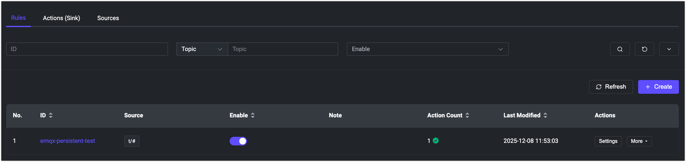

# Enable Persistence in EMQX Cluster

## Objective

Configure persistence for the set of Core nodes of an EMQX cluster through the `persistentVolumeClaimSpec` field.

## Configure EMQX Cluster Persistence

EMQX CRD `apps.emqx.io/v3beta1` supports configuring persistence of each Core node data through `.spec.coreTemplate.spec.persistentVolumeClaimSpec`.

The definition and semantics of the `.spec.coreTemplate.spec.persistentVolumeClaimSpec` field are consistent with those of `PersistentVolumeClaimSpec` defined in the Kubernetes API.

EMQX Operator 3.0 manages Core nodes with a single StatefulSet. Each Core Pod has a stable identity and a stable PVC across image updates and rolling upgrades. When you specify `.spec.coreTemplate.spec.persistentVolumeClaimSpec`, EMQX Operator configures the `/opt/emqx/data` volume of the EMQX container to be backed by a Persistent Volume Claim (PVC), which provisions a Persistent Volume (PV) using a specified [StorageClass](https://kubernetes.io/docs/concepts/storage/storage-classes/).

## PVC Lifecycle

Core node PVCs are tied to StatefulSet Pod ordinals. For example, the PVC for `emqx-core-0` stays attached to `emqx-core-0` during image updates and rolling updates, so the node keeps using the same data volume.

EMQX Operator configures Kubernetes to delete Core node PVCs when they are no longer needed:

- When you scale down Core nodes, PVCs for the removed Pod ordinals are deleted.
    
    For example, scaling from 5 Core replicas to 3 deletes the PVCs for ordinals 3 and 4. EMQX Operator ensures that this incurs no data or durability loss: any Durable Storage data is "rebalanced away" from those Core replicas before scaling the StatefulSet down.

- When you delete the EMQX custom resource, Kubernetes deletes the Core StatefulSet and its associated PVCs.

- During rolling updates, PVCs are preserved because the StatefulSet name and Pod ordinals do not change.

This automatic cleanup depends on the Kubernetes `StatefulSetAutoDeletePVC` feature gate. It is enabled by default in Kubernetes 1.32 and later. On Kubernetes 1.27 through 1.31, make sure the feature gate is enabled; otherwise Kubernetes ignores the deletion policy and you must clean up unused PVCs manually.

For more details about PVs and PVCs, refer to the [Persistent Volumes](https://kubernetes.io/docs/concepts/storage/persistent-volumes/) documentation.

1. Save the following content as a YAML file and deploy it using `kubectl apply`.

   ```yaml
   apiVersion: apps.emqx.io/v3beta1
   kind: EMQX
   metadata:
     name: emqx
   spec:
     image: emqx/emqx:@EE_VERSION@
     config:
       data: |
         license {
           key = "..."
         }
     coreTemplate:
       spec:
         persistentVolumeClaimSpec:
           storageClassName: standard
           resources:
             requests:
               storage: 1Gi
           accessModes:
             - ReadWriteOnce
         replicas: 3
     listenersServiceTemplate:
       spec:
         type: LoadBalancer
     dashboardServiceTemplate:
       spec:
         type: LoadBalancer
   ```

   ::: tip

   Use the `storageClassName` field to choose the appropriate [StorageClass](https://kubernetes.io/docs/concepts/storage/storage-classes/) for EMQX data. Run `kubectl get storageclass` to list the StorageClasses that already exist in the Kubernetes cluster, or create a StorageClass according to your needs.

   :::

2. Wait for the EMQX cluster to become ready.

   Check the status of the EMQX cluster with `kubectl get` and ensure that `STATUS` is `Ready`. This may take some time.

   ```bash
   $ kubectl get emqx emqx
   NAME   STATUS   AGE
   emqx   Ready    10m
   ```

## Verify Persistence

1. Create a test rule in the EMQX Dashboard.

   ```bash
   external_ip=$(kubectl get svc emqx-dashboard -o json | jq -r '.status.loadBalancer.ingress[0].ip')
   ```

     - Log in to the EMQX Dashboard at `http://${external_ip}:18083`.

     - Navigate to **Integration** -> **Rules** to create a new rule.

     - Attach a simple action to this rule.

     - Click **Save** to generate a rule, as shown in the following figure:

       
    
       Once the rule is created successfully, a corresponding record with `emqx-persistent-test` ID will appear on the page, as shown in the figure below:
    
       

2. Delete the old EMQX cluster.

   Run the following command to delete the EMQX cluster, where `emqx.yaml` is the file you used to deploy the cluster earlier:

   ```bash
   $ kubectl delete -f emqx.yaml
   emqx.apps.emqx.io "emqx" deleted
   ```

3. Re-deploy the EMQX cluster.

   Run the following command to re-deploy the EMQX cluster:

   ```bash
   $ kubectl apply -f emqx.yaml
   emqx.apps.emqx.io/emqx created
   ```

4. Wait for the EMQX cluster to be ready. Access the EMQX Dashboard through your browser to verify that the previously created rule still exists, as shown in the following figure:

   

   The `emqx-persistent-test` rule created in the old cluster still exists in the new cluster, which confirms that the persistence configuration is working correctly.
