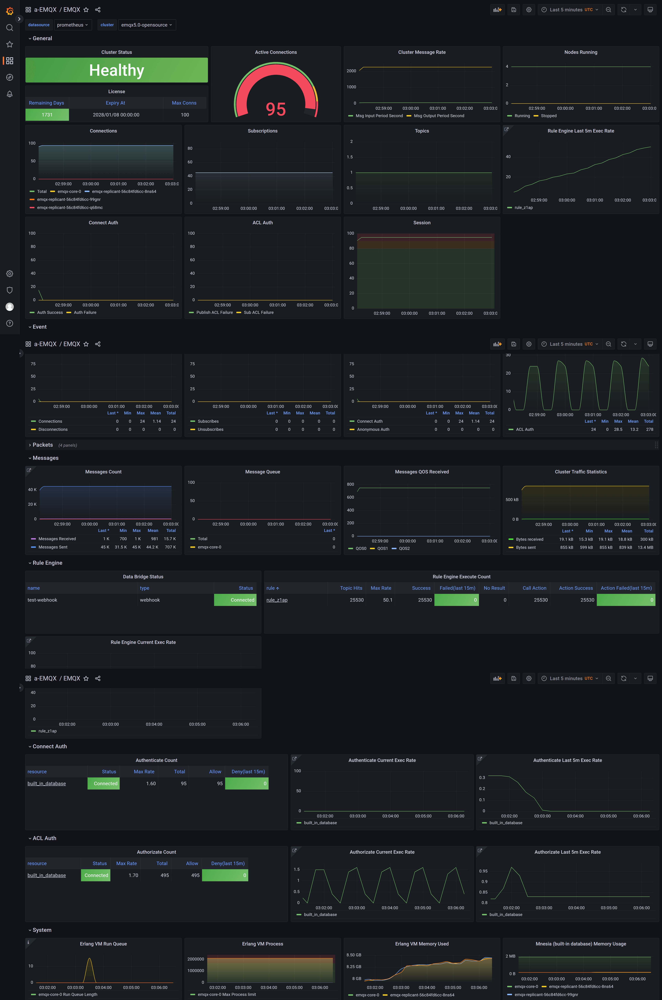

# Monitor EMQX with Prometheus and Grafana

## Objective

Configure Prometheus to scrape an EMQX cluster and visualize its metrics in Grafana.

## Deploy Prometheus and Grafana

* To learn more about Prometheus deployment, refer to the [Prometheus](https://github.com/prometheus-operator/prometheus-operator) documentation.
* To learn more about Grafana deployment, refer to [Grafana](https://grafana.com/docs/grafana/latest/setup-grafana/installation/kubernetes/) documentation.

## Deploy EMQX Cluster

EMQX exposes various metrics through the [Prometheus-compatible HTTP API](../../../../observability/prometheus.md).

```yaml
apiVersion: apps.emqx.io/v3beta1
kind: EMQX
metadata:
  name: emqx
spec:
  image: emqx/emqx:@EE_VERSION@
  config:
    roots:
      license:
        key: "..."
```

Save the above content as `emqx.yaml` and execute the following command to deploy the EMQX cluster:

```bash
$ kubectl apply -f emqx.yaml
emqx.apps.emqx.io/emqx created
```

Check the status of the EMQX cluster and make sure that `STATUS` is `Ready`. This may take some time.

```bash
$ kubectl get emqx emqx
NAME   STATUS   AGE
emqx   Ready    10m
```

## Create API Keys

Sign in to the Dashboard and [create dedicated API key](../../../../dashboard/system.md#api-keys). For Prometheus, create an API key with the Viewer role and only the `monitoring` scope. The `PodMonitor` uses this key to scrape `/api/v5/prometheus/stats`.

Save the API key and secret key. EMQX displays each secret key only once.

## Configure Prometheus Monitor

Prometheus Operator uses the [PodMonitor](https://prometheus-operator.dev/docs/developer/getting-started/#using-podmonitors) CRD to select Pods and define scrape endpoints. EMQX exposes Prometheus metrics through its Dashboard listener, whose container port is named `dashboard` by default.

The following PodMonitor scrapes the basic EMQX metrics endpoint from every Pod in the `emqx` cluster:

Starting from EMQX 6.3.0, Prometheus scrape APIs require authentication by default. Create a Kubernetes Secret in the same namespace as the `PodMonitor` to store the API key and secret key created for Prometheus:

```bash
kubectl create secret generic emqx-prometheus-basic-auth \
  --from-literal=username='<API_KEY>' \
  --from-literal=password='<SECRET_KEY>'
```

```yaml
apiVersion: monitoring.coreos.com/v1
kind: PodMonitor
metadata:
  name: emqx
  labels:
    app.kubernetes.io/name: emqx
spec:
  podMetricsEndpoints:
    - interval: 5s
      path: /api/v5/prometheus/stats
      basicAuth:
        username:
          name: emqx-prometheus-basic-auth
          key: username
        password:
          name: emqx-prometheus-basic-auth
          key: password
      # Name of the EMQX Dashboard container port.
      port: dashboard
      relabelings:
        - action: replace
          # Use a unique value for each EMQX cluster.
          replacement: emqx5
          targetLabel: cluster
        - action: replace
          # Keep this value unchanged.
          replacement: emqx
          targetLabel: from
        - action: replace
          # Use the Pod name as the Prometheus instance label.
          sourceLabels: [pod]
          targetLabel: instance
  selector:
    matchLabels:
      # Match Pods managed for the EMQX resource named `emqx`.
      apps.emqx.io/instance: emqx
      apps.emqx.io/managed-by: emqx-operator
  namespaceSelector:
    matchNames:
      # Change this value if the EMQX cluster is in another namespace.
      - default
```

`path` specifies the metrics collection API path. For EMQX 5.0 and later, use `/api/v5/prometheus/stats`. The `basicAuth` section reads the API key and secret key from the Kubernetes Secret. The selector matches Pods managed for the `emqx` resource. The `cluster` target label must be unique for each EMQX cluster monitored by the same Prometheus server.

By default, EMQX Prometheus pull endpoints do not require authentication. If you enable basic authentication for these endpoints, configure the corresponding authentication secret in `podMetricsEndpoints`. For all available endpoints and authentication options, see [Integrate with Prometheus](../../../../observability/prometheus.md#configure-pull-mode-integration).

Save the above content as `monitor.yaml` and execute the following command:

```bash
$ kubectl apply -f monitor.yaml
```

## View EMQX Metrics in Prometheus

Open the Prometheus expression browser and enter `emqx` to view EMQX metrics, as shown in the following figure:


Open **Status** -> **Targets** to view all monitored EMQX Pods in the cluster:


## Import a Grafana Dashboard

Import the [EMQX Grafana dashboard](https://grafana.com/grafana/dashboards/17446-emqx/) and select the Prometheus data source that scrapes the EMQX Pods.


