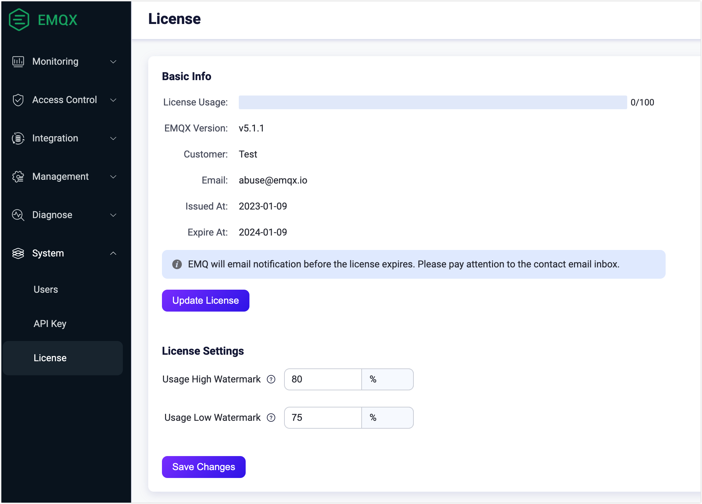

# Work with License

EMQX Enterprise is the commercial version of EMQX, which requires a license certificate (License) when using it.

As part of the installation package, EMQX Enterprise already includes a trial license, which is valid for a maximum of 100 concurrent client connections. However,  if you want to satisfy higher concurrent demands, you need a formal license. 

This page guides you through the process of obtaining a license and importing it into EMQX.

## Apply for a License

To apply for a license, contact your EMQ sales representative or fill out the contact information on our [Contact Us](https://www.emqx.com/en/contact?product=emqx&channel=apply-Licenses) page to apply for a license. Our sales representative will contact you as soon as possible. 

If you prefer to try EMQX Enterprise before purchasing, you can apply for a trial license on our [trial license application page](https://www.emqx.com/en/apply-licenses/emqx) and the license file will be sent to your email box immediately:

- The license is valid for 15 days;
- The license supports 10,000 concurrent connection lines;

If you want to extend the trial period or request support for a higher number of concurrent users, contact our sales department.

:::tip

As EMQX Enterprise 5.0 uses a different license format, make sure that the version you are applying for is compatible. For EMQX Enterprise customers who want to upgrade to version 5.0, contact your sales representative.

:::

## Update and Configure License Settings

You can update your license file and configure the settings for the license connection quota usage through EMQX Dashboard or the configuration file.

### Dashboard

1. On EMQX Dashboard, click **System** -> **License** from the left navigation menu. In the **Basic Info** section on the License page, you can check information such as License connection quota usage, EMQX version, and issue information. 

2. Click the **Update License** button. Paste your License Key in the popup dialog box, and click **Save**. The license information on the page automatically refreshes following your submission.

   Verify the information to confirm that the new license file has taken effect.

3. In the **License Settings** section, you can configure the watermark limits for the license connection quota usage.

   - **Usage High Watermark**: Specify the percentage value to set the threshold above which alarms for license connection quota usage will be triggered.
   - **Usage Low Watermark**: Specify the percentage value to set the threshold below which alarms for license connection quota usage will be deactivated.

4. Click **Save Changes** to save your License settings.

   

### Configuration File

You can also configure the license file with the configuration file. After the configuration, you can run `emqx ctl license reload` in [EMQX command line tool](../admin/cli.md) to reload the license. 

```bash
license {
    ## License Key
    key = "MjIwMTExCjAKMTAKRXZhbHVhdGlvbgpjb250YWN0QGVtcXguaW8KZGVmYXVsdAoyMDIzMDEwOQoxODI1CjEwMAo=.MEUCIG62t8W15g05f1cKx3tA3YgJoR0dmyHOPCdbUxBGxgKKAiEAhHKh8dUwhU+OxNEaOn8mgRDtiT3R8RZooqy6dEsOmDI="
    ## Low watermark limit below which license connection quota usage alarms are deactivated
    connection_low_watermark = "75%"

    ## High watermark limit above which license connection quota usage alarms are activated
    connection_high_watermark = "80%"
}
```

After execution, you can run `emqx ctl license info` to confirm that the new license file has taken effect.

<!-- 您也可以通过环境变量 `EMQX_LICENSE__KEY` 变量名设置您的 License。TODO 确认是否可以 reload -->
