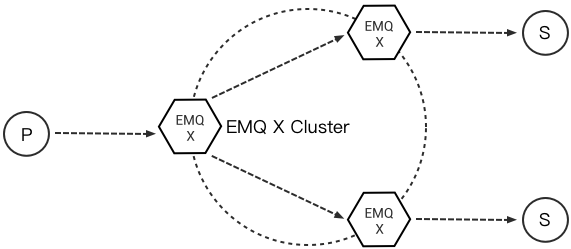
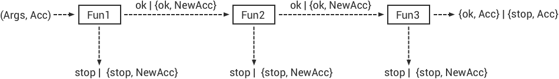

# Design 

## Architecture 

The *EMQ* broker 1.0 is more like a network Switch or Router, not a traditional enterprise message queue. Compared to a network router that routes packets based on IP or MPLS label, the *EMQ* broker routes MQTT messages based on topic trie. 

The *EMQ* 2.0 seperated the Message Flow Plane and Monitor/Control Plane, the Architecture is something like: 

### Design Philosophy 

  1. Focus on handling millions of MQTT connections and routing MQTT messages between clustered nodes. 
  2. Embrace Erlang/OTP, The Soft-Realtime, Low-Latency, Concurrent and Fault-Tolerant Platform. 
  3. Layered Design: Connection, Session, PubSub and Router Layers. 
  4. Separate the Message Flow Plane and the Control/Management Plane. 
  5. Stream MQTT messages to various backends including MQ or databases. 

### System Layers 

  1. Connection Layer 

Handle TCP and WebSocket connections, encode/decode MQTT packets. 

  2. Session Layer 

Process MQTT PUBLISH/SUBSCRIBE Packets received from client, and deliver MQTT messages to client. 

  3. PubSub Layer 

Dispatch MQTT messages to subscribers in a node. 

  4. Routing(Distributed) Layer 

Route MQTT messages among clustered nodes. 

## Connection Layer 

This layer is built on the [ eSockd ](https://github.com/emqx/esockd) library which is a general Non-blocking TCP/SSL Socket Server: 

  * Acceptor Pool and Asynchronous TCP Accept 
  * Parameterized Connection Module 
  * Max connections management 
  * Allow/Deny by peer address or CIDR 
  * Keepalive Support 
  * Rate Limit based on The Leaky Bucket Algorithm 
  * Fully Asynchronous TCP RECV/SEND 

This layer is also responsible for encoding/decoding MQTT frames: 

  1. Parse MQTT frames received from client 
  2. Serialize MQTT frames sent to client 
  3. MQTT Connection Keepalive 

Main erlang modules of this layer: 

Module             |  Description           
-------------------|------------------------
emqx_connection    |  TCP Client            
emqx_ws_connection |  WebSocket Client      
emqx_protocol      |  MQTT Protocol Handler 
emqx_frame         |  MQTT Frame Parser     

## Session Layer 

The session layer processes MQTT packets received from client and delivers PUBLISH packets to client. 

A MQTT session will store the subscriptions and inflight messages in memory: 

  1. The Client’s subscriptions. 
  2. Inflight qos1/2 messages sent to the client but unacked, QoS 2 messages which have been sent to the Client, but have not been completely acknowledged. 
  3. Inflight qos2 messages received from client and waiting for PUBREL. QoS 2 messages which have been received from the Client, but have not been completely acknowledged. 
  4. All qos1, qos2 messages published to when client is disconnected. 

### MQueue and Inflight Window 

Concept of Message Queue and Inflight Window: 

  1. Inflight Window to store the messages delivered and await for PUBACK. 
  2. Enqueue messages when the inflight window is full. 
  3. If the queue is full, drop qos0 messages if store_qos0 is true, otherwise drop the oldest one. 

The larger the inflight window size is, the higher the throughput is. The smaller the window size is, the more strict the message order is. 

### PacketId and MessageId 

The 16-bit PacketId is defined by MQTT Protocol Specification, used by client/server to PUBLISH/PUBACK packets. A GUID(128-bit globally unique Id) will be generated by the broker and assigned to a MQTT message. 

Format of the globally unique message id: 

  1. Timestamp: erlang:system_time if Erlang >= R18, otherwise os:timestamp 
  2. NodeId: encode node() to 2 bytes integer 
  3. Pid: encode pid to 4 bytes integer 
  4. Sequence: 2 bytes sequence in one process 

The PacketId and MessageId in a End-to-End Message PubSub Sequence: 

## PubSub Layer 

The PubSub layer maintains a subscription table and is responsible to dispatch MQTT messages to subscribers. 

MQTT messages will be dispatched to the subscriber's session, which finally delivers the messages to client. 

## Routing Layer 

The routing(distributed) layer maintains and replicates the global Topic Trie and Routing Table. The topic tire is composed of wildcard topics created by subscribers. The Routing Table maps a topic to nodes in the cluster. 

For example, if node1 subscribed 't/+/x' and 't/+/y', node2 subscribed 't/#' and node3 subscribed 't/a', there will be a topic trie and route table: 

The routing layer would route MQTT messages among clustered nodes by topic trie match and routing table lookup: 

The routing design follows two rules: 

  1. A message only gets forwarded to other cluster nodes if a cluster node is interested in it. This reduces the network traffic tremendously, because it prevents nodes from forwarding unnecessary messages. 
  2. As soon as a client on a node subscribes to a topic it becomes known within the cluster. If one of the clients somewhere in the cluster is publishing to this topic, the message will be delivered to its subscriber no matter to which cluster node it is connected. 

## Hooks Design 

The *EMQ* broker implements a simple but powerful hooks mechanism to help users develop plugin. The broker would run the hooks when a client is connected/disconnected, a topic is subscribed/unsubscribed or a MQTT message is published/delivered/acked. 

Hooks defined by the *EMQ* 3.0 broker: 

Hook                 |  Description                                                  
---------------------|---------------------------------------------------------------
client.authenticate  |  Run when client is trying to connect to the broker           
client.check_acl     |  Run when client is trying to publish or subscribe to a topic 
client.connected     |  Run when client connected to the broker successfully         
client.subscribe     |  Run before client subscribes topics                          
client.unsubscribe   |  Run when client unsubscribes topics                          
session.subscribed   |  Run After client(session) subscribed a topic                 
session.unsubscribed |  Run After client(session) unsubscribed a topic               
message.publish      |  Run when a MQTT message is published                         
message.deliver      |  Run when a MQTT message is delivering to target client       
message.acked        |  Run when a MQTT message is acked                             
client.disconnected  |  Run when client disconnected from broker                     

The *EMQ* broker uses the [ Chain-of-responsibility_pattern ](https://en.wikipedia.org/wiki/Chain-of-responsibility_pattern) to implement hook mechanism. The callback functions registered to hook will be executed one by one: 

The callback function for a hook should return: 

Return         |  Description             
---------------|--------------------------
ok             |  Continue                
{ok, NewAcc}   |  Return Acc and Continue 
stop           |  Break                   
{stop, NewAcc} |  Return Acc and Break    

The input arguments for a callback function depends on the types of hook. Checkout the [ emqx_plugin_template ](https://github.com/emqx/emqx_plugin_template/blob/master/src/emqx_plugin_template.erl) project to see the hook examples in detail. 

### Hook Implementation 

The hook APIs are defined in the ` emqx ` module: 
    
    
    -spec(hook(emqx_hooks:hookpoint(), emqx_hooks:action()) -> ok | {error, already_exists}).
    hook(HookPoint, Action) ->
        emqx_hooks:add(HookPoint, Action).
    
    -spec(hook(emqx_hooks:hookpoint(), emqx_hooks:action(), emqx_hooks:filter() | integer())
        -> ok | {error, already_exists}).
    hook(HookPoint, Action, Priority) when is_integer(Priority) ->
        emqx_hooks:add(HookPoint, Action, Priority);
    hook(HookPoint, Action, Filter) when is_function(Filter); is_tuple(Filter) ->
        emqx_hooks:add(HookPoint, Action, Filter);
    hook(HookPoint, Action, InitArgs) when is_list(InitArgs) ->
        emqx_hooks:add(HookPoint, Action, InitArgs).
    
    -spec(hook(emqx_hooks:hookpoint(), emqx_hooks:action(), emqx_hooks:filter(), integer())
        -> ok | {error, already_exists}).
    hook(HookPoint, Action, Filter, Priority) ->
        emqx_hooks:add(HookPoint, Action, Filter, Priority).
    
    -spec(unhook(emqx_hooks:hookpoint(), emqx_hooks:action()) -> ok).
    unhook(HookPoint, Action) ->
        emqx_hooks:del(HookPoint, Action).
    
    -spec(run_hook(emqx_hooks:hookpoint(), list(any())) -> ok | stop).
    run_hook(HookPoint, Args) ->
        emqx_hooks:run(HookPoint, Args).
    
    -spec(run_fold_hook(emqx_hooks:hookpoint(), list(any()), any()) -> any()).
    run_fold_hook(HookPoint, Args, Acc) ->
        emqx_hooks:run_fold(HookPoint, Args, Acc).

### Hook Usage 

The [ emqx_plugin_template ](https://github.com/emqx/emqx_plugin_template/blob/master/src/emqx_plugin_template.erl) project provides the examples for hook usage: 
    
    
    -module(emqx_plugin_template).
    
    -export([load/1, unload/0]).
    
    -export([on_message_publish/2, on_message_deliver/3, on_message_acked/3]).
    
    load(Env) ->
        emqx:hook('message.publish', fun ?MODULE:on_message_publish/2, [Env]),
        emqx:hook('message.deliver', fun ?MODULE:on_message_deliver/3, [Env]),
        emqx:hook('message.acked', fun ?MODULE:on_message_acked/3, [Env]).
    
    on_message_publish(Message, _Env) ->
        io:format("publish ~s~n", [emqx_message:format(Message)]),
        {ok, Message}.
    
    on_message_deliver(Credentials, Message, _Env) ->
        io:format("delivered to client ~s: ~s~n", [Credentials, emqx_message:format(Message)]),
        {ok, Message}.
    
    on_message_acked(Credentials, Message, _Env) ->
        io:format("client ~s acked: ~s~n", [Credentials, emqx_message:format(Message)]),
        {ok, Message}.
    
    unload() ->
        emqx:unhook('message.publish', fun ?MODULE:on_message_publish/2),
        emqx:unhook('message.acked', fun ?MODULE:on_message_acked/3),
        emqx:unhook('message.deliver', fun ?MODULE:on_message_deliver/3).

## Authentication and ACL 

The *EMQ* broker supports extensible Authentication/ACL by hooking to hook-points ` client.authenticate ` and ` client.check_acl ` : 

### Write Authentication Hook CallBacks 

To register a callback function to ` client.authenticate ` : 
    
    
    emqx:hook('client.authenticate', fun ?MODULE:on_client_authenticate/1, []).

The callbacks must have an argument that receives the ` Credentials ` , and returns an updated Credentials: 
    
    
    on_client_authenticate(Credentials = #{password := Password}) ->
        {ok, Credentials#{result => success}}.

The ` Credentials ` is a map that contains AUTH related info: 
    
    
    #{
      client_id => ClientId,     %% The client id
      username  => Username,     %% The username
      peername  => Peername,     %% The peer IP Address and Port
      password  => Password,     %% The password (Optional)
      result    => Result        %% The authentication result, must be set to ``success`` if OK,
                                 %% or ``bad_username_or_password`` or ``not_authorized`` if failed.
    }

### Write ACL Hook Callbacks 

To register a callback function to ` client.authenticate ` : 
    
    
    emqx:hook('client.check_acl', fun ?MODULE:on_client_check_acl/4, []).

The callbacks must have arguments that receives the ` Credentials ` , ` AccessType ` , ` Topic ` , ` ACLResult ` , and then returns a new ACLResult: 
    
    
    on_client_check_acl(#{client_id := ClientId}, AccessType, Topic, ACLResult) ->
        {ok, allow}.

AccessType can be one of ` publish ` and ` subscribe ` . Topic is the MQTT topic. The ACLResult is either ` allow ` or ` deny ` . 

The module ` emqx_mod_acl_internal ` implements the default ACL based on etc/acl.conf file: 
    
    
    %%%-----------------------------------------------------------------------------
    %%%
    %%% -type who() :: all | binary() |
    %%%                {ipaddr, esockd_access:cidr()} |
    %%%                {client, binary()} |
    %%%                {user, binary()}.
    %%%
    %%% -type access() :: subscribe | publish | pubsub.
    %%%
    %%% -type topic() :: binary().
    %%%
    %%% -type rule() :: {allow, all} |
    %%%                 {allow, who(), access(), list(topic())} |
    %%%                 {deny, all} |
    %%%                 {deny, who(), access(), list(topic())}.
    %%%
    %%%-----------------------------------------------------------------------------
    
    {allow, {user, "dashboard"}, subscribe, ["$SYS/#"]}.
    
    {allow, {ipaddr, "127.0.0.1"}, pubsub, ["$SYS/#", "#"]}.
    
    {deny, all, subscribe, ["$SYS/#", {eq, "#"}]}.
    
    {allow, all}.

The Authentication/ACL plugins implemented by emqx organization: 

Plugin             |  Authentication        
-------------------|------------------------
emqx_auth_username |  Username and Password 
emqx_auth_clientid |  ClientID and Password 
emqx_auth_ldap     |  LDAP                  
emqx_auth_http     |  HTTP API              
emqx_auth_mysql    |  MySQL                 
emqx_auth_pgsql    |  PostgreSQL            
emqx_auth_redis    |  Redis                 
emqx_auth_mongo    |  MongoDB               
emqx_auth_jwt      |  JWT                   

## Plugin Design 

Plugin is a normal erlang application that can be started/stopped dynamically by a running *EMQ* broker. 

### emqx_plugins Module 

The plugin mechanism is implemented by emqx_plugins module: 
    
    
    -module(emqx_plugins).
    
    -export([load/1, unload/1]).
    
    %% @doc Load a Plugin
    load(PluginName :: atom()) -> ok | {error, any()}.
    
    %% @doc UnLoad a Plugin
    unload(PluginName :: atom()) -> ok | {error, any()}.

### Load a Plugin 

Use './bin/emqx_ctl' CLI to load/unload a plugin: 
    
    
    ./bin/emqx_ctl plugins load emqx_auth_redis
    
    ./bin/emqx_ctl plugins unload emqx_auth_redis

### Plugin Template 

[ http://github.com/emqx/emqx_plugin_template ](http://github.com/emqx/emqx_plugin_template)

## Mnesia/ETS Tables 

Table                    |  Type   |  Description                     
-------------------------|---------|----------------------------------
emqx_conn                |  ets    |  Connection Table                
emqx_metrics             |  ets    |  Metrics Table                   
emqx_session             |  ets    |  Session Table                   
emqx_hooks               |  ets    |  Hooks Table                     
emqx_subscriber          |  ets    |  Subscriber Table                
emqx_subscription        |  ets    |  Subscription Table              
emqx_admin               |  mnesia |  The Dashboard admin users Table 
emqx_retainer            |  mnesia |  Retained Message Table          
emqx_shared_subscription |  mnesia |  Shared Subscription Table       
emqx_session_registry    |  mnesia |  Global Session Registry Table   
emqx_alarm_history       |  mnesia |  Alarms History                  
emqx_alarm               |  mnesia |  Alarms                          
emqx_banned              |  mnesia |  Built-In Banned Table           
emqx_route               |  mnesia |  Global Route Table              
emqx_trie                |  mnesia |  Trie Table                      
emqx_trie_node           |  mnesia |  Trie Node Table                 
mqtt_app                 |  mnesia |  App table                       

