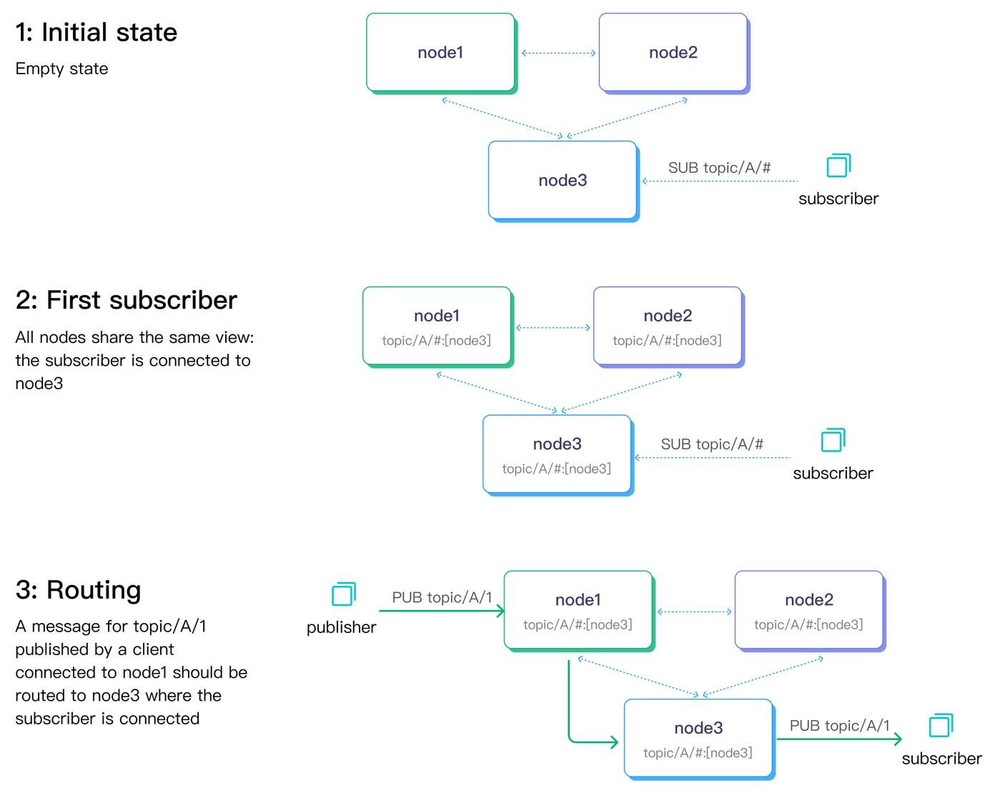
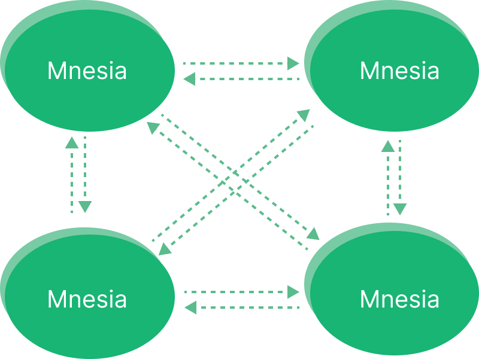
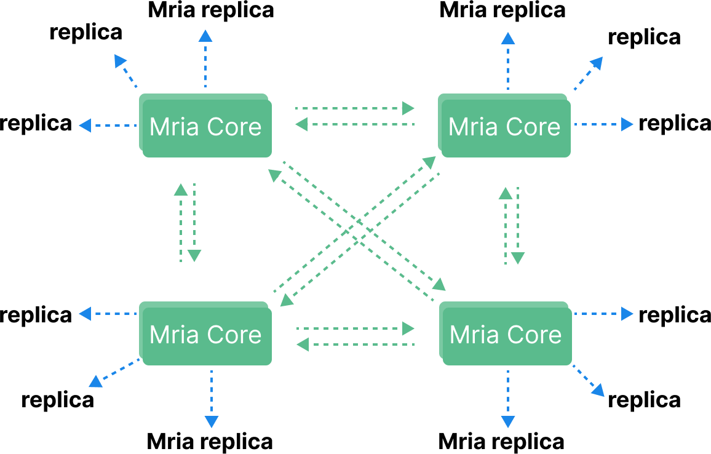

# EMQX Clustering

MQTT is a stateful protocol, which means the broker needs to maintain state information about each MQTT session including subscribed messages and unfinished message transmissions.
One of the biggest challenges of MQTT broker clustering is ensuring that the clustered nodes are able to synchronize and replicate such states efficiently and reliably.

EMQX is a highly scalable and fault-tolerant MQTT broker that can be distributed and run in a cluster mode with multiple nodes.
In this chapter, we will discuss the reasons why we need the cluster MQTT brokers and how it is done EMQX which enables millions of unique wildcard subscribers in one single cluster.

For instructions to create and run a EMQX version 5 cluster, you can find more inforamtion here: [EMQX Cluster](../deploy/cluster/introduction).

## Reasons for Clustering

There are situations where a clustered MQTT broker architecture is necessary for several reasons.

* Scalability: EMQX can be easily scaled horizontally by adding more nodes to the cluster, allowing it to handle an increasing number of MQTT messages and clients.

* High Availability: Running in a cluster provides high availability, as the cluster can continue to function even if one or more nodes fail. EMQX uses a distributed architecture that ensures no single point of failure.

* Load Balancing: EMQX nodes in the cluster can be configured to distribute the load of handling MQTT messages, which helps to avoid overload of a single node and allows for better use of available resources.

* Centralized Management: EMQX can be managed centrally, as all nodes in the cluster can be monitored and controlled from a single management console. This makes it easy to manage a large number of devices and messages.

Clustering EMQX can help improve the scalability, availability, reliability and management of IoT messaging systems, which is why clustering is recommended for larger or mission-critical applications.

## Data Replication Channels

* In a EMQX cluster, there are two data replication channels.

  Metadata replication. Such as routing information which (wildcard) topics are being subscribed by which nodes.

* Message delivery. Such as when forwarding messages from one node to another.

Below diagram illustrates the two data replication channels with a pub-sub flow.

The dashed lines connecting the nodes indicate metadata replications, while the solid arrow lines represent the message delivery channel.

## How EMQX Nodes Form a Cluster

EMQX utilizes Erlang/OTP's built-in database, Mnesia, to store MQTT session states. To facilitate database and message replication, the Erlang distribution protocol a custom distribution protocol are utilized for inter-broker remote procedure calls.

The database replication channel is powered by the "Erlang distribution" protocol, enabling each node to function as both a client and server. The default listening port number for this protocol is 4370.

In contrast, the message delivery channel employs a connection pool and each node is configured to listen on port number 5370 by default (5369 when running in a Docker container). This approach differs from the Erlang distribution protocol, which utilizes a single connection.

### Database

A Mnesia cluster is designed using a full mesh topology where each node in the cluster connects to every other node and continuously checks their liveliness.

However, the full mesh topology imposes a practical limit on the cluster size.
For EMQX versions prior to 5, it is recommended to keep the cluster size under 5 nodes.
Beyond this, vertical scaling, which involves using more powerful machines, is a preferable option to maintain the cluster's performance and stability.

In our benchmark environment, we managed to reach [ten million concurrent connections with EMQX Enterprise 4.3](https://www.emqx.com/en/resources/emqx-v-4-3-0-ten-million-connections-performance-test-report).

While our customers are not required to report their production deployment details, based on the information shared with us, the largest known in-production cluster consists of 7 nodes.

One of the major challenges of managing a large Mnesia cluster is the risk of a split-brain situation, which can occur when a network partition isolates nodes into multiple subclusters, with each subcluster believing it is the only active cluster. This risk is especially pronounced in large clusters, where the N^2 complexity of networking overheads can cause nodes to become less responsive under high load. In addition, head-of-line blocking in the Erlang distribution channel can delay the sending of heartbeat messages, further increasing the risk of a split-brain situation.

In version 5, we have greatly improved the cluster scalability by introducing [Mria](https://github.com/emqx/mria) (an enhanced version of Mnesia with async transaction log replication, a.k.a RLOG). Mria uses a new network topology which consists two type of node roles: `core` and `replicant` (sometimes referred to as `replica` for short).

In a EMQX Enterprise version 5 cluster, the `core` nodes still form the same full-mesh network as in older versions. The `replicant` nodes, however, only connects to one or more core nodes, but not to each other.

### Shard

When two pieces of data in EMQX are logically connected, often updating such data will be preformed in a transaction to ensure atomicity.
In EMQX, we try to group the connected Mnesia tables into shards so we can record transaction logs in concurrent streams to improve through put and reduce latency.
That transactions in the same shard are sequentially replicated from Core nodes to the Replicant node. But different shards are asynchronous.

## Core and Replicant Node Behavior

The behavior of Core nodes is the same as that of Mnesia nodes in 4.x: Core nodes form a cluster in a fully connected manner, and each node can initiate transactions, hold locks, and so on. Therefore, EMQX 5.0 still requires Core nodes to be as reliable as possible in deployment.

Replicant nodes are no longer directly involved in the processing of transactions. But they connect to Core nodes and passively replicate data updates from Core nodes. Replicant nodes are not allowed to perform any write operations. Instead, it is handed over to the Core node for execution. In addition, because Replicants will replicate data from Core nodes, they have a complete local copy of data to achieve the highest efficiency of read operations, which helps to reduce the latency of EMQX routing.

We can think of this data replication model as a mix of masterless and master-slave replication.

Since Replicant nodes do not participate in write operations, the latency of write operations will not be affected when more Replicant nodes join the cluster. This allows creating larger EMQX clusters.

By having only the Core cluster maintain strong consistency, the risk of split-brain can be lowered which increases the cluster’s horizontal scalability. In our benchmark, we tested 50 million publishers plus 50 million wildcard subscribers in a 23 nodes cluster. You can read our [blog post](https://www.emqx.com/en/blog/reaching-100m-mqtt-connections-with-emqx-5-0) to find more details.

Additionally, Replicant nodes are designed to be stateless. Adding or removing them will not result in loss of cluster data or affect the service state of other nodes, so Replicant nodes can be placed in an autoscaling group for better DevOps practices.

## Summary

The new underlying architecture enables EMQX 5.0 to have stronger scalability. While building a larger-scale cluster that meets user business needs, it can reduce the risk of split-brain under large-scale deployment and the impact after split-brain. This effectively reducing clusters maintenance overhead and provide users with more stable and reliable IoT data access services.
