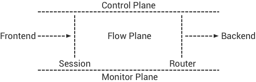
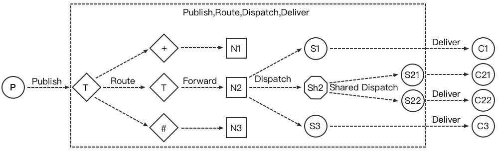
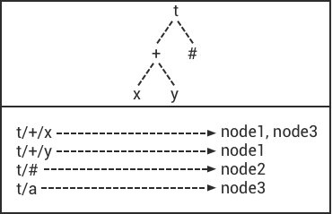

---
# 编写日期
date: 2020-02-07 17:15:26
# 作者 Github 名称
author: wivwiv
# 关键字
keywords:
# 描述
description:
# 分类
category: 
# 引用
ref: undefined
---

# Design

## Foreword

In terms of the design of EMQX Broker, it firstly separates the FrontEnd and Backend, and secondly separates the  Message Flow Plane and Monitor/Control Plane :

### 1 million connections

With Multi-core servers and modern operating system kernel, it can easily support 1 million TCP connections. The core issue is how to deal with business bottlenecks at the application level.

EMQX Broker solves all kinds of bottleneck problems of single node carrying 1 million connections at the business and application level. For the operating system kernel, TCP protocol stack, and Erlang virtual machine parameters of connection testing, see: <http://docs.emqtt.cn/zh_CN/latest/tune.html>

### Fully asynchronous architecture

EMQX Broker is a fully asynchronous architecture based on the Erlang/OTP platform: asynchronous TCP connection processing, asynchronous Topic subscription, and asynchronous message publishing. Only for the resource load limitation part, it adopts synchronous design, such as TCP connection creation and Mnesia database transaction execution.

In the EMQX 3.0 version, from the Publisher to the Subscriber, a MQTT message flows   with a series of Erlang processes Mailbox flows asynchronously inside the EMQXBroker:

### Message persistence

EMQX open source products do not support message persistence within the server, which is an architectural design choice. Firstly, the core problem solved by EMQX is connection and routing; secondly, we think that built-in persistence is a wrong design.

Traditional MQ servers with built-in message persistence, such as the widely used JMS server ActiveMQ, have redesigned the persistence part in almost every major version. There are two design issues with built-in message persistence:

1.  How to balance the use of memory and disk? Message routing is based on memory, while message storage is based on disk.
2. In a multi-server distributed cluster architecture, how to place Queue and how to copy Queue messages?

Kafka made a correct design on the above problem, which is a message server based entirely on disk-distributed Commit Log.

After EMQX separates message routing and message storage responsibilities in the design, the function of data replication, disaster recovery and even application integration can be implemented flexibly at the data level.

In EMQX Enterprise Edition products, through rule engines or plugins, messages can be persisted to both databases such as Redis, MongoDB, Cassandra, MySQL, PostgreSQL, and message queues such as RabbitMQ, Kafka.

## System structure

### Conceptual model

EMQX Broker is more like a network Router or a Switch in concept, rather than the traditional enterprise-level message queue (MQ). Compared to network routers that route packets by IP address or MPLS label, EMQX Broker routes MQTT messages between cluster nodes by publish-subscribe model of Topic Trie:

### Design Philosophy

1. The core problem solved by the EMQX Broker is to process massive concurrent MQTT connection and routing messages.
2. Embrace Erlang/OTP, the Soft-Realtime, Low-Latency, Concurrent and Fault-Tolerant Platform.
3. Layered Design: Connection, Session, PubSub and Router Layers.
4. Separate the Message Flow Plane and the Control/Management Plane.
5. Support backend database or NoSQL for data persistence, disaster recovery and application integration.

### System Layers

1. Connection Layer: Handle TCP and WebSocket connections, encode/decode MQTT packets.
2. Session Layer: Process MQTT PUBLISH/SUBSCRIBE Packets received from client, and deliver MQTT messages to client.
3. Routing(Distributed) Layer: Route MQTT messages among clustered nodes.
4. Distributed Layer: Distributed MQTT messages routed between distributed nodes.
2. Authentication and access control (ACL): The connection layer supports extensible authentication and access control modules.
3. Hooks and Plugins: Each layer of the system provides extensible hooks and supports server expansion with plugin.

 

## Connection Layer design

The connection layer handles the server-side Socket connection and MQTT protocol codec:

1. Asynchronous TCP server based on  [eSockd](https://github.com/emqx/esockd)
2. TCP Acceptor pool and asynchronous TCP Accept
3. TCP / SSL, WebSocket / SSL connection support
4. Maximum number of concurrent connections
5. Access control based on IP address (CIDR)
6. Flow control based on Leaky Bucket
7. MQTT protocol codec
8. MQTT protocol heartbeat detection
9. MQTT protocol packet processing

## Session Layer design

The session layer handles the MQTT protocol Publish/Subscribe business interaction process:

1. Cache all subscriptions of the MQTT client, and terminate the subscription QoS
2. Handle QoS 0/1/2 message reception and delivery, message timeout retransmission and offline message saving
3. Inflight Window, delivering message throughput control and order guarantee
4. Save the unacknowledged QoS 1/2 message sent by the server to the client
5. Cache  QoS 2 message that client sends to the server, but does not receive PUBREL
6. When the client is offline, save the offline QoS 1/2 message of the persistent session

### Packet ID and message ID

The MQTT protocol defines a 16-bit PacketId, which is used to send, receive and confirm messages from the client to the server. After MQTT PUBLISH packet arrives at the broker, it is converted into a message object and assigned a 128-bit MessageId.

Global unique time series message ID structure:

1. 64bits timestamp: erlang: system_time if Erlang \> = R18, otherwise os: timestamp
2. Erlang node ID: encoded as 2 bytes
3. Erlang process PID: encoded as 4 bytes
4. Process internal serial number: 2-byte process internal serial number

During the end-to-end message Pub/Sub process, the published message ID and packet QoS are terminated at the session layer, and the MQTT message object identified by the unique ID is routed between the nodes:

## Routing layer  design

The routing layer maintains the Subscriber and Subscription, and Dispatch message at this node with Pub/Sub model :

After the message is dispatched to the session, the session is responsible for delivering the message according to different QoS.

## Distribution layer design

The distribution layer maintains a Topic Trie and a Route Table. The Topic Trie is composed of wildcard topics, and the Route Table maps topics to nodes:

The distribution layer forwards routed MQTT messages between nodes in the cluster by matching the Topic Trie and querying Route Table:

## Mnesia/ETS  table design

| Table                    | Type   | Description                     |
| :----------------------- | :----- | :------------------------------ |
| emqx_conn                | ets    | Connection Table                |
| emqx_metrics             | ets    | Metrics Table                   |
| emqx_session             | ets    | Session Table                   |
| emqx_hooks               | ets    | Hooks Table                     |
| emqx_subscriber          | ets    | Subscriber Table                |
| emqx_subscription        | ets    | Subscription Table              |
| emqx_admin               | mnesia | The Dashboard admin users Table |
| emqx_retainer            | mnesia | Retained Message Table          |
| emqx_shared_subscription | mnesia | Shared Subscription Table       |
| emqx_session_registry    | mnesia | Global Session Registry Table   |
| emqx_alarm_history       | mnesia | Alarms History                  |
| emqx_alarm               | mnesia | Alarms                          |
| emqx_banned              | mnesia | Built-In Banned Table           |
| emqx_route               | mnesia | Global Route Table              |
| emqx_trie                | mnesia | Trie Table                      |
| emqx_trie_node           | mnesia | Trie Node Table                 |
| mqtt_app                 | mnesia | App table                       |

## Erlang design

1. Use Pool, Pool, Pool ... Recommende GProc library: <https://github.com/uwiger/gproc>
2. Asynchronous, asynchronous, asynchronous message ... asynchronous message between connection layer and the routing layer, and the synchronous request is used for load protection
3. Avoid process Mailbox accumulating messages
4. The Socket connection and session process through which the message flows must be Hibernate, and actively recover the binary handle
5. Use Binary data more to avoid memory copying between processes
6. Use ETS, ETS, ETS ... Message Passing vs. ETS
7. Avoid ETS table non-key value field select, match
8. Avoid large amounts of data ETS read and write, for each time of ETS read and write, it will copy memory, and you can use lookup_element, update_counter
9. Properly open the ETS table {write_concurrency, true}
10. Protect Mnesia database transactions, minimize the number of transactions, and avoid transaction overload 
11. Avoid match, select for non-index or non-key value field of Mnesia data table 

