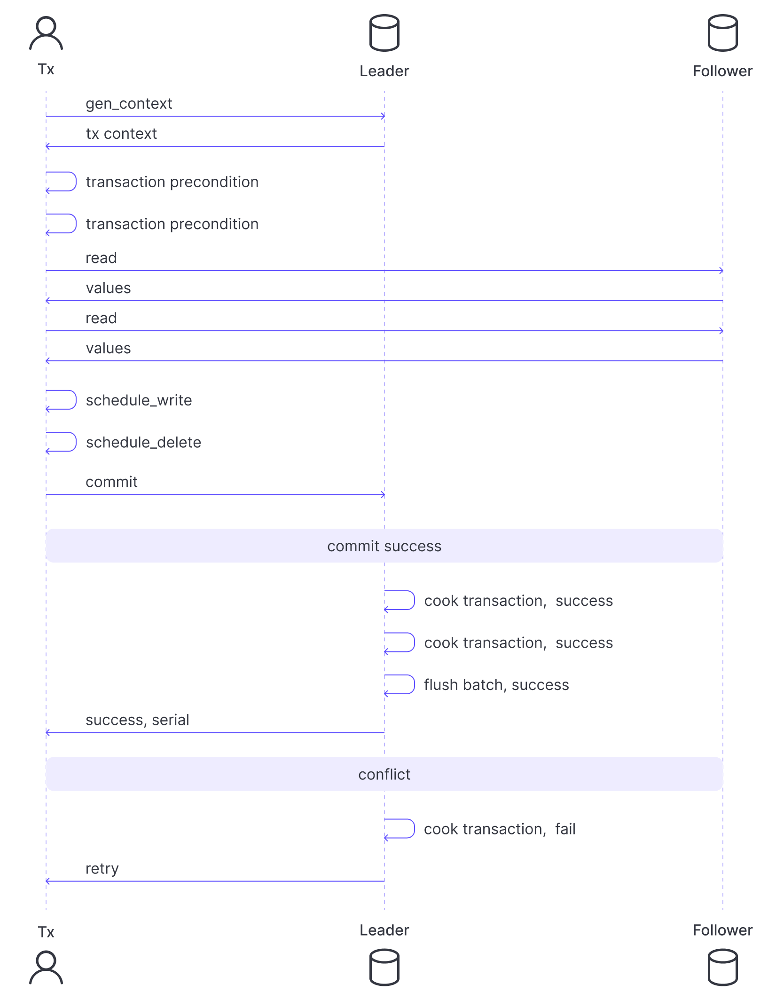
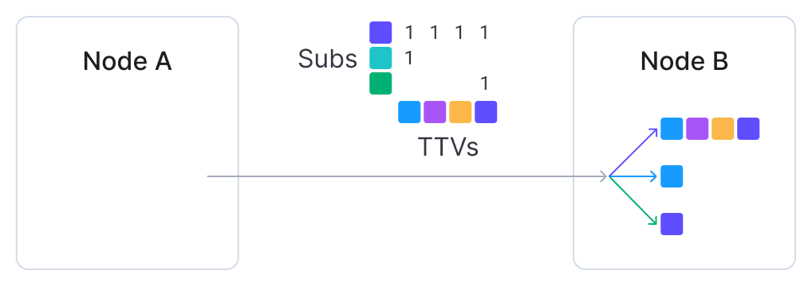

# Design for Durable Storage

EMQX 6.0 introduces Optimized Durable Storage (DS), a purpose-built application designed to ensure high reliability and persistence for MQTT message delivery. DS combines the strengths of a streaming service (like Kafka) and a key-value store, providing a robust, highly optimized foundation for storing, replaying, and managing MQTT data.

## Foundational Concepts

- **Databases (DBs):** The top-level logical container for data. Each DB is independent and can be created, managed, and dropped as needed. For instance:
  - **Sessions DB** stores durable session states.
  - **Messages DB** holds the corresponding MQTT message data.
- **Topic-Timestamp-Value triple (TTV)**: The minimal storage unit in the database, where the topic follows MQTT semantics and the value is an arbitrary binary blob.
- **Streams:** A critical abstraction introduced for efficient handling of wildcard topic filters. Streams are units of batching and serialization. They group TTVs with similar structures, allowing data to be read in time-ordered, deterministic chunks.

## Architecture: Backends and Storage Hierarchy

Durable Storage is implementation-agnostic, using a backend layer to allow data to be stored across different database management systems.

### Embedded Backends

EMQX provides two embedded backends that do not rely on third-party services: 

- The `builtin_local` backend uses RocksDB as the storage engine and is intended for single-node deployments. 
- The `builtin_raft` backend extends `builtin_local` with support for clustering and data replication across different sites.

### Data Storage Hierarchy

Internally, DS organizes data into a sophisticated hierarchy, transparent to the application:

- **Databases -> Shards:** A DB is horizontally partitioned into Shards. Shards are independent in operation and can reside on different physical servers, enabling horizontal scaling and partial availability during cluster outages.
- **Shards -> Generations:** Data within a shard is temporally subdivided into Generations. Periodically creating new generations serves several main purposes:
  1. **Backward compatibility and data migrations:** New data is appended to new generations, possibly with improved encoding, while old generations remain immutable and read-only.
  2. **Time-based data retention:** Since each generation covers a specific time period, old data can be removed by dropping entire generations.
- **Slabs:** A volume of data identified by its shard and generation. All data in a slab share the same encoding schema, and writes are atomic, eliminating the need for extra metadata.

<!-- Consider adding a diagram here -->

## Write Path

Data writes to DS can use either **append-only mode** or **ACID transactions**.

### Append-Only Mode

This mode supports only the **appending of data**, offering minimal overhead for high-throughput scenarios.

### ACID Transactions

Transactions rely on **Optimistic Concurrency Control (OCC)**, assuming that clients typically operate on non-conflicting data subsets. If a conflict occurs, only one contender succeeds in committing the transaction; the others are aborted and retried.

**Transaction Flow:**

1. **Initiation:** A client process (Tx) requests the Leader node to create a transaction context (containing the Leader's term and last committed serial number).
2. **Operations:** The client schedules reads (added to the context), writes, and deletes. It also sets commit preconditions (e.g., check for the existence/non-existence of specific TTVs). Scheduled writes/deletes only materialize upon full commitment and replication.
3. **Submission & Verification:** The client sends the list of operations to the Leader.
   - The Leader checks the preconditions against the latest data snapshot.
   - It verifies that the reads do not conflict with recent writes.
4. **"Cooking (preparing)" and Logging:** If successful, the Leader "cooks" the transaction:
   - It assigns written TTVs to streams.
   - It creates a deterministic list of low-level storage mutations applicable to all replicas.
5. **Commit:** A batch of "cooked" transactions is added to the Raft log (`builtin_raft`) or the RocksDB write-ahead log (WAL).
6. **Outcome:** Upon successful completion, the transaction process is notified. Conflicts result in the transaction being aborted and retried.

**Write Flush Control**:

The frequency of flushing the buffer to the Raft log is controlled:

- `flush_interval`: Maximum time a cooked transaction can remain in the buffer.
- `max_items`: Maximum number of pending transactions.
- `idle_flush_interval`: Allows early flushing if no new data has been added within this interval.

The following sequence describes the transaction lifecycle within the `builtin_raft` backend.

## Read Path

Reading data from DS revolves around streams. 

1. To access data in an MQTT topic, the reader first retrieves the list of streams associated with the topic using the `get_streams` API. This indirection allows DS to group similar topics and minimize metadata volume. The reader then creates an *iterator* for each stream with a specified start time. An iterator is a small data structure that tracks the read position in the stream. 
2. Data can then be read using the `next` API, which returns a chunk of data and an updated iterator pointing to the next chunk.

### Reads with Wildcard Topic Filters

To facilitate efficient subscriptions to wildcard topic filters, DS groups TTVs with similarly structured topics into the same stream. This is achieved using the Learned Topic Structure (LTS) algorithm, which splits topics into *static* and *varying* parts. 

- **Example:** If clients publish data to the topic `metrics/<hostname>/cpu/socket/1/core/16`, the LTS algorithm, given enough data, derives the static topic part as `metrics/+/cpu/socket/+/core/+`, treating the hostname, socket, and core as varying parts. 
- **Benefits:** This enables efficient queries such as `metrics/my_host/cpu/#` or `metrics/+/cpu/socket/1/core/+`.

### Real-Time Subscriptions

Readers can also access data in real time using the subscription mechanism. The `subscribe` API, also based on iterators, allows DS to push data to subscribers instead of requiring clients to poll for data.

DS maintains two pools of subscribers: 

- **Catch-up subscribers** read historical data and, upon reaching the end, become real-time subscribers. 
- **Real-time subscriptions** are event-based and activate only when new data is written to DS.

Both pools group subscribers by stream and topic, reusing resources to serve multiple subscribers simultaneously. This approach saves IOPS when reading from disk and reduces network bandwidth when sending data to remote clients. A batch of messages, a list of subscription IDs, and a sparse dispatch matrix are sent across the cluster to remote nodes hosting subscribers, which then dispatches messages to local clients.

## Applications: Durable Sessions and Shared Subscriptions

Durable Storage is the backbone for EMQX's advanced reliability features:

### Durable Sessions (EMQX 5+)

Durable sessions are a parallel session implementation that uses DS for message routing.

- **Mechanism:** When a client connects with a session expiry interval greater than zero and subscribes to a topic, the filter is marked as durable. Messages published to matching topics are saved to DS *in addition* to being dispatched.
- **State:** Durable sessions access saved messages via the DS subscription mechanism. Their state includes a set of iterators for each matching stream, allowing them to precisely track their progress. Only one copy of each message is stored per database replica, regardless of how many durable sessions share it.

### Shared Subscriptions (EMQX 6.0)

EMQX 6.0 extended DS to shared subscriptions for enhanced load balancing and reliability.

- **Iterator Management:** The iterator sets for shared subscriptions are managed by a separate entity called the **shared sub leader**.
- **Replay and Rebalancing:** Sessions subscribing to a shared topic communicate with the leader, which **lends them iterators** for message replay. Updated iterators are reported back. If a client disconnects or the group is rebalanced, the leader **revokes the iterators** and redistributes them to other members, ensuring consumption continuity and load distribution.

## Conclusion: The Foundation of High-Reliability MQTT

The Optimized Durable Storage in EMQX 6.0 is the resilient foundation for high-reliability MQTT messaging. By re-engineering RocksDB and embedding concepts like TTVs and Streams, DS provides a purpose-built, highly available, and persistent internal database. This architecture, coupled with sophisticated features like the LTS algorithm and Raft replication, ensures lossless message delivery and optimal retrieval for complex wildcard and shared subscriptions, solidifying EMQX's position as a leading solution for demanding IoT infrastructure.