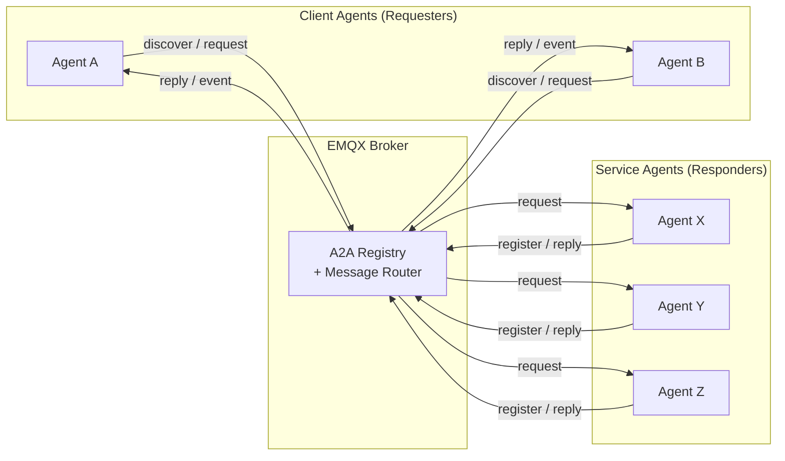
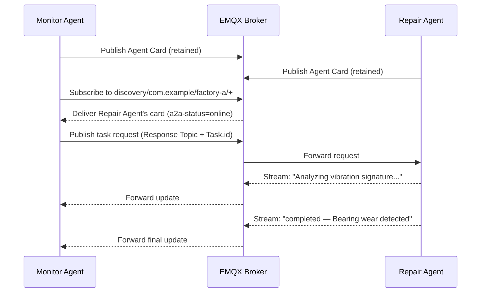

# How A2A over MQTT Works

This page explains the core concepts behind A2A over MQTT: how agents, clients, and the broker are organized, how agents identify and discover each other, what an Agent Card contains, and the interaction patterns agents use to communicate. Understanding these concepts is the foundation for working with the A2A Registry in EMQX.

## Architecture

A2A over MQTT uses a broker-centric model with three participants:

- **Agent (responder)**: Publishes its Agent Card as a retained message on its discovery topic, subscribes to its request topic, and replies to incoming task requests.
- **Client agent (requester)**: Subscribes to discovery topics to find available agents, then sends task requests and receives replies.
- **MQTT Broker (EMQX)**: Routes all messages, records Agent Cards in the A2A Registry, enforces authentication and authorization, and attaches liveness metadata to discovery messages.



## Agent Identity

Each agent is identified by a three-level hierarchy:

```
{org_id} / {unit_id} / {agent_id}
```

- **org_id**: the organization the agent belongs to (for example, `com.example`).
- **unit_id**: a subdivision within the organization, such as a team or deployment environment (for example, `factory-a`).
- **agent_id**: a unique identifier for the agent within its org and unit (for example, `iot-ops-agent-001`).

All three segments must match `^[A-Za-z0-9_.-]+$` and must not contain `/`, `+`, `#`, or whitespace. The agent's MQTT Client ID must use the combined format: `{org_id}/{unit_id}/{agent_id}`.

## Topic Model

| Topic | Purpose |
|---|---|
| `$a2a/v1/discovery/{org_id}/{unit_id}/{agent_id}` | Agent registration and discovery (retained) |
| `$a2a/v1/request/{org_id}/{unit_id}/{agent_id}` | Incoming task requests to a specific agent |
| `$a2a/v1/reply/{org_id}/{unit_id}/{agent_id}/{suffix}` | Recommended reply topic pattern (see note below) |
| `$a2a/v1/event/{org_id}/{unit_id}/{agent_id}` | Unsolicited event publications |
| `$a2a/v1/request/{org_id}/{unit_id}/pool/{pool_id}` | Shared pool topic for load-balanced dispatch |

::: tip Note
The reply topic is not a fixed protocol topic. The requester can use any topic as its reply topic. The responder learns where to reply from the MQTT v5 `Response Topic` property on each incoming request. The pattern above is a recommendation for consistency and to simplify ACL configuration.
:::

Discovery subscriptions use wildcards to scope the view:

```
$a2a/v1/discovery/com.example/+/+     # all agents in an org
$a2a/v1/discovery/com.example/factory-a/+  # all agents in a unit
```

## Agent Card

The Agent Card is a JSON document that an agent publishes to its discovery topic. It describes the agent's identity, capabilities, HTTP endpoint, and optional security metadata. EMQX records the card in the A2A Registry when it is received.

Minimum required fields:

| Field | Type | Description |
|---|---|---|
| `name` | String | Human-readable agent name. |
| `description` | String | Brief description of what the agent does. |
| `version` | String | Version string, for example `"1.0.0"`. |
| `url` | String (URI) | The agent's endpoint URI. Optional. |
| `skills` | Array | At least one skill object, each with `id`, `name`, and `description`. |

Example minimal Agent Card:

```json
{
  "name": "IoT Operations Agent",
  "description": "Monitors factory telemetry and coordinates remediation actions.",
  "version": "1.2.3",
  "url": "mqtts://broker.example.com:8883",
  "skills": [
    {
      "id": "device-diagnostics",
      "name": "Device Diagnostics",
      "description": "Analyzes telemetry and detects device anomalies."
    }
  ]
}
```

For the full Agent Card schema, including `capabilities`, `securitySchemes`, `supportedInterfaces`, and extension parameters, see the [A2A specification](https://a2a-protocol.org/latest/specification/).

## Agent Liveness

Agent Cards persist as retained messages after the agent disconnects. EMQX tracks connection state and attaches MQTT v5 User Properties to discovery messages when forwarding them to subscribers:

| User Property | Value | Meaning |
|---|---|---|
| `a2a-status` | `online` | Agent's MQTT connection is active. |
| `a2a-status` | `offline` | Agent has disconnected (gracefully or via LWT). |
| `a2a-status-source` | `broker` | Status was set by EMQX. |
| `a2a-status-source` | `agent` | Status was set by the agent itself. |
| `a2a-status-source` | `lwt` | Status reflects an unexpected disconnect (Last Will). |

Agents should configure a Last Will message on their discovery topic with `a2a-status=offline` and `a2a-status-source=lwt` so subscribers are notified automatically on ungraceful disconnect.

## Interaction Patterns

A2A over MQTT supports the following interaction patterns between agents. Each uses the MQTT v5 `Response Topic` and `Correlation Data` properties for request/reply routing, with a requester-generated `Task.id` to track task state across the full lifecycle.

| Pattern | Description |
|---|---|
| One request, one response | Requester publishes a task request; responder publishes a single reply to the provided `Response Topic`. |
| Streaming responses | Responder publishes multiple status and artifact update messages until a terminal task state is reached. |
| Multi-turn conversation | Related tasks are grouped using `Task.context_id`, allowing interrupted tasks to be resumed. |
| Shared pool dispatch | Multiple agent instances share a pool topic for load-balanced request handling via MQTT shared subscriptions. |
| Task handover | A responding agent delegates an in-progress task to another instance using the `a2a-responder-agent-id` User Property. |
| OAuth 2.0 authorization | Per-request bearer tokens are passed as the `a2a-authorization` MQTT User Property. |
| End-to-end security | The optional `ubsp-v1` security profile provides end-to-end encrypted payloads for untrusted broker environments. |

For the full specification of each pattern, see the [A2A over MQTT Transport Specification](https://www.emqx.com/mqtt-for-ai/a2a-over-mqtt/specification/0.1/basic/mqtt_transport.html).

## Example Workflow: Factory Alert Response

Two agents collaborate to handle a factory floor alert: a **Monitor Agent** that detects anomalies and delegates diagnostic tasks, and a **Repair Agent** that processes them and streams results back.

**Step 1: Both agents register.** Each agent publishes its Agent Card as a retained message to its discovery topic. EMQX records the cards and marks both agents as online.

**Step 2: Monitor Agent discovers the Repair Agent.** The Monitor Agent subscribes to `$a2a/v1/discovery/com.example/factory-a/+` and immediately receives the Repair Agent's retained card, confirming it can diagnose equipment faults.

**Step 3: Monitor Agent sends a task request.** An abnormal vibration reading arrives from motor `line-7`. The Monitor Agent publishes a request to the Repair Agent's request topic with a unique `Task.id` and a reply topic set in the MQTT `Response Topic` property.

**Step 4: Repair Agent streams status updates.** The Repair Agent publishes progress updates to the reply topic, followed by a final `completed` status: bearing wear detected, inspection scheduled. Each update echoes the original `Correlation Data` so the Monitor Agent can match it to the request.


