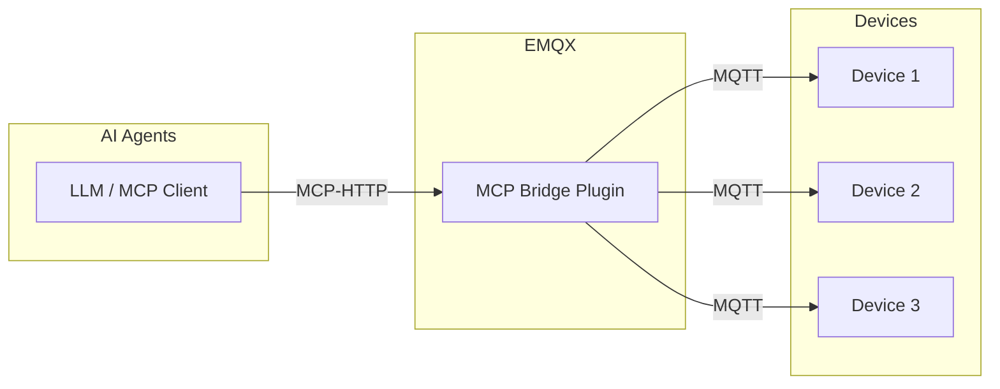
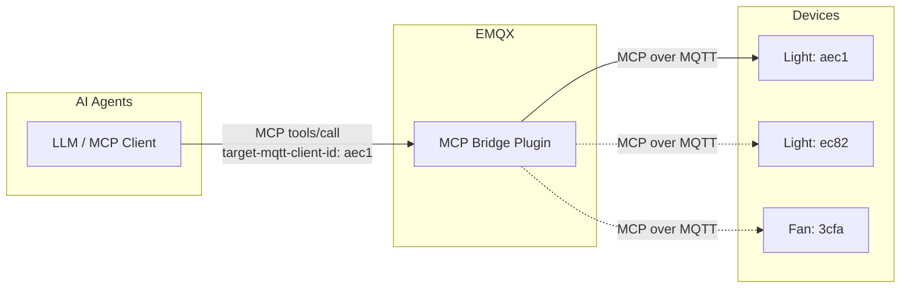
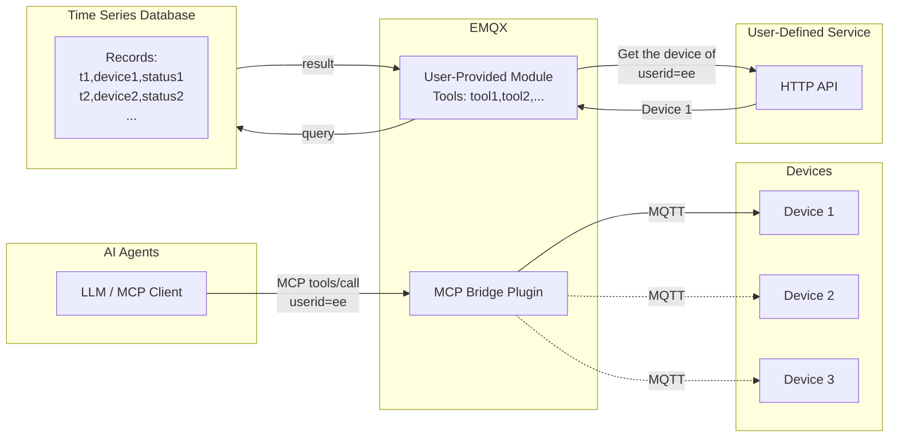

# MCP Bridge Plugin

The [EMQX MCP Bridge Plugin](https://github.com/emqx/emqx_mcp_bridge) is a plugin used to integrate EMQX with MCP (Model Context Protocol)–enabled devices. With this plugin, users can access and control IoT devices using MCP-compatible large language models or AI agents.

## How MCP Bridge Plugin Works

The MCP Bridge Plugin is installed and runs inside EMQX. After startup, it exposes an HTTP endpoint that converts MCP connections based on Streamable HTTP or SSE into the MQTT protocol.

IoT devices connect to the EMQX broker using MQTT, while MCP-enabled large models or AI agents connect to the HTTP endpoint exposed by the MCP Bridge Plugin.

## Access Devices Using MCP over MQTT

On the device side, devices can use the MCP over MQTT protocol and act as MCP Servers that directly expose their tools and capabilities. The plugin aggregates the tools registered by devices based on tool type. In the MCP Bridge Plugin, the Server Name concept from the MCP over MQTT protocol is mapped to a tool type.

In other words, tools registered by multiple devices of the same type are aggregated by the bridge plugin into a single logical tool that can be invoked by an MCP Client.

This approach is suitable for scenarios where a single client accesses one or a small number of devices, such as smart homes, industrial control systems, or voice-enabled toys. In these scenarios, users typically only need access to their own devices rather than managing large fleets of devices.

Because tools from multiple devices of the same type are aggregated into a single logical tool, the MCP Bridge Plugin injects a required parameter named `target-mqtt-client-id` into the tool definition. When an AI agent invokes the tool, it must determine the target device ID according to business logic and provide it via this parameter, allowing the MCP request to be routed to the specific device.

## Access Devices Using Standard MQTT

Devices can also connect to EMQX using the standard MQTT protocol instead of MCP over MQTT. In this case, users can implement MCP tools directly within the MCP Bridge Plugin to indirectly access these regular MQTT devices.

This approach is suitable for scenarios that require more flexible device access, such as smart cities, connected vehicles, and industrial IoT. Within the MCP Bridge Plugin, arbitrary business logic can be implemented, including accessing user-defined external services or APIs, or querying external databases to retrieve device-reported data.

For examples on how to implement MCP tools in code, refer to [Create Custom MCP Tools](https://github.com/emqx/emqx_mcp_bridge?tab=readme-ov-file#create-custom-mcp-tools).

