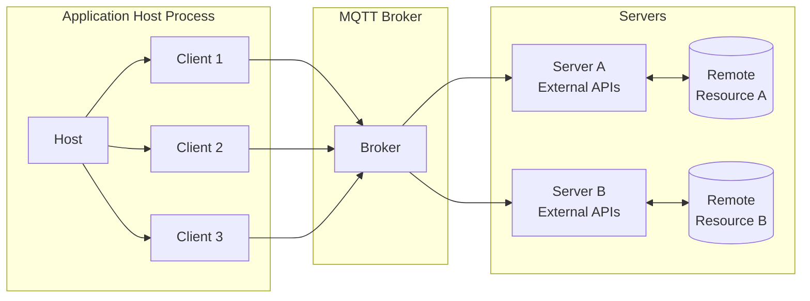
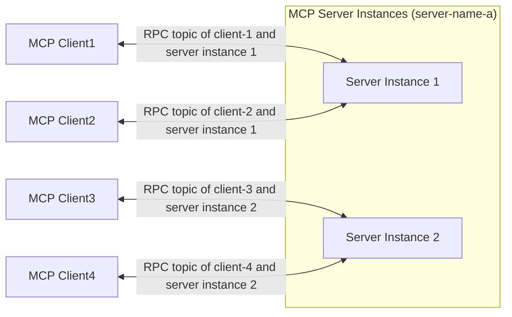

# MCP over MQTT Architecture

MCP over MQTT inherits the core concepts of the standard MCP architecture (Host, Client, Server), while introducing a centralized MQTT Broker as the transport layer. The broker enables message routing, service registration and discovery, authentication, and authorization.

This architecture not only preserves MCP’s original context interaction model but also leverages MQTT’s lightweight and broadly applicable design, providing the foundation for many-to-many communication, load balancing, and scalability in IoT and edge computing scenarios.

## Core Components of the MQTT Transport

In the MCP over MQTT architecture, a centralized MQTT Broker is introduced as the message router, while other components (Host, Client, Server) remain consistent with the standard MCP design.

### Host, Client, and Server

The Host, Client, and Server components remain unchanged (see [MCP core concepts](https://modelcontextprotocol.io/docs/learn/architecture#concepts-of-mcp)):

- **Host** acts as a container and coordinator for clients.
- Each **Client** is created by the Host and maintains an independent connection with a Server.
- **Server** provides dedicated context and capabilities.

The key difference is that Clients and Servers now communicate through the MQTT Broker, instead of directly. With the broker in place, the relationship between Clients and Servers becomes many-to-many rather than one-to-one.

### Role of the MQTT Broker

The MQTT Broker serves as the centralized message router:

- Forwards messages between Clients and Servers.
- Supports service registration and discovery (via retained messages).
- Handles authentication and authorization for Clients and Servers.

## Server Scaling and Load Balancing

To achieve scalability and load balancing, an MCP Server can launch multiple instances (processes). Each instance connects to the broker with a unique `server-id` as its MQTT Client ID, while all instances share the same `server-name`.

**Client interaction flow:**

1. The Client subscribes to the service discovery topic to obtain all available `server-id`s under the target `server-name`.
2. The Client selects a Server instance based on a custom policy (e.g., random or round-robin) and sends an `initialize` request.
3. After initialization, the Client communicates with the selected Server instance through a dedicated RPC topic.

This approach enables high availability and scalability of MCP servers:

- **During scaling up**, existing MCP clients remain connected to old server instances, while new clients can initialize with newly added instances.
- **During scaling down**, MCP clients can reinitialize and connect to other available server instances.