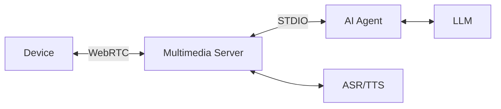
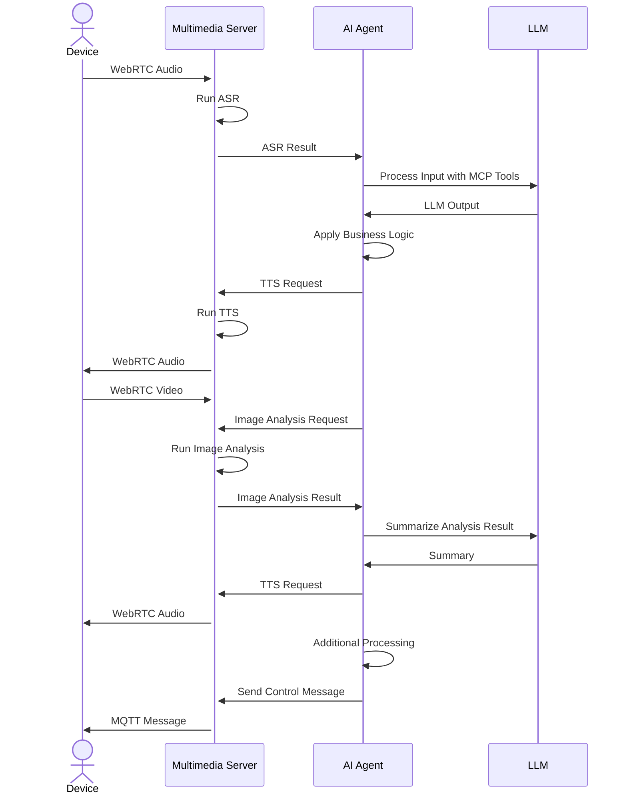

# Multimedia Server Architecture

The EMQX Multimedia Server uses WebRTC to establish peer-to-peer audio and video data transmission with clients, while MQTT is used to carry general messages and WebRTC signaling.

Developers can build AI agent programs in Python, which communicate with the Multimedia Server via Standard Input/Output (STDIO), enabling more sophisticated business logic and AI-driven workflows.

The following diagram illustrates the overall architecture of an AI system built with the Multimedia Server:

## Components

- **Device**: Exchanges audio and video data with the Multimedia Server via WebRTC.
- **Multimedia Server**: Processes audio and video streams from devices, provides Automatic Speech Recognition (ASR) and Text-to-Speech (TTS) services, and communicates with the AI Agent.
- **AI Agent**: Receives ASR results from the Multimedia Server over STDIO. It encapsulates the core business logic of the AI application, calls the Large Language Model (LLM) for natural language understanding, and uses Multimedia Server APIs to send text or audio streams back to devices.
- **ASR/TTS**: External AI service providers that offer speech recognition and text-to-speech capabilities.
- **LLM**: Large Language Model, responsible for natural language processing and text generation.

## Workflow

The diagram below shows how the components interact in a typical workflow:

