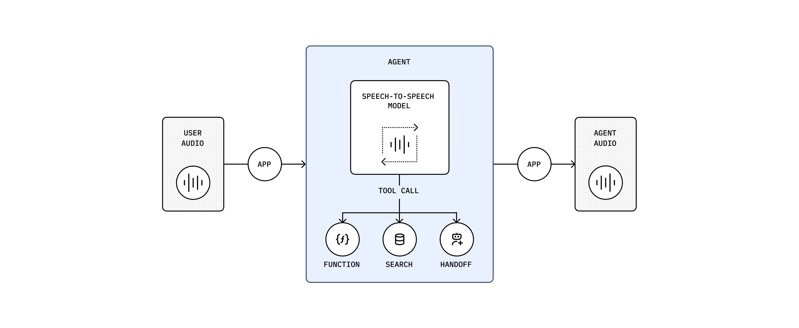

# GPT-Realtime Overview

GPT-Realtime is a multimodal, real-time model developed by OpenAI that can receive live voice input and generate voice output in real time. It is trained on large-scale speech datasets and is designed to align closely with natural human conversational patterns.

Key characteristics include:

- **Protocols**: Supports WebRTC, WebSocket, and SIP. It can process text and speech inputs in real time and stream responses continuously.
- **Conversation experience**: Low latency, natural and fluent speech synthesis, and robust handling of multiple interruptions during a conversation, closely resembling human dialogue.
- **Function calling and tools**: Supports function calling and MCP tools.
- **Developer experience**: For WebRTC integration, it offers two levels of integration:
  - **Voice Agents SDK**: Higher-level abstractions with out-of-the-box capabilities.
  - **WebRTC SDK**: Lower-level audio/video transport with greater flexibility and customization.

## Traditional RTC Real-Time Voice Pipelines with Multiple Models

In traditional RTC real-time voice solutions, multiple types of models are typically chained together to enable voice interaction: speech is first transcribed into text, then processed by a large language model, and finally synthesized back into speech and streamed to the user.

## GPT-Realtime: Unified Capabilities in a Single Model

GPT-Realtime eliminates the need to chain multiple model types. The entire speech-to-speech process is handled within a single model, resulting in significantly lower end-to-end latency.

