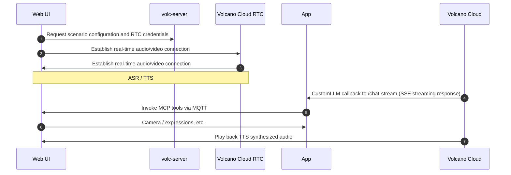

# Build a Real-Time Voice Agent with EMQX + Volcano Engine RTC

This document explains how to deploy an AI Agent demo using Docker Compose. The demo uses an intelligent doll in the browser to simulate a smart device, and demonstrates how to use [Volcano Engine RTC](https://www.volcengine.com/product/veRTC/ConversationalAI) to achieve low-latency voice interaction, invoke device-side capabilities (photo capture, expression switching, volume control, etc.) through the MCP over MQTT protocol, and integrate a custom AI Agent service via Volcano Engine `CustomLLM` mode for multi-turn conversations and tool calling. It showcases the complete workflow from voice conversation to device control.

Watch the [demo video](https://www.bilibili.com/video/BV1P2WTzBEu4/) to see the full effect.

## Architecture Overview

### Components

The system consists of three core components:

| Component   | Role                  | Port | Key Responsibilities                                         |
| ----------- | --------------------- | ---- | ------------------------------------------------------------ |
| volc-server | Volcano Engine proxy  | 3002 | Manages RTC rooms/tokens; configures the CustomLLM callback address for Volcano Engine to call back into the app |
| web         | MCP Server            | 8080 | Frontend UI; exposes hardware control tools (camera/expression/volume) |
| app         | MCP Client + AI Agent | 8081 | Provides the `/chat-stream` endpoint; handles LLM/VLM inference and MCP tool calls |

### Communication Flow



Core capabilities:

- MCP over MQTT: Cross-network tool invocation via an EMQX Broker; the AI Agent controls device capabilities (camera, expression, volume)
- Multimodal understanding: Integrates a VLM for vision use cases such as “What am I holding?”
- Real-time voice interaction: End-to-end low-latency speech recognition and synthesis based on Volcano Engine RTC + ASR/TTS
- Parallel processing architecture: Tool calling and speech synthesis run asynchronously for a smoother user experience

## Prerequisites

### 1. Docker Environment

Docker 24+ (verify by running `docker --version`).

### 2. MQTT Broker

This project requires an accessible EMQX Broker for the web service (MCP Server) and the app (MCP Client + AI Agent) containers to connect to.

Deployment options (choose one):

- Self-hosted: See the [EMQX installation guide](https://docs.emqx.com/zh/emqx/latest/deploy/install.html)
- Managed service: Use [EMQX Cloud](https://docs.emqx.com/zh/cloud/latest/)

Example configuration:

```
MQTT_BROKER_HOST=localhost        # EMQX Broker host
MQTT_BROKER_PORT=1883             # MQTT port
MQTT_USERNAME=your_username       # Username (if authentication is enabled)
MQTT_PASSWORD=your_password       # Password (if authentication is enabled)
```

### 3. LLM API Key

This project integrates a custom AI Agent through Volcano Engine CustomLLM mode. By default, it uses the Alibaba Cloud Bailian `qwen-flash` model.

#### Enable Alibaba Cloud Bailian

1. Go to the [Alibaba Cloud Bailian Console](https://bailian.console.aliyun.com)
2. If you see an enablement prompt at the top, click to enable the service (enabling is free; charges apply only when API usage exceeds the free quota)
3. Complete real-name verification if required

#### Create an API Key

1. Go to [API-KEY Management](https://bailian.console.aliyun.com/#/api-key)
2. Under the API-Key tab, click Create API-KEY
3. Select the account and workspace (typically the default workspace), add a description, and confirm
4. Click the copy icon next to the API key to obtain the secret
5. Put the API key into `app/.env` as `DASHSCOPE_API_KEY`

#### Use Other Model Services (Optional)

To use another OpenAI-compatible model service, update `app/.env`:

```
LLM_API_BASE=https://your-model-service.com/v1  # Model service base URL
LLM_API_KEY=your_api_key                        # Model service API key
LLM_MODEL=your_model_name                       # Model name
```

Common model service endpoints:

- OpenAI: `https://api.openai.com/v1`
- DeepSeek: `https://api.deepseek.com/v1`
- Other compatible services: refer to each provider’s documentation

Latency and cost can vary significantly across LLM services. Choose based on your requirements. For best latency, the default Alibaba Cloud Bailian `qwen-flash` is recommended.

### 4. Volcano Engine Credentials

This project uses multiple Volcano Engine services. Register and log in via the [Volcano Engine Console](https://console.volcengine.com/home).

Required services to enable:

1. RTC Service — [Enablement guide](https://www.volcengine.com/docs/6348/69865)
   - After enabling, obtain `VOLC_RTC_APP_ID` and `VOLC_RTC_APP_KEY`
   - Where to find: [RTC Console](https://console.volcengine.com/rtc/aigc/listRTC)
2. ASR/TTS Speech Service — [Doubao Speech Console](https://console.volcengine.com/speech/app)
   - When creating an app, select:
     - ASR: Streaming speech recognition
     - TTS: Speech synthesis
   - Obtain the following credentials:
     - `VOLC_ASR_APP_ID` - ASR application ID
     - `VOLC_TTS_APP_ID` - TTS application ID
     - `VOLC_TTS_APP_TOKEN` - TTS application token
     - `VOLC_TTS_RESOURCE_ID` - TTS resource ID (depends on the selected voice)
3. Account Credentials — [Key Management](https://console.volcengine.com/iam/keymanage/)
   - `VOLC_ACCESS_KEY_ID` - Access Key ID
   - `VOLC_SECRET_KEY` - Secret Access Key

#### Permission Configuration

Required: Configure cross-service authorization in the RTC console; otherwise the agent cannot call ASR/TTS/LLM services correctly.

Main account invocation (recommended, simpler):

1. Log in to the [RTC Console](https://console.volcengine.com/rtc) with the main account
2. Go to [Cross-service Authorization](https://console.volcengine.com/rtc/aigc/iam)
3. Click One-click Enable Cross-service Authorization to configure the `VoiceChatRoleForRTC` role
4. Use the main account AK/SK to call services

Sub-account invocation (optional, requires additional configuration):

Grant the sub-account permission to call Real-Time Conversational AI APIs:

1. Log in to the [RTC Console](https://console.volcengine.com/rtc) with the main account
2. Go to [Cross-service Authorization](https://console.volcengine.com/rtc/aigc/iam) and click Grant Permissions to Sub-account
3. Find the sub-account and add permissions

Full enablement guide: [Real-Time Conversational AI Prerequisites](https://www.volcengine.com/docs/6348/1315561)

#### LLM Configuration

This project uses CustomLLM mode: Volcano Engine calls back into the app’s custom AI Agent service to obtain LLM responses.

Core settings:

- `VOLC_LLM_URL` - points to the app service `/chat-stream` endpoint
  - Local deployment: `http://app:8081/chat-stream` (container network)
  - Production: `https://your-domain.com/chat-stream` (must be publicly accessible)
- `VOLC_LLM_API_KEY` - custom authentication key; must match the app’s `CUSTOM_LLM_API_KEY` (see “Step 2: Configure environment variables” below)

Optional model sources:

- Volcano Ark: create an inference endpoint or app in the [Ark Console](https://console.volcengine.com/ark/region:ark+cn-beijing/endpoint)
- Coze platform: create an Agent on [Coze](https://www.coze.cn) — [guide](https://www.coze.cn/open/docs/guides/quickstart)
- Third-party models: prepare an OpenAI-compatible service URL — [requirements](https://www.volcengine.com/docs/6348/1399966)

Note: The app service in this project already implements the CustomLLM protocol. You only need to configure the API key described in “3. LLM API Key” (such as `DASHSCOPE_API_KEY`). No additional model service deployment is required.

#### Quickly Retrieve Parameters

Recommended: Use the official Volcano Engine demo to validate your configuration quickly.

1. Open the [Real-Time Conversational AI Demo](https://console.volcengine.com/rtc/aigc/run)
2. After running the demo, click the Access API button in the top-right
3. Copy the parameter configuration snippet and extract the required credentials

### 5. Network Requirements

Ports to open (defaults; can be adjusted in the Compose file):

- `8080` - Web UI
- `8081` - App backend (SSE endpoint)
- `3002` - volc-server proxy (Volcano Engine service configuration)

Accessibility requirements:

Important: To fully experience MCP over MQTT in this project, the app service `/chat-stream` endpoint must be deployed to a publicly accessible HTTPS environment so Volcano Engine can call it back.

- Production (recommended): deploy the app at a public HTTPS URL (e.g., `https://your-domain.com/chat-stream`), and ensure the SSE stream ends correctly with `data: [DONE]`
- Local testing: in a non-public environment, you can only test LLM inference and MCP over MQTT tool invocation via APIs; you cannot fully experience Volcano Engine voice interaction

## Quick Tutorial: Voice Interaction + Device Control Demo in 10 Minutes

After completing all prerequisites, follow these steps to quickly set up the AI Agent demo with voice interaction and device control (the “device” is simulated in the web UI).

### Step 1: Get the Code

```bash
git clone -b volcengine/rtc https://github.com/emqx/mcp-ai-companion-demo.git
cd mcp-ai-companion-demo
```

### Step 2: Configure Environment Variables

This is the most critical step. You must fill in credentials obtained in the prerequisites into the configuration files for the three services. Read the descriptions and sources for each field carefully.

#### 2.1 Configure the app service (AI Agent backend)

Create the config file:

```bash
cp app/.env.example app/.env
```

Edit `app/.env` and fill in the following:

```bash
# ===== LLM configuration =====
# Source: Prerequisite "3. LLM API Key"
# Purpose: The AI Agent calls the LLM for conversational inference
DASHSCOPE_API_KEY=sk-xxxxxxxxxxxxx  # Replace with your Alibaba Cloud Bailian API key

# If using another model service, also configure:
# LLM_API_BASE=https://api.openai.com/v1
# LLM_MODEL=gpt-4

# ===== CustomLLM authentication key =====
# Source: Generate yourself (use a strong random string)
# Purpose: Volcano Engine uses this key to validate callback requests
# Requirement: Must exactly match volc-server VOLC_LLM_API_KEY
CUSTOM_LLM_API_KEY=your-strong-random-secret-key-here

# Example generation (run in terminal):
# openssl rand -base64 32
# Or use an online tool: https://www.random.org/strings/

# ===== MQTT Broker configuration =====
# Source: Prerequisite "2. MQTT Broker"
# Purpose: Connect to EMQX Broker for MCP over MQTT communication
MQTT_BROKER_HOST=localhost        # EMQX Broker host
MQTT_BROKER_PORT=1883             # MQTT port

# If EMQX authentication is enabled:
MQTT_USERNAME=your_mqtt_username  # EMQX username (optional)
MQTT_PASSWORD=your_mqtt_password  # EMQX password (optional)

# ===== Optional settings =====
MCP_TOOLS_WAIT_SECONDS=5          # Seconds to wait for MCP tool registration
PHOTO_UPLOAD_DIR=uploads          # Photo upload directory
# APP_SSL_CERTFILE=/path/to/cert  # HTTPS cert (production)
# APP_SSL_KEYFILE=/path/to/key    # HTTPS key (production)
```

Notes:

- Difference between `DASHSCOPE_API_KEY` and `CUSTOM_LLM_API_KEY`:

  - `DASHSCOPE_API_KEY`: used when the app actively calls Alibaba Cloud Bailian (or another LLM service) to get AI responses
  - `CUSTOM_LLM_API_KEY`: used to authenticate Volcano Engine callback requests received by the app (similar to an API gateway token)

- Ways to generate `CUSTOM_LLM_API_KEY` (choose one):

  ```bash
  # Option 1: Generate with openssl (recommended)
  openssl rand -base64 32
  
  # Option 2: Generate with Python
  python3 -c "import secrets; print(secrets.token_urlsafe(32))"
  
  # Option 3: Online tool
  # https://www.random.org/strings/ (length 32, alphanumeric)
  ```

#### 2.2 Configure the volc-server service (Volcano Engine proxy)

Create the config file:

```bash
cp volc-server/.env.example volc-server/.env
```

Edit `volc-server/.env` and fill in Volcano Engine credentials:

```bash
# ===== Volcano Engine account credentials =====
# Source: Prerequisite "4. Volcano Engine Credentials > Account credentials"
# Where to find: https://console.volcengine.com/iam/keymanage/
VOLC_ACCESS_KEY_ID=AKLT*********************
VOLC_SECRET_KEY=************************************

# ===== RTC service credentials =====
# Source: Prerequisite "4. Volcano Engine Credentials > RTC service"
# Where to find: https://console.volcengine.com/rtc/aigc/listRTC
VOLC_RTC_APP_ID=your_rtc_app_id
VOLC_RTC_APP_KEY=your_rtc_app_key

# ===== ASR/TTS speech service credentials =====
# Source: Prerequisite "4. Volcano Engine Credentials > ASR/TTS speech service"
# Where to find: https://console.volcengine.com/speech/app
VOLC_ASR_APP_ID=your_asr_app_id
VOLC_TTS_APP_ID=your_tts_app_id
VOLC_TTS_APP_TOKEN=your_tts_app_token
VOLC_TTS_RESOURCE_ID=your_tts_resource_id

# ===== CustomLLM configuration =====
# Purpose: Tell Volcano Engine which endpoint to call to obtain LLM responses

# VOLC_LLM_URL - app /chat-stream endpoint
# Local testing: use Docker container networking
# VOLC_LLM_URL=http://app:8081/chat-stream
# Production: must be a public HTTPS URL (for Volcano Engine callbacks)
VOLC_LLM_URL=https://your-domain.com/chat-stream

# VOLC_LLM_API_KEY - CustomLLM authentication key
# Requirement: Must exactly match app/.env CUSTOM_LLM_API_KEY
VOLC_LLM_API_KEY=your-strong-random-secret-key-here  # Keep consistent with app
```

Configuration checklist:

| Item                       | Setting                                                      | Source                                               |
| -------------------------- | ------------------------------------------------------------ | ---------------------------------------------------- |
| Volcano Engine credentials | `VOLC_ACCESS_KEY_ID`, `VOLC_SECRET_KEY`                      | Volcano Engine console                               |
| RTC app config             | `VOLC_RTC_APP_ID`, `VOLC_RTC_APP_KEY`                        | RTC console                                          |
| Speech service config      | `VOLC_ASR_APP_ID`, `VOLC_TTS_APP_ID`, `VOLC_TTS_APP_TOKEN`, `VOLC_TTS_RESOURCE_ID` | Doubao Speech console                                |
| LLM key consistency        | `VOLC_LLM_API_KEY`                                           | Must exactly match `app/.env` `CUSTOM_LLM_API_KEY`   |
| Permissions                | Cross-service authorization                                  | Complete the prerequisite “Permission configuration” |

#### 2.3 Configure the web service (frontend UI)

The web service uses build-time environment variables. The default local development configuration is usually sufficient:

```bash
VITE_AIGC_PROXY_HOST=http://localhost:3002  # volc-server proxy address
```

You only need to customize this when:

- volc-server is deployed on a remote host, or
- volc-server uses a non-3002 port

Customization (export before starting):

```bash
export VITE_AIGC_PROXY_HOST=http://your-remote-host:3002
```

#### Configuration Mapping Summary

```text
Prerequisites                             Config file location
├─ 3. LLM API Key                 ──►  app/.env (DASHSCOPE_API_KEY)
├─ 4. Volcano Engine credentials
│  ├─ Account credentials         ──►  volc-server/.env (VOLC_ACCESS_KEY_ID/SECRET_KEY)
│  ├─ RTC service                 ──►  volc-server/.env (VOLC_RTC_APP_ID/APP_KEY)
│  ├─ ASR/TTS services            ──►  volc-server/.env (VOLC_ASR_*/VOLC_TTS_*)
│  └─ LLM config                  ──►  volc-server/.env (VOLC_LLM_URL/API_KEY)
└─ 2. MQTT Broker                 ──►  app/.env (MQTT_BROKER_HOST/PORT/USERNAME/PASSWORD)

Self-generated
└─ CUSTOM_LLM_API_KEY             ──►  app/.env + volc-server/.env (must match)
```

Key points:

1. `CUSTOM_LLM_API_KEY` is the only key you must generate yourself, and it must match exactly in both `app/.env` and `volc-server/.env`
2. `DASHSCOPE_API_KEY` is used to call the LLM; `CUSTOM_LLM_API_KEY` is used to authenticate Volcano Engine callbacks
3. In production, you must change `VOLC_LLM_URL` to a public HTTPS URL, otherwise Volcano Engine cannot call back into the app service

### Step 3: Start the Services

Start all services with Docker Compose:

```bash
docker compose -f docker/docker-compose.web-volc.yml up --build
```

Startup process:

1. Build images: `mcp-app`, `mcp-volc-server`, `mcp-web`
2. Start containers and listen on:
   - `8080` - Web UI
   - `8081` - AI Agent backend
   - `3002` - Volcano Engine proxy

The first startup may take a few minutes to download dependencies and build images.

View logs (optional):

```bash
# Follow logs for all services
docker compose -f docker/docker-compose.web-volc.yml logs -f

# Follow logs for a specific service
docker compose -f docker/docker-compose.web-volc.yml logs -f app
```

### Step 4: Validate Functionality

#### 4.1 Open the Web UI

Open the browser at: http://localhost:8080

You should see a virtual device interface with a chatbot avatar, microphone, camera button, and other UI elements.

#### 4.2 Configure MQTT Connection (First Use)

1. Click the settings icon in the top-right corner
2. In the settings panel, enter EMQX Broker settings:
   - Broker: `ws://localhost:8083/mqtt` (use WebSocket port 8083, not MQTT port 1883)
   - Username: if EMQX authentication is enabled, enter the username
   - Password: if EMQX authentication is enabled, enter the password
3. Click Save
4. In the confirmation dialog, click Confirm; the page refreshes automatically and applies the new configuration, and the MQTT connection is established automatically

Notes:

- The device ID is generated automatically (format: `web-ui-hardware-controller/{randomID}`); no manual setup is required
- After MQTT connects successfully, MCP tools are registered automatically and can be invoked by the AI Agent
- If the connection fails, check whether the EMQX WebSocket listener is enabled (default port 8083)

#### 4.3 Start Voice Interaction

Click the microphone button at the bottom of the page and allow microphone permissions. The system will establish an RTC connection automatically. When the connection succeeds, the microphone button turns purple and you can start speaking.

Suggested tests:

- Say “Hello” or “Tell me a story” to test basic conversation
- Say “What am I holding?” to trigger photo capture and vision recognition
- Say “Set the volume to 80%” or “Switch to a happy expression” to test device control

#### 4.4 Success Criteria

- Voice interaction: ASR transcription is correct, LLM streams responses, and TTS playback works
- MCP tool calling: photo capture, expression switching, and volume adjustment all take effect
- No errors in logs: app, volc-server, and browser console show no errors

#### 4.5 Partial Feature Test

If you only want to validate the UI and Volcano Engine configuration (without using the custom AI Agent):

```
docker compose -f docker/docker-compose.web-volc.yml up --build volc-server web
```

Mode characteristics:

- Available: ASR, TTS, basic conversation
- Not available: MCP tool calls (camera, expression, volume control, etc.)

Use Volcano Ark platform LLM for conversation:

1. Create an inference endpoint or Agent app in the [Ark Console](https://console.volcengine.com/ark)

2. Obtain `EndpointId` (inference endpoint) or `BotId` (Agent app)

3. Configure the LLM in `volc-server/src/config.ts`:

   ```typescript
   llm: {
     mode: 'ArkV3',                    // Use Ark platform LLM
     endpointId: 'ep-xxx',             // Option 1: inference endpoint ID (choose one)
     // botId: 'bot-xxx',               // Option 2: Agent app ID (choose one)
     systemMessages: [
       { role: 'system', content: 'You are a friendly voice assistant' }
     ],
     historyLength: 5,                 // Context history turns
   }
   ```

4. Restart the volc-server service to use the Ark platform LLM for conversation

Tip: For smoother interactions, use non-deep-thinking models (such as the Doubao-pro series). For full configuration parameters, refer to the [Volcano Engine documentation](https://www.volcengine.com/docs/6348/1581714).

### Step 5: Stop the Services

```bash
docker compose -f docker/docker-compose.web-volc.yml down
```

## FAQ and Troubleshooting

### Configuration Adjustments

#### Port Conflicts

If ports are in use, modify port mappings in `docker/docker-compose.web-volc.yml`:

```yaml
services:
  web:
    ports:
      - "8888:8080"  # Change Web UI port
  app:
    ports:
      - "8082:8081"  # Change app port
  volc-server:
    ports:
      - "3003:3002"  # Change volc-server port
```

Note: If you change the volc-server port, update the `VITE_AIGC_PROXY_HOST` environment variable accordingly.

#### Enable HTTPS (Production)

1. Prepare certificate files (`fullchain.pem`, `privkey.pem`)

   Important: You must use the fullchain (complete certificate chain), not a single certificate file. Volcano Engine callbacks validate the full chain; otherwise the SSL handshake will fail.

   - Let’s Encrypt: use `fullchain.pem` (includes certificate + intermediate certificate)
   - Other CAs: ensure the cert file contains the full chain (server cert + intermediate certs)

2. Place the certificate files in the project directory (for example, `certs/`)

3. Configure certificate paths in `app/.env`:

   ```bash
   APP_SSL_CERTFILE=./certs/fullchain.pem  # Must be fullchain
   APP_SSL_KEYFILE=./certs/privkey.pem
   ```

4. Update `VOLC_LLM_URL` in `volc-server/.env` to the HTTPS address (for example, `https://your-domain.com:8081`)

#### Build Images Separately

To build a specific service image:

```bash
docker build -t mcp-web:local ./web
docker build -t mcp-app:local ./app
docker build -t volc-server:local ./volc-server
```

### Common Issues

#### Service Startup Issues

| Issue                             | Possible Cause         | Solution                                                     |
| --------------------------------- | ---------------------- | ------------------------------------------------------------ |
| Container fails to start          | Port is already in use | 1) Run `lsof -i :8080` to identify the process 2) Change Compose port mappings 3) Re-run `docker compose up --build` |
| Environment variables not applied | `.env` file not loaded | 1) Ensure `.env` is in the correct directory 2) Check file permissions 3) Rebuild images |

#### Volcano Engine Service Issues

| Issue                   | Possible Cause                             | Solution                                                     |
| ----------------------- | ------------------------------------------ | ------------------------------------------------------------ |
| Stuck on “AI preparing” | Cross-service authorization not configured | 1) Verify “Permission configuration” is completed 2) Ensure services are enabled and balance is sufficient 3) Verify parameter casing |
| 401/403 errors          | Incorrect AK/SK or token                   | 1) Check `VOLC_ACCESS_KEY_ID`/`VOLC_SECRET_KEY` 2) Ensure the token is not expired 3) Verify cross-service authorization |
| Sub-account quota limit | Default quota is insufficient              | Increase quota in the [Quota Center](https://console.volcengine.com/quota/productList/ParameterList?ProviderCode=iam) |

#### LLM Request Issues

| Issue                    | Possible Cause               | Solution                                                     |
| ------------------------ | ---------------------------- | ------------------------------------------------------------ |
| LLM request fails        | Incorrect API key            | 1) Confirm `DASHSCOPE_API_KEY` is correct 2) Check network connectivity 3) View logs: `docker compose logs app` |
| CustomLLM callback fails | Auth keys do not match       | 1) Ensure the two `CUSTOM_LLM_API_KEY` values match 2) Verify `VOLC_LLM_URL` 3) Check whether volc-server can reach the app |
| HTTPS callback fails     | Incomplete certificate chain | You must use a fullchain cert: `APP_SSL_CERTFILE` must point to `fullchain.pem` (full chain), not a single `cert.pem`. Volcano Engine callbacks require full-chain validation or the SSL handshake will fail. |

#### MCP Tool Invocation Issues

| Issue                      | Possible Cause                     | Solution                                                     |
| -------------------------- | ---------------------------------- | ------------------------------------------------------------ |
| Tools unavailable          | MQTT connection or device_id issue | 1) Check MQTT status in the browser console 2) Confirm Device ID matches 3) Increase `MCP_TOOLS_WAIT_SECONDS=10` |
| Camera photo capture fails | Permission not granted             | 1) Check browser camera permissions 2) Click Allow 3) Refresh the page |

#### MQTT Connection Issues

| Issue                 | Possible Cause            | Solution                                                     |
| --------------------- | ------------------------- | ------------------------------------------------------------ |
| MQTT connection fails | Incorrect broker settings | 1) Ensure EMQX Broker is running 2) Check `MQTT_BROKER_HOST`/`PORT` 3) Verify credentials 4) Test network connectivity |
| Web UI cannot connect | WebSocket port not open   | 1) Ensure WebSocket listener is enabled (default 8083) 2) Use the `ws://` scheme (e.g., `ws://localhost:8083/mqtt`) |

### Viewing Logs

```
# Follow logs for all services
docker compose -f docker/docker-compose.web-volc.yml logs -f

# Follow logs for a specific service
docker compose -f docker/docker-compose.web-volc.yml logs -f app

# Show the last 100 lines
docker compose -f docker/docker-compose.web-volc.yml logs --tail=100 app
```

### Performance Optimization

- LLM latency: use a low-latency model (recommended: Alibaba Cloud Bailian `qwen-flash`)
- Voice quality: adjust ASR VAD thresholds and TTS voice selection in `volc-server/src/config.ts`
- Tool call latency: ensure good network connectivity between app and web; reduce MQTT latency (deploy in the same LAN or a low-latency environment)

Local development (non-Docker):

- web: `pnpm dev`
- app: `uv run ...`
- volc-server: `bun run dev`
