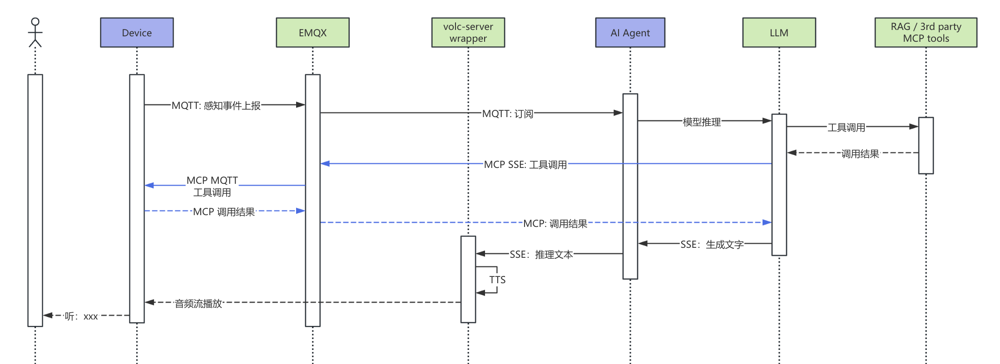

# Device-Initiated Voice Feedback Scenarios

Unlike user-initiated voice control or conversational scenarios, interactions here are initiated by the device. When a device detects environmental changes or events, it proactively triggers AI-generated voice messages and plays them to the user—shifting from “people finding devices” to “devices finding people.”

**Technical implementation**: Sensors on the device (temperature, smoke, camera AI, etc.) detect events and report them to the cloud via MQTT. The AI Agent analyzes the event and generates natural-language announcements, then uses the Volcano Engine `UpdateVoiceChat` API with the `ExternalTextToSpeech` command to push text into an RTC room for TTS playback.

**Architecture components**:

- **Device sensors**: Detect environmental changes (standard hardware)
- **EMQX**: Event data ingestion via MQTT (standard product)
- **AI Agent**: Event analysis and announcement generation (custom-developed)
- **Volcano Engine RTC + TTS**: Voice broadcast channel (standard product)

## Flow Diagram

**Flow description**:

1. Device sensors detect an event (e.g., abnormal temperature, smoke alarm)
2. Event data is reported to the cloud via MQTT
3. The AI Agent analyzes the event and generates natural-language announcements
4. The `ExternalTextToSpeech` command of the `UpdateVoiceChat` API is invoked
5. Volcano Engine pushes TTS audio to the device via RTC for playback

## Typical Scenarios

### Industrial Monitoring — Real-Time Incident Alerts

At 3:00 a.m., the factory is unattended:

> *(A temperature sensor detects abnormal temperature in Boiler #3)*
>  **PA system**: “Warning! Boiler #3 temperature has reached 285°C, exceeding the safety threshold. Power has been automatically reduced. On-duty personnel, please inspect immediately.”
>  *(A phone call is also placed to the shift supervisor)*
>
> *(Abnormal vibration detected)*
>  **System**: “Attention: Abnormal vibration detected on Motor #5. Possible bearing wear. Data recorded and a maintenance ticket has been generated.”

Immediate voice alerts reduce inspection workload and help prevent accidents.

### Child Care — Safety and Companionship

A mother is cooking in the kitchen while her 3-year-old plays in the living room:

> *(Camera detects the child approaching a power outlet)*
>  **Speaker**: “Sweetie, the outlet is dangerous—don’t touch it. How about we play with some blocks instead?”
>
> *(Crying detected)*
>  **Speaker**: “What’s wrong, sweetheart? Did you fall? Mom is coming right away.”
>  *(A notification is also sent to the mother’s phone)*
>
> *(On a hot day, a car temperature sensor detects rising heat and the camera recognizes a child alone in the car)*
>  **In-vehicle system** (voice alert sent to the parent’s phone): “Emergency alert! A child is detected in the vehicle. Current temperature is 42°C and rising. The air conditioner has been turned on automatically. Please return to the vehicle immediately!”
>  *(Hazard lights are activated to alert nearby pedestrians)*

Devices proactively detect danger and alert caregivers in time to protect children.

## Key Technical Points

| Aspect             | Description                                            |
| ------------------ | ------------------------------------------------------ |
| Event-driven       | Triggered by sensor data, no user initiation required  |
| Intelligent speech | AI-generated natural language, not fixed alert tones   |
| Priority control   | Critical alerts can interrupt ongoing conversations    |
| Multi-channel      | Voice + app push + SMS for multi-channel notifications |

## Flexibility of the AI Agent

The AI Agent is the most customizable core component. Developers can tailor it to specific scenarios:

- **Announcement style**: Serious industrial alerts, gentle child companionship, professional medical reminders
- **Decision logic**: Multi-sensor fusion instead of single-threshold triggers
- **Response strategy**: Different notification channels and priorities based on urgency
- **Context awareness**: Incorporate history, time, and user habits for more relevant messages

## Comparison with Traditional Rule-Based Approaches

| Aspect           | Traditional Rules                           | AI Agent Approach                                        |
| ---------------- | ------------------------------------------- | -------------------------------------------------------- |
| Triggering       | Fixed thresholds (e.g., temperature > 50°C) | Contextual reasoning (temperature + trend + environment) |
| Message content  | Static templates (“Temperature abnormal”)   | Dynamic generation with values, suggestions, and context |
| New scenarios    | Requires new rules                          | Adaptable via prompt updates                             |
| False alarms     | Hard to filter                              | Multi-factor analysis reduces false alerts               |
| Maintenance cost | Grows with rule complexity                  | Unified agent logic, easier iteration                    |

## Applicable Devices

- Smart speakers / control panels
- Health monitoring bands / watches
- Children’s watches / companion robots
- In-vehicle systems
- Industrial monitoring terminals
- Retail display kiosks / greeting robots
