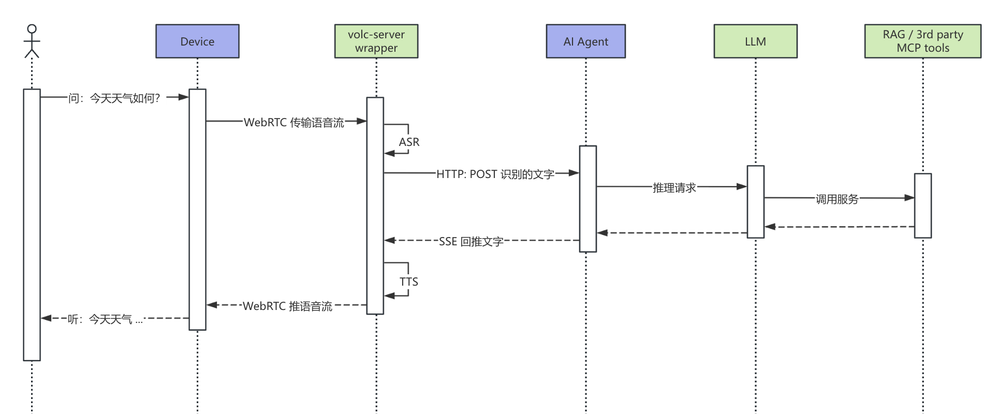

# Pure Voice Conversation Scenarios

Pure voice conversation is the most fundamental and natural form of human–machine interaction. Users simply speak to the device, and the system responds in real time with spoken replies, enabling smooth, multi-turn conversational experiences.

**Technical implementation**: The device establishes a real-time audio channel via Volcano Engine RTC. User speech is converted to text by ASR and sent to an LLM for processing. The LLM’s response is then synthesized into speech via TTS and played back to the user. The end-to-end latency is approximately one second. Combined with VAD (voice activity detection) and interruption mechanisms, this delivers an interaction experience close to natural human conversation.

**Device requirements**: Only a microphone and speaker are required—no screen or camera—making this suitable for a wide range of voice-enabled devices.

## Flow Diagram

## Typical Scenarios

### Smart Speakers — The Home Information Hub

In the morning:

> **User**: “What’s the weather like today?”
>  **Speaker**: “Today in Hangzhou it will be cloudy turning sunny, with temperatures between 18 and 26 degrees. Air quality is good and suitable for outdoor activities.”
>
> **User**: “Set an alarm for 3 p.m. to remind me of a meeting.”
>  **Speaker**: “Okay, the 3 p.m. alarm has been set with a meeting reminder.”
>
> **User**: “What’s in the news today?”
>  **Speaker**: “Today’s top headlines include: first, a tech giant has released a new generation of AI chips…”

The speaker becomes the household’s information gateway, allowing users to access weather, news, schedules, and more hands-free.

### In-Vehicle Assistant — Hands-Free Driving

While driving on the highway:

> **User**: “Navigate to the nearest service area.”
>  **Car system**: “Okay. The Yangcheng Lake Service Area is 15 kilometers ahead. Estimated arrival time is 10 minutes. The route has been planned for you.”
>
> **User**: “Call my wife.”
>  **Car system**: “Calling now…”
>
> **User**: “Play songs by Jay Chou.”
>  **Car system**: “Playing popular songs by Jay Chou for you.”

Voice interaction keeps drivers focused on the road, improving driving safety.

### Language Learning — AI Conversation Practice

Practicing spoken English:

> **User**: “Can you help me practice English conversation?”
>  **AI**: “Of course! Let’s start with a common scenario. Imagine you’re ordering food at a restaurant. I’ll be the waiter. Are you ready?”
>
> **User**: “Yes, I’m ready.”
>  **AI**: “Good evening! Welcome to our restaurant. Here’s the menu. What would you like to order tonight?”
>
> **User**: “I want… a beef steak.”
>  **AI**: “Great choice! By the way, a more natural way to say that would be ‘I’d like a beef steak, please.’ How would you like it cooked?”

The AI not only engages in situational dialogue but also corrects grammar and word usage during the conversation, providing an immersive learning experience.

### Child Companionship — Educational Interaction and Bedtime Stories

At bedtime:

> **Child**: “I can’t sleep. Can you tell me a story?”
>  **Speaker**: “Sure! What kind of story would you like tonight? Little Red Riding Hood, The Three Little Pigs, or a brand-new story?”
>
> **Child**: “A new one!”
>  **Speaker**: “Okay. Once upon a time, in a big forest, there lived a brave little rabbit…”
>
> —
>
> **Child**: “Why did dinosaurs go extinct?”
>  **Speaker**: “That’s a great question! About 66 million years ago, a huge asteroid hit the Earth… Would you like to know more?”
>
> **Child**: “How big was the asteroid?”
>  **Speaker**: “It was about 10 kilometers wide—almost as big as a mountain!”

The AI becomes a “why-why encyclopedia” for children, satisfying curiosity while fostering a love of learning.

## Technical Highlights

| Aspect            | Description                                                |
| ----------------- | ---------------------------------------------------------- |
| Low latency       | ~1 second end-to-end response, close to human conversation |
| Multi-turn dialog | Context memory with reference and ellipsis understanding   |
| Interruption      | Users can interrupt AI responses at any time               |
| Personalization   | Customizable persona, voice, and response style            |

## Applicable Devices

- Smart speakers (e.g., Tmall Genie, Xiaodu, Echo-like devices)
- In-vehicle head units / rearview mirrors
- Mobile phone/tablet apps
- Smartwatches
- TVs / set-top boxes
- Children’s educational devices
- Voice-enabled IoT devices, such as smart desk lamps
