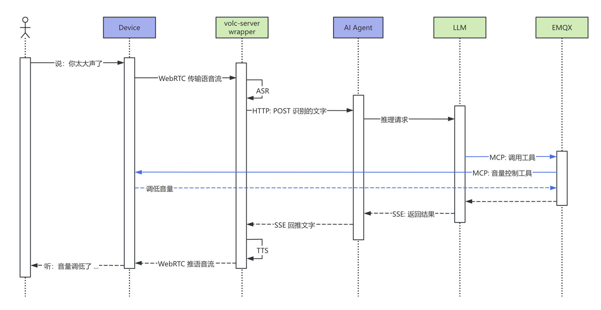

# Voice-Controlled Hardware Scenarios

Building on pure voice conversation, voice-controlled hardware scenarios enable users to control physical devices through speech. Users issue commands verbally, and the AI not only understands and responds but also performs real device operations to complete tasks.

**Technical implementation**: Voice transport, ASR, and TTS are the same as in pure voice conversation scenarios. The key difference is that the AI Agent has tool-calling capabilities. When a control intent is detected, the Agent sends a tool invocation request to the device via the MCP over MQTT protocol. The device, acting as an MCP Server, executes the hardware operation (such as turning a camera on or off, adjusting volume, switching expressions, taking photos, etc.), returns the execution result to the Agent, and the Agent finally provides voice feedback to the user.

**Architecture components**:

- **Volcano Engine RTC + ASR + TTS**: Real-time voice channel and speech recognition/synthesis (standard products)
- **AI Agent (MCP Client)**: Intent understanding and tool invocation decisions (custom-developed)
- **EMQX**: MQTT transport layer for the MCP protocol (standard product)
- **Device (MCP Server)**: Exposes hardware capabilities as MCP tools (custom-developed)

## Flow Diagram



**Flow description**:

1. Voice transport and ASR/TTS are the same as in the pure voice conversation scenario
2. The AI Agent analyzes user intent and decides to invoke a tool
3. A tool invocation request is sent via MCP over MQTT
4. The device (MCP Server) receives the request and performs the hardware operation
5. The execution result is returned to the AI Agent
6. The Agent converts the result into voice feedback for the user

## Typical Scenarios

### Smart Home — Whole-Home Voice Control

At 10:00 p.m., Xiao Zhang is getting ready for bed:

> **Xiao Zhang**: “I’m going to sleep.”
>  **Speaker**: “Okay, good night mode has been activated.”
>
> *(Living room lights dim and turn off, bedroom curtains slowly close, the air conditioner switches to 26°C sleep mode, and the TV turns off.)*
>
> **Xiao Zhang**: “Dim the bedside lamp a bit.”
>  **Speaker**: “The bedside lamp brightness has been set to 20%.”
>
> **Xiao Zhang**: “Open the curtains at 7 a.m. tomorrow.”
>  **Speaker**: “Okay, the bedroom curtains will open automatically at 7 a.m. tomorrow.”

A single sentence triggers coordinated actions across multiple devices. The AI understands the contextual meaning of “sleep” and automatically executes a preset combination of device actions.

### In-Vehicle Systems — Safe Interaction While Driving

Ms. Li is driving on city roads:

> **Ms. Li**: “It’s a bit hot. Lower the air conditioner temperature by two degrees.”
>  **Car system**: “Okay. The air conditioner has been adjusted from 24°C to 22°C.”
>
> *(The temperature is adjusted automatically.)*
>
> **Ms. Li**: “Open the sunroof for some air.”
>  **Car system**: “The sunroof has been opened.”
>
> *(The sunroof opens slowly.)*
>
> **Ms. Li**: “Close the rear windows, it’s too windy.”
>  **Car system**: “The rear windows have been closed.”
>
> **Ms. Li**: “Turn on seat massage, lumbar mode.”
>  **Car system**: “Lumbar seat massage has been activated. Enjoy your drive.”

The driver never needs to look down or reach for controls, ensuring safer driving through voice-based operation.

### Medical Assistance — Voice Control in Operating Rooms

Chief Surgeon Wang is performing surgery:

> **Dr. Wang**: “Move the surgical light 10 degrees to the left.”
>  **System**: “The surgical light has been adjusted.”
>
> *(The light moves automatically.)*
>
> **Dr. Wang**: “Increase the brightness.”
>  **System**: “Brightness increased to 90%.”
>
> **Dr. Wang**: “Display the patient’s CT images, third slice.”
>  **System**: “Displaying the third CT slice.”
>
> *(The display switches to the specified image.)*
>
> **Dr. Wang**: “Zoom in on the upper-right area.”
>  **System**: “Zoomed in.”

In sterile environments where touching non-sterilized equipment is not allowed, voice control becomes essential, improving surgical efficiency and safety.

### Industrial Production — Hands-Free Operation

Factory worker Lao Zhang is operating machinery:

> **Lao Zhang** *(holding parts in both hands)*: “Start the conveyor belt.”
>  **System**: “The conveyor belt has started.”
>
> **Lao Zhang**: “Set the speed to level two.”
>  **System**: “The conveyor belt speed is set to level two, 30 units per minute.”
>
> **Lao Zhang**: “Turn on the inspection camera.”
>  **System**: “The quality inspection camera has been turned on and real-time inspection is in progress.”
>
> **Lao Zhang**: “Record the current parameters.”
>  **System**: “Recorded: temperature 180°C, pressure 2.5 MPa, speed level two.”

When workers’ hands are occupied, voice becomes the most natural control method, significantly improving productivity.

## Core Capabilities

### MCP Tool Invocation

Devices act as MCP Servers exposing capabilities, while the AI Agent acts as an MCP Client invoking them:

```
User speech → ASR → AI Agent intent understanding → MCP tool invocation → Device execution → Voice feedback
```

### Parallel Processing

Voice feedback and device operations occur in parallel for a smoother user experience:

- User says “Turn on the camera”
- The AI immediately responds with “Okay, turning it on”
- The camera starts up at the same time

Instead of waiting for the camera to fully start before responding, perceived latency is greatly reduced.

## Technical Highlights

| Aspect                     | Description                                                |
| -------------------------- | ---------------------------------------------------------- |
| Intent parsing             | AI maps natural language to specific device actions        |
| Multi-device orchestration | One command triggers coordinated actions across devices    |
| State feedback             | Execution results are reported back via voice              |
| Context awareness          | Understands references like “a bit higher” or “that light” |

## Applicable Devices

- Smart home gateways / control panels
- Service robots / companion robots
- In-vehicle control systems
- Operating room medical equipment
- Industrial control terminals
- Smart conference room devices
