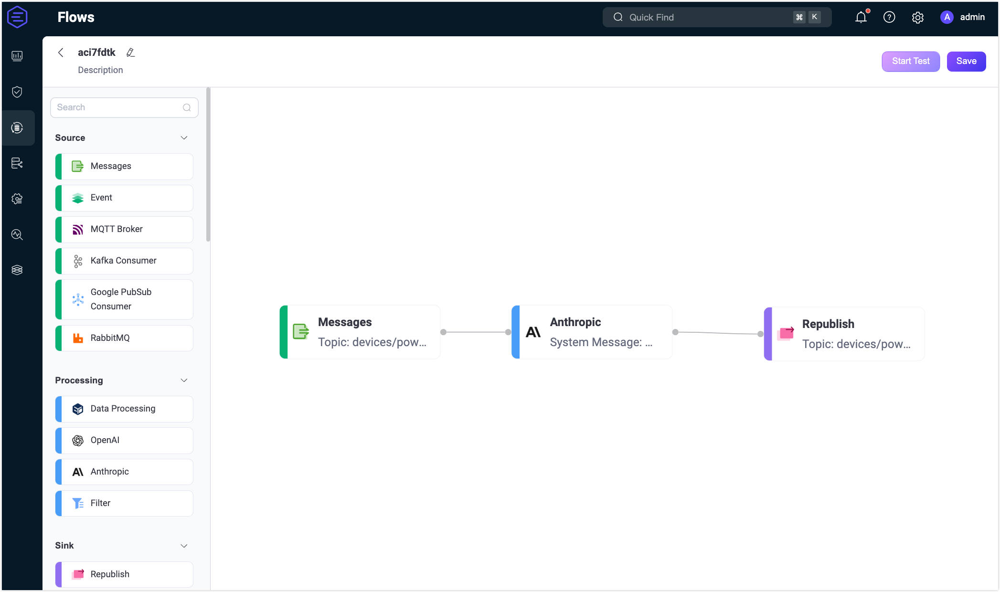
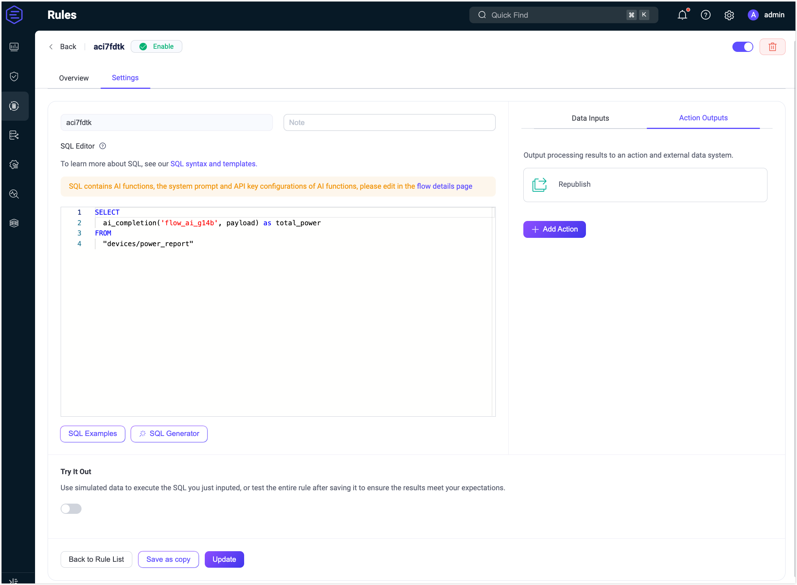
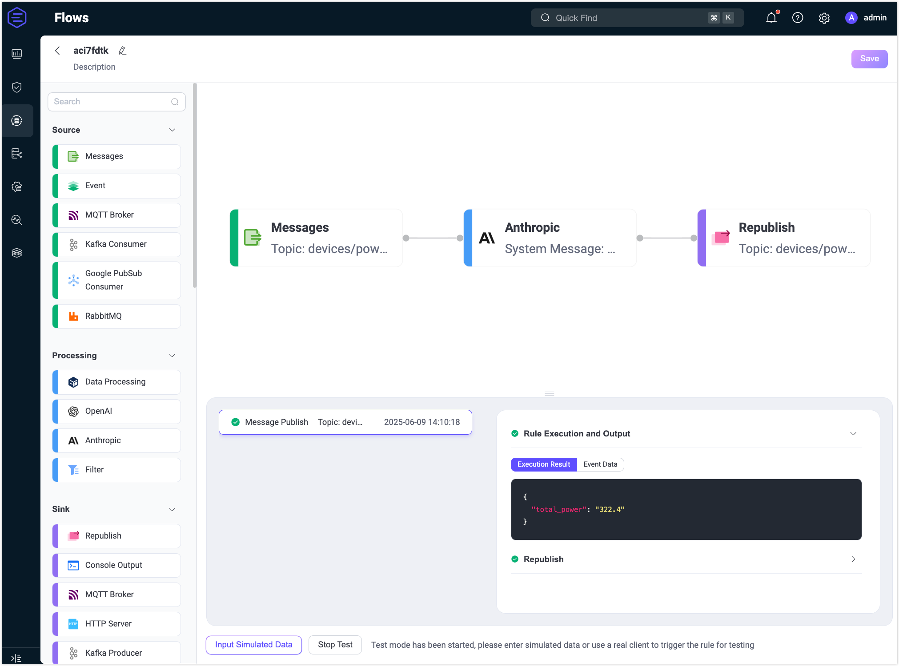
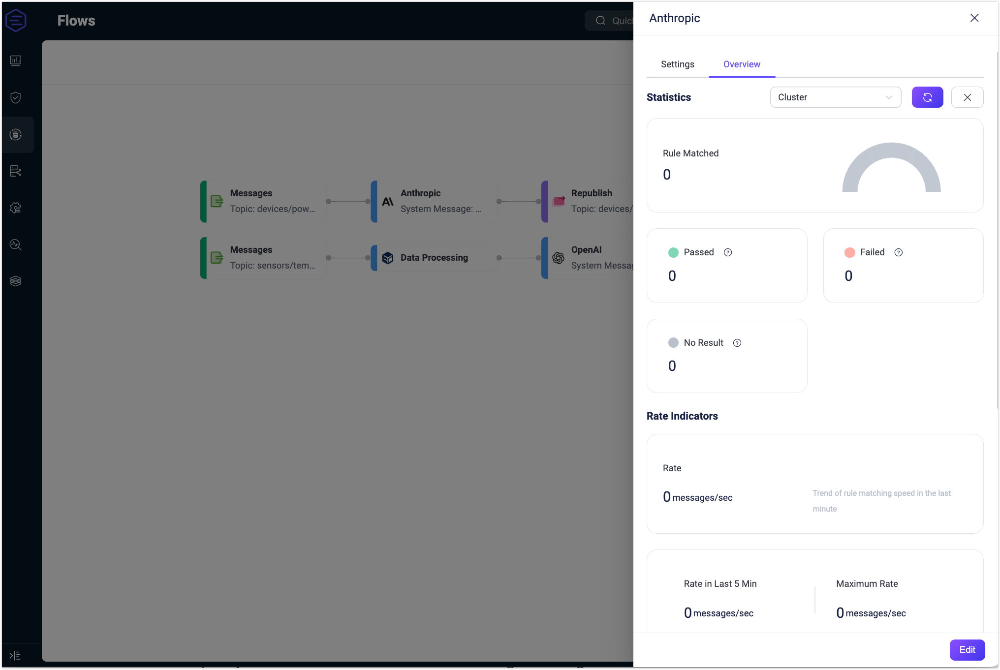

# Quick Start: Create a Flow Using Anthropic Node

This page demonstrates how to use Claude 3 Sonnet to perform fault classification and generate corrective recommendations based on incoming telemetry. It simulates a real-world scenario where IoT systems, such as smart factories or buildings, receive status messages from devices and require automated, intelligent interpretation of those issues.

## Scenario Description

In many industrial or smart building scenarios, IoT devices report multiple metrics in a single MQTT message. For example, a power monitoring device may send power consumption across different circuits in one payload.

Each message is published to the topic `devices/power_report` and includes:

- `device_id`: Identifier of the device
- Multiple numeric metrics, such as `circuit_1`, `circuit_2`, `circuit_3`, etc.
- Additional non-numeric fields like `status` or `timestamp`

Your goal is to sum all numeric values in the message (i.e., total power consumption across circuits) using an LLM (Claude 3 Sonnet), and republish only the numeric result for downstream processing or billing.

## Sample Message

```json
{
  "device_id": "pmu-1008",
  "circuit_1": 120.5,
  "circuit_2": 98.7,
  "circuit_3": 103.2,
  "status": "nominal",
  "timestamp": "2025-06-06T10:00:00Z"
}
```

## Expected Output (from Claude)

```
322.4
```

This value is the total of all numeric circuit readings.

## Create the Flow

::: tip Prerequisite

Make sure you have a valid **Anthropic API Key** and set the correct API version (e.g., `2023-06-01`).

:::

1. Click the **Create Flow** button on the **Flows** page.

2. Add a **Messages** node.

   - Drag a **Messages** node from the Source panel.
   - Set the topic to `devices/power_report`.
   - Click **Save**.

3. Add an **Anthropic** node.

   - Drag an **Anthropic** node from the Processing section and connect it to the Data Processing node.
   - Configure the node:
     - **Input**: Enter `payload`.
     - **System Message**:  You can enter a dynamic prompt like the following:  
       
       ```
       You are a power consumption calculator. Given an input JSON object with various keys, sum all numeric values (e.g., circuit readings) and return only the total.
       ```
     - **Model**: Select `claude-3-sonnet-20240620`.
     - **Max Tokens**: Enter `50`.
     - **Anthropic Version**: Enter `2023-06-01`.
     - **API Key**: Enter your Anthropic API key.
     - **Base URL**: Leave empty.
     - **Output Result Alias**: Enter `total_power`.
   - Click **Save**.

4. Add a **Republish** node.

   - Drag a **Republish** node from the Sink section and connect it to the Anthropic node.
   - Set the topic to `devices/power_total`.
   - Set the payload to `${total_power}`.
   - Click **Save**.

5. Click **Save** in the upper-right corner to save the Flow.

   

6. Flows and form rules are interoperable. You can also view the SQL and related rule configurations on the Rule page.

   

## Test the Flow

1. Connect an MQTT client to EMQX.

   To quickly test the flow, you can use the **Diagnostic Tools** -> **WebSocket Client** on the Dashboard to simulate an MQTT client. Alternatively, you can also use the [MQTTX](https://mqttx.app/) tool or a real MQTT client:

   - Connect to your EMQX server.
   - Subscribe to the topic `devices/power_total`.

2. Start Testing.

   - In the Flow Designer, click any node to open the Edit panel.

   - Click **Edit**, then click **Start Test** to open the test panel at the bottom.

   - Click **Input Simulated Data** and publish this message to topic `devices/power_report` by clicking **Submit Test**:

     ```json
     {
       "device_id": "pmu-1008",
       "circuit_1": 120.5,
       "circuit_2": 98.7,
       "circuit_3": 103.2,
       "status": "nominal",
       "timestamp": "2025-06-06T10:00:00Z"
     }
     ```

3. Review results and node processing metrics.

   - You can see the successful execution result of the flow.

     

   - Return to the **WebSocket Client** page and you should receive an AI-generated summary like:
   
     > 322.4
     
   - If the test results are unsuccessful, error messages will be displayed accordingly.
   
   - To view the running statistics and metrics of the **Anthropic** node, click the node to open the Edit panel and click the **Overview** tab.
   
     
