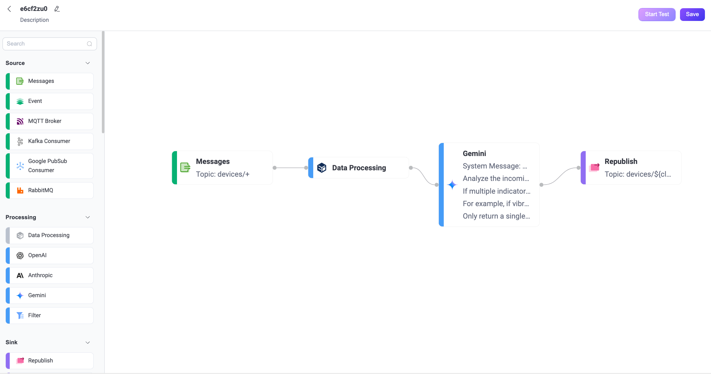
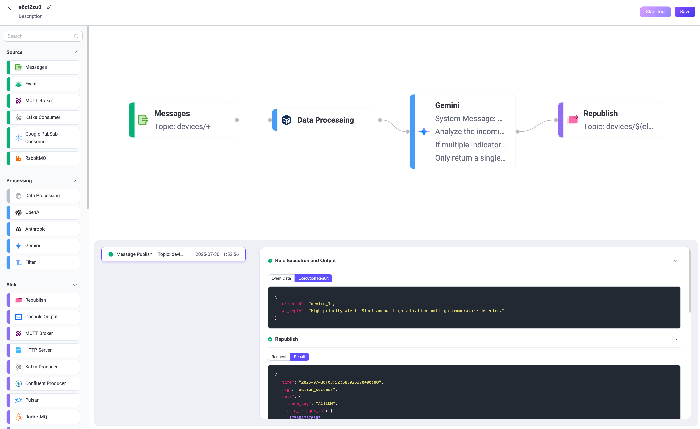

# Quick Start: Create a Flow Using Gemini Node

This section demonstrates how to quickly create and test an LLM-based Flow in the Flow Designer through a practical use case using the Gemini Node. 

This example demonstrates how to build a Flow that integrates with the Gemini LLM to process MQTT device messages containing structured sensor data while preserving the `clientid` for routing. The Gemini node generates a reply based on the message payload, and the Republish node sends the AI’s reply to the per-client topic `devices/${clientid}/reply`, ensuring each device receives its own customized reply.

## Scenario Description

In an industrial monitoring scenario, each device periodically publishes structured sensor data in JSON format to the topic `devices/<device_id>`. Traditional rule-based alerts (e.g., threshold for temperature) may miss hidden patterns or combinations of abnormal indicators.

This Flow leverages Gemini to analyze the overall context of multiple fields, such as vibration, temperature, and pressure, and detect complex anomalies that suggest potential mechanical failures. For example, when vibration and temperature are both elevated, Gemini can infer a more severe risk (e.g., bearing overload) and output a precise, explainable alert.

- **Data Processing**: Extract the device readings from the payload and expose the `clientid` (i.e., `device_1`) for downstream use.
- **LLM-Based Processing**: Send the full payload to Gemini for comprehensive analysis across all fields.
- **Message Republish**: Publish the AI-generated alert to the per-client topic `devices/<district_id>/reply`.

**Sample incoming message (to `devices/device_1`):**

```json
{
  "vibration": 9.5,
  "temperature": 85,
  "pressure": 1.2
}
```

**Expected republished output (to `devices/device_1/reply`):**

```
Critical Alert: Simultaneous severe vibration and high temperature detected, indicating an immediate critical equipment malfunction risk.
```

## Create the Flow

::: tip Prerequisite

Make sure you have a valid Gemini API Key.

:::

1. Click the **Create Flow** button on the **Flows** page.

2. Add a **Messages** node.

   - Drag a **Messages** node from the Source panel.
   - Set the topic to `devices/+`.
   - Click **Save**.

3. Add a **Data Processing** node.

   - Drag a **Data Processing** node from the **Processing** section.
   - Fill in the form with the following configurations. This setting exposes `clientid` for later use to ensure that it is accessible in downstream nodes (e.g., for `${clientid}` in republish topics).
     
     - **Field**: `clientid`
     - **Transform**: Leave empty
     - **Alias**: `clientid`
   - Click **Save**.
   
4. Add a **Gemini** node.

   - Drag a **Gemini** node from the Processing section.

   - Configure the node:

     - **Input**: Enter `payload`.

     - **System Message**: Enter the following prompt:

       ```
       You are an industrial anomaly detection assistant.
       Analyze the incoming sensor data (vibration, temperature, pressure) as a whole.
       If multiple indicators exceed risk thresholds at the same time, for example, if vibration > 8 and temperature > 80 in the same reading, the combined risk is significantly higher than a single abnormal value. In such cases, generate a precise, high-priority alert.
       Only return a single alert sentence—no extra explanation.
       ```
       
     - **Model**: Here you can keep the default model `gemini-2.0-flash`.

     - **API Key**: Enter your Gemini API key.

     - **Base URL**: Leave empty to use Gemini’s default endpoint.

     - **Output Result Alias**: Enter `ai_reply`.

   - Click **Save**.

5. Add a **Republish** node.

   - Drag a **Republish** node from the Sink section.
   - Set the topic to `devices/${clientid}/reply`.
   - Set the payload to `${ai_reply}`.
   - Click **Save**.

6. Connect all the nodes and click **Save** in the upper-right corner to save the Flow.

   

   Flows and form rules are interoperable. You can also view the SQL and related rule configurations on the Rule page.

   

## Test the Flow

1. Connect an MQTT client to EMQX.

   To quickly test the flow, you can use the **Diagnostic Tools** -> **WebSocket Client** on the Dashboard to simulate an MQTT client. Alternatively, you can also use the [MQTTX](https://mqttx.app/) tool or a real MQTT client:

   - Connect to your EMQX server.
   - Subscribe to the topic, for example `devices/device_1/reply`.

2. Start Testing.

   - In the Flow Designer, click any node to open the Edit panel.

   - Click **Edit**, then click **Start Test** to open the test panel at the bottom.

   - Click **Input Simulated Data** and publish the following message to topic `devices/device_1` by clicking **Submit Test**:

     ```json
     {
       "vibration": 9.5,
       "temperature": 85,
       "pressure": 1.2
     }
     ```
   
3. Review results.

   - You can see the successful execution result of the flow.

     

   - Return to the **WebSocket Client** page and you should receive an AI-generated summary like:

     > “High-priority alert: Simultaneous high vibration and high temperature detected.”

   - If the test results are unsuccessful, error messages will be displayed accordingly.

   - To view the running statistics and metrics of the **Gemini** node, exit the editing page, click the node to open the Edit panel and click the **Overview** tab.

     


