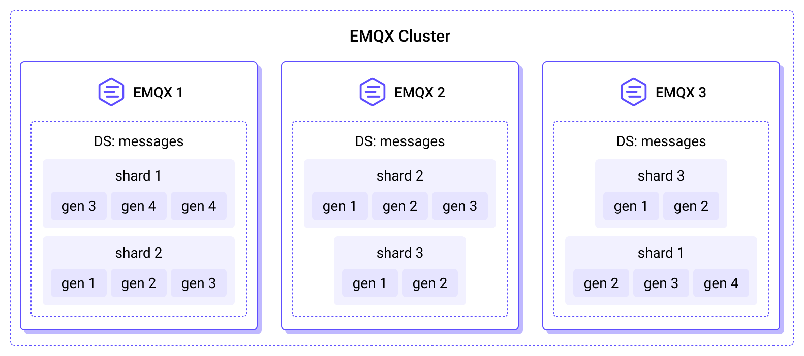

# MQTT Durable Sessions

EMQX includes a built-in durable sessions feature, which allows MQTT sessions and messages to be persistently stored on disk, providing high availability replicas to ensure data redundancy and consistency. With session persistence, effective failover and recovery mechanisms can be implemented, ensuring service continuity and availability, thereby improving system reliability.

This page introduces the concepts, principles, and usage of session persistence in EMQX.

::: warning Important Notice

This feature is available starting from EMQX v5.7.0. However, it does not yet support the persistence of shared subscription sessions, which is planned to be implemented in future versions.

:::

## Basic Concepts

Before learning the durable sessions feature in EMQX, it's essential to first understand some basic concepts about MQTT sessions.

### Types of Client Sessions

The durable sessions in EMQX only applies to persistent sessions, so it's necessary to first understand the categorization of MQTT client sessions.

According to the MQTT standard, client sessions facilitate the management of client connections and states within the MQTT broker. Informally, EMQX separates client sessions into 2 logical categories:

- **Persistent Sessions**: Persistent sessions are kept by the broker after the client's connection terminates, and can be resumed if the client reconnects to the broker within the session expiry interval. Messages sent to the topics while the client was offline are delivered.
- **Ephemeral Sessions**: Ephemeral sessions exist only for the duration of the client's connection to EMQX. When a client with an ephemeral session disconnects, all session information, including subscriptions and undelivered messages, is discarded.

The client session is considered persistent in following cases:

- For the clients using the MQTT 5 protocol, [Session Expiry Interval](https://docs.oasis-open.org/mqtt/mqtt/v5.0/os/mqtt-v5.0-os.html#_Toc3901048) property of `CONNECT` or `DISCONNECT` packet is set to a value greater than zero.

- For the clients using MQTT 3.* protocol, [Clean Session](http://docs.oasis-open.org/mqtt/mqtt/v3.1.1/os/mqtt-v3.1.1-os.html#_Toc398718030) flag is set to 0, and `mqtt.session_expiry_interval` configuration parameter is set to a value greater than 0.

### Conceptual Differentiation

In the context of MQTT usage, the concepts of Persistent Sessions and Durable Sessions may be easily confused, so this section aims to differentiate between the two.

- **Persistent Sessions**: A feature in the MQTT protocol where a client can choose to maintain its current session when establishing a connection with the server. Even if the client disconnects and reconnects, its previously subscribed topics, unsent messages, and other states are retained. In essence, it pertains to the persistence of client connection states and message queues.
- **Durable Sessions**: This is an MQTT protocol-independent feature that refers to whether client sessions are saved to persistent storage (disk), ensuring message delivery reliability.

## Session Storage Implementations in EMQX

EMQX provides 2 different client session storage implementations, each optimized for specific use cases:

- **RAM Storage**: Sessions are stored in the memory of the EMQX node, making them non-persistent.
- **Durable Storage**: Adds a persistence layer, with sessions stored using local RocksDB and the node's local disk in the current version.

The choice of implementation depends on the session type (ephemeral or persistent) and the `durable_sessions.enable` configuration parameter, which can be set globally or per [zone](../configuration/configuration.md#zone-override). The implementation can be selected based on the following criteria:

| `durable_sessions.enable` | Ephemeral Session | Persistent Session |
| ------------------------- | ----------------- | ------------------ |
| `false`                   | RAM               | RAM                |
| `true`                    | RAM               | durable            |

EMQX uses a unique approach to manage message durability, allowing RAM and durable sessions to coexist while minimizing storage costs.

When a durable session subscribes to a topic filter, EMQX marks the topics matching that filter as "durable." This ensures that, in addition to routing MQTT PUBLISH messages from these topics to RAM sessions, the broker also saves these messages to durable storage.

Each durable MQTT message is stored exactly once on each replica, regardless of the number of subscribing durable sessions or their connection status. This efficient fan-out minimizes disk writes.

### Comparison of RAM Storage and Durable Storage

The management strategy for client sessions is a crucial factor in ensuring service stability and reliability. This section provides a comparative analysis of the characteristics of RAM storage and durable storage for MQTT sessions in EMQX. It aims to help developers better understand their respective features and applicable scenarios, enabling more precise deployment decisions.

#### RAM Storage

The RAM storage implementation is the default and has been used in all EMQX releases before version 5.7. As the name implies, the state of RAM sessions is maintained entirely in volatile memory.

Advantages of RAM storage include:

- Very high throughput and low latency.
- Immediate message dispatch to clients.

However, there are some drawbacks:

- Session data is lost when the EMQX node hosting the session stops or restarts, due to the volatility of RAM.
- Undelivered messages are stored in a memory queue, with a limit to prevent memory exhaustion. New messages are discarded when this limit is reached, leading to potential message loss.

#### Durable Storage

Introduced in EMQX v5.7.0, the durable session implementation stores session state and messages routed to the durable sessions on disk. This feature is disabled by default and can be enabled by setting the `durable_sessions.enable` configuration parameter to `true`.

Durable sessions provide robust durability and high availability by consistently replicating session metadata and MQTT messages across multiple nodes within an EMQX cluster. The configurable [replication factor](./managing-replication.md#replication-factor) determines the number of replicas for each message or session, enabling users to customize the balance between durability and performance to meet their specific requirements.

Advantages of durable storage include:

- Sessions can be resumed after EMQX nodes are restarted or stopped.
- MQTT messages are stored in a shared, replicated, durable storage instead of a memory queue, reducing RAM usage for both online and offline sessions.

However, there are some disadvantages:

- Storing messages on disk results in lower overall system throughput.
- Durable sessions have higher latency compared to RAM sessions because both writing and reading MQTT messages are performed in batches. While batching improves throughput, it also increases end-to-end latency (the delay before clients see the published messages).

## Durable Sessions Architecture

EMQX's durable sessions is organized into a hierarchical structure comprising storages, shards, generations, and streams.



### Storage

Storage encapsulates all data of a certain type, such as MQTT messages or MQTT sessions.

### Shard

Messages are segregated by client and stored in shards based on the publisher's client ID. The number of shards is determined by [n_shards](./managing-replication.md#number-of-shards) configuration parameter during the initial startup of EMQX. A shard is also a unit of replication. Each shard is consistently replicated the number of times specified by `durable_storage.messages.replication_factor` across different nodes, ensuring identical message sets in each replica.

### Generation

Messages within a shard are segmented into generations corresponding to specific time frames. New messages are written to the current generation, while previous generations are read-only. EMQX cleans up old MQTT messages by deleting old generations in their entirety. The retention period for old MQTT messages is determined by the `durable_sessions.message_retention_period` parameter.

Generations can organize data differently according to the storage layout specification. Currently, only one layout is supported, optimized for high throughput of wildcard and single-topic subscriptions. Future updates will introduce layouts optimized for different workloads.

The storage layout for new generations is configured by the `durable_storage.messages.layout` parameter, with each layout engine defining its own configuration parameters.

### Stream

Messages in each shard and generation are split into streams. Streams serve as units of message serialization in EMQX. Streams can contain messages from multiple topics. Various storage layouts can employ different strategies for mapping topics into streams.

Durable sessions fetch messages in batches from the streams, with batch size adjustable via the `durable_sessions.batch_size` parameter.

## Durable Sessions Across Cluster

Each node within an EMQX cluster is assigned a unique *Site ID*, which serves as a stable identifier, independent of the Erlang node name (`emqx@...`). Site IDs are persistent, and they are randomly generated at the first startup of the node. This stability maintains the integrity of the data, especially in scenarios where nodes might undergo name modifications or reconfigurations.

Administrators can manage and monitor durable sessions across the cluster by using the `emqx_ctl ds info` CLI command to view the status of different sites.

## Hardware Requirements for Session Persistence

When session persistence is enabled, EMQX saves the metadata of persistent sessions and MQTT messages sent to the persistent sessions on disk. Therefore, EMQX must be deployed on a server with sufficiently large storage capacity. To achieve the best throughput, it is recommended to use Solid State Drive (SSD) storage.

The storage requirements can be estimated according to the following guidelines:

- **Message Storage**: The space required for storing messages on each replica is proportional to the rate of incoming messages multiplied by the duration specified by the `durable_sessions.message_retention_period` parameter. This parameter dictates how long messages are retained, influencing the total storage needed.
- **Session Metadata Storage**: The amount of storage for session metadata is proportional to the number of sessions multiplied by the number of streams to which they are subscribed.
- **Stream Calculation**: The number of streams is proportional to the number of shards. It also depends (in a non-linear fashion) on the number of topics. EMQX automatically combines topics that have a similar structure into the same stream, ensuring that the number of streams doesn't grow too fast with the number of topics, minimizing the volume of metadata stored per session.

## Quick Start with Durable Sessions

This section will help you quickly understand how to use the durable sessions on EMQX and MQTT clients, and introduce a simple workflow of durable sessions.

::: tip Note

Even if durable sessions are not enabled, following steps 2-4 will still retain the session and messages will be saved in the client queue. The difference lies in whether the session is persistently stored and whether the session can be restored after the node restarts in step 5.

:::

1. Enable durable sessions on EMQX.

   By default, EMQX does not enable the durable sessions. You need to modify the `etc/emqx.conf` file and add the following configuration to enable this feature:

   ```bash
   durable_sessions {
     enable = true
   }
   ```

   Restart EMQX to apply the configuration.

2. Adjust MQTT client connection parameters to enable persistent sessions.

   Using [MQTTX CLI](https://mqttx.app/cli) as an example, which defaults to using MQTT 5.0 protocol, add the `--no-clean` option to set `Clean Start = false`, and specify the client ID as `emqx_c`. Connect to EMQX and subscribe to the `t/1` topic:

   ```bash
   mqttx sub -t t/1 -i emqx_c --no-clean
   ```

3. Disconnect the client, and the session will be retained.

   Disconnect the client from step 2. Open the EMQX Dashboard, go to the **Monitoring** -> **Clients** page, and you still can see the client status as **Disconnected**, indicating that the session has been retained.

   

4. Send messages to the client, and messages will be saved in the client queue.

   Using MQTTX CLI again, use the `bench` command to repeatedly publish messages to the `t/1` topic with one client:

   ```bash
   mqttx bench pub -t t/1 -c 1
   ```

   According to the MQTT protocol, even if the `emqx_c` client is offline, the messages for the `t/1` topic it subscribed to will be saved in the client queue and will be delivered when it reconnects.

5. Restart the EMQX node, the session and messages will be restored from the durable storage.

   Restart the EMQX node. Without making any client connection operations, open the EMQX Dashboard and go to the **Monitoring** -> **Clients** page to see the client with status **Disconnected**, indicating that the session has been restored.

   Try connecting to EMQX with the same client ID `emqx_c` and using the `--no-clean` option to set `Clean Start = false`:

   ```bash
   mqttx sub -t t/1 -i emqx_c --no-clean
   ```

   The messages received during the offline period will be delivered to the current client:

   ```bash
   ...
   [2024-5-22] [16:14:14] › …  Connecting...
   [2024-5-22] [16:14:14] › ✔  Connected
   [2024-5-22] [16:14:14] › …  Subscribing to t/1...
   [2024-5-22] [16:14:14] › ✔  Subscribed to t/1
   [2024-5-22] [16:14:14] › payload: Hello From MQTTX CLI
   ...
   ```

   ::: tip Note

   - You must use the same client ID `emqx_c` and specify the `--no-clean` option to set `Clean Start` to `false`. These two requirements must be met to restore the persistent session.
   - Since the previous subscription information is already saved in the session, messages will be delivered to the client even if it does not resubscribe to the `t/1` topic upon reconnection.

   :::

## Next Steps

To learn how to configure and manage the durable sessions feature, as well as how to initially set up and modify durable sessions in an EMQX cluster, please refer to the following pages:

- [Manage Replication](./managing-replication.md)
- [Configure and Manage Durable Sessions](./management.md)
