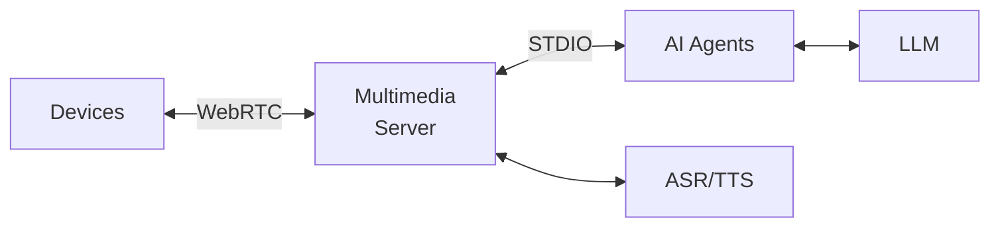
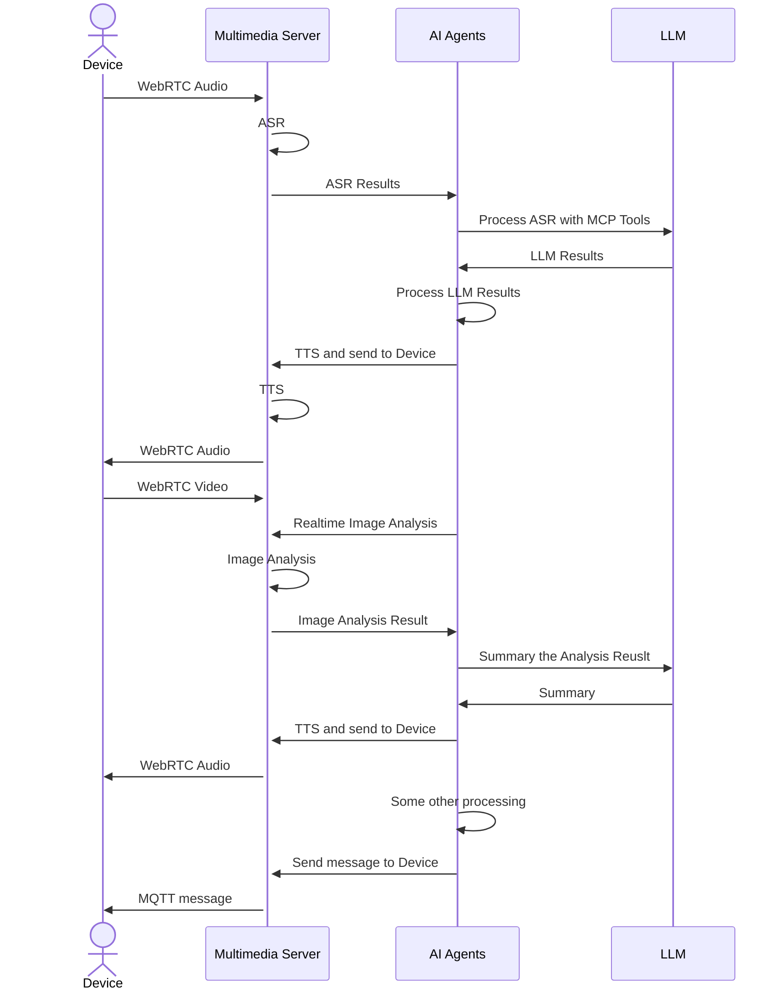

# Architecture

The following diagram illustrates the architecture of a typical multimedia AI system built using EMQX AI.

The following diagram illustrates the interaction flow between the components:

