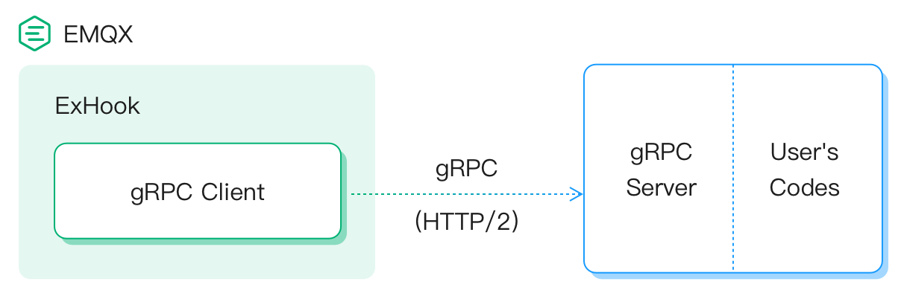
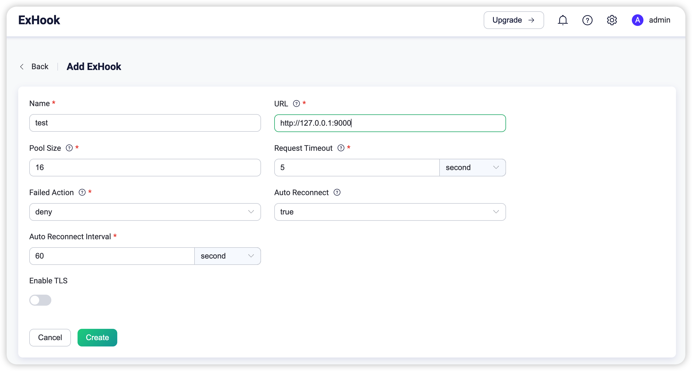

# gRPC Hook Extension

The **ExHook(Extension Hook)** allows users to process EMQX [Hooks](hooks.md) using other programming languages.

In this way, other programming languages can handle emqx events for the purpose of extending EMQX
functionality.

For example, users can use other programming languages to implement:
- Authentication for client connecting
- Authorization for publishing/subscribing
- Persistence and bridging for messages
- Process client connected/disconnected events

## How it works

**ExHook** uses [gRPC](https://www.grpc.io) as the communication framework for RPC.

The architecture is as illustrated below:



It indicates that EMQX acts as a gRPC client, sending hook events from EMQX to the user's gRPC server,
for example, `OnClientAuthenticate` or `OnMessagePublish`.
Users can decide in their own gRPC service whether the client has permission to log in to EMQX or
store these events in other systems.


Consistent with EMQX native hooks, it also supports a chained approach to calculating and returning.
[Callback Functions Chain](./hooks.md#callback-functions-chain)

## Add an ExHook server in EMQX

In EMQX 5.0, ExHook server can be added through the Dashboard, HTTP API, and configuration file `emqx.conf`. This section takes configuration via Dashboard as an example to illustrate the operating steps.

On EMQX Dashboard, click **Management** -> **ExHook** on the left navigation menu. On the **ExHook** page, all added exhook servers are listed.
Click the **Add** button in the upper right corner to enter the configuration page for adding ExHook Server.



These parameters represent the following meanings:

- **Name**: The server name, a UTF-8 String to give a name to this server.
- **URL**: Server address. This needs to be configured as the URL address of a gRPC
  server starting with `http` or `https`. For example: `http://127.0.0.1:9000`.
- **Pool Size**: Process pool size for gRPC client in EMQX to request the configured
  gRPC server.
- **Request Timeout**: After the request timeout, the request is treated failure.
- **Failed Action**: Alternate action after request failure, currently only available for
  `client.authenticate` and `client.authorize` hooks. The available values:
    * `ignore`: ignore this permission check.
    * `deny`: return a failure for this permission check.
- **Auto Reconnec**: Whether to reconnect to the gRPC server when it is disconnected.
- **Auto Reconnect Interval**: Reconnect interval.

In the above figure, we have configured the URL as `http://127.0.0.1:9000`, but you may need to fill
in the address of your actual gRPC Server deployment.

Click on **Create** to complete the creation and return to the list page of ExHook server.

At this point, you can see that ExHook server has been successfully created. However, it is
currently in a *Disabled* status.
This is correct, you can click the Enable switch to make it start working. However, let's move on
to the next section and prepare a example gRPC service before turning it on.

## Start an example gRPC service to test it

In this section, we can try to start a example gRPC service to learn how ExHook and the
gRPC service works together.

We provide various language example programs in
[emqx-extension-examples](https://github.com/emqx/emqx-extension-examples). In this repository,
`exhook-svr-python` implements the `HookProvider` service defined in exhook.proto by Python.
It simply prints all received event from EMQX.

Let's take it as an example:

1. Make sure you are running EMQX v5.1.0 or above and add an ExHook server with above configurations.

2. On the same machine as EMQX, clone the sample code and enter the directory of exhook-svr-python:
```
git clone https://github.com/emqx/emqx-extension-examples
cd exproto-svr-python
```

3. Make sure you have installed Python 3.7 or above, and install the following dependencies:
```
python -m pip install grpcio
python -m pip install grpcio-tools
```

4. Start the example server by the following command:
```
python exhook_server.py
```

5. Once successfully started, we can goto back the EMQX Dashboard and enable the ExHook server that
   we configured before.

6. After enabled the ExHook server in EMQX Dashboard, the `exhook_server.py` will print the following
   logs. It indicated the `exhook_server.py` has been loaded by EMQX
```
OnProviderLoaded: broker {
  version: "5.1.0"
  sysdescr: "EMQX"
  uptime: 67553173
  datetime: "2023-07-01T02:03:24.826755959+00:00"
}
...
```

7. Use an MQTT client, such as [MQTTX](https://mqttx.app/), to connect to EMQX and observe the
   output of this example program. We can see that `exhook_server.py` will print out all the events
   it received.
```
OnClientConnect: ...
OnClientAuthenticate: ...
OnSessionCreated: ...
OnClientConnected: ...
OnClientConnack: ...
```

At this point, the example program has successfully integrated with EMQX and received all client
events from EMQX.


## Learn the `exhook.proto` file

The `exhook.proto` file defines the interfaces and data structures for communication between EMQX
and ExHook server.

The gRPC server must implement the `HookProvider` service of `exhook.proto` for receiving all
events from EMQX.

In this section, we will introduce the meaning of each callback function in HookProvider.

### Provider related callbacks

This part includes the following callback functions:

| Callback           |
| ------------------ |
| OnProviderLoaded   |
| OnProviderUnloaded |

#### OnProviderLoaded

The function signature:
```
rpc OnProviderLoaded(ProviderLoadedRequest) returns (LoadedResponse) {};
```

- `ProviderLoadedRequest`: the request parameter, it includes the EMQX version, uptime, etc.
- `LoadedResponse`: the response parameter, it includes an events list thatt the server want to
  get callback.

The gRPC server must implement this method to register to EMQX the callback list.

#### OnProviderUnloaded

The function signature:

```
rpc OnProviderUnloaded(ProviderUnloadedRequest) returns (EmptySuccess) {};
```

Whenever the EMQX delete or disable the ExHook server, this callback will be triggered.

### Client related callbacks

This part includes the following callback functions:

| Callback             |
| -------------------- |
| OnClientConnect      |
| OnClientConnack      |
| OnClientConnected    |
| OnClientDisconnected |
| OnClientAuthenticate |
| OnClientAuthorize    |
| OnClientSubscribe    |
| OnClientUnsubscribe  |


#### OnClientConnect

The function signature:
```
rpc OnClientConnect(ClientConnectRequest) returns (EmptySuccess) {};
```

It's the callback function for `client.connect` event. This callback function is triggered whenever
EMQX receives a connection request from a client.

- `ClientConnectRequest`: the request parameter, it includes the Client ID, Username and Protocol Name
   of the client.
- `EmptySuccess`: the response parameter, just a empty response, indicating that the event has been processed.

#### OnClientConnack

The function signature:
```
rpc OnClientConnack(ClientConnackRequest) returns (EmptySuccess) {};
```

It's the callback function for `client.connack` event. This callback function is triggered whenever
EMQX respond the connection result to a client.

- `ClientConnackRequest`: the request parameter, it includes the Connection Info and Result Code for
  this response
- `EmptySuccess`: the response parameter, just a empty response, indicating that the event has been processed.

#### OnClientConnected

The function signature:
```
rpc OnClientConnected(ClientConnectedRequest) returns (EmptySuccess) {};
```
It's the callback function for `client.connected` event. This callback function is triggered whenever
a client successfully connected to EMQX.
- `ClientConnectedRequest`: the request parameter, it includes the Client Info for connected client
- `EmptySuccess`: the response parameter, just a empty response, indicating that the event has been processed.


#### OnClientDisconnected

The function signature:
```
rpc OnClientDisconnected(ClientDisconnectedRequest) returns (EmptySuccess) {};
```

It's the callback function for `client.disconnected` event. This callback function is triggered whenever
a client connection disconnected to EMQX
- `ClientDisconnectedRequest`: the request parameter, it includes the Client Info for disconnected
   client and the disconnected Reason.
- `EmptySuccess`: the response parameter, just a empty response, indicating that the event has been processed.

#### OnClientAuthenticate

The function signature:
```
rpc OnClientAuthenticate(ClientAuthenticateRequest) returns (ValuedResponse) {};
```

It's the callback function for `client.authenticate` event.This callback is executed whenever a
client connects to EMQX to complete the login authentication.
- `ClientAuthenticateRequest`: the request parameter, it includes the Client Info for client.
- `ValuedResponse`: the response parameter, we can return in this parameter whether to allow or deny
   the login request for this client.

#### OnClientAuthorize

The function signature:
```
rpc OnClientAuthorize(ClientAuthorizeRequest) returns (ValuedResponse) {};
```

It's the callback function for `client.authorize` event.This callback is executed whenever a
client wants to subscribe a topic or publish a message to a topic.
- `ClientAuthorizeRequest`: the request parameter, it includes the Client Info for client and the
   requested topic.
- `ValuedResponse`: the response parameter, we can return in this parameter whether to allow or
   deny the subscribe or publish request.

#### OnClientSubscribe

The function signature:
```
rpc OnClientSubscribe(ClientSubscribeRequest) returns (EmptySuccess) {};
```

It's the callback function for `client.subscribe` event.This callback is executed whenever EMQX
receives a Subscribe request from client. It is executed before `client.authorize` and
`session.subscribed`.

- `ClientSubscribeRequest`: the request parameter, it includes the Client Info for client and the
   requested topics.
- `EmptySuccess`: the response parameter, just a empty response, indicating that the event has been processed.

#### OnClientUnsubscribe

The function signature:
```
rpc OnClientUnsubscribe(ClientUnsubscribeRequest) returns (EmptySuccess) {};
```

It's the callback function for `client.unsubscribe` event. This callback is executed whenever EMQX
receives a Subscribe request from client. It is executed before `session.unsubscribed`.

- `ClientUnsubscribeRequest`: the request parameter, it includes the Client Info for client and the
   unsubscribed topics.
- `EmptySuccess`: the response parameter, just a empty response, indicating that the event has been processed.


### Session related callbacks

This part includes the following callback functions:

| Callback               |
| ---------------------- |
| OnSessionCreated       |
| OnSessionSubscribed    |
| OnSessionUnsubscribed  |
| OnSessionResumed       |
| OnSessionDiscarded     |
| OnSessionTakenover     |
| OnSessionTerminated    |

#### OnSessionCreated

The function signature:
```
rpc OnSessionCreated(SessionCreatedRequest) returns (EmptySuccess) {};
```

It's the callback function for `session.created` event. This callback is executed whenever a newly
Session created. This usually happens after the `client.authenticate`

- `SessionCreatedRequest`: the request parameter, it includes the Client Info for the client.
- `EmptySuccess`: the response parameter, just a empty response, indicating that the event has been processed.

#### OnSessionSubscribed

The function signature:
```
rpc OnSessionSubscribed(SessionSubscribedRequest) returns (EmptySuccess) {};
```

It's the callback function for `session.subscribed` event. This callback is executed whenever a
Subscription has been created for a client. This usually happens after `client.authorize`

- `SessionSubscribedRequest`: the request parameter, it includes the Client Info and Topic for the client.
- `EmptySuccess`: the response parameter, just a empty response, indicating that the event has been processed.

#### OnSessionUnsubscribed

The function signature:
```
rpc OnSessionUnsubscribed(SessionUnsubscribedRequest) returns (EmptySuccess) {};
```

It's the callback function for `session.unsubscribed` event. This callback is executed whenever a
Subscription has been removed for a client.

- `SessionUnsubscribedRequest`: the request parameter, it includes the Client Info and Topic for the client.
- `EmptySuccess`: the response parameter, just a empty response, indicating that the event has been processed.

#### OnSessionResumed

The function signature:
```
rpc OnSessionResumed(SessionResumedRequest) returns (EmptySuccess) {};
```

It's the callback function for `session.resumed` event. This callback is executed whenever a
Persistence session has been resumed for a client.

- `SessionResumedRequest`: the request parameter, it includes the Client Info for the client.
- `EmptySuccess`: the response parameter, just a empty response, indicating that the event has been processed.

#### OnSessionDiscarded

The function signature:
```
rpc OnSessionDiscarded(SessionDiscardedRequest) returns (EmptySuccess) {};
```

It's the callback function for `session.discarded` event. This callback is executed whenever a
Session has been discarded for a client.

- `SessionDiscardedRequest`: the request parameter, it includes the Client Info for the client.
- `EmptySuccess`: the response parameter, just a empty response, indicating that the event has been processed.

#### OnSessionTakenover

The function signature:
```
rpc OnSessionTakenover(SessionTakenoverRequest) returns (EmptySuccess) {};
```

It's the callback function for `session.takenover` event. This callback is executed whenever a
Session has been taken by another Connection process.

- `SessionTakenoverRequest`: the request parameter, it includes the Client Info for the client.
- `EmptySuccess`: the response parameter, just a empty response, indicating that the event has been processed.

#### OnSessionTerminated

The function signature:
```
rpc OnSessionTerminated(SessionTerminatedRequest) returns (EmptySuccess) {};
```

It's the callback function for `session.terminated` event. This callback is executed whenever a
Session has been terminated.

- `SessionTerminatedRequest`: the request parameter, it includes the Client Info for the client and
   the terminated Reason.
- `EmptySuccess`: the response parameter, just a empty response, indicating that the event has been processed.


### Message related callbacks

This part includes the following callback functions:

| Callback           |
| ------------------ |
| OnMessagePublish   |
| OnMessageDelivered |
| OnMessageDropped   |
| OnMessageAcked     |

#### OnMessagePublish

The function signature:
```
rpc OnMessagePublish(MessagePublishRequest) returns (ValuedResponse) {};
```

It's the callback function for `message.publish` event. This callback is executed whenever EMQX try
to publish a Message.

- `MessagePublishRequest`: the request parameter, it includes the topic, payload, qos of the
   Message
- `ValuedResponse`: the response parameter, allow returning a new message to replace the original
   message.

Usually, we can use this callback to complete the functionality of payload serialization or
deserialization.

#### OnMessageDelivered

The function signature:
```
rpc OnMessageDelivered(MessageDeliveredRequest) returns (EmptySuccess) {};
```

It's the callback function for `message.delivered` event. This callback is executed whenever a
message has been delivered to client.

- `MessageDeliveredRequest`: the request parameter, it includes the Message Info and the delivered
  Client Info.
- `EmptySuccess`: the response parameter, just a empty response, indicating that the event has been processed.

#### OnMessageDropped

The function signature:
```
rpc OnMessageDropped(MessageDroppedRequest) returns (EmptySuccess) {};
```

It's the callback function for `message.dropped` event. This callback is executed whenever a
message has been dropped for some reason.

- `MessageDroppedRequest`: the request parameter, it includes the Message Info and the dropped
  reason.
- `EmptySuccess`: the response parameter, just a empty response, indicating that the event has been processed.

#### OnMessageAcked

The function signature:
```
rpc OnMessageAcked(MessageAckedRequest) returns (EmptySuccess) {};
```

It's the callback function for `message.acked` event. This callback is executed whenever a
message has been acked by the client. This callback may only be triggered during message delivery
for Qos1 and QoS2.

- `MessageAckedRequest`: the request parameter, it includes the Message Info and the Client Info.
- `EmptySuccess`: the response parameter, just a empty response, indicating that the event has been processed.

## Developing Guide

The user needs to implement the gRPC service of `HookProvider` to receive callback events from EMQX.

The main development steps are as following:

1. Copy the `lib/emqx_exhook-<x.y.z>/priv/protos/exhook.proto` file to your project.
2. Generate the code for the gRPC server side of `exhook.proto` using the gRPC framework for the corresponding programming language.
3. Implement the interfaces defined in exhook.proto on demand

Once the development is complete, the service needs to be deployed to a server that can communicate with EMQX and ensure that the ports are open.

You can use the [EMQX Dashboard](http://127.0.0.1:18083/#/exhook) to manage and monitor the ExHook service.

One of the gRPC frameworks for each language can be found at: [grpc-ecosystem/awesome-grpc](https://github.com/grpc-ecosystem/awesome-grpc)

We also provide sample programs for some common programming languages: [emqx-extension-examples](https://github.com/emqx/emqx-extension-examples)
