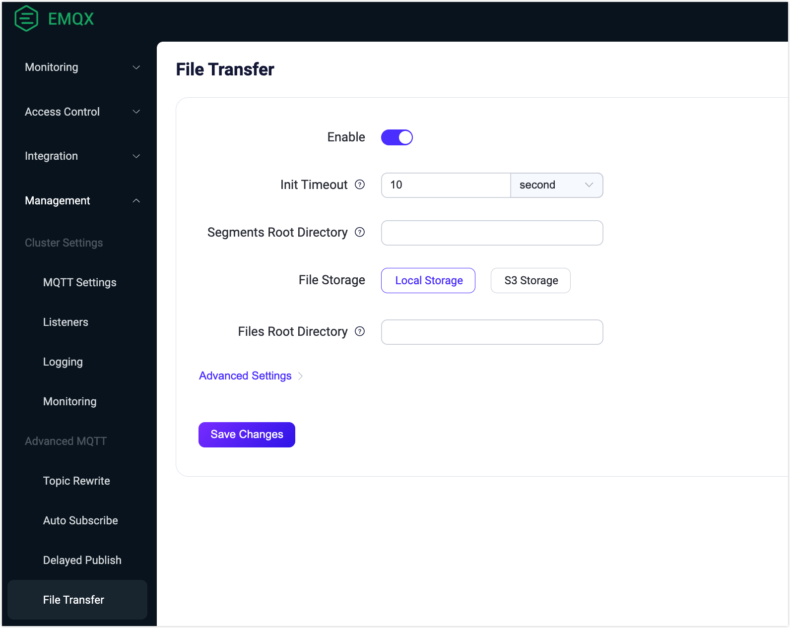

# Configure File Transfer Server-Side Settings

EMQX does not enable the MQTT file transfer feature by default. If you wish to use this feature, you need to enable it in the configuration file.

This page mainly introduces how to enable the File Transfer feature in EMQX and configure various functionalities of file transfer on the EMQX server side. This includes segment storage and exporting merged files to local disk and S3 buckets. It also covers the configuration of MQTT transfer to optimize the server's handling of file transfers. The following sections introduce how to configure these settings through the configuration file in detail:

- [Enable File Transfer](#enable-file-transfer)
- [Configure Segment Storage](#configure-segment-storage)
- [Configure File Export](#configure-file-export)
- [Configure MQTT Transfer Settings](#configure-mqtt-transfer-settings)

You can also enable and configure the File Transfer feature through the Dashboard. For detailed information, refer to [Enable and Configure File Transfer via Dashboard](#enable-and-configure-file-transfer-via-dashboard).

This page also introduces how to manage exported files through REST API. For specific details, refer to [Manage Exported Files](#manage-exported-files).

## Enable File Transfer

In EMQX, the file transfer feature is disabled by default, and you need to enable it in the configuration file.

```bash
file_transfer {
  enable = true
}
```

With this configuration, EMQX will default to storing segment files in the `data/file_transfer/segments` directory and enable local disk export, exporting merged files to the `data/transfers/exports` directory.

If you need to further configure the file transfer feature, you can refer to the following configuration instructions.

## Configure Segment Storage

EMQX supports clients uploading file segments, which are merged into a complete file after receiving all segments. To support this, EMQX needs to temporarily store the segment files and manage them.

Currently, EMQX only supports storing segment files on disk, and you can configure the storage location of the segments.

Once the file upload is complete, the segments will be automatically cleaned up. For files that have not been uploaded successfully within the timeout period, you can configure the validity period of segments and schedule cleaning time to avoid occupying disk space.

```bash
file_transfer {
  # Enable file transfer feature
  enable = true

  # Segment storage configuration
  storage.local.segments = {
    # Segment storage directory, preferably set on high I/O performance disks.
    root = "./data/file_transfer/segments"
    
    # Scheduled cleaning of expired segment files
    gc {
      # Cleaning interval
      interval = "1h"

      # Maximum valid period for segment storage, segments will be cleared after this period, even if they have not been merged.
      # The validity period specified by the client must not exceed this value.
      maximum_segments_ttl = "24h"
    }
  }
}
```

You need to set a reasonable configuration based on the expected file size, concurrent transmission number, and available disk space.

## Configure File Export

After all segments are transmitted, EMQX supports merging segments into a complete file and exporting the complete file to a local disk or S3 bucket for application integration.

:::tip

If file export is not configured, it defaults to local disk export. EMQX does not support configuring both export methods simultaneously; only one can be used.

:::

### File Export to Local Disk

Use the following configuration example to save the merged complete file on the local disk. You can configure the storage location and validity period of the exported file.

```bash
file_transfer {
  # Enable file transfer feature
  enable = true

  # Segment storage configuration
  # ...

  # Enable local disk file export
  storage.local.exporter.local {
    enable = true
    # Export file storage directory, preferably set on high I/O performance disks.
    root = "./data/transfers/exports"
  }
}
```

### File Export to S3 Bucket

Use the following configuration example to save the merged complete file in an S3 bucket.

```bash
file_transfer {
  # Enable file transfer feature
  enable = true

  # Segment storage configuration
  # ...

  # Enable S3 bucket file export
  storage.local.exporter.s3 {
    enable = true

    host = "s3.us-east-1.amazonaws.com"
    port = 443

    # Credentials for accessing S3
    access_key_id = "AKIA27EZDDM9XLINWXFE"
    secret_access_key = "******"

    # Export file storage bucket
    bucket = "my-bucket"

    # Shared URL expiration time
    # EMQX generates a temporary shared URL for clients to download files directly from S3. This parameter specifies the expiration time of the file download URL returned by the EMQX API. After expiration, the URL becomes unavailable, although the actual file remains in S3.
    #url_expire_time = "1h"

    # Settings for the underlying HTTP(S) connection with S3, allowing secure file upload and connection pool management.
    transport_options {
      ssl.enable = true
      connect_timeout = 15s
    }
  }
}
```

## Configure MQTT Transfer Settings

To optimize file transfer operations and prevent clients from waiting excessively, we can set specific timeouts for different file transfer operations. The following MQTT settings can be configured:

```bash
file_transfer {
    enable = true
    
    init_timeout = "10s"
    store_segment_timeout = "10s"
    assemble_timeout = "60s"
}
```

- `init_timeout`: Timeout for initialization operation.
- `store_segment_timeout`: Timeout for storing file segments.
- `assemble_timeout`: Timeout for file assembly.

If any of these operations exceed the specified timeout, the MQTT client will receive a PUBACK packet with the `RC_UNSPECIFIED_ERROR` code.

## Enable and Configure File Transfer via Dashboard

This section demonstrates how to enable the File Transfer feature and configure its functionalities on Dashboard.

Go to the EMQX Dashboar and click **Management** -> **File Transfer**. On the File Transfer page, you can click the **Enable** toggle switch to enable the File Transfer feature. You can refer to the [General Settings](#general-settings) and [Advanced Settings](#advanced-settings) to configure the functionalities. After you complete the configuration, click **Save Changes**.



### General Settings

You can configure the following general settings:

- **Init Timeout**: The maximum amount of time allowed for the `init` command to execute before it times out. For instance, if the system is overloaded and cannot process the `init` command within this timeframe, the operation will time out. In such cases, a PUBACK message with an error code (0x80) is sent to indicate the failure. The default value is `10s`.
- **Segments Root Directory**: The directory path where temporary segments of uploaded files are stored. It's essential to choose an absolute path, preferably located on a disk with high I/O performance. This ensures efficient handling of file segments, especially under heavy load.
- **File Storage**: Select the method for exporting the files. The options include `Local Storage` and `S3 Storage`. When `S3 Storage` is selected, additional configurations are required:
  - **Host**: The endpoint for the S3 service. For example, `s3.us-east-1.amazonaws.com`.
  - **Port**: The port used to connect to the S3 service, for example, `443`, indicating a secure HTTPS connection.
  - **Access Key ID** and **Secret Access Key**: Credentials required for accessing the S3 bucket. These should be securely stored.
  - **Bucket**: The name of the S3 bucket where files are stored, for example `my-bucket`.
  - **Enable TLS**: Determine whether to use TLS (Transport Layer Security) for secure file transfers. For more information, see [TLS for External Resource Access](../network/overview.md/#tls-for-external-resource-access).
- **Files Root Directory**: Specify the root directory for file storage and need to be an absolute path. This directory is used for storing assembled files when `Local Storage` is selected as the file storage method.

### Advanced Settings

Based on the file storage methods you have configured in general settings, there are different advanced settings for configuration.

#### Local Storage

If you select to export the files to the local storage, you can configure the following advanced settings.

| Field Names           | Descriptions                                                 | Recommended Values |
| --------------------- | ------------------------------------------------------------ | ------------------ |
| Store Segment Timeout | Specifies the maximum time allowed for storing a file segment using the `segment` command. If this time is exceeded (e.g., due to system overload), a PUBACK message with an error code (0x80) is sent, indicating a timeout. | `5` minute         |
| Assemble Timeout      | Defines the maximum duration allowed for the `fin` command to complete the file assembly process. If it times out, a PUBACK message with error code (0x80) will be sent. This setting is crucial in scenarios where system resources are constrained, leading to delays in file assembly. | `5 ` minute        |
| Storage GC Interval   | Sets the interval for the garbage collection process to run in the file storage system. This process helps in managing storage space by removing unnecessary data. | `1` hour           |
| Maximum Segments TTL  | Sets the maximum time-to-live (TTL) for stored segments. Segments older than this TTL will be automatically cleaned up, regardless of whether they have been merged into a complete file or if a longer TTL was specified during the file transfer. | `24` hour          |
| Minimum Segments TTL  | Indicates the minimum TTL for segments. Segments will not be removed before this TTL expires, even if they have already been merged into a complete file or if a shorter TTL was specified during the file transfer. This ensures that segments are available for a minimum duration for any post-processing or redundancy requirements. | `5` minute         |

#### S3 Storage

If you select to export the files to the S3 storage, you can also configure the following advanced settings excepts for those the same as in the [Local Storage](#local-storage).

| Field Names       | Descriptions                                                 | Recommended Values |
| ----------------- | ------------------------------------------------------------ | ------------------ |
| URL Expire Time   | Determines the duration for which the generated URL for accessing the uploaded file on S3 is valid. Once expired, the URL can no longer be used to access the file. | -                  |
| Minimum Part Size | Specifies the minimum size of each part when a file is uploaded in multiple parts to S3. Smaller part sizes can increase the upload frequency but might be useful for handling large files in environments with less stable connections. | `5 MB`             |
| Maximum Part Size | Defines the maximum size limit for each part in a multi-part upload to S3. Larger parts mean fewer upload operations, which can be efficient for high-bandwidth environments but might consume more memory. | `5 MB`             |
| ACL               | Access Control List (ACL) specifies the permissions for the uploaded objects to the S3 bucket. Different ACL options offer varying levels of access control:<br />`private`: Only the owner has full access.<br />`public_read`: Everyone has read access.<br />`public_read_write`: Everyone has read and write access.<br />`authenticated_read`: Only authenticated users have read access.<br />`bucket_owner_read`: Bucket owner has read access.<br />`bucket_owner_full_control`: Bucket owner has full control. | -                  |
| IPV6 Probe        | Determines whether to check for IPv6 connectivity. Enabling this can be beneficial if your network supports IPv6, ensuring compatibility and potentially better performance. | Enabled            |
| Connect Timeout   | The maximum time allowed for establishing a connection to the S3 server. If the connection takes longer than this duration, it times out. This setting ensures timely responses from the server. | -                  |
| Pool Type         | Specifies the type of connection pool used for managing S3 connections:<br />`random`: Randomly selects a connection.<br />`hash`: Uses a hash function to select a connection. This choice can affect the performance and reliability of connections to S3. | `random`           |
| Pool Size         | Defines the size of the connection pool for S3 connections. A larger pool can handle more concurrent connections but consumes more resources. | `8`                |
| HTTP Pipelining   | Specify the number of HTTP requests to be sent without waiting for each response. This can improve throughput but may increase complexity. | `100`              |
| HTTP Headers      | Allows the addition of custom HTTP headers for S3 requests. This can be used to pass additional information or control parameters to the S3 service. Click **Add** to specify Key-Value pairs. | -                  |
| Max Reries        | Specifies the maximum number of retry attempts for an S3 request in case of errors. Increasing this value can improve reliability at the cost of potential delays. | -                  |
| Request Timeout   | The maximum time allowed for an S3 request to complete. If a request takes longer, it times out. | -                  |

## Manage Exported Files

You can manage exported files, such as listing files to browse detailed information, moving, deleting, or downloading files. You can perform these management operations via the REST API or manually. Future versions will add a Dashboard interface for managing exported files.

### Manage Exported Files via REST API

EMQX provides REST APIs for managing exported files, and you can use the [MQTT File Transfer Management API](https://docs.emqx.com/en/enterprise/v5.3/admin/api-docs.html#tag/File-Transfer) for management, enabling file browsing and downloading.

### Manually Manage Disk Exported Files

If you need to manage exported files directly on the disk, such as moving files, or using your FTP or HTTP service for download, you can refer to the following instructions for file storage locations.

To address file name conflicts and excessive numbers of files in a single directory, EMQX uses a bucket storage scheme for saving exported files. The working principle of the scheme is as follows:

- First, calculate the sha256 hash value of the file ID and client ID, e.g., `ABCDEFG012345...`.
- Store the file in a 6-level directory structure, each defined as follows:
  1. The first two bytes of the hash as the first-level directory name;
  2. The next two bytes as the second-level directory name;
  3. The remaining hash as the third-level directory name;
  4. Escaped client ID;
  5. Escaped file ID;
  6. The file name from the metadata as the last layer.

For example, an exported file might be stored in a directory structure like this:  `AB/CD/EFGH.../{clientid}/{file_id}/{filename}`.

### Manually Manage S3 Bucket Exported Files

For S3 buckets, you can use S3 client tools or S3's REST API for management, enabling file deletion, download, etc. You can refer to the following instructions for file storage locations.

Unlike the bucket storage scheme used by the local exporter, files exported using the S3 exporter are stored in a simpler 3-level hierarchical structure:

1. Escaped client ID;
2. Escaped file ID;
3. File name.

For example, an exported file might be stored in a directory structure like this:  `{clientid}/{file_id}/{filename}`.

::: tip

For more about using S3 client tools or REST API, refer to the following resources:

- [Amazon S3](https://aws.amazon.com/s3/?nc1=h_ls) and its [User Guide](https://docs.aws.amazon.com/AmazonS3/latest/userguide/Welcome.html)
- [MinIO Object Storage System](https://min.io/)

:::
