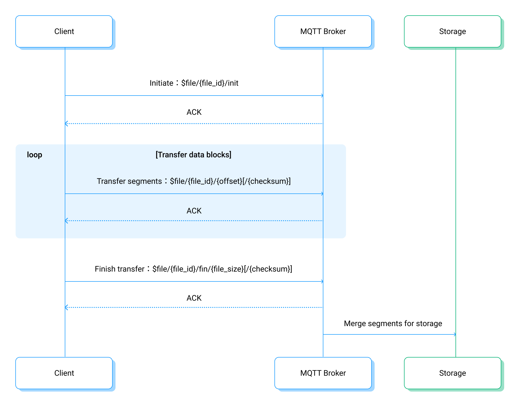

# File Transfer Clients Development

This page provides an overview of the file transfer process from a client's perspective, along with detailed information on commands for uploading files to EMQX. It aims to assist in developing client-side file transfer functionality.

## File Transfer Process

While reusing existing MQTT connections, clients can control file transfer sessions by publishing predetermined messages to topics with specific prefixes.

The client-side file transfer process is as follows:

1. **Preparation for Transfer**: The client device selects the file to be uploaded and generates a unique `file_id` to identify the transfer session.
2. **Initialize File Transfer**: The client device publishes an `init` command to the `$file/{file_id}/init` topic. The message is in JSON format and contains metadata of the file, such as the file name, size, and checksum.
3. **Segmented File Transfer**: The client transfers the file by consecutively publishing messages to the `$file/{file_id}/{offset}[/{checksum}]` topic. The message content is the data block of the current file segment, with an optional `checksum` field for the data block's checksum.
4. **Completing File Transfer**: The client publishes a `fin` command to the `$file/{file_id}/fin/{file_size}[/{checksum}]` topic, indicating the completion of the file transfer. The message content is empty, the `file_size` parameter indicates the total size of the file, and the `checksum` field is the checksum of the entire file.

For a detailed introduction and considerations of each step in the transfer command, refer to the following sections.



## File Transfer Commands

File transfer commands are MQTT messages with specific topic formats and message contents:

- **Topic**: Topic prefixes include `$file/` and `$file-async/`, used for synchronous and asynchronous transfers, respectively, allowing clients to mix use in different commands within the same file transfer session.
  - **Synchronous Transfer**: The client needs to wait for EMQX to confirm the execution result of a command before proceeding with subsequent operations.
  - **Asynchronous Transfer**: The client does not need to wait for EMQX to confirm the command execution and can immediately send new commands after one is sent, which can speed up the process.
- **QoS**: All commands are published with a QoS level of 1 to ensure reliability.
- **Message Body**: Either a JSON format or a message body containing data blocks.

After each command is published, command execution results can be obtained through the PUBACK message or the response topic. Refer to [Retrieve Command Execution Results](#retrieve-command-execution-results) for details.

:::tip

1. All file transfer commands are processed by the EMQX broker and are not sent to other MQTT clients.
2. The asynchronous transfer mode is available in EMQX Enterprise version v5.3.2 and later.
3. For MQTT v3.1/v3.1.1 clients, as PUBACK Reason Code is not available, it is recommended to use the asynchronous transfer mode.

:::

### init Command

The `init` command is used to initialize a file transfer session.

- Topic: `$file/{file_id}/init` or `$file-async/{file_id}/init`

- Message Body: A JSON object with the following fields:

  ```json
  {
    "name": "{name}",
    "size": {size},
    "checksum": "{checksum}",
    "expire_at": {expire_at},
    "segments_ttl": {segments_ttl},
    "user_data": {user_data}
  }
  ```

| Field          | Description                                                  |
| -------------- | ------------------------------------------------------------ |
| `file_id`      | Unique identifier for the file transfer session.             |
| `name`         | Filename. If it conflicts with reserved filenames (e.g., ".", "..") or contains special characters, it will be percent-encoded. The binary length of the filename should not exceed 240 bytes. |
| `size`         | Size of the file.                                            |
| `checksum`     | SHA256 checksum of the file (optional). If provided, EMQX will verify the file's checksum. |
| `expire_at`    | Timestamp for when the file may be deleted from storage (seconds since the epoch). |
| `segments_ttl` | Validity period of file segments (in seconds). This value is limited to the range set by `minimum_segments_ttl` and `maximum_segments_ttl`. See [Segment Storage](./broker.md#segment-storage). |
| `user_data`    | Arbitrary JSON object for storing additional information and metadata about the file. |

In the message body, the only required field is `name`.

Example:

```json
{
  "name": "ml-logs-data.log",
  "size": 12345,
  "checksum": "1234567890abcdef1234567890abcdef1234567890abcdef1234567890abcdef",
  "expire_at": 1696659943,
  "segments_ttl": 600
}
```

### segment Command

The `segment` command is used to upload a data block of the file.

- Topic: `$file/{file_id}/{offset}[/{checksum}]` or `$file-async/{file_id}/{offset}[/{checksum}]`
- Message Body: Binary data of the file block.

| Field      | Description                                                  |
| ---------- | ------------------------------------------------------------ |
| `file_id`  | Unique identifier for the file transfer session.             |
| `offset`   | Starting offset (in bytes) of the file block, calculated from the beginning of the file. |
| `checksum` | Optional SHA256 checksum of the file block.                  |

### fin Command

The `fin` command is used to complete the file transfer session.

- Topic: `$file/{file_id}/fin/{file_size}[/{checksum}]` or `$file-async/{file_id}/fin/{file_size}[/{checksum}]`
- Message Body: Empty message body.

| Field       | Description                                                  |
| ----------- | ------------------------------------------------------------ |
| `file_id`   | Unique identifier for the file transfer session.             |
| `file_size` | Total size of the file (in bytes).                           |
| `checksum`  | Optional SHA256 checksum of the entire file. If specified, it takes precedence over the `checksum` field provided in the `init` command. |

After receiving the `fin` command, EMQX verifies whether all segments required to assemble the file have been received. If the file is successfully exported and its checksum is valid, EMQX responds with a successful Reason Code. In case of any errors, an appropriate error response is sent.

## Retrieve Command Execution Results

The results of command execution are indicated by MQTT PUBACK Reason Codes:

- **Synchronous transfer**: The PUBACK reason code represents the final result of the operation.
- **Asynchronous transfer**: A non-zero PUBACK reason code indicates immediate failure of the operation, while a zero reason code means the command has been accepted for processing, but the result will be returned through a response message upon completion.

### PUBACK Reason Codes

| Reason Code | Meaning in MQTT         | Meaning in File Transfer                                     |
| ----------- | ----------------------- | ------------------------------------------------------------ |
| None        |                         | Same as 0x00.                                                |
| 0x00        | Success                 | The file block has been successfully persisted.              |
| 0x10        | No matching subscribers | The server requires the client to retransmit all file blocks. |
| 0x80        | Unspecified error       | For `segment` commands, the server requires the client to retransmit the current file block; for `fin` commands, the server requires the client to retransmit all file blocks. |
| 0x83        | Specific error          | The server requires the client to cancel the transmission.   |
| 0x97        | Quota exceeded          | The server requests the client to pause transmission, the client should wait before attempting to retransmit the file segment again. |

### Response Messages

- Topic: `$file-response/{clientId}`, where `clientId` is the client ID.
- Message: A JSON object containing the response result.

Example:

```json
{
  "vsn": "0.1",
  "topic": "$file-async/[COMMAND]",
  "packet_id": 1,
  "reason_code": 0,
  "reason_description": "success"
}
```

| Field                | Description                                                  |
| -------------------- | ------------------------------------------------------------ |
| `vsn`                | Version of the response message format                       |
| `topic`              | The command topic being responded to, e.g., `$file-async/somefileid/init` |
| `packet_id`          | MQTT message ID of the command being responded to            |
| `reason_code`        | Execution result code for the command. For details, see [Reason Codes](https://chat.openai.com/c/97d539b5-8d5c-4634-9dbe-6e7e40be5a8f#PUBACK-Reason-Codes) |
| `reason_description` | Description of the execution result                          |

Clients can obtain the actual operation results of commands via the `$file-response/{clientId}` topic, regardless of whether the operation is synchronous or asynchronous.

## Considerations

1. If the client disconnects during file transfer, or needs to interrupt the transfer for higher priority message delivery, simply re-send the unacknowledged data blocks or commands after resuming file transfer. This method avoids retransmitting the entire file, enhancing transmission efficiency.
2. As EMQX needs to assemble the file from received file segments and export it to configured storage, the `fin` command may take a longer time to process. During this time, the client can continue sending other commands while waiting for the `fin` command to complete. If a disconnection occurs during the `fin` command, the client can simply re-send the command to resume file transfer. If the file transfer has already been completed, EMQX will immediately reply with a successful transmission.

## Client Code Examples

Explore file transfer client code examples in various languages and client libraries:

- [C - Paho](https://github.com/emqx/MQTT-Client-Examples/blob/master/mqtt-client-C-paho/emqx_file_transfer.c)
- [Python3 - Paho](https://github.com/emqx/MQTT-Client-Examples/blob/master/mqtt-client-Python3/file_transfer.py)
- [Java - Paho](https://github.com/emqx/MQTT-Client-Examples/blob/master/mqtt-client-Java/src/main/java/io/emqx/mqtt/MqttFileTransferSample.java)
- [Golang - Paho](https://github.com/emqx/MQTT-Client-Examples/pull/110/files#diff-ea542153b4dd7109626626beff78b699ed649f9a7c05af362e5d67cce0866a94)
- [Node.js - MQTT.js](https://github.com/emqx/MQTT-Client-Examples/blob/master/mqtt-client-Node.js/emqx-file-transfer.js)
