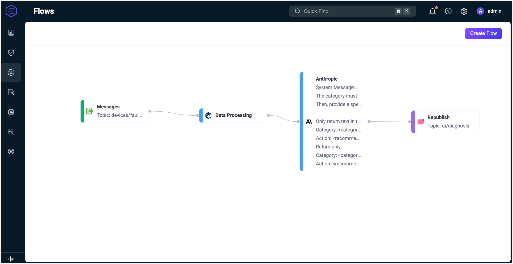

# Quick Start: Create a Flow Using Anthropic Node

This page demonstrates how to use Claude 3 Sonnet to perform fault classification and generate corrective recommendations based on incoming telemetry. It simulates a real-world scenario where IoT systems, such as smart factories or buildings, receive status messages from devices and require automated, intelligent interpretation of those issues.

## Scenario Description

A device publishes environmental data to the topic `devices/fault_status`. Each message includes:

- `device_id`: Identifier of the device
- `temperature`: Temperature reading
- `humidity`: Humidity reading
- `status_description`: Free-text description of a fault or warning

The goal is to:

- Classify the issue into one of three categories: `hardware`, `environment`, or `connectivity`
- Suggest a corresponding corrective action
- Output both in a structured, human-readable format using an LLM

## Sample Message

```json
{
  "device_id": "unit42",
  "temperature": 72.5,
  "humidity": 55,
  "status_description": "sensor reporting inconsistent temperature spikes for 5 minutes"
}
```

## Expected Output (from Claude)

```
Category: hardware
Action: Inspect sensor wiring and replace the unit if the anomaly persists.
```

## Create the Flow

::: tip Prerequisite

Make sure you have a valid **Anthropic API Key** and set the correct API version (e.g., `2023-06-01`).

:::

1. Click the **Create Flow** button on the **Flows** page.

2. Add a **Messages** node.

   - Drag a **Messages** node from the Source panel.
   - Set the topic to `devices/fault_status`.
   - Click **Save**.

3. Add a **Data Processing** node.

   - Drag a **Data Processing** node from the **Processing** section.
   - Add the following mappings:
     - `payload.device_id` to alias `device_id`
     - `payload.status_description` to alias `status_description`
     - `payload.temperature` to alias `temperature`
     - `payload.humidity` to alias `humidity`
   - Click **Save**.

4. Add an **Anthropic** node.

   - Drag an **Anthropic** node from the Processing section and connect it to the Data Processing node.
   - Configure the node:
     - **Input**: Use `payload` or combine fields like `${device_id}, ${status_description}`.
     - **System Message**:  You can enter a dynamic prompt like the following:  
       
       ```
       Classify the device issue in the input JSON as one of: hardware, environment, or connectivity.  
       Suggest a brief action to resolve it.  
       Only return:
       Category: <category>  
       Action: <action>
       ```
     - **Model**: Select `claude-3-sonnet-20240620`.
     - **Max Tokens**: Enter `200`.
     - **Anthropic Version**: Enter `2023-06-01`.
     - **API Key**: Enter your Anthropic API key.
     - **Base URL**: Leave empty.
     - **Output Result Alias**: Enter `diagnosis_result`.
   - Click **Save**.

5. Add a **Republish** node.

   - Drag a **Republish** node from the Sink section and connect it to the Anthropic node.
   - Set the topic to `ai/diagnosis`.
   - Set the payload to `${diagnosis_result}`.
   - Click **Save**.

6. Click **Save** in the upper-right corner to save the Flow.

   

7. Flows and form rules are interoperable. You can also view the SQL and related rule configurations on the Rule page.

## Test the Flow

1. Connect an MQTT client to EMQX.

   To quickly test the flow. You can use the **Diagnostic Tools** -> **Websocket Client** on the Dashboard to simulate an MQTT client. Or, you can also use the [MQTTX](https://mqttx.app/) tool or a real MQTT client:

   - Connect to your EMQX server.
   - Subscribe to the topic `ai/diagnosis`.

2. Start Testing.

   - In the Flow Designer, double-click any node to open the Edit panel.

   - Click **Edit**, then click **Start Test** to open the test panel at the bottom.

   - Click **Input Simulated Data** and publish this message to topic `devices/fault_status` by clicking **Submit Test**:

     ```json
     {
       "device_id": "unit42",
       "temperature": 72.5,
       "humidity": 55,
       "status_description": "sensor reporting inconsistent temperature spikes for 5 minutes"
     }
     ```

3. Review results.

   - You can see the successful excecution result of the flow.

   - Return to the **WebSocket Client** page and you You should receive an AI-generated summary like:

     > Category: hardware
     > Action: Inspect sensor wiring and replace the unit if the anomaly persists.
   
   - If the test results are unsuccessful, error messages will be displayed accordingly.
