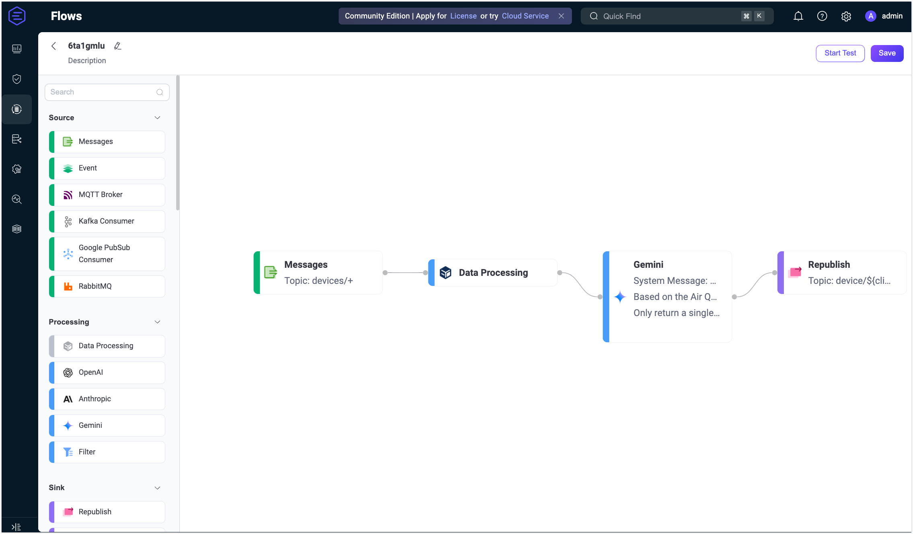
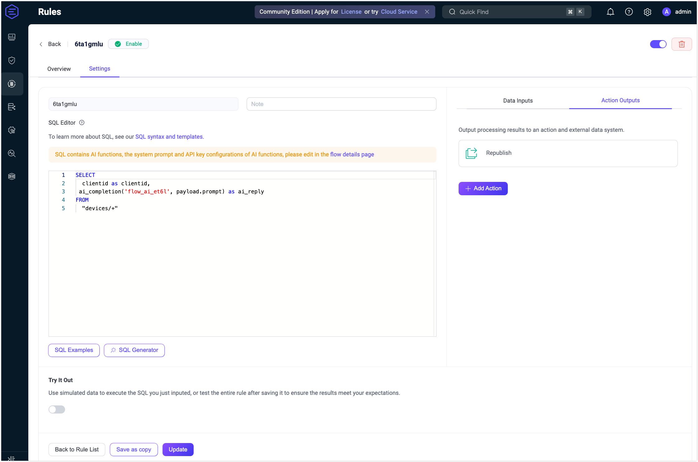
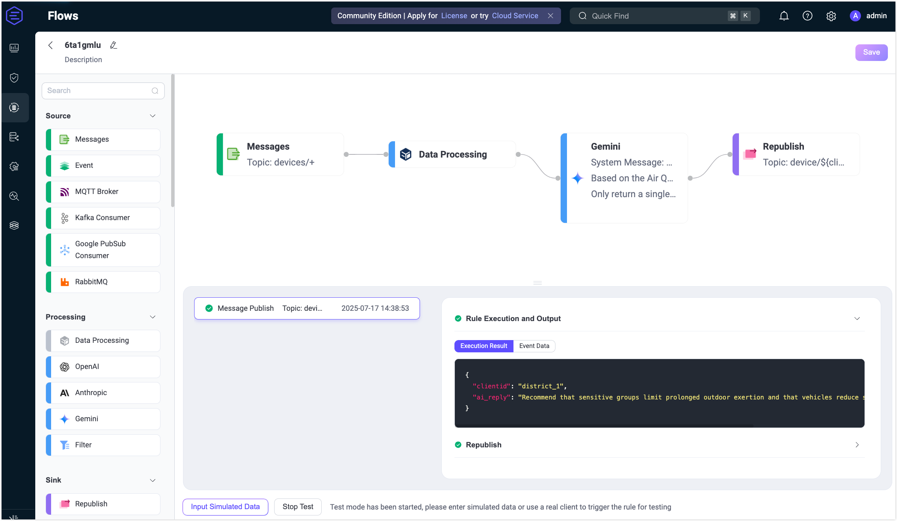
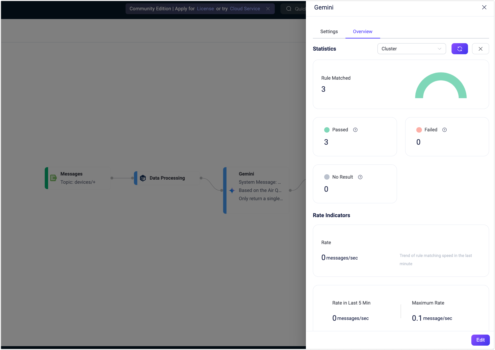

# Quick Start: Create a Flow Using Gemini Node

This section demonstrates how to quickly create and test an LLM-based Flow in the Flow Designer through a practical use case using the Gemini Node. 

This example demonstrates how to build a Flow that integrates with the Gemini LLM to process MQTT device messages containing a free-text `prompt` while preserving the `clientid` for routing. A single Data Processing node pulls out both `payload.prompt` and `clientid`. The Gemini node generates a reply based on that prompt, and the Republish node sends the AI’s reply to the per-client topic `device/${clientid}/reply`, ensuring each device receives its own customized advice.

## Scenario Description

In a smart city deployment, each district is equipped with environmental sensors that periodically publish JSON messages to the topic `devices/<district_id>`. Each message’s `prompt` field contains key readings in plain text, such as the air quality index and noise level. The Flow will:

- **Data Processing**: Extract the environmental readings from the `prompt` field and expose the `clientid` (i.e., `district_id`) for downstream use.
- **LLM-Based Processing**: Send the readings to Gemini to generate an actionable public-safety or traffic-management recommendation (e.g., restrict traffic, adjust street-light levels).
- **Message Republish**: Publish the AI-generated advice to the per-district control topic `device/<district_id>/reply`.

**Sample incoming message (to `devices/district_1`):**

```json
{
  "prompt": "Air Quality Index is 150. Noise level is 72 dB."
}
```

**Expected republished output (to `device/district_1/reply`):**

```
AQI is high—implement traffic restrictions in district_1 and increase pedestrian patrols.
```

## Create the Flow

::: tip Prerequisite

Make sure you have a valid Gemini API Key.

:::

1. Click the **Create Flow** button on the **Flows** page.

2. Add a **Messages** node.

   - Drag a **Messages** node from the Source panel.
   - Set the topic to `devices/+`.
   - Click **Save**.

3. Add a **Data Processing** node.

   - Drag a **Data Processing** node from the **Processing** section.
   - Fill in the form with the following configurations. This setting exposes `clientid` for later use to ensure that it is accessible in downstream nodes (e.g., for `${clientid}` in republish topics).
     
     - **Field**: `clientid`
     - **Transform**: Leave empty
     - **Alias**: `clientid`
   - Click **Save**.
   
4. Add a **Gemini** node.

   - Drag a **Gemini** node from the Processing section and connect it to the Data Processing node.

   - Configure the node:

     - **Input**: Enter `payload.prompt`.

     - **System Message**: Enter the following message:

       ```
       You are an expert smart-city AI assistant.
       Based on the Air Quality Index and noise level provided in the user prompt, generate a concise public-safety or traffic-management recommendation for the specified district.
       Only return a single sentence with the action steps—no extra commentary.
       ```
       
     - **Model**: Here you can keep the default model `gemini-2.0-flash`.

     - **API Key**: Enter your Gemini API key.

     - **Base URL**: Leave empty to use Gemini’s default endpoint.

     - **Output Result Alias**: Enter `ai_reply`.

   - Click **Save**.

5. Add a **Republish** node.

   - Drag a **Republish** node from the Sink section and connect it to the Gemini node.
   - Set the topic to `device/${clientid}/reply`.
   - Set the payload to `${ai_reply}`.
   - Click **Save**.

6. Connect all the nodes and click **Save** in the upper-right corner to save the Flow.

   

   Flows and form rules are interoperable. You can also view the SQL and related rule configurations on the Rule page.

   

## Test the Flow

1. Connect an MQTT client to EMQX.

   To quickly test the flow, you can use the **Diagnostic Tools** -> **WebSocket Client** on the Dashboard to simulate an MQTT client. Alternatively, you can also use the [MQTTX](https://mqttx.app/) tool or a real MQTT client:

   - Connect to your EMQX server.
   - Subscribe to the topic, for example `device/district_1/reply`.

2. Start Testing.

   - In the Flow Designer, click any node to open the Edit panel.

   - Click **Edit**, then click **Start Test** to open the test panel at the bottom.

   - Click **Input Simulated Data** and publish the following message to topic `devices/district_1` by clicking **Submit Test**:

     ```json
     {
       "prompt": "Air Quality Index is 150. Noise level is 72 dB."
     }
     ```
   
3. Review results.

   - You can see the successful execution result of the flow.

     

   - Return to the **WebSocket Client** page and you should receive an AI-generated summary like:

     > “Reduce traffic volume in the district to mitigate air pollution and noise levels.”

   - If the test results are unsuccessful, error messages will be displayed accordingly.

   - To view the running statistics and metrics of the **Gemini** node, exit the editting page, click the node to open the Edit panel and click the **Overview** tab.

     


