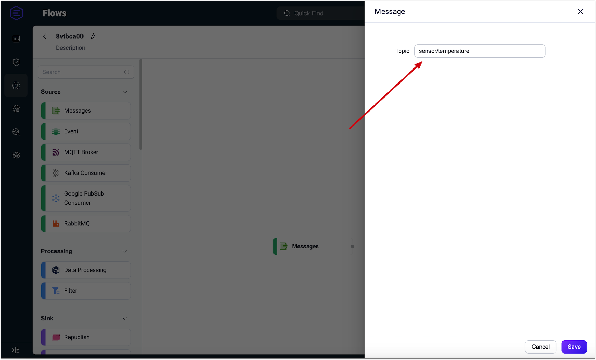
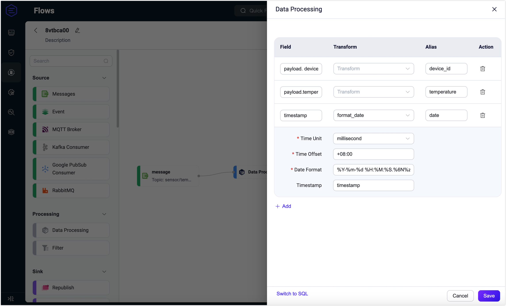
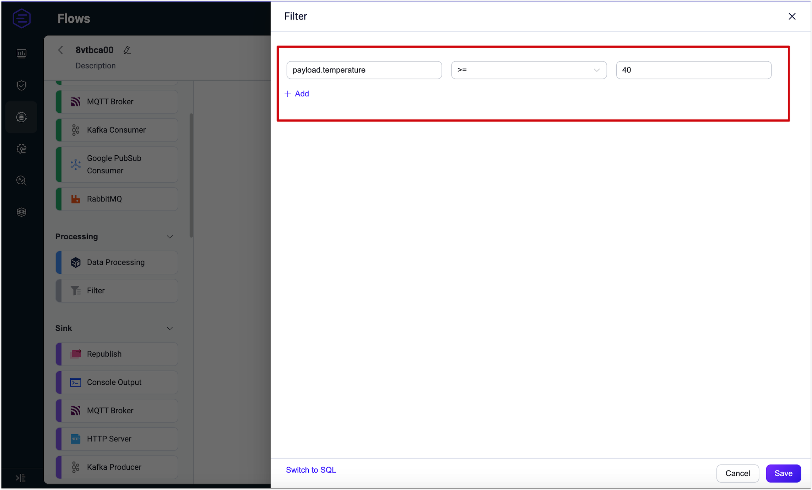
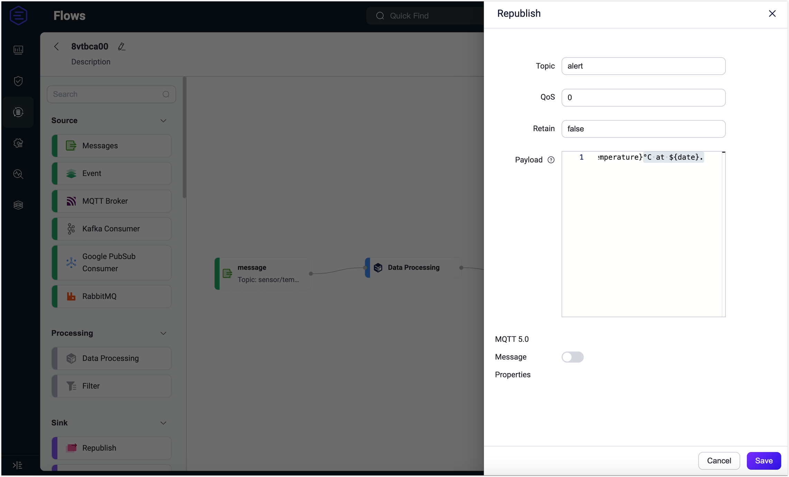
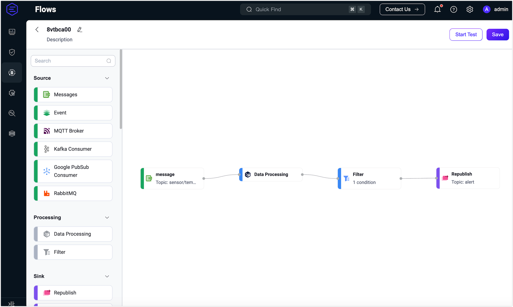
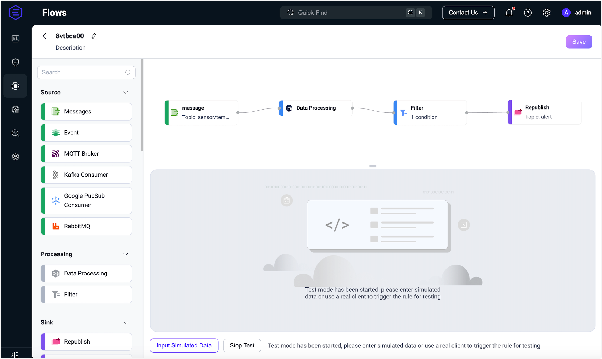
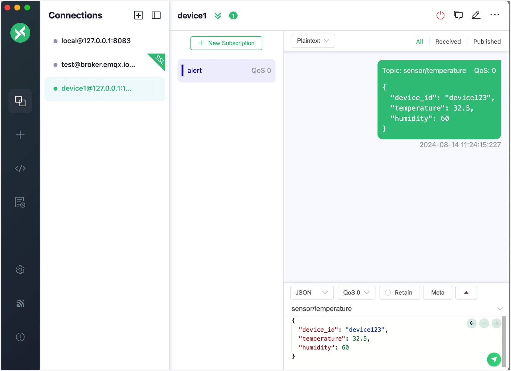
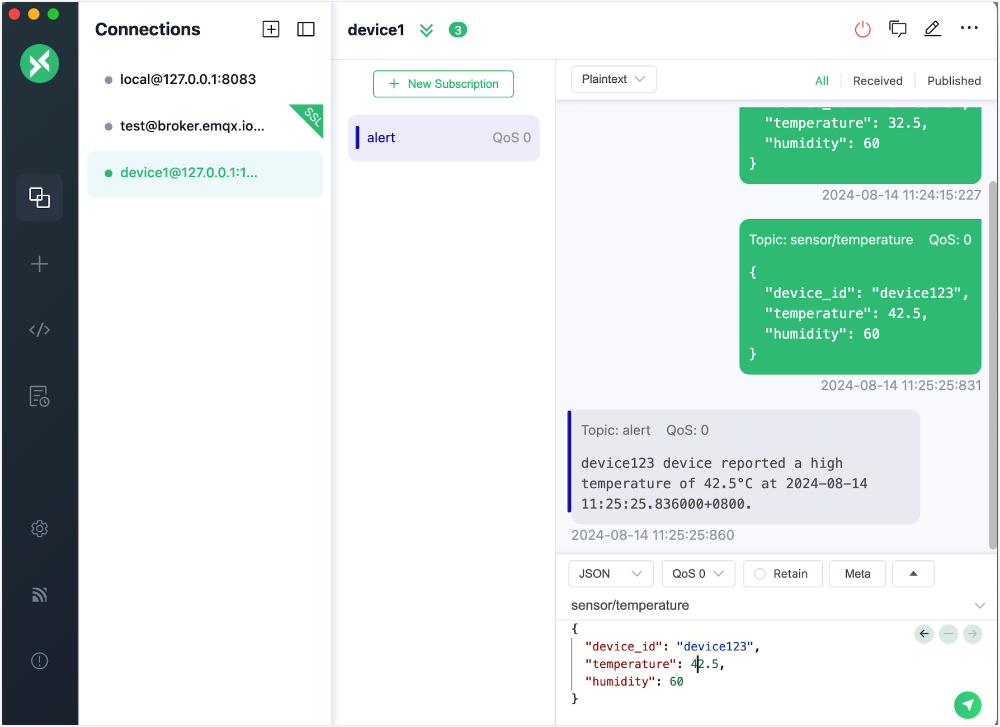
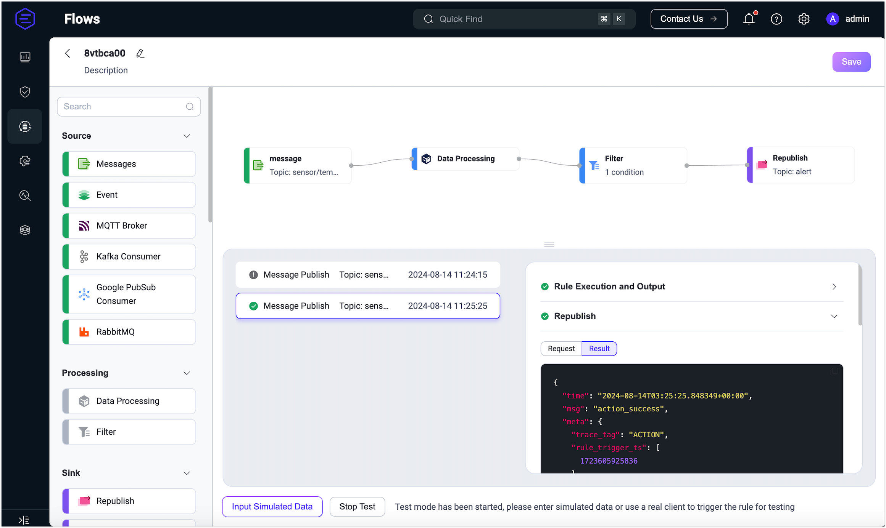

# Flow Designer

::: tip Note

Flow Designer is an EMQX Enterprise feature.

:::

The Flow Designer is a powerful visual tool that extends the capabilities of the earlier visual tool, Flows, by adding the ability to create and edit data processing workflows (Flows). This enhancement simplifies and streamlines the configuration of data processing and integration. Starting from EMQX v5.8.0, you can also test the data processing workflows you create.

Rules created on the Rule page and rules created in Flows are interoperable. This means you can create a rule in Flows and view its SQL and related configurations on the Rule page, or create the rule in the SQL Editor on the Rule page and then view the rule’s data flow processing configurations in Flows.


## Main Features

To access the Flows page in the EMQX Dashboard, click **Integrations** -> **Flow Designer** on the left menu.  If you have already created rules or data integrations, you will see a directed acyclic graph composed of multiple nodes. Each node represents a data processing step, such as reading data from a topic, event, or Source, transforming data through rules, and forwarding data using actions or Sinks.

The Flows page displays all data processing workflows created using the Rules, Webhook, and Flow Designer. Through Flows, you can visualize how data flows—from devices or clients through rule processing to external data systems, or vice versa, from external data systems through rule processing back to devices. Refreshing the page updates it with the latest changes in rules and data integrations.

Clicking the **Create** button allows you to enter the Flow creation page for visual configuration. You can drag and drop to select the nodes needed for each step and connect them to implement the workflow.


### Source

The data input supports messages, events, or messages flowing from external data systems. A Flow must contain at least one Source node, and multiple data input nodes can be supported simultaneously. Currently supported Sources include:

- **Messages:** Specified through topics and topic wildcards for client-published messages.
- **Event:** Supports all client events within EMQX; refer to [Client Events](../data-integration/rule-sql-events-and-fields.md#mqtt-events).
- External Data Systems:
  - [MQTT Service](../data-integration/data-bridge-mqtt.md)
  - [Kafka Consumer](../data-integration/data-bridge-kafka.md)
  - [GCP PubSub Consumer](../data-integration/data-bridge-gcp-pubsub.md)
  - [RabbitMQ](../data-integration/data-bridge-rabbitmq.md)

### Processing

Use function and filter nodes for data processing and filtering. This step is optional, and a Flow can support at most one function and one filter node:

- **Data Processing:** Supports all [SQL built-in functions](../data-integration/rule-sql-builtin-functions.md) of the rule engine.
- **Filter:** Supports comparison filtering for data fields coming from the Source; supported comparison operations include `>, <, <=, >=, <>, !=, =, =~`

In addition to visual form editing, Processing nodes also support switching to expression mode to edit using Rule SQL syntax. Filter nodes can only be connected after functions, meaning data must first be processed and then filtered.

### Sink

Outputs the data sources and processing results to specific nodes and external data systems. A Flow must contain at least one Sink node, and supported Sink nodes include:

- **Republish:** Publishes messages to locally specified MQTT topics.
- **Console Output:** Prints messages to logs for debugging.
- **External Data Systems:** Supports over 40 types of data systems, such as MySQL and Kafka; refer to [Data Integration](../data-integration/data-bridges.md).

### Flow Editing and Testing

When a Flow is created, the system will randomly generate an ID for it. Click the edit icon next to the ID to modify the Flow's name and description.

To delete a node in the Flow, hover over the node and click the delete icon in the upper right corner of the node. Click on a node to edit its configuration details and save the changes. Click the **Start Testing** button to input simulated data or test the Flow with a real client to verify if it executes correctly.

## Advantages

Flow Designer is a feature-rich and user-friendly tool that helps users process and integrate data more efficiently, drive business innovation, and improve the visibility and control of data management. Its main features and advantages include:

- **Intuitive Visual Interface:** Users can easily create, adjust, and customize data processing workflows using a straightforward drag-and-drop interface, making complex data integration logic accessible even to those without programming experience.
- **Fast Real-time Processing:** Flow Designer enables users to establish real-time processing workflows for messages and events within minutes. This helps businesses respond more quickly to emerging data and events, supporting real-time business needs.
- **Extensive Integration Capabilities:** Seamlessly integrates with over 40 data systems, offering flexible data connection and exchange options.
- **Unified Management and Monitoring:** Users can clearly manage the entire data integration process through a unified view, understanding the status and performance of each processing node. This helps in real-time monitoring and tracking of data flows, ensuring high reliability and integrity of data.
- **EMQX Data Processing Capabilities:** Leverages the rule SQL and Sink/Source capabilities of EMQX, inheriting its robust data processing and performance advantages. Users can switch between the UI and SQL editor, combining the flexibility of SQL editing with a simpler and faster user experience, facilitating business innovation and data-driven decision-making without needing in-depth knowledge of EMQX rule SQL syntax.

## Quick Start

This section demonstrates how to quickly create and test a Flow in the Flow Designer through a sample use case.

This demonstration shows you how to create a data processing workflow to handle high-temperature alerts. The workflow will receive data from temperature and humidity sensors via MQTT topics, set up data filtering and transformation rules, and republish alert messages to a new topic, `alert`, if the temperature exceeds 40°C.  It also demonstrates how to validate the effectiveness of the rules and the results of data processing through testing.

### Scenario Description

Assume a device contains a temperature and humidity sensor that sends data to the MQTT topic `sensor/temperature` every 5 seconds. The EMQX rule engine will process this data, involving the following steps:

1. **Data Filtering:** Only process data where the temperature is greater than 40°C.
2. **Data Transformation**:
   - Extract the device ID.
   - Extract the temperature information.
   - Use a built-in function to convert the timestamp in the payload to a readable date format.
3. **Message Republish:** Format the processed data into an alert message and publish it to a new topic, `alert`.

Sample data to be republished:

```json
{
  "device_id": "device123",
  "temperature": 22.5,
  "humidity": 60
}
```

### Create the Flow

1. Click the **Create Flow** button on the Flows page.

2. Drag a **Messages** node from the **Source** section onto the canvas and configure a message source topic, such as `sensor/temperature`. Click **Save**. This step specifies the source of the messages published by the client.

   

3. Drag a **Data Processing** node from the **Processing** section onto the canvas and configure data processing rules to extract the following fields from the message:

   - `payload.device_id`: Alias it as `device_id`.
   - `payload.temperature`: Alias it as `temperature`.
   - `timestamp`: Use the `format_date` function to convert the message timestamp to a readable date and time format. Alias it as `date`.
     - `Time Unit`: Select `millisecond`.
     - `Time Offset`: Enter `+08:00`.
     - `Data Format`: Enter `%Y-%m-%d %H:%M:%S.%6N%z`. Refer to [Date and Time Conversion Functions](../data-integration/rule-sql-builtin-functions.md#format-date-unit-string-offset-string-integer-formatstring-string-time-integer-string).
     - `Timestamp`: Enter `timestamp`.

   Click **Save** when done.

   

4. Drag a **Filter** node from **Processing** and configure a filter condition to implement a data filtering rule. Add a filter item, enter `payload.temperature`, select the operator `>=`, enter `40`, and click **Save**.

   

5. Select a **Republication** node from **Sink** and configure the topic for forwarding messages, setting it to `alert`. Format the processed and transformed data into an alert message with the following payload:

   ```bash
   ${device_id} device reported a high temperature of ${temperature}°C at ${date}.
   ```

   Click **Save**.

   

6. You will see the newly created Flow on the page. Click **Save** in the upper right corner to save the Flow.

   

Flows and form rules are interoperable; you can also view the SQL and related configurations of the rules created earlier on the Rule page.

### Test the Flow

1. After creating the Flow, click **Start Test** next to the **Save** button to open a bottom pop-up.

   

2. Click **Input Simulated Data**. You can enter simulated data in the pop-up page or use a real client to publish messages to see the results. This demonstration will use [MQTTX](https://mqttx.app) to publish real data.

3. First, send a message with a temperature below 40°C. You will see that the message does not meet the condition and the rule SQL does not execute.

   

4. Next, publish a message with a temperature above 40°C. You will see the `alert` topic receiving the alert message.

   

5. Return to the testing page to view the successful test results. 

   
   
   If the test results are unsuccessful, error messages will be displayed accordingly.

   
   
   
