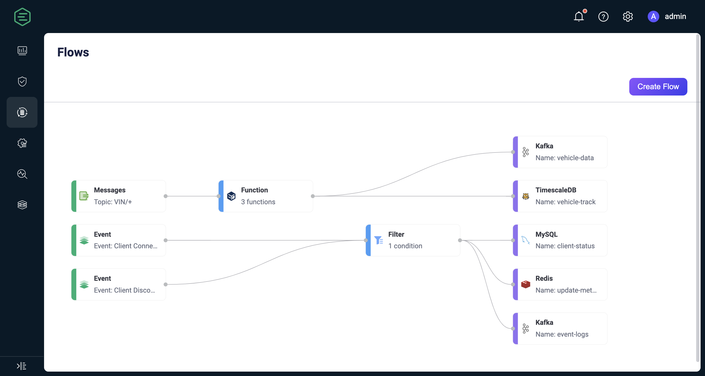
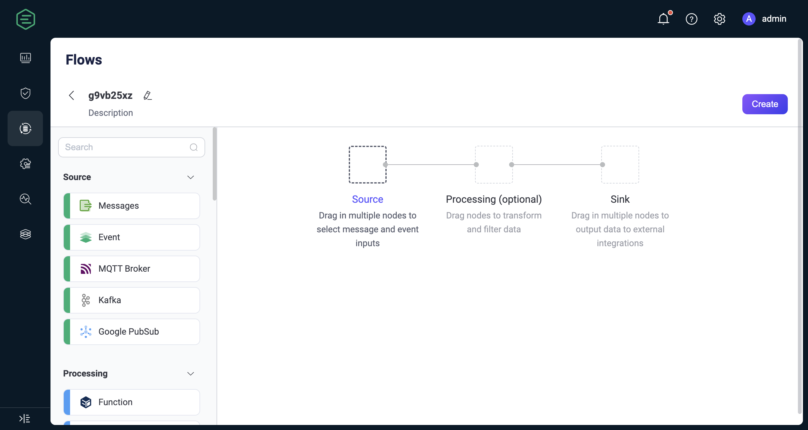

# Flow Designer

::: tip Note

Flow Designer is an EMQX Enterprise feature.

:::

The Flow Designer is a powerful visual tool built upon earlier versions of the visual viewing tool Flows. It provides the capability to visualize data flows and create and edit flows, aiming to simplify and streamline the configuration and management of data processing and integration tasks.

To access the Flows page in the EMQX Dashboard, click **Integrations** -> **Flow Designer** on the left menu. If you have already created rules or data integrations, you will see a directed acyclic graph composed of multiple nodes. Each node represents a data processing step, such as reading data from a topic, event, or Source, transforming data through rules, and forwarding data using actions or Sinks. Through Flows, you can visualize how data flows—from devices or clients through rule processing to external data systems, or vice versa, from external data systems through rule processing back to devices. Refreshing the page updates it with the latest changes in rules and data integrations.

Click **Create Flow** in the top right corner to access the Flow creation page.

## Features and Advantages

Flow Designer is a feature-rich and user-friendly tool that helps users process and integrate data more efficiently, drive business innovation, and improve the visibility and control of data management. Its main features and advantages include:

- **Intuitive Visual Interface:** Users can easily create, adjust, and customize data processing workflows using intuitive drag-and-drop and connecting features. This means that even users without programming experience can quickly get started and design complex data integration logic.
- **Fast Real-time Processing:** Flow Designer enables users to establish real-time processing workflows for messages and events within minutes. This helps businesses respond more quickly to emerging data and events, supporting real-time business needs.
- **Extensive Integration Capabilities:** Supports seamless integration with over 40 types of data systems, offering users flexible data connection and exchange options. Regardless of where your data resides, Flow Designer can help you achieve integration.
- **Unified Management and Monitoring:** Users can clearly see the relationships between each rule and data integration through a unified view, monitoring the status and performance of each processing node. Hovering over a node provides detailed information about it. Clicking on a node allows quick access to the preview page of the rule or data integration, where users can view additional data statistics and make rapid configuration adjustments.
- **EMQX Data Processing Capabilities:** The underlying layer of Flow Designer utilizes Rule SQL and Sink/Source, inheriting EMQX's powerful data processing and performance advantages. Users can freely switch between the UI and SQL editors, providing a simpler, faster experience while retaining the flexibility of SQL editing. This means that users don't need to deeply understand EMQX Rule SQL syntax to leverage its powerful data processing capabilities for business innovation and data-driven decision-making.

In summary, it's an indispensable component in IoT application development, supporting various data processing and fast configuration needs.

## Get Started

Flow Designer is located under the Dashboard **Data Integration** menu. This page includes all data processing flows created by the Rule Engine, Webhook, and Flow Designer.

Flow describes the processing workflows for client messages and events, consisting of data sources, data processing and filtering, and data outflow. Clicking the **Create** button allows you to enter the Flow creation page for visual configuration. You can drag and drop to select the nodes needed for each step and connect them to implement the workflow.

### Source

The data input supports messages, events, or messages flowing from external data systems. A Flow must contain at least one Source node, and multiple data input nodes can be supported simultaneously. Currently supported Sources include:

- **Messages:** Specified through topics and topic wildcards for client-published messages
- **Events:** Supports all client events within EMQX; refer to [Client Events](../data-integration/rule-sql-events-and-fields.md#mqtt-events).
- External Data Systems:
  - [MQTT Service](../data-integration/data-bridge-mqtt.md)
  - [Kafka](../data-integration/data-bridge-kafka.md)
  - [GCP PubSub](../data-integration/data-bridge-gcp-pubsub.md)

### Processing

Use function and filter nodes for data processing and filtering. This step is optional, and a Flow can support at most one function and one filter node:

- **Functions:** Supports all [SQL built-in functions](../data-integration/rule-sql-builtin-functions.md) of the rule engine.
- **Filters:** Supports comparison filtering for data fields coming from the Source; supported comparison operations include `>, <, <=, >=, <>, !=, =, =~`

In addition to visual form editing, Processing nodes also support switching to expression mode to edit using Rule SQL syntax. Filter nodes can only be connected after functions, meaning data must first be processed and then filtered.

### Sink

Outputs the data sources and processing results to specific nodes and external data systems. A Flow must contain at least one Sink node, and supported Sink nodes include:

- **Message Republishing:** Publishes messages to locally specified MQTT topics.
- **Console Output:** Prints messages to logs for debugging.
- **External Data Systems:** Supports over 40 types of data systems, such as MySQL and Kafka; refer to [Data Integration](../data-integration/data-bridges.md).

