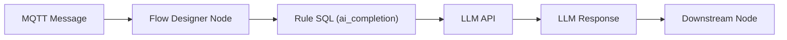

# LLM-Based MQTT Data Processing

Starting from EMQX 5.10.0, Flow Designer supports integrating Large Language Models (LLMs) such as OpenAI GPT, Anthropic Claude, and Gemini. With this feature, users can build intelligent message flows capable of summarizing logs, classifying sensor data, enriching MQTT messages, or generating real-time insights, all using natural language prompts.

## Feature Overview

LLM-Based Processing Nodes in Flow Designer are AI-powered components that connect to external LLM APIs to process message content. These nodes allow users to send MQTT data to models like `gpt-4o` or `claude-3-sonnet`, receive the response, and pass it along downstream in the flow.

::: tip Note

Invoking an LLM and processing data takes time. The entire process may take several seconds to over ten seconds, depending on the response speed of the model. Therefore, LLM processing nodes are not suitable for scenarios with high message throughput (TPS).

:::

### Key Concepts

- **LLM Provider**: A named configuration for an AI service (OpenAI / Anthropic).
- **Completion Profile**: A reusable bundle of LLM model parameters (model ID, system prompt, token limits, etc.).
- **AI Completion Node**: A flow component that sends input to the LLM and stores its result as a user-defined alias.
- `ai_completion`: A Rule SQL function that sends text/binary data to an LLM and returns its response.

### How It Works

When an MQTT message is received in Flow Designer, the AI Completion Node internally calls the built-in SQL function `ai_completion/2,3` to send data to the configured LLM.

1. The message enters the Flow via a **Messages** node (e.g., subscribed to a topic).
2. A **Data Processing** node *(optional)* can extract or transform fields like `device_id`, `payload`, or `timestamp`.
3. The **AI Completion Node** (OpenAI, Anthropic, or Gemini) uses the `ai_completion` function behind the scenes to:

     - Look up the selected **Completion Profile**, which includes provider info, model name, system message, and other parameters.
     - Send the selected input (e.g., `payload`) to the LLM.
     - Receive a response from the LLM API (e.g., a summary or classification result).
4. The response is stored under the **Output Result Alias**, making it available to any downstream node, such as:

     - **Republish** (publish to another topic)

     - **Database** (insert the result into PostgreSQL, MongoDB, etc.)

     - **Bridge** (forward to remote brokers or cloud services)

### Supported LLM Providers

EMQX 5.10.0 supports the following providers:

- **OpenAI**: GPT-3.5, GPT-4, GPT-4o, etc.
- **Anthropic**: Claude 3 models
- **Gemini**: gemini-2.0-flash, gemini-2.5-flash, gemini-2.5-pro, etc.

::: tip Compatibility Note

In addition to the officially listed providers, EMQX also supports any LLM service that is API-compatible with the OpenAI protocol.

:::

## Configure LLM-Based Processing Nodes

To use LLMs in Flow Designer, you must configure a dedicated processing node for your chosen provider, either an OpenAI or an Anthropic node. Each node allows you to define how MQTT message data is sent to the LLM, including which input fields to use, how the model should behave via system prompts, and where to store the AI-generated result for further processing. Once configured, these nodes seamlessly invoke the `ai_completion` function behind the scenes to process data using the selected LLM.

### Configure an OpenAI Node

To use an OpenAI node:

1. Drag the **OpenAI** node from the **Processing** panel.

2. Connect it to a source or preprocessing node.

3. Configure the following fields:

   - **Input**: Type or select the source field. Options are: `event`, `id`, `clientid`, `username`, `payload`, etc.

   - **System Message**: Enter the prompt message, used to guide AI models to generate outputs that meet expectations. Example: "Add up the values of numeric keys in the input JSON data and output the result; only return the output result".

   - **Model**: Select the LLM provider, e.g., `gpt-4o`, `gpt-3.5-turbo`.

   - **API Key**: Enter your OpenAI API key.

   - **Base URL**: Enter an optional custom endpoint. Leave empty to use OpenAI’s default endpoint.

     ::: tip

     You can use this field to connect to other OpenAI-compatible services by entering the provider’s API base URL and your API key.

     :::

   - **Output Result Alias**: Variable name to hold the LLM output, used to reference output results in actions or subsequent processing, e.g., `summary`.
   
     ::: tip
   
     If the alias contains characters other than letters, numbers, and underscores, or starts with a number, or is a SQL keyword, please add double quotes to the alias.
   
     :::

4. Click **Save** to apply your configuration.

### Configure an Anthropic Node

To use an Anthropic node:

1. Drag the **Anthropic** node from the **Processing** panel.

2. Connect it to the message input or a Data Processing node.

3. Fill out the configuration:

   - **Input**: Type or select the source field. Options are: `event`, `id`, `clientid`, `username`, `payload`, etc.

   - **System Message**: Enter the prompt message, used to guide AI models to generate outputs that meet expectations. Example: "Add up the values of numeric keys in the input JSON data and output the result; only return the output result".

   - **Model**: Select the LLM provider, e.g., `claude-3-sonnet-20240620`.

   - **Max Tokens**: Controls response length (default: `100`).

   - **Anthropic Version**: Select the version of Anthropic (default: `2023-06-01`).

   - **API Key**: Enter your Anthropic API key.

   - **Base URL**: Enter an optional custom endpoint. Leave empty to use Anthropic’s default endpoint.

   - **Output Result Alias**: 

   - Variable name to hold the LLM output, used to reference output results in actions or subsequent processing, e.g., `summary`.

     ::: tip

     If the alias contains characters other than letters, numbers, and underscores, or starts with a number, or is a SQL keyword, please add double quotes to the alias.

     :::

4. Click **Save** to apply your configuration.

### Configure a Gemini Node

To use a Gemini node:

1. Drag the **Gemini** node from the **Processing** panel.

2. Connect it to a source or preprocessing node.

3. Configure the following fields:

   - **Input**: Type or select the source field. Options are: `event`, `id`, `clientid`, `username`, `payload`, etc.

   - **System Message**: Enter the prompt message, used to guide AI models to generate outputs that meet expectations. Example: "Add up the values of numeric keys in the input JSON data and output the result; only return the output result".

   - **Model**: Select the LLM provider, e.g., `gemini-2.0-flash`, `gemini-2.5-pro`.

   - **API Key**: Enter your OpenAI API key.

   - **Base URL**: Enter an optional custom endpoint. Leave empty to use Gemini’s default endpoint.

   - **Output Result Alias**: Variable name to hold the LLM output, used to reference output results in actions or subsequent processing, e.g., `summary`.

     ::: tip

     If the alias contains characters other than letters, numbers, and underscores, or starts with a number, or is a SQL keyword, please add double quotes to the alias.

     :::

4. Click **Save** to apply your configuration.

## Quick Start

The following two examples demonstrate how to quickly build and test Flows using LLM-based processing nodes in EMQX:

- [Create a Flow Using OpenAI Node](./openai-node-quick-start.md): Use GPT models to summarize or transform MQTT messages.
- [Create a Flow Using Anthropic Node](./anthropic-node-quick-start.md): Use Claude models to process numeric values in MQTT messages.
- [Create a Flow Using Gemini Node](./gemini-node-quick-start): Use Gemini models to dynamically generate responses by combining both the MQTT client ID and message payload as input.

