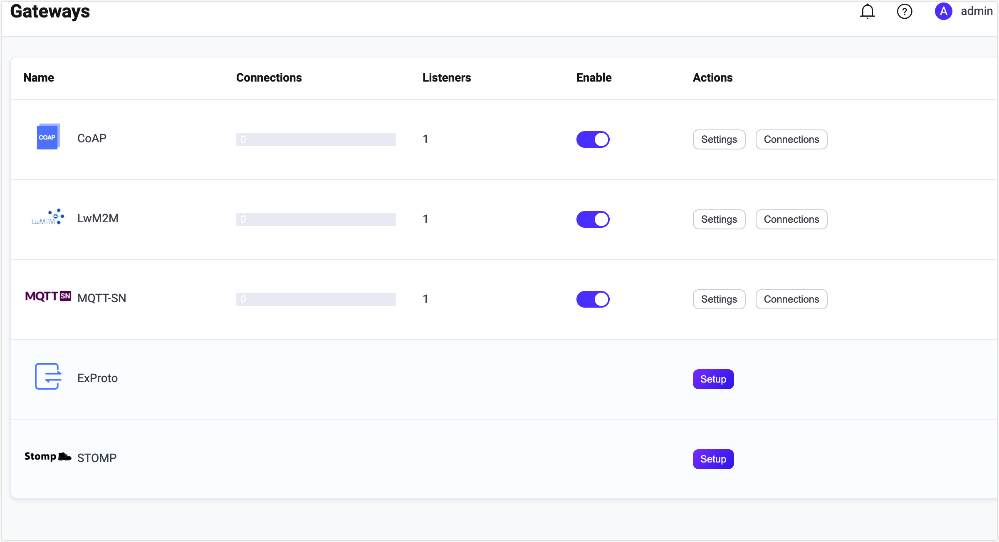
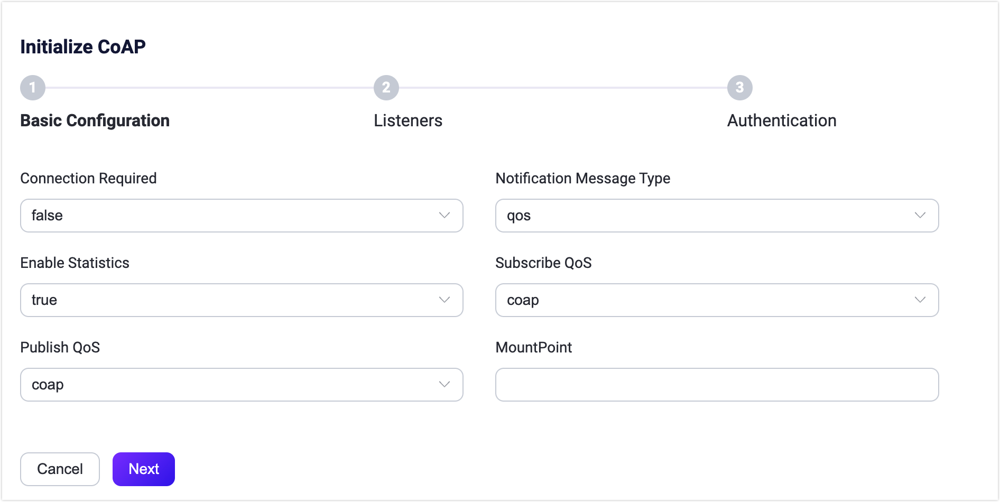

# CoAP Gateway

## Introduction

<!--**Add an introductory section**: Begin the page briefly introducing the relevant protocol and the Gateway. This will provide context for users who are new to the concept.-->

The CoAP gateway in EMQX enables you to implement publish, subscribe, and receive messages as standard with the [Publish-Subscribe Broker for the CoAP](https://datatracker.ietf.org/doc/html/draft-ietf-core-coap-pubsub-09) protocol.

To ensure secure communication, the CoAP gateway includes the **Connection Mode** feature which provides client access authentication. This feature restricts unauthorized CoAP clients from accessing the system, thus enhancing security and preventing potential attacks. 

Below is the feature list supported in connection mode and connectionless mode.

| Feature           | Connectionless Mode | Connection Mode |
| ----------------- | ------------------- | --------------- |
| Message Publish   | √                   | √               |
| Topic Subscribe   | √                   | √               |
| Topic Unsubscribe | √                   | √               |
| Create connection | ×                   | √               |
| Close connection  | ×                   | √               |
| Heartbeat         | ×                   | √               |
| Authentication    | ×                   | √               |

<!--a brief introduction of the architecture-->

## Enable the CoAP Gateway

In EMQX 5.0, CoAP gateway can be configured and enabled through the Dashboard, HTTP API, and configuration file `emqx.conf`. This section takes the configuration via Dashboard as an example to illustrate the operating steps. 

On EMQX Dashboard, click **Extensions** -> **Gateways** on the left navigation menu. On the **Gateway** page, all supported gateways are listed. Locate **CoAP** and click **Setup** in the **Actions** column. Then, you will be directed to the **Initialize CoAP** page.

::: tip

If you are running EMQX in a cluster, the settings you made through the Dashboard or HTTP API will affect the whole cluster. If you only want to change the settings with one node, please configure with [`emqx.conf`](../configuration/configuration.md)

:::

The EMQX CoAP Gateway supports the connectionless and connection work mode. In the connectionless mode, messages are sent as a one-off transmission and it is useful for short-lived interactions such as reading sensor data or sending simple commands. In the connection mode, the client will establish a connection with the broker before the data transfer begins:


You can choose whether to enable the connection or connectionless mode by selecting **false** or **true** under **Connection Requested**, which is **false** by default.

After confirming the connection mode, you can continue with the settings. If you don't need extensive customization, you can enable the CoAP Gateway in just 3 clicks:

1. Click **Next** in the **Basic Configuration** tab to accept all the default settings. 
2. Then you will be directed to the **Listeners** tab, where EMQX has pre-configured a UDP listener on port `5683`. Click **Next** again to confirm the setting.
3. Then click the **Enable** button to activate the CoAP Gateway.

Upon completing the gateway activation process, you can return to the **Gateways** page and observe that the CoAP Gateway now displays an **Enabled** status.



The above configuration can also be configured with HTTP API:

**Example Code:**

```bash
curl -X 'PUT' 'http://127.0.0.1:18083/api/v5/gateway/coap' \
  -u <your-application-key>:<your-security-key> \
  -H 'Content-Type: application/json' \
  -d '{
  "name": "coap",
  "enable": true,
  "mountpoint": "coap/",
  "connection_required": false,
  "listeners": [
    {
      "type": "udp",
      "name": "default",
      "bind": "5683",
      "max_conn_rate": 1000,
      "max_connections": 1024000
    }
  ]
}'
```
For a detailed HTTP API description, see [HTTP API - Gateway](../admin/api.md)

If you have some customization needs, want to add more listeners, or add authentication rules, you can continue to read the [Customize Your CoAP Gateway section](#customize-your-coap-gateway).

The CoAP gateway only supports UDP and DTLS type listeners, for a complete list of configurable parameters refer to: [Gateway Configuration - Listeners](../configuration/configuration-manual.md)

## Work with CoAP Clients

### Client libraries

After establishing the CoAP gateway, you can use the CoAP client tools to test the connections and ensure everything works as expected. Below are some of the recommended CoAP client tools. 

- [libcoap](https://github.com/obgm/libcoap)
- [californium](https://github.com/eclipse/californium)

## Publish/Subscribe

The CoAP gateway uses the URI path and methods defined in the [Publish-Subscribe Broker for the CoAP](https://datatracker.ietf.org/doc/html/draft-ietf-core-coap-pubsub-09) standard.

Detailed parameters refer to [Message Publish](#message-publish), [Topic Subscribe](#topic-subscribe), [Topic Unsubscribe](#topic-unsubscribe).

## Customize Your CoAP Gateway

In addition to the default settings, EMQX provides a variety of configuration options to better accommodate your specific business requirements. This section offers an in-depth overview of the various fields available on the **Gateways** page. See the texts below the screenshot for a comprehensive explanation of each field. 



- **Connection Required**: Set whether to enable connectionless or connection mode, default: **false** (connectionless), optional values: **false** (connectionless), **true** (connection).

- **Notification Message Type**: Set the type of CoAP messages to be delivered, default: **qos**; optional values: 

  - **qos**: Whether the CoAP notification needs to be acknowledged depends on the QoS level of the received message, 
    - QoS 0, no acknowledgment is required from the client, 
    - QoS 1/2, acknowledgment is required from the client. 
  - **con**: The CoAP notification should be acknowledged by the client. 
  - **non**: The CoAP notification need not be acknowledged by the client. 

- **Heatbeat**: Only needed if **Connection Required** is set to **true**, set the minimum heartbeat interval to keep the connection alive; default: 30s. 

- **Enable Statistics**: Set whether to allow the Gateway to collect and report statistics; default: **true**, optional values: **true**, **false**.

- **Subscriber QoS**: Set the default QoS level for subscribe requests, default: **coap**, optional values:

  - **coap**: Follow the setting in **Notification Message Type** to determine the QoS level
    - Use QoS 0 if no acknowledgment is required.
    - Use QoS 1 if acknowledgment is required.
  - **qos0**, **qos1**, **qos2**

- **Publish QoS**: Set the default QoS level for publish requests, default: **coap**, optional values: **coap**, **qos0**, **qos1**, **qos2**; the values here 

- **MountPoint**: Set a string that is prefixed to all topics when publishing or subscribing, providing a way to implement message routing isolation between different protocols, for example, *MQTT-SN*.

  **Note**: This topic prefix is managed by the gateway. CoAP clients do not need to add this prefix explicitly when publishing and subscribing.

### Add Listeners 

By default, one UDP listener with the name of **default** is already configured on port `5683`, which supports up to 1,024,000 concurrent connections. You can click **Settings** for more customized settings for **Delete** to delete the listener. Or click **Add Listener** to add a new listener.


Click **Add Listener** to open **Add Listener** page, where you can continue with the following configuration fields:

**Basic settings**

- **Name**: Set a unique identifier for the listener.
- **Type**: Select the protocol type, for CoAP, this can be either **udp** or **dtls**.
- **Bind**: Set the port number on which the listener accepts incoming connections.
- **MountPoint** (optional): Set a string that is prefixed to all topics when publishing or subscribing, providing a way to implement message routing isolation between different listeners.

**Listener Settings** 

- **Max Connections**: Set the maximum number of concurrent connections that the listener can handle, default: 1024000.
- **Max Connection Rate**: Set the maximum rate of new connections the listener can accept per second, default: 1000.

**UDP Settings** 

- **ActiveN**: Set the `{active, N}` option for the socket, that is, the number of incoming packets the socket can actively process. For details, see [Erlang Documentation -  setopts/2](https://erlang.org/doc/man/inet.html#setopts-2).
- **Buffer**: Set the size of the buffer used to store incoming and outgoing packets, unit: KB.
- **Receive Buffer**: Set the size of the receive buffer,  unit: KB.
- **Send Buffer**: Set the size of the send buffer,  unit: KB.
- **SO_REUSEADDR**: Set whether to allow local reuse of port numbers. <!--not quite sure what this means-->

**DTLS Settings** (for DTLS listeners only)

You can set whether to enable the TLS Verify by setting the toggle switch. But before that, you need to configure the related **TLS Cert**, **TLS Key**, and **CA Cert** information, either by entering the content of the file or uploading with the **Select File** button. For details, see [Enable SSL/TLS Connection](https://docs.emqx.com/en/enterprise/v5.0/network/emqx-mqtt-tls.html).

### Configure Authentication

::: tip

The authentication configuration only takes effect in connection mode, that is, **Connection Required** is set to true.

:::

The client ID, username, and password are provided by the client's [Create Connection](#create-connection) request. The CoAP gateway supports the following authenticator types:

- [Built-in Database Authentication](../access-control/authn/mnesia.md)
- [MySQL Authentication](../access-control/authn/mysql.md)
- [MongoDB Authentication](../access-control/authn/mongodb.md)
- [PostgreSQL Authentication](../access-control/authn/postgresql.md)
- [Redis Authentication](../access-control/authn/redis.md)
- [HTTP Server Authentication](../access-control/authn/http.md)
- [JWT Authentication](../access-control/authn/jwt.md)

This part takes the Dashboard as an example to illustrate how to do the authentication configuration.

On the **Gateways** page, locate **CoAP** and click **Setup** in the **Actions** column and click **Authentication** to enter the **Authentication** tab.

Click **Create Authentication**, choose **Password-Based** or **JWT** as the **Mechanism**, and select the **Backend** as needed. 

For a detailed explanation of how to configure the authenticators, you may refer to the pages listed at the beginning of this section. 

Besides the Dashboard, you can also use HTTP API to configure the authenticator, for example, to create a built-in database authentication for CoAP gateway, you can use the code below:

```bash
curl -X 'POST' \
  'http://127.0.0.1:18083/api/v5/gateway/coap/authentication' \
  -u <your-application-key>:<your-security-key> \
  -H 'accept: application/json' \
  -H 'Content-Type: application/json' \
  -d '{
  "backend": "built_in_database",
  "mechanism": "password_based",
  "password_hash_algorithm": {
    "name": "sha256",
    "salt_position": "suffix"
  },
  "user_id_type": "username"
}'
```

::: tip

Unlike the MQTT protocol, **the gateway only supports the creation of an authenticator, not a list of authenticators (or an authentication chain)**. If no authenticator is enabled, all CoAP clients are allowed to log in.

:::

## Reference: CoAP Client Guide

### Create Connection

Only available in `Connection Mode`.

This interface is used to create a client connection to the CoAP gateway.
When the authentication of the CoAP gateway is enabled, the gateway will
verify the `clientid`, `username`, and `password` provided by this request to prevent illegal users.

**Request Parameters:**

- Method: `POST`
- URI: `mqtt/connection{?QueryString*}`, the `QueryString` is:
  - `clientid`: required parameter, UTF-8 string. The gateway uses this string as a unique identifier for the connection
  - `username`: optional parameter, UTF-8 string. Used for connection authentication.
  - `password`: optional parameter, UTF-8 string. Used for connection authentication.
- Payload: empty

**Response:**
- Return Code:
  - `2.01`: Connection created successfully. The token string for this connection will be returned in the message body.
  - `4.00`: Bad request. Detailed error information will be returned in the message body.
  - `4.01`: Not authorized. The request format is validated, but authorization failed.
- Payload: When the return code is `2.01`, the message body is `Token`, otherwise it is `ErrorMessage`.
  - `Token`: The token string to be used for subsequent requests.
  - `ErrorMessage`: the error description messages.

Take `libcoap` as an example:

```bash
# Initiate a connection request with clientid 123 and username and password admin/public.
# Returned token is 3404490787
coap-client -m post -e "" "coap://127.0.0.1/mqtt/connection?clientid=123&username=admin&password=public"

3404490787
```

:::tip
After the connection is successfully created, you can use Dashboard, HTTP API or CLI to check the client list in the CoAP gateway.
:::


### Close Connnection

Only available in `Connection Mode`.

This interface is used to close the CoAP connection.

**Request Parameters:**
- Method: `DELETE`
- URI: `mqtt/connection{?QueryString*}`, the `QueryString` is:
  - `clientid`: required parameter, UTF-8 string. The gateway uses this string as a unique identifier for the connection
  - `token`: required parameter, Using the token string returned by Create Connection request
- Payload: empty

**Response:**

- Return Code:
  - `2.01`: Close connection successfully.
  - `4.00`: Bad request. Detailed error information will be returned in the message body.
  - `4.01`: Not authorized. The request format is validated, but authorization failed.
- Payload: When the return code is `2.01`, the message body is `Token`, otherwise it is `ErrorMessage`.

For example:

```bash
coap-client -m delete -e "" "coap://127.0.0.1/mqtt/connection?clientid=123&token=3404490787"
```

### Hearbeat

Only available in `Connection Mode`.

This interface is used to maintain the connection between the CoAP client and the gateway. When the heartbeat expires, the gateway deletes the session and subscription, and releases all resources for that client.

**Request Parameters:**
- Method: `PUT`
- URI: `mqtt/connection{?QueryString*}`, the `QueryString` is:
  - `clientid`: required parameter, UTF-8 string. The gateway uses this string as a unique identifier for the connection
  - `token`: required parameter, Using the token string returned by Create Connection request
- Payload: empty

**Response:**

- Return Code:
  - `2.01`: Close connection successfully.
  - `4.00`: Bad request. Detailed error information will be returned in the message body.
  - `4.01`: Not authorized. The request format is validated, but authorization failed.
- Payload: When the return code is `2.01`, the message body is `Token`, otherwise it is `ErrorMessage`.

For example:

```bash
coap-client -m put -e "" "coap://127.0.0.1/mqtt/connection?clientid=123&token=3404490787"
```

:::tip
The heartbeat interval is determined by the `hearbeat` option of CoAP gateway, default: 30 seconds.
:::


### Message Publish

This interface is used by the CoAP client to send messages to the specified topic. Additional identity information needs to be carried if the `Connection Mode` is enabled.

**Request Parameters:**
- Method: `POST`
- URI: `mqtt/{+topic}{?QueryString*}`
  -  `{+topic}` is the topic of publish messages, i.e. the URI is `ps/coap/test` if publish message to `coap/test`.
  - `{?QueryString}` is request parameters:
    - `clientid`: required in `Connection Mode` and optional in `Connectionless Mode`.
    - `token`: `Connection Mode` only, required parameter.
    - `retain` (optional): Whether to publish as a retained message. It is a boolean, default: `false`.
    - `qos`: Message QoS, which identifies the QoS level of the message and affects only how the MQTT client receives the message. Enum with `0`, `1`, `2`.
    - `expiry`: Message expiry interval in seconds, default is 0 which means never expire

- Payload: Message payload

**Response:**
- Return Code:
  - `2.04`: Publish successfully
  - `4.00`: Bad request. Detailed error information will be returned in the message body.
  - `4.01`: Not authorized. The request format is validated, but authorization failed.
- Payload: When the return code is `2.04`, the message body is empty, otherwise it is `ErrorMessage`.

For example, publish a message in `Connectionless Mode`:
```bash
coap-client -m post -e "Hi, this is libcoap" "coap://127.0.0.1/ps/coap/test"
```

Or carry `clientid` and `token` in `Connection Mode`:

```bash
coap-client -m post -e "Hi, this is libcoap" "coap://127.0.0.1/ps/coap/test&clientid=123&token=3404490787"
```


### Topic Subscribe

This interface is used by the CoAP client to subscribe a topic.
Additional identity information needs to be carried if the `Connection Mode` enabled.

**Request Parameters:**
- Method: `POST`
- Options: Set `observer` to `0`
- URI: `mqtt/{+topic}{?QueryString*}`
  -  `{+topic}` is the topic to subscribe, i.e. the URI is `ps/coap/test` if to subscribe `coap/test`.
  - `{?QueryString}` is request parameters:
    - `clientid`: required in `Connection Mode` and optional in `Connectionless Mode`.
    - `token`: `Connection Mode` only, required parameter.
    - `qos`: Subscription QoS to indicate which MessageType (`CON` or `NON`) is used by the gateway to deliver messages to CoAP client. Enumerated with:
      - `0`: Using `NON` message to delivery
      - `1` or `2`: Using `CON`  message to delivery

- Payload: empty

**Response:**

- Return Code:
  - `2.05`: Subscribe successfully
  - `4.00`: Bad request. Detailed error information will be returned in the message body.
  - `4.01`: Not authorized. The request format is validated, but authorization failed.
- Payload: When the return code is `2.05`, the message body is empty, otherwise it is `ErrorMessage`.

For example, subscribe to `coap/test` in `Connectionless Mode`:

```bash
coap-client -m get -s 60 -O 6,0x00 -o - -T "obstoken" "coap://127.0.0.1/ps/coap/test"
```

Or, carry `clientid` and `token` to subscribe in `Connection Mode`:

```bash
coap-client -m post -e "Hi, this is libcoap" "coap://127.0.0.1/ps/coap/test&clientid=123&token=3404490787"
```


### Topic Unsubscribe

This interface is used by the CoAP client to unsubscribe from a topic.
Additional identity information needs to be carried if the `Connection Mode` is enabled.

**Request Parameters:**

- Method: `GET`
- URI: `mqtt/{+topic}{?QueryString*}`
  -  `{+topic}` is the topic to unsubscribe, i.e. the URI is `ps/coap/test` if subscribe to `coap/test`.
  - `{?QueryString}` is request parameters:
    - `clientid`: required in `Connection Mode` and optional in `Connectionless Mode`.
    - `token`: `Connection Mode` only, required parameter.

- Payload: empty

**Response:**

- Return Code:
  - `2.07`: Unsubscribe successfully
  - `4.00`: Bad request. Detailed error information will be returned in the message body.
  - `4.01`: Not authorized. The request format is validated, but authorization failed.
- Payload: When the return code is `2.07`, the message body is empty, otherwise it is `ErrorMessage`.
