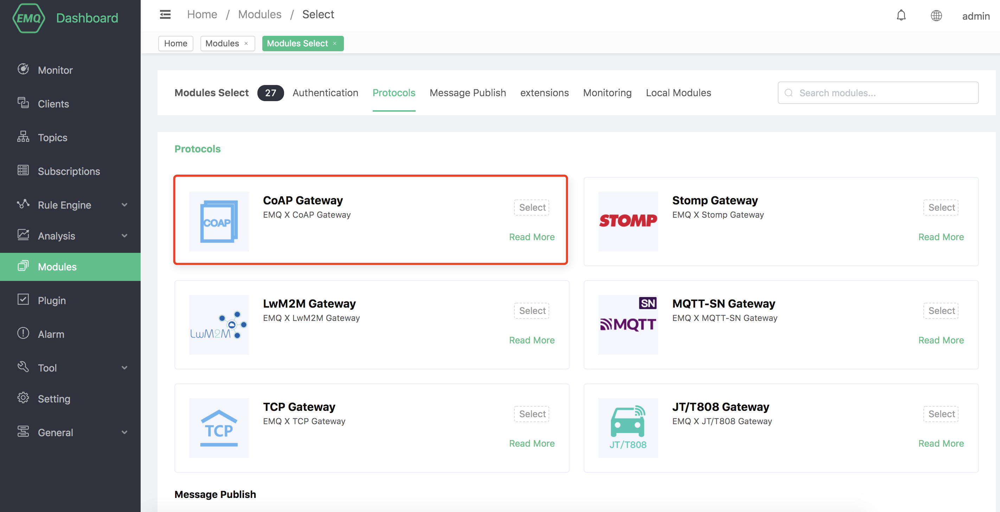
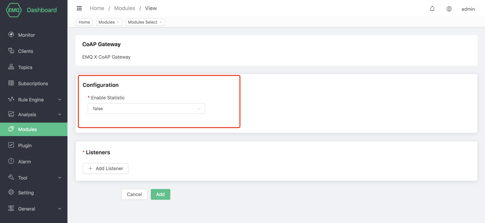

# CoAP Protocol Gateway

The CoAP protocol gateway provides EMQX with the access capability of the CoAP protocol. It allows publishing, subscribing, and receiving messages to EMQX in accordance with a certain defined CoAP message format.

## Create module

Open [EMQX Dashboard](http://127.0.0.1:18083/#/modules), click the "Modules" tab on the left, and choose to add:


Click "Select", and then select "CoAP Access Gateway":



Configure related basic parameters:



Add listening port:


Configure monitoring parameters:


Click "OK" to complete the configuration of the listener, and then click "Add" to complete the creation of the module:


## Usage example

### Client

[libcoap](http://github.com/obgm/libcoap) is a very easy-to-use CoAP client library. Here we use it as a CoAP client to test the function of EMQX CoAP access gateway.

```
git clone http://github.com/obgm/libcoap
cd libcoap
./autogen.sh
./configure --enable-documentation=no --enable-tests=no
make
```

### PUBLISH example

Use `libcoap` to post a message:

```bash
libcoap/examples/coap-client -m put -e 1234 "coap://127.0.0.1/mqtt/topic1?c=client1&u=tom&p=secret"
```

-The topic name is: "topic1" (not "/topic1")
-Client ID is: "client1"
-Username: "tom"
-The password is: "secret"
-Payload is: "1234"

### SUBSCRIBE example

Use `libcoap` to subscribe to a topic:

```
libcoap/examples/coap-client -m get -s 10 "coap://127.0.0.1/mqtt/topic1?c=client1&u=tom&p=secret"
```

-The topic name is: "topic1" (not "/topic1")
-Client ID is: "client1"
-Username: "tom"
-The password is: "secret"
-Duration of subscription: 10 seconds

During this period, if a message is generated on the topic of `topic1`, `libcoap` will receive the message.

### Communication interface description

#### CoAP Client Observe Operation

In the EMQX CoAP access gateway, you can use the Observe operation of CoAP to implement a topic subscription operation:

```
GET coap://localhost/mqtt/{topicname}?c={clientid}&u={username}&p={password} with OBSERVE=0
```

-"Mqtt" in the path is required
-Replace {topicname}, {clientid}, {username} and {password} with your real values
-{topicname} and {clientid} are required
-If clientid does not exist, "bad_request" will be returned
-{Topicname} in the URI should be percent-encoded to prevent special characters such as + and #
-{username} and {password} are optional
-If {username} and {password} are incorrect, an uauthorized error will be returned
-The subscribed QoS level is always 1


#### CoAP Client Unobserve Operation

Use the Unobserve operation to unsubscribe the topic:

```
GET coap://localhost/mqtt/{topicname}?c={clientid}&u={username}&p={password} with OBSERVE=1
```

-"Mqtt" in the path is required
-Replace {topicname}, {clientid}, {username} and {password} with your real values
-{topicname} and {clientid} are required
-If clientid does not exist, "bad_request" will be returned
-{Topicname} in the URI should be percent-encoded to prevent special characters such as + and #
-{username} and {password} are optional
-If {username} and {password} are incorrect, an uauthorized error will be returned

#### CoAP Client Notification Operation

The access gateway will receive the message on the subscription topic and deliver it to the CoAP client in the form of Observe-notification:


-Its payload is exactly the payload in the MQTT message
-The payload data type is "application/octet-stream"


#### CoAP Client Publish Operation

Use CoAP's PUT command to perform a PUBLISH operation:

```
PUT coap://localhost/mqtt/{topicname}?c={clientid}&u={username}&p={password}
```
-"Mqtt" in the path is required
-Replace {topicname}, {clientid}, {username} and {password} with your real values
-{topicname} and {clientid} are required
-If clientid does not exist, "bad_request" will be returned
-{Topicname} in the URI should be percent-encoded to prevent special characters such as + and #
-{username} and {password} are optional
-If {username} and {password} are incorrect, an uauthorized error will be returned
-The payload can be any binary data
-The payload data type is "application/octet-stream"
-Post information will be sent as qos0


#### CoAP Client Keep Alive

The device should periodically issue GET commands as a ping operation to keep the session online

```
GET coap://localhost/mqtt/{any_topicname}?c={clientid}&u={username}&p={password}
```

-"Mqtt" in the path is required
-Replace {topicname}, {clientid}, {username} and {password} with your real values
-{topicname} and {clientid} are required
-If clientid does not exist, "bad_request" will be returned
-{Topicname} in the URI should be percent-encoded to prevent special characters such as + and #
-{username} and {password} are optional
-If {username} and {password} are incorrect, an uauthorized error will be returned
-The client should do keepalive work regularly to keep the session online, especially for devices in the NAT network


### Remarks

CoAP access gateway does not support `POST` and `DELETE` methods.

The subject name in the URI must be URI encoded first (reference: RFC 7252-section 6.4)

ClientId, Username, Password, Topic in CoAP URI are concepts in MQTT. In other words, the CoAP access gateway tries to incorporate CoAP information into the MQTT system by borrowing the concept of nouns in MQTT.

The authentication, access control, hook and other functions of EMQX are also applicable to the CoAP access gateway. such as:

-If the username/password is not authorized, the CoAP client will get an ʻuauthorized` error
-If the username/client ID is not allowed to publish a specific topic, the CoAP message will actually be discarded, although the CoAP client will get an Acknoledgement from the access gateway
-If a CoAP message is published, the'message.publish' hook can also capture this message

### Well-known locations
--------------------

The well-known of the CoAP access gateway found constant return "</mqtt>,</ps>"

E.g:
```
libcoap/examples/coap-client -m get "coap://127.0.0.1/.well-known/core"
```