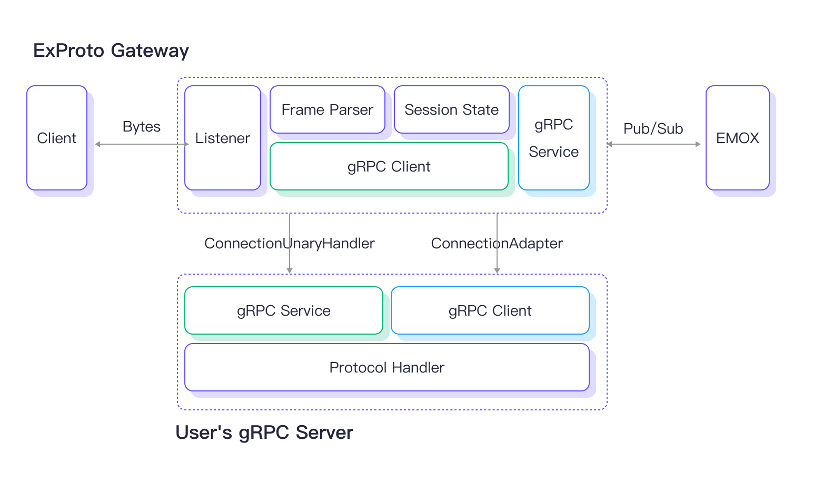
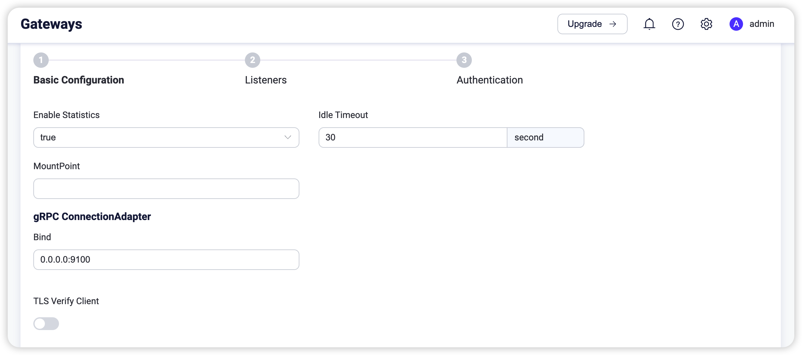
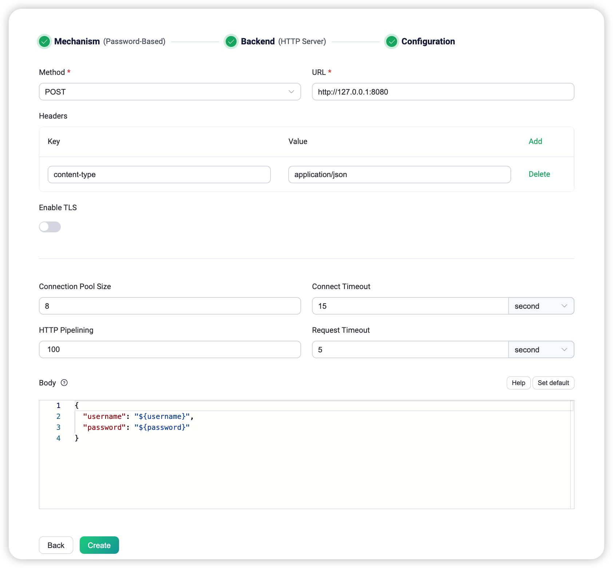
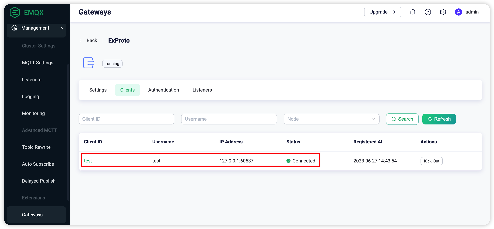
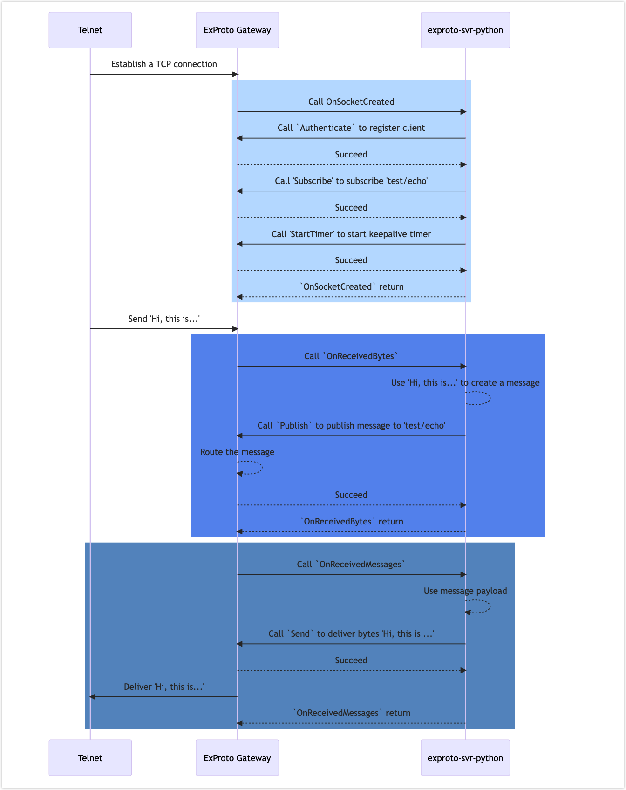

# ExProto Gateway

The Extension Protocol (ExProto) is a custom protocol parsing gateway implemented using gRPC communication. It allows users to develop gRPC services in their preferred programming languages, such as Java, Python, Go, and more. These services are designed to parse network protocols of devices and facilitate functions like device connection, authentication, and message transmission.

This page introduces the working principle of the ExProto gateway and how to configure and use the ExProto Gateway in EMQX.

<!--a brief introduction of the architecture-->

## How ExProto Gateway and gPRC Service Work

Once the ExProto gateway is enabled in EMQX, it listens on a specific port (e.g., 7993) for device connections. When it receives client device connections, it passes the byte data and events generated by the client device to the user's gRPC service. This requires a gRPC client in ExProto gateway to invoke the methods of the `ConnectionUnaryHandler` service implemented in the user's gRPC server. 

The gRPC service in user's gPRC server receives the byte data and events from the ExProto Gateway, parses the client's network protocol and translate byte data and events into Pub/Sub requests, and sends them back to the ExProto gateway. The `ConnectionAdapter` service implemented in ExProto gateway provides an interface for interacting with the user's gRPC Server. Through the ExProto gateway, the client device then can publish messages to EMQX, subscribe to topics, and manage client connections. 

The illustration below shows the architecture of how ExProto gateway and gRPC service work.



### `exproto.proto` File

The `exproto.proto` file defines the interface between ExProto gateway and users' gRPC service. The file specifies the following two services:

- `ConnectionAdapter` service: Implemented by ExProto Gateway to provide interface to the gPRC server.
- `ConnectionUnaryHandler` service: Implemented by user's gRPC server to define the methods for handling the connection of client sockets and byte parsing.

### `ConnectionUnaryHandler` Service

The `ConnectionUnaryHandler` service implemented by users' gRPC server to handle the connection of client sockets and byte parsing.

This service includes the following methods:

| Method             | Description                                                  |
| ------------------ | ------------------------------------------------------------ |
| OnSocketCreated    | Whenever a new Socket connects to the ExProto Gateway, this callback will be triggered. |
| OnSocketClosed     | Whenever a Socket is closed, this callback will be triggered. |
| OnReceivedBytes    | Whenever data is received from the client's socket, this callback will be triggered. |
| OnTimerTimeout     | Whenever a timer times out, this callback will be triggered. |
| OnReceivedMessages | Whenever a message is received for the subscribed topic, this callback will be triggered. |

When ExProto gateway calls these methods, it will pass a unique identifier `conn` in the parameters to mark which socket sent out this event. For example, in the `OnSocketCreated` function parameters:

```
message SocketCreatedRequest {
  string conn = 1;
  ConnInfo conninfo = 2;
}

```

::: tip

Since ExProto Gateway cannot recognize the start and end of private protocol message frames, if there is TCP packet sticking or splitting, it needs to be handled in the OnReceivedBytes callback.

:::

### `ConnectionAdapter` Service

The `ConnectionAdapter` service is implemented by the ExProto Gateway to provides functions for the gRPC service to initiate subscriptions, publish messages, start timers and close connections functions for managing connections. It includes the following methods: 

| Method       | Description                                                  |
| ------------ | ------------------------------------------------------------ |
| Send         | Send bytes to the specified connection.                      |
| Close        | Close the specified connection.                              |
| Authenticate | Register a client with ExProto Gateway and complete the authentication. |
| StartTimer   | To start a timer for the specified connection, typically used for liveness detecting. |
| Publish      | Publish messages to emqx from the specified connection.      |
| Subscribe    | Create a subscription for the specified connection.          |
| Unsubscribe  | Delete a subscription for the specified connection.          |
| RawPublish   | Publish a message to EMQX.                                   |

## Enable ExProto Gateway

The ExProto gateway in EMQX can be configured and enabled through the Dashboard, HTTP API, or configuration file `emqx.conf`. This section demonstrates how to enable ExProto gateway via Dashboard.

On EMQX Dashboard, click **Management** -> **Gateways** from the left navigation menu. On the **Gateways** page, all supported gateways are listed. Locate **ExProto** and click **Setup** in the **Actions** column. Then, you will be directed to the **Initialize ExProto** page.

::: tip

If you are running EMQX in a cluster, the settings you made through the Dashboard or HTTP API will affect the whole cluster. If you only want to change the settings with one node, configure the gateway using [`emqx.conf`](../configuration/configuration.md).

:::

To simplify the configuration process, EMQX offers default values for all required fields on the **Gateways** page. If you don't need extensive customization, you can enable the ExProto Gateway in just 3 clicks:

1. Click **Next** in the **Basic Configuration** step page to accept all the default settings.
2. Then you will be directed to the **Listeners** step page, where EMQX has pre-configured a TCP listener on port 7993. Click **Next** again to confirm the setting.
3. Click the **Enable** button to activate the ExProto Gateway.

Upon completing the gateway activation process, you can return to the **Gateways** page and see that the ExProto Gateway now displays an **Enabled** status.


The above configuration can also be configured with HTTP API:

**Example Code:**

```bash
curl -X 'PUT' 'http://127.0.0.1:18083/api/v5/gateway/exproto' \
  -u <your-application-key>:<your-security-key> \
  -H 'Content-Type: application/json' \
  -d '{
  "name": "exproto",
  "enable": true,
  "mountpoint": "exproto/",
  "server": {
    "bind": "0.0.0.0:9100"
  }
  "handler": {
    "address": "http://127.0.0.1:9001"
    "ssl_options": {"enable": false}
  }
  "listeners": [
    {
      "type": "tcp",
      "bind": "7993",
      "name": "default",
      "max_conn_rate": 1000,
      "max_connections": 1024000
    }
  ]
}'
```

For a detailed REST API description, see [REST API](../admin/api.md).

If you have some customization needs, want to add more listeners, or add authentication rules, you can continue to read the [Customize Your ExProto Gateway](#customize-your-exproto-gateway).


## Customize Your ExProto Gateway

In addition to the default settings, EMQX provides a variety of configuration options to better accommodate your specific business requirements. This section offers an in-depth overview of the configuration options available on the **Gateways** page.

### Basic Configuration

On the Gateways page, locate **ExProto**. Click **Settings** in the **Actions** column. On the **Settings** pane, you can customize your ConnectionUnaryHandler service address, ConnectionAdapter listening port, and set the MountPoint string for this gateway. 



- **Enable Statistics**: Set whether to allow the Gateway to collect and report statistics; default: `true`, optional values: `true`, `false`.
- **Idle Timeout**: Set the duration (in seconds) of inactivity after which a connected client will be considered disconnected. Default: `30 s`.
- **MountPoint**: Set a string that is prefixed to all topics when publishing or subscribing, providing a way to implement message routing isolation between different protocols, for example, `mqttsn/`. This topic prefix is managed by the gateway. Clients do not need to add this prefix explicitly when publishing and subscribing.
- **gRPC ConnectionAdapter**: Set the configurations for starting the `ConnectionAdapter` service.
  - **Bind**: Listening address and port for the gRPC server; default: **0.0.0.0:9100**.
    - **TLS Verify Client**: Enable or disable peer verification; disabled by default. When enabled, you can configure the related **TLS Cert**, **TLS Key**, and **CA Cert** information, either by entering the content of the file or uploading with the **Select File** button. For details, see [Enable SSL/TLS Connection](../network/emqx-mqtt-tls.md).
- **gRPC ConnectionHandler**: Set the callback server configurations that implemented ConnectionUnaryHandler.
  - **Server**: The callback gRPC server address.
    - **Enable TLS**: Enable the TLS connection for gRPC server; disabled by default. When enabled, you can further set the configurations below:
      - **TLS Verify**: Enable or disable peer verification; disabled by default. When enabled, you can configure the related **TLS Cert**, **TLS Key**, and **CA Cert** information, either by entering the content of the file or uploading with the **Select File** button. 
      - **SNI**: Specify the host name to be used in TLS Server Name Indication extension.


### Add Listeners

By default, one TCP listener with the name of **default** is already configured on port `7993`, which allows a maximum of 1,000 connections per second, and supports up to 1,024,000 concurrent connections. You can click the **Listeners** tab for more customized settings, including editing, deleting, or adding a new listener.


Click **+ Add Listener** to open **Add Listener** page, where you can continue with the following configuration fields:

**Basic settings**

- **Name**: Set a unique identifier for the listener.
- **Type**: Select the protocol type, for ExProto, this can be either `udp` or `dtls`.
- **Bind**: Set the port number on which the listener accepts incoming connections.
- **MountPoint** (optional): Set a string that is prefixed to all topics when publishing or subscribing, providing a way to implement message routing isolation between different protocols.

**Listener Settings**

- **Acceptor**: Set the size of the acceptor pool, default: `16`.
- **Max Connections**: Set the maximum number of concurrent connections that the listener can handle, default: `1024000`.
- **Max Connection Rate**: Set the maximum rate of new connections the listener can accept per second, default: `1000`.
- **Proxy Protocol**: Enable the Proxy Protocol V1/2 if the EMQX cluster is deployed behind HAProxy or NGINX; default: `false`.
- **Proxy Protocol Timeout**: Timeout for proxy protocol. EMQX will close the TCP connection if proxy protocol packet is not received within the timeout; default: `3` seconds.

**TCP Settings**

- **ActiveN**: Set the `{active, N}` option for the socket, that is, the number of incoming packets the socket can actively process. For details, see [Erlang Documentation -  setopts/2](https://erlang.org/doc/man/inet.html#setopts-2).
- **Buffer**: Set the size of the buffer used to store incoming and outgoing packets, unit: KB.
- **TCP_NODELAY**: Set the TCP_NODELAY flag for the connections; default: `false`.
- **SO_REUSEADDR**: Set whether to allow local reuse of port numbers; default: `true`.<!--not quite sure what this means-->
- **Send Timeout**: The TCP sends timeout for the connections, default: `15` seconds.
- **Send Timeout Close**: Close the connection if send timeout, default `true`.

**TLS Settings** (for SSL listeners only)

You can set whether to enable the TLS Verify by setting the toggle switch. But before that, you need to configure the related **TLS Cert**, **TLS Key**, and **CA Cert** information, either by entering the content of the file or uploading with the **Select File** button. For details, see [Enable SSL/TLS Connection](../network/emqx-mqtt-tls.md).

Then you can continue to set:

- **SSL Versions**: Set the TLS versions supported, default:`tlsv1`，`tlsv1.1`，`tlsv1.2`, and `tlsv1.3`。
- **SSL Fail If No Peer Cert**: Set whether EMQX will reject the connection if the client sends an empty certificate, default: `false`, optional values: `true`, `false`.
- **CACert Depth**: Set the maximum number of non-self-issued intermediate certificates that can be included in a valid certification path following the peer certificate, default, `10`.
- **Key File Passphrase**: Set the user's password, used only when the private key is password-protected.


### Configure Authentication

ExProto Gateway supports various types of authenticators, such as:

- [Built-in Database Authentication](../access-control/authn/mnesia.md)
- [MySQL Authentication](../access-control/authn/mysql.md)
- [MongoDB Authentication](../access-control/authn/mongodb.md)
- [PostgreSQL Authentication](../access-control/authn/postgresql.md)
- [Redis Authentication](../access-control/authn/redis.md)
- [HTTP Server Authentication](../access-control/authn/http.md)
- [JWT Authentication](../access-control/authn/jwt.md)
- [LDAP Authentication](../access-control/authn/ldap.md)

The Client ID, Username, and Password of the client information are all derived from the parameters passed in the Authenticate method of the ConnectionAdapter.


This section takes the Dashboard as an example to illustrate how to do the authentication configuration.

On the ExProto page, click the **Authentication** tab.

Click **+ Create Authentication**, select `Password-Based` as the **Mechanism**, and select `HTTP Server` as the **Backend**. Click **Next**. In **Configuration**, you can set the authentication rules. For a detailed explanation of each field on the page, you can refer to [HTTP Server Authentication](../access-control/authn/http.md).



The above configuration can also be performed via HTTP API.

**Example Code**

```bash
curl -X 'POST' 'http://127.0.0.1:18083/api/v5/gateway/exproto/authentication' \
  -u <your-application-key>:<your-security-key> \
  -H 'Content-Type: application/json' \
  -d '{
  "method": "post",
  "url": "http://127.0.0.1:8080",
  "headers": {
    "content-type": "application/json"
  },
  "body": {
    "username": "${username}",
    "password": "${password}"
  },
  "pool_size": 8,
  "connect_timeout": "5s",
  "request_timeout": "5s",
  "enable_pipelining": 100,
  "ssl": {
    "enable": false,
    "verify": "verify_none"
  },
  "backend": "http",
  "mechanism": "password_based",
  "enable": true
}'
```

## Start an Example gRPC Service for Testing

This section demonstrates how ExProto gateway and the gRPC service work together by starting an example gRPC service.

In this demonstration, the `telnet` command is used to simulate a client that uses TCP protocol to send or receive messages. In the actual environment, it can be a device that implements custom private protocols and connects to the TCP listener on port 7993. The ExpProto gateway listens on port 7993 to receive client connections and it also listens on port 9100 and provides a `ConnectionAdapter` service defined in the `exproto.proto` file.

You can find programs in various languages in [emqx-extension-examples](https://github.com/emqx/emqx-extension-examples) as example gRPC services. In this demonstration, an echo program `exproto-svr-python` is used as an example gRPC service to implement the `ConnectionUnaryHandler` service using Python. It simply sends back any data received from a TCP client. In the actual environment, it publishes these upstream messages to EMQX, or subscribes to topics to receive messages from EMQX and delivers them to client connections.

The following steps take `exproto-svr-python` as an example:

::: tip Prerequisites

Before you start, make sure you have completed the following:

- Run EMQX 5.1.0 or above and enable the ExProto gateway with default configurations.

- Install Python 3.7 or above, and install the following dependencies:

  ```
  python -m pip install grpcio
  python -m pip install grpcio-tools
  ```

:::

1. On the same machine with EMQX running, clone the sample code and enter the directory `exproto-svr-python`:

   ```bash
   git clone https://github.com/emqx/emqx-extension-examples
   cd exproto-svr-python
   ```

2. Start the gRPC Server using the following command:

   ```
   python exproto_server.py
   ```

   After a successful start, an output similar to the following will be printed:

   ```
   ConnectionUnaryHandler started successfully, listening on 9001
   
   Tips: If the Listener of EMQX ExProto gateway listen on 7993:
         You can use the telnet to test the server, for example:
   
         telnet 127.0.0.1 7993
   
   Waiting for client connections...
   ```

3. Use `telenet` to access the port `7993` that Exproto gateway is listening on. Enter `Hi, this is tcp client!` to test if the gRPC Server is working properly. For example:

   ```
   $ telnet 127.0.0.1 7993
   Trying 127.0.0.1...
   Connected to 127.0.0.1.
   Escape character is '^]'.
   Hi, this is tcp client!
   Hi, this is tcp client!
   ```

4. Go to EMQX Dashboard and click **Management** -> **Gateways** from the left navigation menu. Click **Clients** of ExProto. On the ExProto page, you can see the client you connect to using telnet. 

   

### Sequence Diagram of the Example

The diagram below shows the sequence of connections and message delivery in this example.



<!--```mermaid sequenceDiagram
    Telnet ->> ExProto Gateway: Establish a TCP connection
rect rgb(191, 223, 255)
    ExProto Gateway ->> exproto-svr-python: Call OnSocketCreated
  exproto-svr-python ->> ExProto Gateway: Call `Authenticate` to register client
  ExProto Gateway -->> exproto-svr-python: Succeed
  exproto-svr-python ->> ExProto Gateway: Call 'Subscribe' to subscribe 'test/echo'
    ExProto Gateway -->> exproto-svr-python: Succeed
  exproto-svr-python ->> ExProto Gateway: Call 'StartTimer' to start keepalive timer
    ExProto Gateway -->> exproto-svr-python: Succeed
    exproto-svr-python -->> ExProto Gateway: `OnSocketCreated` return
end
  Telnet ->> ExProto Gateway: Send 'Hi, this is...'
rect rgb(100,150, 240)
  ExProto Gateway ->> exproto-svr-python: Call `OnReceivedBytes`
  exproto-svr-python --> exproto-svr-python: Use 'Hi, this is...' to create a message
  exproto-svr-python ->> ExProto Gateway: Call `Publish` to publish message to 'test/echo'
  ExProto Gateway -->> ExProto Gateway: Route the message
  ExProto Gateway -->> exproto-svr-python: Succeed
  exproto-svr-python -->> ExProto Gateway: `OnReceivedBytes` return
end
rect rgb(100, 150, 200)
  ExProto Gateway ->> exproto-svr-python: Call `OnReceivedMessages`
  exproto-svr-python -->> exproto-svr-python: Use message payload
  exproto-svr-python ->> ExProto Gateway: Call `Send` to deliver bytes 'Hi, this is ...'
  ExProto Gateway -->> exproto-svr-python: Succeed
  ExProto Gateway ->> Telnet: Deliver 'Hi, this is...'
  exproto-svr-python -->> ExProto Gateway: `OnReceivedMessages` return
end ```-->
