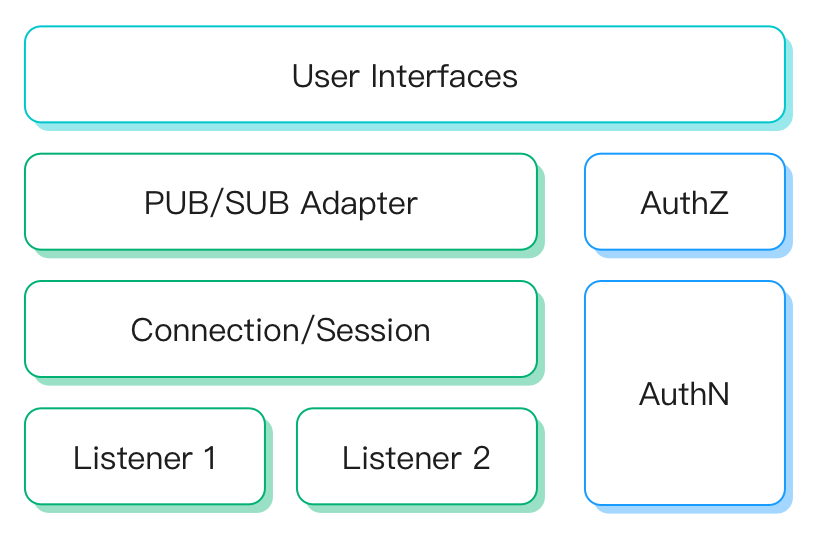

# Extended protocol gateway

The Gateway is responsible for handling all non-MQTT protocol connections,
authentication and message sending and receiving.
that provides a unified user layer interface and concept for them.

Prior to EMQX 5.0, non-MQTT protocol access was implemented by separate protocol plugins
(e.g. the `emqx_lwm2m` plug-in for LwM2M)
There were design and implementation differences between these plugins,
which made using them difficult to understand.

In 5.0, EMQX defines a unified conceptual and operational model for them to make
them easier to use.

Quick Start: [Stomp](./stomp.md), [MQTT-SN](./mqttsn.md), [CoAP](./coap.md)

## Design

To unify the model for each access protocol, Gateway abstracts the following concepts:

- **Listener**: Supports listener types: TCP, SSL, UDP, DTLS. Each gateway can create multiple listeners.
- **Connection/Session**: Gateway creates a session for each accepted client connection. The session manages the subscription list, deliver/receive queue and retransmission logic of client messages.
- **Publish/Subscribe**: Each type of gateway defines how to adapt to the PUB/SUB message model of the MQTT protocol. i.e:
    * The LwM2M protocol does not define the concept of publish/subscribe, so in LwM2M gateway it is necessary to define which topics are used to publish and subscribe.
    * The concept of publish/subscribe is defined in the MQTT-SN protocol, so there is no need for predefined topics to publish/subscribe in MQTT-SN gateway.
- **User Interfaces**: Defines how to manage gateways or clients by configurations and HTTP APIs.



### Authentication

The gateway will construct `ClientInfo` for each connection, which requires:

- No matter the type of gateway, its ClientInfo contains generic fields such as `Client ID`, `Username`, `Password`, etc. (even if the protocol does not have a definition for these fields, the gateway will set the appropriate default value for it)
- Also, each gateway has its own specific client information field, e.g. LwM2M has `Endpoint Name`, `Life Time`, etc.
- Client ID for different gateways is allowed to be duplicated, but the duplicated Client ID logins in a gateway will kick out the old session.

In 5.0, gateways can be configured with authenticators and use the above client information for login authorization:

- Each gateway can be configured independently authenticator, and the configuration and data is isolated between them.
- If no authenticator is configured it is assumed that any client is allowed to log in.
- Due to the different client information formats of different gateways, there is a difference in the type of authenticator that can be configured, but each gateway supports HTTP-based authentication.

:::tip
Setting authenticators for different listeners in a gateway is also supported in the configuration file.
This means that different listening ports are allowed under one gateway
can be configured for different authentication methods and data sources.
:::

### Publish/Subscribe Authorization

In order to adapt the PUB/SUB messaging model, each type of gateway has to fulfil the compatibility with it.

For protocol gateways that already have a PUB/SUB concept, such as MQTT-SN, Stomp usually defines the concept of topics and message payloads.
- The gateway is compatible with the PUB/SUB messaging model by using the topic and payload sent by client.
- Needs to configure the topic authorization rules in [Authorization](../access-control/authz/authz.md).

However, for non-PUB/SUB concept protocols, it lacks the definition of topic, publish, and subscribe, so:
- it is necessary to configure the topics of different messages. i.e, in the LwM2M gateway, we need to configure the topics for each type of message.
- it is up to the gateway to design the format of the message content. Each type of gateway may use a different message format.
- Needs to configure the topic authorization rules in [Authorization](../access-control/authz/authz.md).

::: tip
Authentication can be configured in gateways and is independent of each gateway itself.
However, there is no separate authorization concept in the gateway. If you need to set permissions for a topic in gateway, you need to configure it in the global authorization.
:::

Detailed descriptions can be found in the documentation of each gateway.

## Usage and Integration

### Configuration and Management

In 5.0, gateways can be enabled and configured directly in the Dashboard.

It is also managed using the HTTP API or emqx.conf, e.g:

:::: tabs type:card

::: tab HTTP API

```bash
curl -X 'POST' 'http://127.0.0.1:18083/api/v5/gateway' \
  -u admin:public \
  -H 'Content-Type: application/json' \
  -d '{
  "name": "stomp",
  "enable": true,
  "mountpoint": "stomp/",
  "listeners": [
    {
      "bind": "61613",
      "max_conn_rate": 1000,
      "max_connections": 1024000,
      "name": "default",
      "type": "tcp"
    }
  ]
}'
```

:::

::: tab Configuration

```properties
gateway.stomp {

  mountpoint = "stomp/"

  listeners.tcp.default {
    bind = 61613
    acceptors = 16
    max_connections = 1024000
    max_conn_rate = 1000
  }
}
```

:::

::::

Detailed reference:
- [HTTP API - Gateway](../admin/api.md)
- [Configuration - Gateway](../configuration/configuration-manual.md)

::: tip
Configuring the gateway via emqx.conf requires changes on a per-node basis, but configuring it via Dashboard or the HTTP API will take effect across the cluster.
:::

### Listener-level Authentication and Topic Mountpoint

Apart from the ability to configure different authenticators and topic mountpoints for different gateways at the gateway level.

It is also supported to configure `mountpoint` and `authentication` for different listeners to override the gateway level options.
In this way, multiple listeners can be configured different topic mountpoints and authenticators. e.g:
```properties
gateway.stomp {

  listeners.tcp.default {
    bind = 61613
    ## e.g, to configure the built-in database based authenticator for port 61613
    authentication {
      mechanism = password_based
      backend = built_in_database
      user_id_type = username
    }
  }

  listeners.tcp.default2 {
    bind = 61614
    ## e.g, to configure the HTTP Server-based authenticator for port 61614
    authentication {
      mechanism = password_based
      backend = http
      method = post
      url = "http://127.0.0.1:9000/stomp/auth"
      headers {
        content-type = "application/json"
      }
      body {
        username = "${username}"
        password = "${password}"
      }
    }
  }
}
```

::: tip
Applying different authenticator to each listener is only supported in the configuration file,
not yet supported in the HTTP API and Dashboard.
:::

### Hooks and Events

For better integration with external systems, the gateway also supports hooks defined in the EMQX.

Due to the heterogeneity of semantics between gateways, only some of the core hooks are available.

Client connection related hooks with the following supportability:

| Name                   | Available |  Desc                                                                     |
| ---------------------- | --------- | ------------------------------------------------------------------------- |
| `client.connect`       | Optional  | Originally used for MQTT protocol, only supported by partial gateways     |
| `client.connack`       | Optional  | Originally used for MQTT protocol, only supported by partial gateways     |
| `client.authenticate`  | Required  | Client authentication request, supported by all gateways                  |
| `client.connected`     | Required  | Client connected successfully, supported by all gateways                  |
| `client.disconnected`  | Required  | Client disconnected, supported by all gateways                            |
| `client.authorize`     | Required  | Client publish/subscribe authorization request, supported by all gateways |
| `client.subscribe`     | Optional  | Originally used for MQTT protocol, only supported by partial gateways     |
| `client.unsubscribe`   | Optional  | Originally used for MQTT protocol, only supported by partial gateways     |

Session and message-related hooks have no heterogeneity issues between protocols, so these hooks are fully supported for each tye of gateway.
