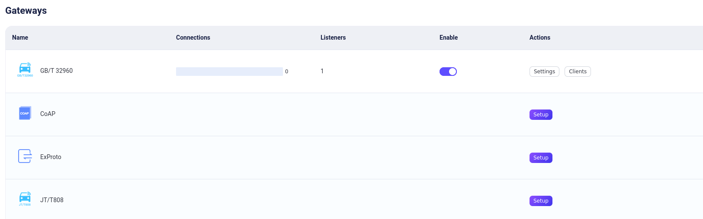
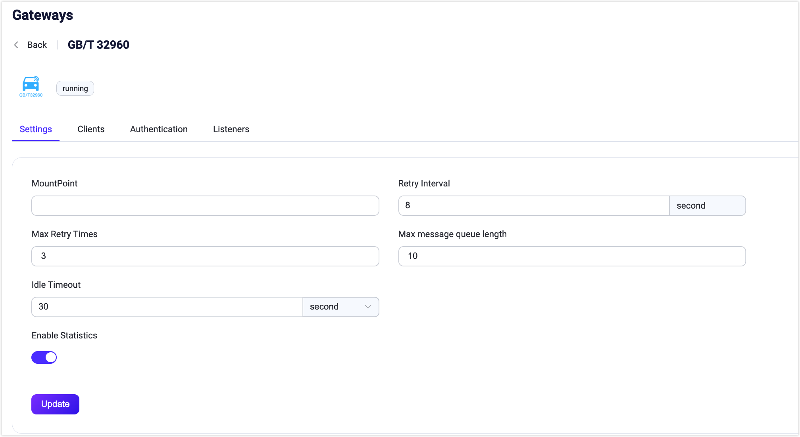
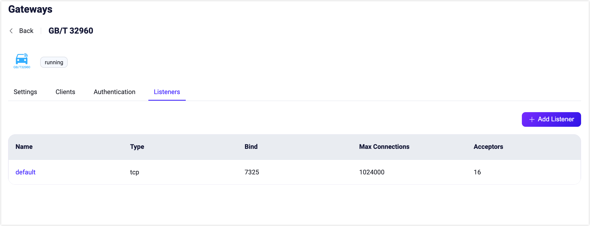

# GB/T 32960 Gateway

::: tip

The GB/T 32960 Gateway is an EMQX Enterprise edition feature. 

:::

EMQX GB/T 32960 Gateway is a messaging protocol translator that bridges the gap between GB/T 32960 and MQTT protocols, allowing clients to use these protocols to communicate with each other.This GB/T 32960 Gateway provides a lightweight and simple messaging solution for clients and servers, enabling message exchange in a variety of messaging environments. With its support for TCP and SSL-type listeners, the GB/T 32960 gateway is a flexible and versatile tool for building messaging systems.

This page introduces how to configure and use the GB/T 32960 Gateway in EMQX.

## Enable GB/T 32960 Gateway

From EMQX 5.4, GB/T 32960 gateway can be configured and enabled through the Dashboard, REST API, and configuration file `emqx.conf`. 

::: tip

If you are running EMQX in a cluster, the settings you made through the Dashboard or REST API will affect the whole cluster. If you only want to change the settings with one node, configure with [`emqx.conf`](../configuration/configuration.md).

:::

This section demonstrates how to enable GB/T 32960 gateway via Dashboard and REST API.

On EMQX Dashboard, click **Management** -> **Gateways** on the left navigation menu. On the **Gateways** page, all supported gateways are listed. Locate **GB/T 32960** and click **Setup** in the **Actions** column. Then, you will be directed to the **Initialize GB/T 32960** page.

To simplify the configuration process, EMQX offers default values for all required fields on the **Gateways** page. If you don't need extensive customization, you can enable the GB/T 32960 Gateway in just 3 clicks:

1. Click **Next** in the **Basic Configuration** tab to accept all the default settings.
2. Then you will be directed to the **Listeners** tab, where EMQX has pre-configured a TCP on port `7325`. Click **Next** again to confirm the setting.
3. Then click the **Enable** button to activate the GB/T 32960 Gateway.

Upon completing the gateway activation process, you can return to the **Gateways** page and observe that the GB/T 32960 Gateway now displays an **Enabled** status.



The above configuration can also be configured with HTTP API:

**Example Code:**

```bash
curl -X 'PUT' 'http://127.0.0.1:18083/api/v5/gateway/gbt32960' \
  -u <your-application-key>:<your-security-key> \
  -H 'Content-Type: application/json' \
  -d '{
  "name": "gbt32960",
  "enable": true,
  "mountpoint": "gbt32960/${clientid}/",
  "retry_interval": "8s",
  "max_retry_times": 3,
  "message_queue_len": 10,
  "listeners": [
    {
      "type": "tcp",
      "name": "default",
      "bind": "7325",
      "max_conn_rate": 1000,
      "max_connections": 1024000
    }
  ]
}'
```

For a detailed REST API description, see [REST API](../admin/api.md).

If you have some customization needs, want to add more listeners, or add authentication rules, you can continue to read [Customize Your GB/T 32960 Gateway](#customize-your-gbt-32960-gateway).

## Work with GB/T 32960 Clients

Once the GB/T 32960 gateway in EMQX is enabled, it acts as a translator and a router between the GB/T 32960 protocol and MQTT, allowing communication between GB/T 32960 clients and systems that use MQTT for messaging. Due to the distinct differences between the GB/T 32960 protocol and the MQTT specification, direct mapping of GB/T 32960 commands to MQTT messages is not feasible. To address this, we have established specific conversion rules to facilitate communication between the two systems:

1. **Command Conversion to MQTT**: Every command issued by a GB/T 32960 client is translated into an MQTT message. The topic of this message follows the format `${mountpoint}/upstream/${command}`, and the payload is structured in JSON format, containing the details of the command.
2. **Sending Commands to GB/T 32960 Clients**: Users can issue commands to GB/T 32960 clients by publishing messages in JSON format to the topic `${mountpoint}/dnstream`. 
3. **Handling Responses from GB/T 32960 Clients**: Responses received from GB/T 32960 clients are converted into MQTT messages with the topic `${mountpoint}/upstream/response`. 

For a comprehensive understanding of the information conversion process between GB/T 32960 and MQTT, refer to our detailed [Data Exchange Guide](https://github.com/emqx/emqx/blob/release-54/apps/emqx_gateway_gbt32960/doc/Data_Exchange_Guide_EN.md).

## Customize Your GB/T 32960 Gateway

In addition to the default settings, EMQX provides a variety of configuration options to better accommodate your specific business requirements. This section offers an in-depth overview of the various fields available on the **Gateways** page.

### Basic Configuration

On the Gateways page, locate **GB/T 32960**. Click **Settings** in the **Actions** column. On the **Settings** pane, you can set the maximum header allowed, the header length allowed, and whether to enable statistics or set the MountPoint string for this gateway. See the texts below the screenshot for a comprehensive explanation of each field.



- **MountPoint**: Set a string that is prefixed to all topics when publishing or subscribing, providing a way to implement message routing isolation between different protocols, for example, `stomp/`.

- **Retry Interval**: Re-send time interval, default: `8s`.

- **Max Retry Times**: Maximum resend times, default: `3`.

- **Message Queue Length**: Maximum message queue, default: `10`.

- **Idle Timeout**: Set the maximum amount of time in seconds that the gateway will wait for a GB/T 32960 frame before closing the connection due to inactivity.

- **Enable Statistics**: Set whether to allow the Gateway to collect and report statistics; default: `true`, optional values: `true`, `false`.

  **Note**: This topic prefix is managed by the gateway. Clients do not need to add this prefix explicitly when publishing and subscribing.

### Add Listeners

One tcp listener with the name of **default** is already configured on port `7325`, which allows a maximum of 16 acceptors in the pool, and supports up to 1,024,000 concurrent connections. You can click the **Listeners** tab for more customized settings, including editing, deleting, or adding a new listener.

::: tip

The GB/T 32960 gateway only supports TCP and SSL types of listeners.

:::



Click **Add Listener** to open **Add Listener** page, where you can continue with the following configuration fields:

**Basic settings**

- **Name**: Set a unique identifier for the listener.
- **Type**: Select the protocol type, for GB/T 32960, this can be either `tcp` or `ssl`.
- **Bind**: Set the port number on which the listener accepts incoming connections.
- **MountPoint** (optional): Set a string that is prefixed to all topics when publishing or subscribing, providing a way to implement message routing isolation between different protocols.

**Listener Settings**

- **Acceptor**: Set the size of the acceptor pool, default `16`.
- **Max Connections**: Set the maximum number of concurrent connections that the listener can handle, default: `1024000`.
- **Max Connection Rate**: Set the maximum rate of new connections the listener can accept per second, default: `1000`.
- **Proxy Protocol**: Set to enable protocol V1/2 if EMQX is configured behind the [load balancer](../deploy/cluster/lb.md).
- **Proxy Protocol Timeout**: Set the maximum amount of time in seconds that the gateway will wait for the proxy protocol package before closing the connection due to inactivity, default: `3s`.

**TCP Settings**

- **ActiveN**: Set the `{active, N}` option for the socket, that is, the number of incoming packets the socket can actively process. For details, see [Erlang Documentation -  setopts/2](https://erlang.org/doc/man/inet.html#setopts-2).
- **Buffer**: Set the size of the buffer used to store incoming and outgoing packets, unit: KB.
- **TCP_NODELAY**: Set whether to enable the `TCP_NODELAY` flat for the connection, that is, whether the client needs to wait for the acknowledgment of the previous data before sending additional data; default: `false`, optional values: `true`, `false`.
- **SO_REUSEADDR**: Set whether to allow local reuse of port numbers. <!--not quite sure what this means-->
- **Send Timeout**: Set the maximum amount of time in seconds that the gateway will wait for the proxy protocol package before closing the connection due to inactivity, default: `15s`.
- **Send Timeout**: Set whether to close the connection if the send timeout.

**SSL Settings **(for SSL listeners only)

You can set whether to enable the TLS Verify by setting the toggle switch. But before that, you need to configure the related **TLS Cert**, **TLS Key**, and **CA Cert** information, either by entering the content of the file or uploading with the **Select File** button. For details, see [Enable SSL/TLS Connection](../network/emqx-mqtt-tls.md).

Then you can continue to set:

- **SSL Versions**: Set the SSL versions supported, default, `tlsv1.3`, `tlsv1.2`, `tlsv1.1`, and `tlsv1`.
- **Fail If No Peer Cert**: Set whether EMQX will reject the connection if the client sends an empty certificate, default: `false`, optional values: `true`, `false`.
- **Intermediate Certificate Depth**: Set the maximum number of non-self-issued intermediate certificates that can be included in a valid certification path following the peer certificate, default, `10`.
- **Key Password**: Set the user's password, used only when the private key is password-protected.

## Configure Authentication

The GB/T 32960 gateway only supports [HTTP Server Authentication](../access-control/authn/http.md). It uses the information in the `login` command and uses the `vin` code as `clientid` to generate the authentication fields for the client:

- Client ID: the `vin` code
- Username: the `vin` code

The following examples show how to create an HTTP authentication for GB/T 32960 gateway via REST API or emqx.conf:

:::: tabs type:card

::: tab REST API

```bash
curl -X 'POST' 'http://127.0.0.1:18083/api/v5/gateway/gbt32960/authentication' \
  -u <your-application-key>:<your-security-key> \
  -H 'Content-Type: application/json' \
  -d '{
  "method": "post",
  "url": "http://127.0.0.1:8080",
  "headers": {
    "content-type": "application/json"
  },
  "body": {
    "vin": "${clientid}"
  },
  "pool_size": 8,
  "connect_timeout": "5s",
  "request_timeout": "5s",
  "enable_pipelining": 100,
  "ssl": {
    "enable": false,
    "verify": "verify_none"
  },
  "backend": "http",
  "mechanism": "password_based",
  "enable": true
}'
```

:::

::: tab Configuration file

```properties
gateway.gbt32960 {
  authentication {
    backend = "http"
    mechanism = "password_based"
    method = "post"
    connect_timeout = "5s"
    enable_pipelining = 100
    url = "http://127.0.0.1:8080"
    headers {
      "content-type" = "application/json"
    }
    body {
      "vin": "${clientid}"
    }
    pool_size = 8
    request_timeout = "5s"
    ssl.enable = false
  }
}
```

:::

::::
