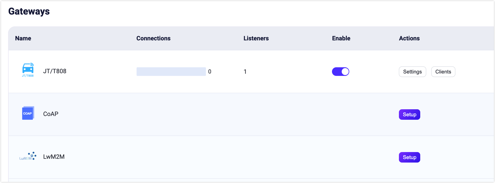
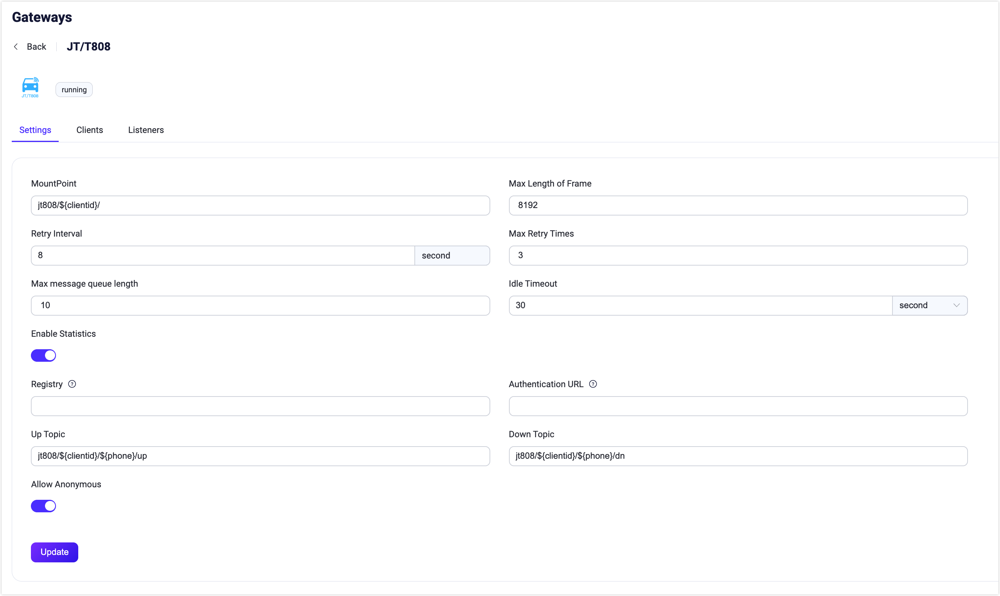
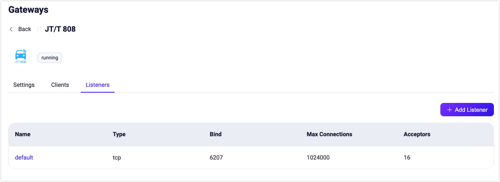

# JT/T808 Gateway

EMQX 5.4 includes the JT/T 808 protocol, a widely used vehicle terminal communication protocol in China for data communication between vehicles and monitoring centers. The JT/T808 gateway in EMQX can receive connections from JT/T808 clients and convert their events and messages into MQTT Publish messages.

In its current implementation, it has the following limitations:

- Based on TCP transmission.
- Only supports JT/T 808 2013. Does not support JT/T 808 2021 yet.
- Unable to send terminal registration and deregistration messages via SMS.
- Cannot use EMQX's built-in authentication system; configuration of the HTTP service address for terminal registration/access authentication is required.

## Enable JT/T808 Gateway

You can enable and configure the JT/T 808 gateway via Dashboard, HTTP API, or the `emqx.conf` configuration file.

### Enable Gateway via Dashboard

This section demonstrates how to enable the JT/T 808 gateway via the Dashboard.

Click **Management** -> **Gateway** in the left navigation bar of the EMQX Dashboard. The **Gateway** page lists all supported gateways. Find **JT/T808** and click the **Configure** button in the **Action** column. You will enter the **Initialize JT/T808** page.

::: tip

If EMQX is running in a cluster, configurations via Dashboard or HTTP API will be effective across the entire cluster. If you only wish to configure a single node, you can configure the gateway using the `emqx.conf` configuration file.

:::

To simplify the configuration process, EMQX provides default values for all required fields on the **Gateway** page. If you do not need custom configurations, you can enable the JT/T 808 gateway in just 3 steps:

1. Accept all the default settings on the **Basic Parameters** step page and click **Next**.
2. Then you will be navigated to the **Listeners** step page, where EMQX has preconfigured a TCP listener on port 6207. Click **Next** again to confirm the settings.
3. Click the **Enable** button to activate the JT/T808 gateway.

After completing the gateway activation process, you can return to the **Gateway** page and see that the JT/T808 gateway is now in the **Enabled** status.



### Enable Gateway via HTTP API or Configuration File

The JT/T 808 gateway can also be enabled and configured via HTTP API or `emqx.conf` configuration file, for example:

:::: tabs type:card

::: tab HTTP API

```bash
curl -X 'PUT' 'http://127.0.0.1:18083/api/v5/gateways/jt808' \
  -u <your-application-key>:<your-security-key> \
  -H 'Content-Type: application/json' \
  -d '{
  "name": "jt808",
  "frame": {
    "max_length": 8192
  },
  "proto": {
    "auth": {
      "allow_anonymous": true
    },
    "up_topic":"jt808/${clientid}/${phone}/up",
    "dn_topic":"jt808/${clientid}/${phone}/dn"
  },
  "mountpoint": "jt808/${clientid}/",
  "retry_interval": "8s",
  "max_retry_times": 3,
  "message_queue_len": 10,
  "enable_stats": true,
  "idle_timeout": "30s",
  "listeners": [
    {
      "type":"tcp",
      "name":"default",
      "bind":"6207",
      "acceptors":16,
      "max_conn_rate":1000,
      "max_connections":1024000,
      "id":"jt808:tcp:default"
    }
  ]
  }'
```

:::

::: tab Configuration File

```properties
gateway {
  jt808 {
    enable_stats = true
    frame {max_length = 8192}
    idle_timeout = 30s
    listeners {
      tcp {
        default {
          acceptors = 16
          bind = "6207"
          max_conn_rate = 1000
          max_connections = 1024000
        }
      }
    }
    max_retry_times = 3
    message_queue_len = 10
    mountpoint = "jt808/${clientid}/"
    proto {
      auth {allow_anonymous = true}
      dn_topic = "jt808/${clientid}/${phone}/dn"
      up_topic = "jt808/${clientid}/${phone}/up"
    }
    retry_interval = 8s
  }
}
```

:::

::::

::: tip

If EMQX is running in a cluster, configurations via Dashboard or HTTP API will be effective across the entire cluster. If you only wish to configure a single node, you can configure the gateway using the `emqx.conf` configuration file.

:::

The JT/T 808 gateway only supports TCP type listeners. For a complete list of configurable parameters, refer to: [Gateway Configuration - Listeners](../configuration/configuration-manual.md).

## Customize Your JT/T808 Gateway

In addition to the default settings, EMQX provides a variety of configuration options to better accommodate your specific business requirements. This section offers an in-depth overview of the configuration options available on the **Gateways** page.

### Basic Configuration

On the Gateways page, locate **JT/T808**. Click **Settings** in the **Actions** column. On the **Settings** pane, you can customize your JT/T808 gateway. 



- **MountPoint**: Set a string that is prefixed to all topics when publishing or subscribing, providing a way to implement message routing isolation between different protocols, for example, `jt808/${clientid}/`. This topic prefix is managed by the gateway. Clients do not need to add this prefix explicitly when publishing and subscribing.
- **Max Length of Frame**: The maximum size of a frame that the gateway can process. The default value is set to `8192`, allowing the gateway to accommodate a wide range of data packet sizes.
- **Retry Interval**: The time interval between retries when a message fails to be delivered by the gateway. The default value is `8s`.
- **Max Retry Times**: The maximum number of attempts the gateway will make to deliver a message. After exceeding this number, the message will be dropped if it cannot be delivered. The default value is: `3`.
- **Max message queue length**: The maximum message queue length for download stream message delivery. The default value is: `100`.
- **Idle Timeout**: Set the duration (in seconds) of inactivity after which a connected client will be considered disconnected. Default: `30` second.
- **Enable Statistics**: Set whether to allow the gateway to collect and report statistics; default: `true`, optional values: `true`, `false`.
- **Registry**: The JT/T 808 device registry center. This setting is required if `allow_anonymous` is set to `false`. When the gateway receives a JT/T 808 registration message, it sends the registration information as an HTTP request to this address. See [Configure Client Authentication/Authorization](#configure-client-authentication-authorization) for more information.
- **Authentication URL**: Specify the URL of an external service to authenticate clients. 
- **Up Topic**: The MQTT topic pattern used for publishing messages from the gateway to EMQX. It defines how messages from JT/T808 clients are mapped to MQTT topics for upstream communication. The default topic is: `jt808/${clientid}/${phone}/up`.
- **Down Topic**: the MQTT topic pattern for messages that are sent from the broker to the gateway and then to JT/T808 clients. It defines how messages from the MQTT broker are routed to the JT/T808 clients for downstream communication. The default topic is: `jt808/${clientid}/${phone}/dn`.
- **Allow Anonymous**: This setting determines whether or not the gateway allows clients to connect without authentication. If set to `true`, clients can connect without providing authentication credentials.


### Add Listeners

By default, one TCP listener with the name of **default** is already configured on port `6207`, which allows a maximum of 1,000 connections per second, and support up to 1,024,000 concurrent connections. You can click the **Listeners** tab for more customized settings, including editing, deleting, or adding a new listener.



Click **+ Add Listener** to open **Add Listener** page, where you can continue with the following configuration fields:

**Basic settings**

- **Name**: Set a unique identifier for the listener.
- **Type**: Select the protocol type, for MQTT-SN, this can be either `udp` or `dtls`.
- **Bind**: Set the port number on which the listener accepts incoming connections.
- **MountPoint** (optional): Set a string that is prefixed to all topics when publishing or subscribing, providing a way to implement message routing isolation between different protocols.

**Listener Settings**

- **Acceptor**: Set the size of the acceptor pool, default: `16`.
- **Max Connections**: Set the maximum number of concurrent connections that the listener can handle, default: `1024000`.
- **Max Connection Rate**: Set the maximum rate of new connections the listener can accept per second, default: `1000`.
- **Proxy Protocol**: Enable the Proxy Protocol V1/2 if the EMQX cluster is deployed behind HAProxy or Nginx; default: `false`.
- **Proxy Protocol Timeout**: Timeout for proxy protocol. EMQX will close the TCP connection if proxy protocol packet is not received within the timeout; default: `3` seconds.

**TCP Settings**

- **ActiveN**: Set the `{active, N}` option for the socket, that is, the number of incoming packets the socket can actively process. For details, see [Erlang Documentation -  setopts/2](https://erlang.org/doc/man/inet.html#setopts-2).
- **Buffer**: Set the size of the buffer used to store incoming and outgoing packets, unit: KB.
- **TCP_NODELAY**: Set the TCP_NODELAY flag for the connections; default: `false`.
- **SO_REUSEADDR**: Set whether to allow local reuse of port numbers; default: `true`.<!--not quite sure what this means-->
- **Send Timeout**: The TCP sends timeout for the connections, default: `15` seconds.
- **Send Timeout Close**: Close the connection if send timeout, default `true`.

### Configure Client Authentication/Authorization

Due to the unique registration/authentication logic in the JT/T 808 protocol specification, the JT/T 808 gateway only supports one type of authentication: requesting registration/authentication from a specific registration service HTTP service.

::: tip 

The term "authentication" here refers to the authentication defined in the JT/T 808 protocol, not MQTT Pub/Sub access control. 

:::

You can also configure `gateway.jt808.proto.auth.allow_anonymous = true` to enable anonymous authentication, i.e., skipping the client's registration/authentication logic.

The detailed format of the registration/authentication request is as follows:

#### Registration Request

```properties
URL: http://127.0.0.1:8991/jt808/registry
Method: POST
Body:
   { "province": 58,
     "city": 59,
     "manufacturer": "Infinity",
     "model": "Q2",
     "license_number": "ZA334455",
     "dev_id": "xx11344",
     "color": 3,
     "phone", "00123456789"
   }
```

**Registration Response:** 

:::: tabs type:card

::: tab Example 1

```json
{
  "code": 0,
  "authcode": "132456789"
}
```

:::

::: tab Example 2

```json
{
  "code": 1
}
```

:::

::::

The return codes can be:

0: Success<br/> 1: Vehicle has been registered<br/> 2: No such vehicle in the database<br/> 3: Terminal has been registered<br/> 4: No such terminal in the database<br/>

#### Authentication Request

```properties
URL: http://127.0.0.1:8991/jt808/auth
Method: POST
Body:
   { "code": "authcode",
     "phone", "00123456789"
   }
```

**Authentication Response:**

```
HTTP Status Code 200: Authentication successful
Others: Authentication failed
```

Note: The authentication request is only called when the system has not saved the authentication code (i.e., the terminal directly sends authentication messages to log in to the system).

## Data Exchange Format

Please refer to [JT/T 808 Gateway Data Exchange Format](./jt808_data_exchange.md).

## User Layer Interface

- For detailed configuration instructions, refer to: [Gateway Configuration - JT/T 808 Gateway](../configuration/configuration-manual.md)
- For detailed HTTP API interface, refer to: [HTTP API - Gateway](../admin/api.md)