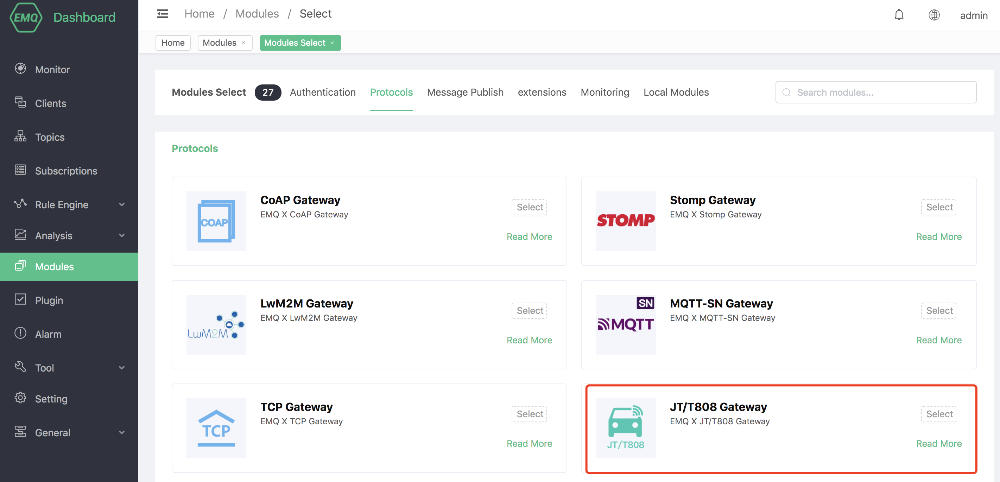

# JT/T808 Protocol Gateway

## Protocol Introduction

**emqx-jt808** As EMQX access gateway, according to its functional logic and the relationship between the entire system, the entire message exchange process can be divided into three parts: terminal side, platform side and other sides:

```
|<-- Terminal -->|<---------- Broker Side ---------->|<---  Others  --->|
|<-    Side    ->|                                   |<--    Side    -->|

+---+                                                  PUB  +-----------+
| D |  INCOMING  +------------+    PUB     +---------+   -->| subscriber|
| E |----------->|            |----------->|         |--/   +-----------+
| V |            | emqx-jt808 |            |  EMQX  |
| I |<-----------|            |<-----------|         |<--   +-----------+
| C |  OUTGOING  +------------+    PUB     +---------+   \--| publisher |
| E |                                                  PUB  +-----------+
+---+
```

1. Terminal side: exchange data through the JT/T 808 protocol to report different types of data, or send downlink messages to the terminal.
2. Platform side: emqx-jt808 decodes the message and performs registration/authentication, or PUBLISH the data message to a specific topic; the agent subscribes to the downstream topic, and converts the downstream PUBLISH message into a JT/T 808 protocol message The text structure is delivered to the terminal.
3. The other side can subscribe to the topic of the upstream PUBLISH message appearing in 2 to receive the upstream message. Or to publish a message to a specific downlink topic to send data to the terminal side.

## Create module

Open [EMQX Dashboard](http://127.0.0.1:18083/#/modules), click the "Modules" tab on the left, and choose to add:


Select JT/T808 protocol to access the gateway:



Configure related basic parameters:


Add listening port:


Configure monitoring parameters:


Click to confirm to the configuration parameter page:


After clicking Add, the module is added:


**emqx-jt808 implementation regulations:**

-In the system, the mobile phone number is used as the unique identification of a connection, namely ClientId


### Configuration parameters

The implementation of emqx-jt808 supports anonymous access authentication:


| Configuration          | Description                                                  |
| ---------------------- | ------------------------------------------------------------ |
| Allow anonymous        | Whether to allow anonymous user login                        |
| Registray URL          | JT/T808 terminal registered HTTP interface address           |
| Authentication URL     | JT/T808 terminal access authentication HTTP interface address |
| Downlink Message Topic | Upstream topic. Uplink message to the message topic in the EMQX system%c: ClientId of the connected client, %p: Phone |
| Uplink Message Topic   | Downstream topic. Uplink message to the message topic in the EMQX system%c: ClientId of the connected client, %p: Phone |
| Max Frame Length       | Maximum processing size of a single JT/T808 protocol message |


### Registration and authentication

The detailed format of the registration request is as follows:

**Registration request:**
```
    URL: http://127.0.0.1:8991/jt808/registry
    Method: POST
    Body:
       {"province": 58,
         "city": 59,
         "manufacturer": "Infinity",
         "model": "Q2",
         "license_number": "ZA334455",
         "dev_id": "xx11344",
         "color": 3,
         "phone", "00123456789"
       }
```

**Registration Response:**
```
{
  "code": 0,
  "authcode": "132456789"
}

or:

{
  "code": 1
}

The return code can be:

0: success
1: The vehicle has been registered
2: The vehicle is not in the database
3: The terminal has been registered
4: There is no such terminal in the database
```

**Authentication request:**

```properties
    URL: http://127.0.0.1:8991/jt808/auth
    Method: POST
    Body:
       {"code": "authcode",
         "phone", "00123456789"
       }
```

**Authentication response:**
```
HTTP status code 200: authentication succeeded
Other: Authentication failed
```

::: tip Tip
The authentication request is only called when the system does not save the authentication code (that is, the terminal directly sends an authentication message to log in to the system)
:::

### Data uplink and downlink

In emqx-jt808, you can send and receive terminal messages by configuring uplink and downlink topics:

#### Upward

For example: **Manufacturer Id** is ʻabcde` and **Terminal Id** is `1234567`.

First use the MQTT client to subscribe to the topic `jt808/abcde1234567/up`:

```properties
$ mosquitto_sub -t jt808/abcde1234567/up
```

For example, after the terminal reports a message of type `Data Uplink Transparent Transmission (0x0900)`, the subscriber will receive:

```js
{"body":
    {"data":"MTIzNDU2",
      "type":240
    },
  "header":
     {"encrypt":0,
       "len":7,
       "msg_id":2304,
       "msg_sn":4,
       "phone":"011111111111"
     }
}
```

::: tip Tip
For transparent transmission, the content of the data field will be base64 encoded and reported once
:::

#### Data Downlink

Similarly, take the ID in the above row as an example; after the terminal is successfully authenticated, use the MQTT client to send a message of the type `data downlink transparent transmission (0x8900)` to the terminal:
```
$ mosquitto_pub -t jt808/abcde1234567/dn -m'{"body":{"data":"MTIzNDU2","type":240},"header":{"msg_id":35072}}'
```

::: tip Tip
In the downstream JSON, the content in the header only needs to have msg_id; the content in the body has different structures according to different msg_id
:::
