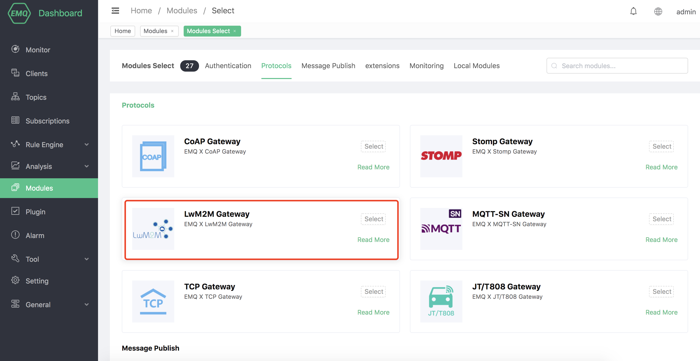
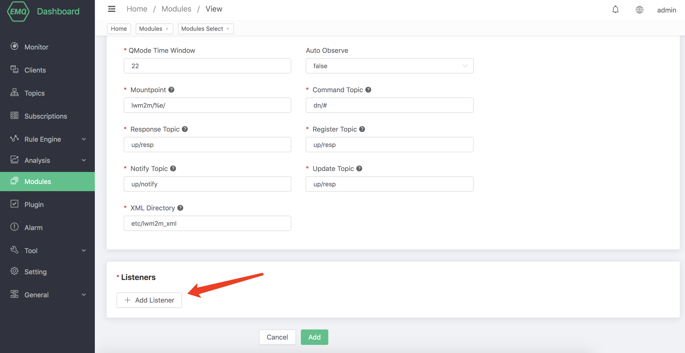
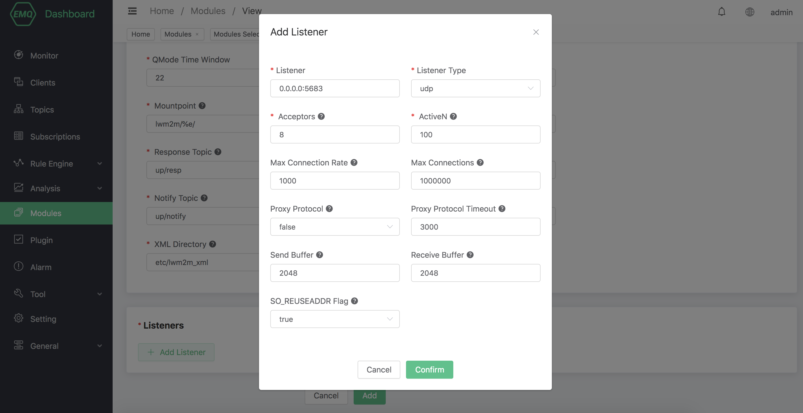

# LwM2M Protocol Gateway

## Protocol Introduction

The full name of LwM2M is Lightweight Machine-To-Machine, which is developed by Open Mobile Alliance (OMA)
A defined set of lightweight protocols suitable for the Internet of Things, which provides device management and communication functions, especially suitable for terminal devices with limited resources. The agreement can be in
[Here](http://www.openmobilealliance.org/wp/) to download.

LwM2M is based on the REST architecture, using CoAP as the underlying transport protocol, carried in UDP or SMS
Therefore, the message structure is simple and compact, and it is also applicable in environments where network resources are limited and the device is always online.

The main entities of LwM2M include LwM2M Server and LwM2M Client.

LwM2M Server serves as a server and is deployed at the M2M service provider or network service provider. LwM2M defines two types of servers

  -One is LwM2M BOOTSTRAP SERVER. The emqx-lwm2m plug-in does not implement the server function.
  -One is LwM2M SERVER, emqx-lwm2m realizes the function of this server on UDP, but SMS does not.

LwM2M Client acts as a client and is deployed on each LwM2M device.

Between LwM2M Server and LwM2M Client, the LwM2M protocol defines 4 interfaces.

1. Bootstrap interface Bootstrap: provide LwM2M client with registration to LwM2M
    The necessary information of the server, such as server access information, resource information supported by the client, etc.
2. Client Registration Interface Client Registration: Connect LwM2M client and LwM2M server, connect LwM2M
    The relevant information of the client is stored on the LwM2M server. Only after completing the registration, LwM2M
    The communication and management between the client and the server becomes possible.
3. Device management and service implementation interface Device Management and Service Enablement: the master of this interface is LwM2M
    The server sends instructions to the client, and the client responds to the instructions and sends the response message to the server.
4. Information reporting interface Information Reporting: Allow LwM2M
    The server subscribes to the client for resource information, and the client receives the subscription and reports its resource changes to the server according to the agreed mode.

LwM2M abstracts the services on the device into Object and Resource, and defines the attributes and functions of various Objects in XML files. allowable
[Here](http://www.openmobilealliance.org/wp/OMNA/LwM2M/LwM2MRegistry.html)
Find various definitions of XML.

The LwM2M protocol predefines 8 kinds of Objects to meet the basic requirements, namely:

  -Security object
  -Server object
  -Access Control access control object
  -Device object
  -Connectivity Monitoring Connectivity monitoring object
  -Firmware firmware object
  -Location object
  -Connectivity Statistics Connectivity statistics object

## Create module

Open [EMQX Dashboard](http://127.0.0.1:18083/#/modules), click the "Modules" tab on the left, and choose to add:


Select LwM2M protocol to access the gateway:



Configure related basic parameters:


Add listening port:



Configure monitoring parameters:



Click to confirm to the configuration parameter page:


After clicking Add, the module is added:


EMQX-LWM2M is a gateway module of EMQX server, which implements most of the functions of LwM2M. MQTT client can pass EMQX-LWM2M
Access devices that support LwM2M. The device can also report notification to EMQX-LWM2M to collect data for EMQX back-end services.

### Configuration parameters

| Configuration     | Description                                                  |
| ----------------- | ------------------------------------------------------------ |
| Minimum Lifetime  | Minimum lifetime allowed to be set for registration/update, in seconds |
| Maximum Lifetime  | Maximum lifetime allowed to be set for registration/update, in seconds |
| QMode Time Window | QMode time window, indicating how long the downstream command sent to the client will be cached, in seconds |
| Auto Observe      | After successful registration, whether the objectlist reported by Observe is automatically reported |
| Mountpoint        | topic Prefix                                                 |
| Command Topic     | Downstream command topic %e indicates the value endport name |
| Response Topic    | Upstream response topic %e means endport name                |
| Register Topic    | Register message topic %e means endport name                 |
| Notify Topic      | Uplink notification topic %e means endport name              |
| Update Topic      | Update message topic %e means endport name                   |
| XML Directory     | The directory where the XML files are stored. These XMLs are used to define the LwM2M Object |

### MQTT and LwM2M conversion

From the MQTT client, you can send Command to the LwM2M device. The command from MQTT to LwM2M uses the following topic

```bash
"lwm2m/{?device_end_point_name}/command".
```

The MQTT Payload is a string in json format, which specifies the command to be sent. For more details, please refer to the emqx-lwm2m documentation.

The reply of the LwM2M device is sent with the following topic

```bash
"lwm2m/{?device_end_point_name}/response".
```

MQTT Payload is also a string in json format. For more details, please refer to the documentation of emqx-lwm2m.
