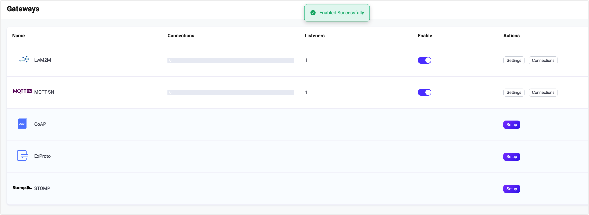
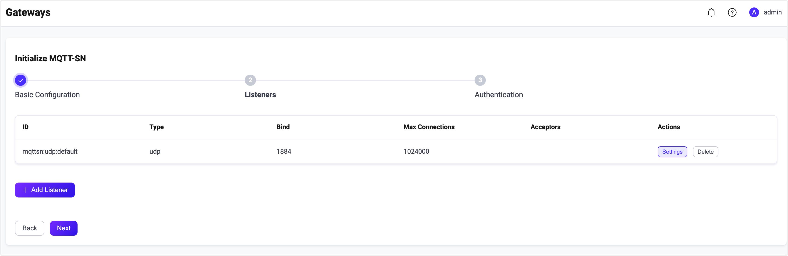
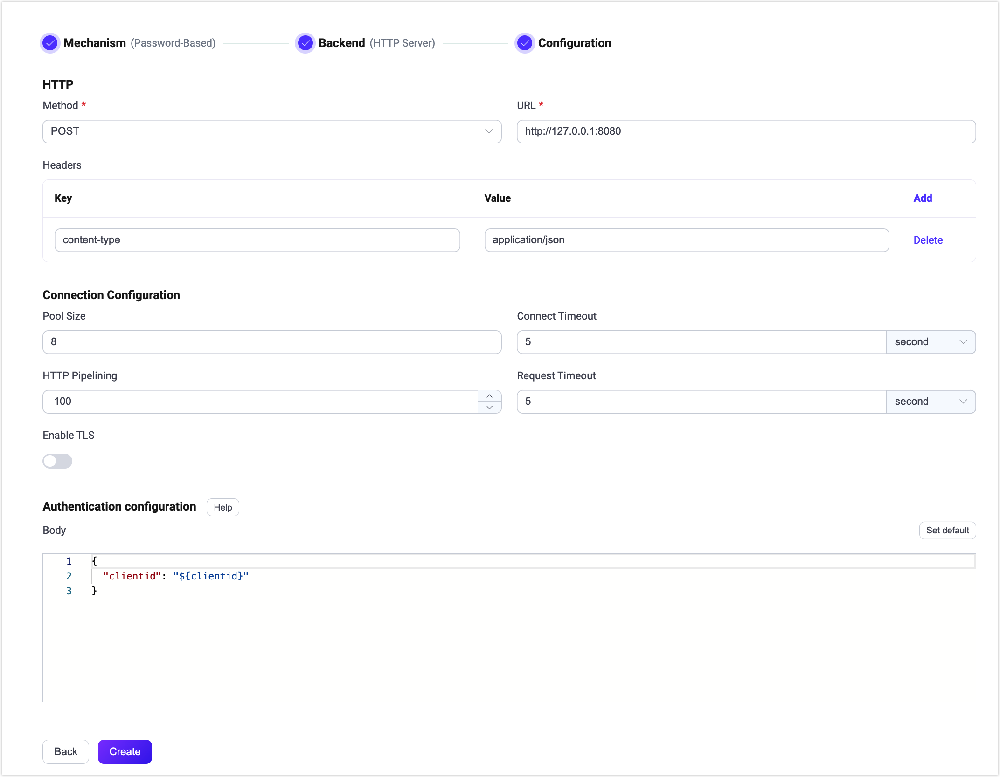

# MQTT-SN Gateway

## Introduction

<!--**Add an introductory section**: Begin the page briefly introducing the relevant protocol and the Gateway. This will provide context for users who are new to the concept.-->

MQTT-SN (MQTT for Sensor Networks) is a lightweight pub/sub protocol for wireless sensor networks, the EMQX MQTT-SN Gateway allows these devices to connect and communicate with EMQX, bridging the gap between MQTT-SN and the standard MQTT protocol.

This guide will teach you how to configure and use the MQTT-SN Gateway in EMQX.

::: tip

The MQTT-SN gateway is based on the [MQTT-SN v1.2](https://www.oasis-open.org/committees/download.php/66091/MQTT-SN_spec_v1.2.pdf).

:::

<!--a brief introduction of the architecture-->

## Enable the MQTT-SN Gateway

In EMQX 5.0, MQTT-SN gateways can be configured and enabled through the Dashboard, HTTP API, and configuration file `emqx.conf`. This section takes the configuration via Dashboard as an example to illustrate the operating steps. 

On EMQX Dashboard, click **Extensions** -> **Gateways** on the left navigation menu. On the **Gateway** page, all supported gateways are listed. Locate **MQTT-SN** and click **Setup** in the **Actions** column. Then, you will be directed to the **Initialize MQTT-SN** page.

::: tip

If you are running EMQX in a cluster, the settings you made through the Dashboard or HTTP API will affect the whole cluster. If you only want to change the settings with one node, please configure with [`emqx.conf`](../configuration/configuration.md)

:::

To simplify the configuration process, EMQX offers default values for all required fields on the **Gateways** page. If you don't need extensive customization, you can enable the MQTT-SN Gateway in just 3 clicks:

1. Click **Next** in the **Basic Configuration** tab to accept all the default settings. 
2. Then you will be directed to the **Listeners** tab, where EMQX has pre-configured a UDP listener on port 1884. Click **Next** again to confirm the setting.
3. Then click the **Enable** button to activate the MQTT-SN Gateway.

Upon completing the gateway activation process, you can return to the **Gateways** page and observe that the MQTT-SN Gateway now displays an **Enabled** status.



The above configuration can also be configured with HTTP API:

**Example Code:**

```bash
curl -X 'PUT' 'http://127.0.0.1:18083/api/v5/gateway/mqttsn' \
  -u <your-application-key>:<your-security-key> \
  -H 'Content-Type: application/json' \
  -d '{
  "name": "mqttsn",
  "enable": true,
  "gateway_id": 1,
  "mountpoint": "mqttsn/",
  "listeners": [
    {
      "type": "udp",
      "bind": "1884",
      "name": "default",
      "max_conn_rate": 1000,
      "max_connections": 1024000
    }
  ]
}'
```

For a detailed HTTP API description, see [HTTP API - Gateway](../admin/api.md)

If you have some customization needs, want to add more listeners, or add authentication rules, you can continue to read the [Customize Your MQTT-SN Gateway section](#customize-your-mqtt-sn-gateway).

## Work with MQTT-SN Clients

### Client Libraries

After establishing the MQTT-SN gateway, you can use the MQTT-SN client tools to test the connections and ensure everything works as expected. Below are some of the recommended MQTT-SN client tools. 

- [paho.mqtt-sn.embedded-c](https://github.com/eclipse/paho.mqtt-sn.embedded-c)
- [mqtt-sn-tools](https://github.com/njh/mqtt-sn-tools)

### Publish/Subscribe

The MQTT-SN protocol already defines the publish/subscribe behavior, e.g:

- The `PUBLISH` message of the MQTT-SN protocol is used as a publishing operation, whose topic and QoS are specified by this message.
- The `SUBSCRIBE` message of the MQTT-SN protocol is used as a subscribing operation, whose topic and QoS are both specified by this message.
- The `UNSUBSCRIBE` message of the MQTT-SN protocol is used as an unsubscribe operation, whose topic is specified by this message.

## Customize Your MQTT-SN Gateway

In addition to the default settings, EMQX provides a variety of configuration options to better accommodate your specific business requirements. This section offers an in-depth overview of the various fields available on the **Gateways** page.

### Basic Configuration

In the **Basic Configuration** tab, you can customize your gateway ID, predefine the topic list, and set the MountPoint string for this gateway. See the texts below the screenshot for a comprehensive explanation of each field. 


- **Gateway ID**: Set the unique identifier of the gateway, for example, 1. 

- **Enable Broadcast**: Set whether to allow the gateway to broadcast gateway advertisements to clients, it will broadcast the message the Gateway ID you just specified, default: **true**, optional values: **true**, **false**.

- **Enable QoS3**: Set whether to allow the gateway to support QoS 3 (Exactly-once) message delivery,  this setting is intended for basic clients that only need to send `PUBLISH` messages to the gateway; default: **true**, optional values: **true**, **false**.

- **Idle Timeout**: Set the duration (in seconds) of inactivity after which a connected MQTT-SN client will be considered disconnected. Default: **30 s**.

- **Enable Statistics**: Set whether to allow the Gateway to collect and report statistics; default: **true**, optional values: **true**, **false**.

- **Predefined Topic List**: Set the predefined topic IDs and corresponding topic names. Click **Add** to add a new entry. 

  - **Topic ID**: Set the topic ID, which should be an integer between 1 and 65535.
  - **Topic**: Set the topic names.<!--, multiple topics can be added here, separated with a `,`-->

- **MountPoint**: Set a string that is prefixed to all topics when publishing or subscribing, providing a way to implement message routing isolation between different listeners, for example, *mqttsn*.

  **Note**: The prefixed string will be removed from the topic name when the message is delivered to the subscriber. 

### Add Listeners 

By default, one UPD listener with the name of **default** is already configured on port `1884`, which allows a maximum of 1,000 connections per second, and support up to 1,024,000 concurrent connections. You can click **Settings** for more customized settings for **Delete** to delete the listener. Or click **Add Listener** to add a new listener.



Click **Add Listener** to open **Add Listener** page, where you can continue with the following configuration fields:

**Basic settings**

- **Name**: Set a unique identifier for the listener.
- **Type**: Select the protocol type, for MQTT-SN, this can be either **udp** or **dtls**.
- **Bind**: Set the port number on which the listener accepts incoming connections.
- **MountPoint** (optional): Set a string that is prefixed to all topics when publishing or subscribing, providing a way to implement message routing isolation between different listeners.

**Listener Settings** 

- **Acceptor **(for DTLS listeners only): Set the size of the acceptor pool, default: **16**. 
- **Max Connections**: Set the maximum number of concurrent connections that the listener can handle, default: **1024000**.
- **Max Connection Rate**: Set the maximum rate of new connections the listener can accept per second, default: **1000**.

**UDP Settings** 

- **ActiveN**: Set the `{active, N}` option for the socket, that is, the number of incoming packets the socket can actively process. For details, see [Erlang Documentation -  setopts/2](https://erlang.org/doc/man/inet.html#setopts-2).
- **Buffer**: Set the size of the buffer used to store incoming and outgoing packets, unit: KB.
- **Receive Buffer**: Set the size of the receive buffer,  unit: KB.
- **Send Buffer**: Set the size of the send buffer,  unit: KB. 
- **SO_REUSEADDR**: Set whether to allow local reuse of port numbers. <!--not quite sure what this means-->

**DTLS Settings** (for DTLS listeners only)

You can set whether to enable the TLS Verify by setting the toggle switch. But before that, you need to configure the related **TLS Cert**, **TLS Key**, and **CA Cert** information, either by entering the content of the file or uploading with the **Select File** button. For details, see [Enable SSL/TLS Connection](../network/emqx-mqtt-tls.md).

Then you can continue to set:

- **DTLS Versions**: Set the DTLS versions supported, default, **dtlsv1.2** and **dtlsv1**. 
- **Fail If No Peer Cert**: Set whether EMQX will reject the connection if the client sends an empty certificate, default: **false**, optional values: **true**, **false**. 
- **Intermediate Certificate Depth**: Set the maximum number of non-self-issued intermediate certificates that can be included in a valid certification path following the peer certificate, default, **10**.
- **Key Password**: Set the user's password, used only when the private key is password-protected. 

### Configure Authentication

Since the connection message of the MQTT-SN protocol only gives the Client ID of the Client, therefore, the MQTT-SN gateway only supports [HTTP Server Authentication](../access-control/authn/http.md).

The client information generation rules are as follows:

- Client ID: using the Client ID field of `CONNECT` message.
- Username: undefined
- Password: undefined

This part takes the Dashboard as an example to illustrate how to do the authentication configuration. 

On the **Gateways** page, locate **MQTT-SN** and click **Setup** in the **Actions** column and click **Authentication** to enter the **Authentication** tab. 

Click **Create Authentication**, choose **Password-Based** as the **Mechanism**, and select **HTTP Server** as the **Backend**. Then in the **Configuration** tab, you can set the authentication rules. 



For a detailed explanation of each field on the page, you can refer to [HTTP Server Authentication](../access-control/authn/http.md).

The above configuration can also be performed via HTTP API.

**Example Code**

```bash
curl -X 'POST' 'http://127.0.0.1:18083/api/v5/gateway/mqttsn/authentication' \
  -u <your-application-key>:<your-security-key> \
  -H 'Content-Type: application/json' \
  -d '{
  "method": "post",
  "url": "http://127.0.0.1:8080",
  "headers": {
    "content-type": "application/json"
  },
  "body": {
    "clientid": "${clientid}"
  },
  "pool_size": 8,
  "connect_timeout": "5s",
  "request_timeout": "5s",
  "enable_pipelining": 100,
  "ssl": {
    "enable": false,
    "verify": "verify_none"
  },
  "backend": "http",
  "mechanism": "password_based",
  "enable": true
}'
```

