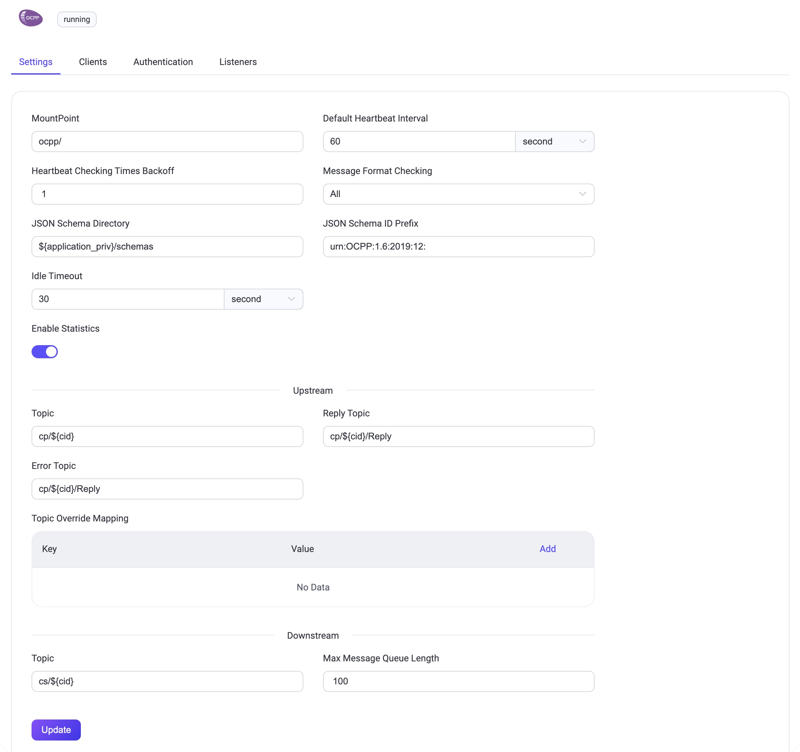

# OCPP Gateway

::: tip

EMQX Enterprise Edition feature. EMQX Enterprise Edition offers comprehensive coverage of critical business scenarios, richer data integration support, higher production-grade reliability, and 24/7 global technical support. Feel free to [try it for free](https://www.emqx.com/zh/try?product=enterprise).

:::

[OCPP](https://www.openchargealliance.org/) (Open Charge Point Protocol) is an open communication protocol that connects charging stations with central management systems, aiming to provide a unified communication standard for electric vehicle charging infrastructure. The OCPP gateway acts as a protocol translator, bridging the gap between OCPP and MQTT protocols, thus enabling clients that use these protocols to communicate with each other.

EMQX has added a protocol gateway for [OCPP 1.6-J](https://www.openchargealliance.org/protocols/ocpp-16/), capable of connecting to charging station equipment of various brands that comply with the OCPP specifications. It integrates with management systems (Central System) through rule engines, data integration, REST APIs, and other methods, helping users quickly build electric vehicle charging infrastructures.

This page introduces how to configure and use the OCPP gateway in EMQX.

## Enable OCPP Gateway

The OCPP gateway in EMQX can be configured and enabled through the Dashboard, HTTP API, and configuration file `emqx.conf`. This section takes the configuration via Dashboard as an example to illustrate the operating steps.

On EMQX Dashboard, click **Management** -> **Gateways** on the left navigation menu. On the **Gateways** page, all supported gateways are listed. Locate **OCPP** and click **Setup** in the **Actions** column. Then, you will be directed to the **Initialize OCPP** page.

::: tip

If you are running EMQX in a cluster, the settings you made through the Dashboard or HTTP API will affect the whole cluster. If you only want to change the settings with one node, configure with [`emqx.conf`](../configuration/configuration.md).

:::

To simplify the configuration process, EMQX offers default values for all required fields on the **Gateways** page. If you don't need extensive customization, you can enable the OCPP Gateway in just 3 clicks:

1. Click **Next** in the **Basic Configuration** tab to accept all the default settings.
2. Then you will be directed to the **Listeners** tab, where EMQX has pre-configured a Websocket listener on port `33033`. Click **Next** again to confirm the setting.
3. Then click the **Enable** button to activate the OCPP Gateway.

Upon completing the gateway activation process, you can return to the **Gateways** page and see that the OCPP Gateway now displays an **Enabled** status.


The above configuration can also be configured with HTTP API:

**Example Code:**

```bash
curl -X 'PUT' 'http://127.0.0.1:18083/api/v5/gateways/ocpp' \
  -u <your-application-key>:<your-security-key> \
  -H 'Content-Type: application/json' \
  -d '{
  "name": "ocpp",
  "enable": true,
  "mountpoint": "ocpp/",
  "listeners": [
    {
      "type": "ws",
      "name": "default",
      "bind": "33033",
      "websocket": {
        "path": "/ocpp"
      }
    }
  ]
}'
```

## Work with OCPP Clients

Once the OCPP gateway is operational, you can utilize OCPP client tools for connection testing and to verify that the setup functions correctly.

Take [ocpp-go](https://github.com/lorenzodonini/ocpp-go) as a practical example. This section demonstrates how to connect it to the OCPP Gateway in EMQX.

1. Begin by preparing an MQTT client to interface with the OCPP Gateway. For instance, using [MQTTX](https://mqttx.app/downloads), configure it to connect to EMQX and subscribe to the topic `ocpp/#`.

   

2. Execute the ocpp-go client and establish a connection with the OCPP Gateway.

   **Note**: Replace `<host>` in the command below with the address of your EMQX server.

   ```shell
   docker run -e CLIENT_ID=chargePointSim -e CENTRAL_SYSTEM_URL=ws://<host>:33033/ocpp -it --rm --name charge-point ldonini/ocpp1.6-charge-point:latest
   ```

   A successful connection will output logs similar to:

   ```css
   INFO[2023-12-01T03:08:39Z] connecting to server logger=websocket
   INFO[2023-12-01T03:08:39Z] connected to server as chargePointSim logger=websocket
   INFO[2023-12-01T03:08:39Z] connected to central system at ws://172.31.1.103:33033/ocpp
   INFO[2023-12-01T03:08:39Z] dispatched request 1200012677 to server logger=ocppj
   ```

3. Monitor MQTTX for an incoming message formatted as:

   ```json
   Topic: ocpp/cp/chargePointSim
   {
     "UniqueId": "1200012677",
     "Payload": {
       "chargePointVendor": "vendor1",
       "chargePointModel": "model1"
     },
     "Action": "BootNotification"
   }
   ```

   This message signifies that the ocpp-go client has connected to the OCPP Gateway and initiated a `BootNotification` request.


4. In MQTTX, compose a message to the topic `ocpp/cs/chargePointSim` with the following content and send it.

   **Note**: Ensure to replace `UniqueId` with the one received in the previous message.

   ```json
   {
     "MessageTypeId": 3,
     "UniqueId": "***",
     "Payload": {
       "currentTime": "2023-12-01T14:20:39+00:00",
       "interval": 300,
       "status": "Accepted"
     },
     "Action": "BootNotification"
   }
   ```

5. Subsequently, MQTTX will receive a `StatusNotification` status report. This indicates that the OCPP client has successfully established a connection with the OCPP Gateway.

   ```json
   Topic: ocpp/cp/chargePointSim
   Payload:
   {
     "UniqueId": "3062609974",
     "Payload": {
       "status": "Available",
       "errorCode": "NoError",
       "connectorId": 0
     },
     "MessageTypeId": 2,
     "Action": "StatusNotification"
   }
   ```

## Customize Your OCPP Gateway

In addition to the default settings, EMQX provides a variety of configuration options to better accommodate your specific business requirements. This section offers an in-depth overview of the various fields available on the **Gateways** page.

### Basic Configuration

In the **Basic Configuration** tab, you can configure the following fields:



- **MountPoint**: Set a string that is prefixed to all topics when publishing or subscribing, providing a way to implement message routing isolation between different protocols, for example, `ocpp/`.
- **Default Heartbeat Interval**: The default Heartbeat time interval, default: `60s`.
- **Heartbeat Checking Times Backoff**: The backoff for heartbeat checking times, default: `1`.
- **Message Format Checking**: Whether to enable message format legality checking. EMQX checks the message format of the upload stream and download stream against the format defined in json-schema. When the check fails, EMQX will reply with a corresponding answer message. The checking strategy can be one of the following values:

    - `all`: Check all messages.
    - `upstream_only`: Check upload stream messages only.
    - `dnstream_only`: Check download stream messages only.
    - `disable`: Do not check any messages.
- **JSON Schema Directory**: JSON Schema directory for OCPP message definitions, default: `${application}/priv/schemas`.
- **JSON Schema ID Prefix**: The ID prefix for the OCPP message schemas, default: `urn:OCPP:1.6:2019:12:`.
- **Idle Timeout**: Set the maximum amount of time in seconds that the gateway will wait for an OCPP frame before closing the connection due to inactivity.
- **Upstream**: The Upload stream configuration group.
    - **Topic**: The topic for Upload stream Call Request messages, default: `cp/${cid}`.
    - **Reply Topic**: The topic for Upload stream Reply messages, default: `cp/${cid}/Reply`.
    - **Error Topic**: The topic for Upload stream Error messages, default: `cp/${cid}/Reply`.
    - **Topic Override Mapping**: Upload stream topic override mapping by Message Name.
- **Downstream**: The Download stream configuration group.
    - **Topic**: Download stream topic to receive request/control messages from EMQX. This value is a wildcard topic name that is subscribed by every connected Charge Point. The default value is: `cs/${cid}`.
    - **Max Message Queue Length**: The maximum message queue length for download stream message delivery. The default value is: `100`.

### Add Listeners

One Websocket listener with the name of **default** is already configured on port `33033`, which allows a maximum of 16 acceptors in the pool, and support up to 1,024,000 concurrent connections. You can click **Settings** for more customized settings, click **Delete** to delete the listener, or click **+ Add Listener** to add a new listener.

::: tip

The OCPP gateway only supports Websocket and Websocket over TLS types of listeners.

:::

Click **Add Listener** to open **Add Listener** page, where you can continue with the following configuration fields:

**Basic settings**

- **Name**: Set a unique identifier for the listener.
- **Type**: Select the protocol type, for OCPP, this can be either `ws` or `wss`.
- **Bind**: Set the port number on which the listener accepts incoming connections.
- **MountPoint**: Set a string that is prefixed to all topics when publishing or subscribing, providing a way to implement message routing isolation between different protocols.

**Listener Settings**

- **Path**: Sets the path prefix for the connection address. The client must carry this entire address for the connection, default value `/ocpp`.
- **Acceptor**: Set the size of the acceptor pool, default `16`.
- **Max Connections**: Set the maximum number of concurrent connections that the listener can handle, default: `1024000`.
- **Max Connection Rate**: Set the maximum rate of new connections the listener can accept per second, default: `1000`.
- **Proxy Protocol**: Set to enable protocol V1/2 if EMQX is configured behind the [load balancer](../deploy/cluster/lb.md).
- **Proxy Protocol Timeout**: Set the maximum amount of time in seconds that the gateway will wait for the proxy protocol package before closing the connection due to inactivity, default: `3s`.

**TCP Settings**

- **ActiveN**: Set the `{active, N}` option for the socket, that is, the number of incoming packets the socket can actively process. For details, see [Erlang Documentation -  setopts/2](https://erlang.org/doc/man/inet.html#setopts-2).
- **Buffer**: Set the size of the buffer used to store incoming and outgoing packets, unit: KB.
- **TCP_NODELAY**: Set whether to enable the `TCP_NODELAY` flat for the connection, that is, whether the client needs to wait for the acknowledgment of the previous data before sending additional data; default: `false`, optional values: `true`, `false`.
- **SO_REUSEADDR**: Set whether to allow local reuse of port numbers.
- **Send Timeout**: Set the maximum amount of time in seconds that the gateway will wait for the proxy protocol package before closing the connection due to inactivity, default: `15s`.
- **Send Timeout Close**: Set whether to close the connection if the send timeout.

**SSL Settings **(for wss listeners only)

You can set whether to enable the TLS Verify by setting the toggle switch. But before that, you need to configure the related **TLS Cert**, **TLS Key**, and **CA Cert** information, either by entering the content of the file or uploading with the **Select File** button. For details, see [Enable SSL/TLS Connection](../network/emqx-mqtt-tls.md).

Then you can continue to set:

- **SSL Versions**: Set the SSL versions supported, default, `tlsv1.3`, `tlsv1.2`, `tlsv1.1`, and `tlsv1`.
- **Fail If No Peer Cert**: Set whether EMQX will reject the connection if the client sends an empty certificate, default: `false`, optional values: `true`, `false`.
- **Intermediate Certificate Depth**: Set the maximum number of non-self-issued intermediate certificates that can be included in a valid certification path following the peer certificate, default, `10`.
- **Key Password**: Set the user's password, used only when the private key is password-protected.

## Configure Authentication

As the concept of username and password is already defined in the connection message of the OCPP protocol, the OCPP supports a variety of authenticator types, such as:

- [Built-in Database Authentication](../access-control/authn/mnesia.md)
- [MySQL Authentication](../access-control/authn/mysql.md)
- [MongoDB Authentication](../access-control/authn/mongodb.md)
- [PostgreSQL Authentication](../access-control/authn/postgresql.md)
- [Redis Authentication](../access-control/authn/redis.md)
- [HTTP Server Authentication](../access-control/authn/http.md)
- [JWT Authentication](../access-control/authn/jwt.md)
- [LDAP Authentication](../access-control/authn/ldap.md)

OCPP gateway uses the information in the Basic Authentication of the Websocket handshake message to generate the authentication fields for the client:

- Client ID: Valu of the part of the connection address after the fixed path prefix.
- Username: Value of the Username in the Basic Authentication.
- Password: Value of the Password in the Basic Authentication.

You can also use HTTP API to create a built-in database authentication for a OCPP gateway:

**Example Code:**

```bash
curl -X 'POST' \
  'http://127.0.0.1:18083/api/v5/gateways/ocpp/authentication' \
  -u <your-application-key>:<your-security-key> \
  -H 'accept: application/json' \
  -H 'Content-Type: application/json' \
  -d '{
  "backend": "built_in_database",
  "mechanism": "password_based",
  "password_hash_algorithm": {
    "name": "sha256",
    "salt_position": "suffix"
  },
  "user_id_type": "username"
}'
```

::: tip

Unlike the MQTT protocol, **the gateway only supports the creation of an authenticator, not a list of authenticators (or an authentication chain)**.

When no authenticator is enabled, all OCPP clients are allowed to log in.

:::
