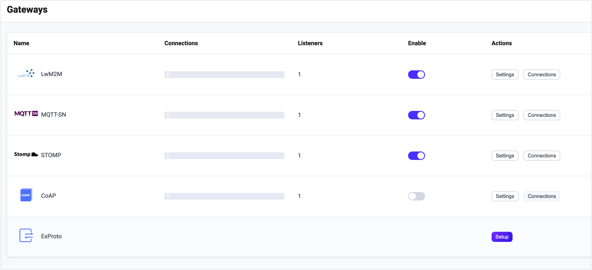

# STOMP Gateway

## Introduction

<!--**Add an introductory section**: Begin the page briefly introducing the relevant protocol and the Gateway. This will provide context for users who are new to the concept.-->

EMQX STOMP Gateway is a messaging protocol translator that bridges the gap between [STOMP](https://stomp.github.io/stomp-specification-1.2.html) and MQTT protocols, allowing clients using these protocols to communicate with each other.

This STOMP Gateway provides a lightweight and simple messaging solution for clients and servers, enabling message exchange in a variety of messaging environments. With its support for TCP and SSL type listeners, the STOMP gateway is a flexible and versatile tool for building messaging systems.

::: tip

The STOMP gateway is based on [Stomp v1.2](https://stomp.github.io/stomp-specification-1.2.html) and is compatible with STOMP v1.0 and v1.1 specifications.

:::

## Enable the STOMP Gateway

In EMQX 5.0, STOMP gateways can be configured and enabled through the Dashboard, HTTP API, and configuration file `emqx.conf`. This section takes the configuration via Dashboard as an example to illustrate the operating steps. 

On EMQX Dashboard, click **Extensions** -> **Gateways** on the left navigation menu. On the **Gateway** page, all supported gateways are listed. Locate **STOMP** and click **Setup** in the **Actions** column. Then, you will be directed to the **Initialize STOMP** page.

::: tip

If you are running EMQX in a cluster, the settings you made through the Dashboard or HTTP API will affect the whole cluster. If you only want to change the settings with one node, please configure with [`emqx.conf`](../configuration/configuration.md)

:::

To simplify the configuration process, EMQX offers default values for all required fields on the **Gateways** page. If you don't need extensive customization, you can enable the STOMP Gateway in just 3 clicks:

1. Click **Next** in the **Basic Configuration** tab to accept all the default settings. 
2. Then you will be directed to the **Listeners** tab, where EMQX has pre-configured a UDP listener on port `61613`. Click **Next** again to confirm the setting.
3. Then click the **Enable** button to activate the STOMP Gateway.

Upon completing the gateway activation process, you can return to the **Gateways** page and observe that the STOMP Gateway now displays an **Enabled** status.



In EMQX 5.0, Stomp gateways can be configured and enabled through the Dashboard.

The above configuration can also be configured with HTTP API:

**Example Code:**

```bash
curl -X 'PUT' 'http://127.0.0.1:18083/api/v5/gateway/stomp' \
  -u <your-application-key>:<your-security-key> \
  -H 'Content-Type: application/json' \
  -d '{
  "name": "stomp",
  "enable": true,
  "mountpoint": "stomp/",
  "listeners": [
    {
      "type": "tcp",
      "name": "default",
      "bind": "61613",
      "max_conn_rate": 1000,
      "max_connections": 1024000
    }
  ]
}'
```

## Work with STOMP Clients

### Client Libraries

After establishing the STOMP gateway, you can use the STOMP client tools to test the connections and ensure everything works as expected. Below are some of the recommended STOMP client tools. 

- [erlang-stomp-client](https://github.com/KodiEhf/erlang-stomp-client)
- [stomp.py](https://github.com/jasonrbriggs/stomp.py)

### Publish/Subscribe

The STOMP protocol is fully compatible with the PUB/SUB messaging model, and the STOMP gateway uses:

- the `SEND` message of the STOMP protocol for message publishing. The `destination` field in the `SEND` message specifies the topic, while the message content is contained in the body of the `SEND` message. The quality of service (QoS) is fixed at 0.
- the `SUBSCRIBE` message of the STOMP protocol for subscribing requests. The `destination` field in the `SUBSCRIBE` message specifies the topic. The QoS is fixed at 0 and the wildcards defined in the MQTT protocol are supported.
- the `UNSUBSCRIBE` message of the STOMP protocol for unsubscribing requests.  The `destination` field in the `SUBSCRIBE` message specifies the topic. 

## Customize Your STOMP Gateway

In addition to the default settings, EMQX provides a variety of configuration options to better accommodate your specific business requirements. This section offers an in-depth overview of the various fields available on the **Gateways** page.

### Basic Configuration

In the **Basic Configuration** tab, you can set the maximum header allowed, the header length allowed, and whether to enable statistics or set the MountPoint string for this gateway. See the texts below the screenshot for a comprehensive explanation of each field. 

<!--with a screenshot to be added later-->

1. **Max Header**: Set the maximum allowed number of STOMP Header, default: **10**. 

2. **Max Each Header Length**: Set the maximum allowed string length of the Header value, default: **1024**. 

3. **Max Body Length**: Set the maximum allowed bytes of the STOMP packet, default: **65536**. 

4. **Idle Timeout**: Set the maximum amount of time in seconds that the gateway will wait for a STOMP frame before closing the connection due to inactivity.

5. **Enable Statistics**: Set whether to allow the Gateway to collect and report statistics; default: **true**, optional values: **true**, **false**.

6. **MountPoint**: Set a string that is prefixed to all topics when publishing or subscribing, providing a way to implement message routing isolation between different listeners, for example, *stomp*.

   **Note**: The prefixed string will be removed from the topic name when the message is delivered to the subscriber. 

### Add Listeners 

One tcp listener with the name of **default** is already configured on port `61613`, which allows a maximum of 16  acceptors in the pool, and support up to 1,024,000 concurrent connections. You can click **Settings** for more customized settings for **Delete** to delete the listener. Or click **Add Listener** to add a new listener.

::: tip

The Stomp gateway only supports TCP and SSL types of listeners.

:::

Click **Add Listener** to open **Add Listener** page, where you can continue with the following configuration fields:

**Basic settings**

- **Name**: Set a unique identifier for the listener.
- **Type**: Select the protocol type, for STOMP, this can be either **tcp** or **ssl**.
- **Bind**: Set the port number on which the listener accepts incoming connections.
- **MountPoint** (optional): Set a string that is prefixed to all topics when publishing or subscribing, providing a way to implement message routing isolation between different listeners.

**Listener Settings** 

- **Acceptor**: Set the size of the acceptor pool, default **16**. 
- **Max Connections**: Set the maximum number of concurrent connections that the listener can handle, default: **1024000**.
- **Max Connection Rate**: Set the maximum rate of new connections the listener can accept per second, default: **1000**.
- **Proxy Protocol**: Set to enable protocol V1/2 if EMQX is configured behind the [load balancer](../deploy/cluster/lb.md).
- **Proxy Protocol Timeout**: Set the maximum amount of time in seconds that the gateway will wait for the proxy protocol package before closing the connection due to inactivity, default: **3s**.

**TCP Settings** 

- **ActiveN**: Set the `{active, N}` option for the socket, that is, the number of incoming packets the socket can actively process. For details, see [Erlang Documentation -  setopts/2](https://erlang.org/doc/man/inet.html#setopts-2).
- **Buffer**: Set the size of the buffer used to store incoming and outgoing packets, unit: KB.
- **TCP_NODELAY**: Set whether to enable the `TCP_NODELAY` flat for the connection, that is, whether the client needs to wait for the acknowledgment of the previous data before sending additional data; default: **false**, optional values: **true**, **false**. 
- **SO_REUSEADDR**: Set whether to allow local reuse of port numbers. <!--not quite sure what this means-->
- **Send Timeout**: Set the maximum amount of time in seconds that the gateway will wait for the proxy protocol package before closing the connection due to inactivity, default: **15s**.
- **Send Timeout**: Set whether to close the connection if the send timeout. 

**SSL Settings **(for SSL listeners only)

You can set whether to enable the TLS Verify by setting the toggle switch. But before that, you need to configure the related **TLS Cert**, **TLS Key**, and **CA Cert** information, either by entering the content of the file or uploading with the **Select File** button. For details, see [Enable SSL/TLS Connection](../network/emqx-mqtt-tls.md).

Then you can continue to set:

- **SSL Versions**: Set the SSL versions supported, default, **tlsv1.3** **tlsv1.2**, **tlsv1.1**, and **tlsv1**. 
- **Fail If No Peer Cert**: Set whether EMQX will reject the connection if the client sends an empty certificate, default: **false**, optional values: **true**, **false**. 
- **Intermediate Certificate Depth**: Set the maximum number of non-self-issued intermediate certificates that can be included in a valid certification path following the peer certificate, default, **10**.
- **Key Password**: Set the user's password, used only when the private key is password-protected. 

## Configure Authentication

As the concept of username and password is already defined in the connection message of the Stomp protocol, the STOMP supports a variety of authenticator types, such as:

- [Built-in Database Authentication](../access-control/authn/mnesia.md)
- [MySQL Authentication](../access-control/authn/mysql.md)
- [MongoDB Authentication](../access-control/authn/mongodb.md)
- [PostgreSQL Authentication](../access-control/authn/postgresql.md)
- [Redis Authentication](../access-control/authn/redis.md)
- [HTTP Server Authentication](../access-control/authn/http.md)
- [JWT Authentication](../access-control/authn/jwt.md)

Stomp gateway uses the information in the `CONNECT` or `STOMP` message of the STOMP protocol to generate the authentication fields for the client:

- Client ID: Randomly generated string
- Username: Value of the `login` field in the `CONNECT` or `STOMP` message headers
- Password: Value of the `passcode` field in the `CONNECT` or `STOMP` message headers.

You can also use HTTP API to create a built-in database authentication for a Stomp gateway:

**Example Code:**

```bash
curl -X 'POST' \
  'http://127.0.0.1:18083/api/v5/gateway/stomp/authentication' \
  -u <your-application-key>:<your-security-key> \
  -H 'accept: application/json' \
  -H 'Content-Type: application/json' \
  -d '{
  "backend": "built_in_database",
  "mechanism": "password_based",
  "password_hash_algorithm": {
    "name": "sha256",
    "salt_position": "suffix"
  },
  "user_id_type": "username"
}'
```

::: tip

Unlike the MQTT protocol, **the gateway only supports the creation of an authenticator, not a list of authenticators (or an authentication chain)**. 

When no authenticator is enabled, all STOMP clients are allowed to log in.

:::
