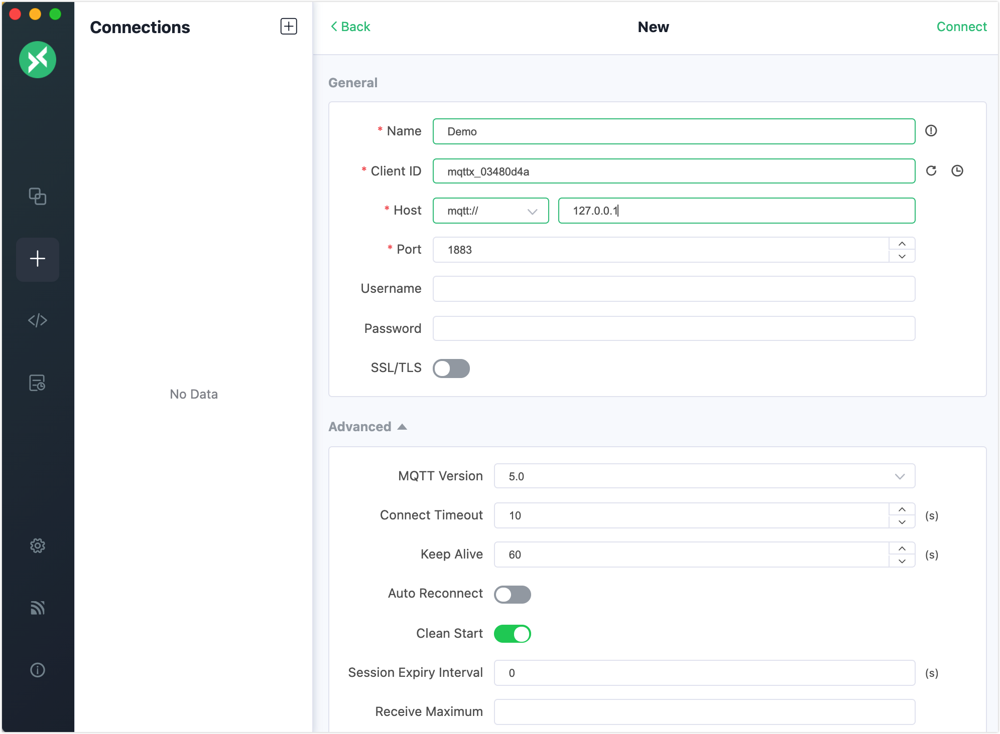
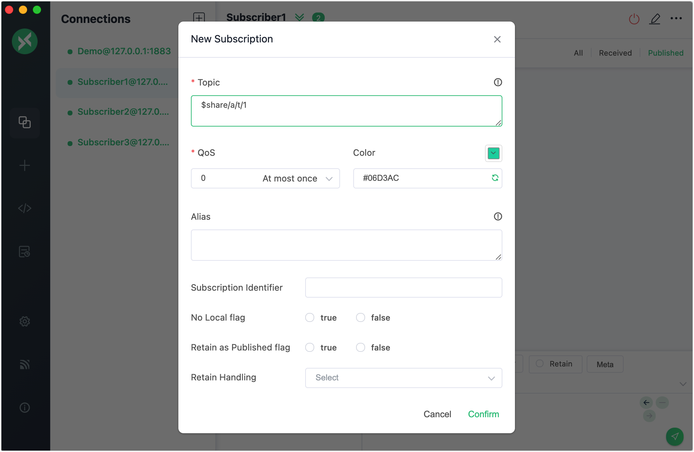

# MQTT Shared Subscription

EMQX implements the shared subscription feature of MQTT. A shared subscription is a subscription mode to implement load balancing among multiple subscribers. Clients can be divided into multiple subscription groups, and messages are still forwarded to all subscription groups, but only one client within each subscription group receives the message at a time. You can add a prefix to the original topic to enable a shared subscription for multiple subscribers. EMQX supports shared subscription prefixes in two formats: shared subscription for groups (prefixed with `$share/<group-name>/`) and shared subscription not for groups (prefixed with `$queue/`).

Examples of two shared subscription prefixes formats are as follows.

| Prefixes format                  | Example        | Prefix      | Real topic name |
| --------------------------------- | -------------- | ----------- | --------------- |
| Shared subscription for groups    | $share/abc/t/1 | $share/abc/ |t/1|
| Shared subscription not for group | $queue/t/1     | $queue/     |t/1|

You can use client tools to connect to EMQX and try this messaging service. This section introduces how shared subscription works and provides a demonstration of how to use the [MQTTX Desktop](https://mqttx.app/) and [MQTTX CLI](https://mqttx.app/cli) to simulate clients and try the shared subscription feature.

## Shared Subscription for Groups

You can enable a shared subscription for groups of subscribers by adding the prefixed `$share/<group-name>` to the original topic. The group name can be any string. EMQX forwards messages to different groups at the same time, and subscribers belonging to the same group receive messages with load balancing.

For example, if subscribers `s1`, `s2`, and `s3` are members of group `g1`, subscribers `s4` and `s5` are members of group `g2`, and all subscribers subscribe to the original topic `t1`. The shared subscription topics must be `$share/g1/t1` and `$share/g2/t1`. When EMQX publishes a message `msg1` to the original topic `t1`:

- EMQX sends `msg1` to both groups `g1` and `g2`.
- Only one of `s1`, `s2`, `s3` will receive `msg1`.
- Only one of `s4` and `s5` will receive `msg1`.


## Shared Subscription Not for Groups

Shared subscription topics prefixed with `$queue/` are for subscribers not in groups. It is a special case of a shared subscription topic with a `$share` prefix. You can understand it as all subscribers in a subscription group such as `$share/$queue`.


## Shared Subscription and Session

When a client has a persistent session and subscribes to shared subscriptions, the session continues to receive messages published to the shared subscription topics while the client disconnects. If the client stays disconnected for a long time and the message publishing rate is high, the internal message queue in the session state may overflow. To avoid this problem, it is recommended to use a clean session ( `clean_session=true` ) for shared subscriptions. A clean session expires immediately after the client disconnects.

When clients use MQTT v5, it is a good practice to set a short session expiry interval (if not 0). This allows the client to temporarily disconnect and reconnect to receive messages published during the disconnection period. When a session expires, the QoS1 and QoS2 messages in the send queue or the QoS1 messages in the infight queue will be re-dispatched to other sessions in the same group. When the last session expires, all pending messages will be discarded.

For more information on the persistent session, see [MQTT Persistent Session and Clean Session Explained](https://www.emqx.com/en/blog/mqtt-session).

## Configure Shared Subscription Strategy

EMQX allows fine-grained control over how messages are distributed to subscribers within a shared subscription group. This behavior is defined by the Shared Subscription Strategy, which determines the algorithm used to select the subscriber that receives each message. By tuning this strategy, you can optimize message flow for different workloads, client deployment patterns, and cluster topologies.

### Shared Subscription Dispatch Strategy

The Shared Subscription Dispatch Strategy determines how EMQX distributes messages among subscribers within a shared subscription group.

You can configure this using the `mqtt.shared_subscription_strategy` option.

| Strategy                    | Description                                                  |
| --------------------------- | ------------------------------------------------------------ |
| **`random`**                | Randomly selects one subscriber in the group for each message. This provides even distribution overall but may not be deterministic. |
| **`round_robin`** (default) | Messages are delivered to subscribers in turn within each shared subscription group. EMQX maintains a separate round-robin position for each publishing client, so messages from different publishers may still be delivered to the same subscriber consecutively. |
| **`round_robin_per_group`** | Similar to `round_robin`, but the round-robin progress is tracked independently on each node. This means messages published from different nodes in a cluster may be delivered to the same subscriber. Useful for clustered deployments where each node handles separate publisher loads. |
| **`sticky`**                | Continuously dispatches messages to the same subscriber until the subscriber disconnects or its session ends. This strategy helps avoid unnecessary re-processing or cross-client state sharing by keeping message flows on a single subscriber whenever possible.<br />The initial subscriber is determined by the `mqtt.shared_subscription_initial_sticky_pick` setting. |
| **`local`**                 | Prefers delivering messages to subscribers connected to the same node where the message is processed. If no local subscribers exist, EMQX randomly selects a subscriber from the cluster. This reduces inter-node traffic and latency. |
| **`hash_clientid`**         | Uses a hash of the publisher’s Client ID to consistently route all messages from that publisher to the same subscriber. This strategy provides deterministic routing for per-client data streams. |
| **`hash_topic`**            | Uses a hash of the publishing topic to route all messages with the same topic name to the same subscriber. Useful for topic-based message sharding and stateful processing. |

> EMQX tracks dispatch state, such as round-robin positions or sticky subscriber assignments, per publisher connection. When a publishing client disconnects and reconnects, this state is reset and reinitialized.

### Initial Sticky Pick

When the shared subscription strategy is set to `sticky`, EMQX determines the initial subscriber to receive the messages based on `mqtt.shared_subscription_initial_sticky_pick`.

This setting controls whether EMQX prefers local subscribers, uses hashing for deterministic routing, or selects randomly.

### Configure Dispatch Strategy via Dashboard

You can configure these options in the EMQX Dashboard:

1. Navigate to **Management** -> **MQTT Settings** -> **General**.
2. Ensure **Allowed Shared Subscription** is enabled.
3. Select the desired **Shared Subscription Strategy** from the dropdown list. The default option is `round_robin`.
4. If the selected strategy is `sticky`, choose an appropriate **Shared Subscription Initial Sticky Pick** method. The default option is `random`.
5. Click **Save Changes**.

These settings take effect immediately and allow EMQX to adjust its message dispatching logic without requiring client-side configuration changes.

## Try Shared Subscription with MQTTX Desktop

:::tip Prerequisites

- Knowledge about MQTT [Shared Subscription](./mqtt-concepts.md#shared-subscription)
- Basic publishing and subscribing operations using [MQTTX](./publish-and-subscribe.md)

:::

The following procedure demonstrates how to add a `$share` prefix to the original topic so that subscribers in different groups can share the subscription to the same topic and receive the messages from the shared subscription.

In this demonstration, you can create one client connection `demo` as a publisher to publish messages to the topic `t/1`. Then, you can create 4 client connections as subscribers, such as `Subscriber1`, `Subscriber2`, `Subscriber3`, and `Subscriber4`.  The subscribers can be divided into groups `a` and `b`, and both groups subscribe to the topic `t/1`.

1. Start EMQX and MQTTX Desktop. Click the **New Connection** to create a client connection as a publisher.

   - Enter `Demo` in the **Name** field.
   - Enter the localhost `127.0.0.1` in **Host** to use as an example in this demonstration.
   - Leave other settings as default and click **Connect**.

   ::: tip

   More detailed instructions on creating an MQTT connection are introduced in [MQTTX Desktop](./publish-and-subscribe.md#mqttx-desktop).

   :::

   

2. Click the **New Connection** to create 4 new connections as subscribers. Set **Name** set to `Subscriber1`, `Subscriber2,` `Subscriber3`, and `Subscriber4` respectively.

3. Select the `Subscriber` connections one at a time in the **Connections** pane and click **New Subscription** to create a shared subscription for each subscriber. Enter the correct topic in the **Topic** text box by referring to the rules below.

   To form a group for multiple subscribers, you need to add group name `{group}` before the subscribed topic `t/1`. To make them all subscribe to the same topic, you need to add the prefix `$share` before the group name.

   In the **New Subscription** window:

   - Set the **Topic** to `$share/a/t/1` for `Subscribe1` and `Subscriber2`.
   - Set the **Topic** to `$share/b/t/1` for `Subscriber3` and `Subscriber4`.

   In these example topics:

   - The prefix `$share` indicates this is a shared subscription.
   - `{group}` is `a` and `b`, but it can be any customized name.
   - `t/1` indicates the original topic name.

   Leave other settings as default. Click the **Confirm** button.

   

5. Click the connection `Demo` you created before.

   - Send a message with the topic `t/1`. The client `Subscriber1` in group `a` and `Subscriber4` in gourd `b` should receive the message.

     

   - Send the same message again. The client `Subscriber2` in group `a` and `Subscriber3` in group `b` should receive the message.

     

:::tip

When the message of the shared subscription is published, the EMQX forwards the message to different groups at the same time, but only one of the subscribers in the same group receives the message at a time.

:::

## Try Shared Subscription with MQTTX CLI

1. Four subscribers are divided into 2 groups and subscribe to topic  `t/1`:

   ```bash
   # Client A and B subscribe to topic `$share/my_group1/t/1`
   mqttx sub -t '$share/my_group1/t/1' -h 'localhost' -p 1883

   ## Client C and D subscribe to topic  `$share/my_group2/t/1`
   mqttx sub -t '$share/my_group2/t/1' -h 'localhost' -p 1883
   ```

2. Use a new client to publish 4 messages with payloads `1`, `2`, `3`, and `4` to the original topic `t/1`:

   ```bash
   mqttx pub -t 't/1' -m '1' -h 'localhost' -p 1883
   mqttx pub -t 't/1' -m '2' -h 'localhost' -p 1883
   mqttx pub -t 't/1' -m '3' -h 'localhost' -p 1883
   mqttx pub -t 't/1' -m '4' -h 'localhost' -p 1883
   ```

3. Check the message received by the clients within each subscription group:

   - Subscription group 1 (A and B) and subscription group 2 (C and D) simultaneously receive the messages.
   - Only one of the subscribers in the same group receives the message at a time.
