# Dashboard

## Introduction

EMQX Dashboard is a web application provided by EMQX. You can view the
running status of nodes and cluster, metrics, online status and
subscriptions of clients through the Dashboard. You can also configure
the plug-in on the Dashboard, stop and start the specified plug-in,
manage the HTTP API key and most configurations of the EMQX cluster.

## Quick Start

If EMQX is installed on this machine, use your browser to open the
address <http://127.0.0.1:18083>. To log in, enter the default user name
`admin` and the default password `public` to log in to Dashboard. If you
forget to account information, click the **Forgot Password** button on
the login page and follow the instructions or use management commands to
reset or create a new account.

The Dashboard interface is shown in the following figure. It contains
the left navigation bar, top control bar, and content area. The top
control bar (red frame area) has three functions:

  - Alarm: EMQX alarm info. The number of alarms triggered by excessive
    resource usage and EMQX internal errors is displayed. Click to view
    the alarm list.
  - User: the currently logged in Dashboard user, which can be used to
    log out and change passwords;
  - I18n: Dashboard displays Chinese / English by default according to
    the user's browser language. Click to switch
languages.

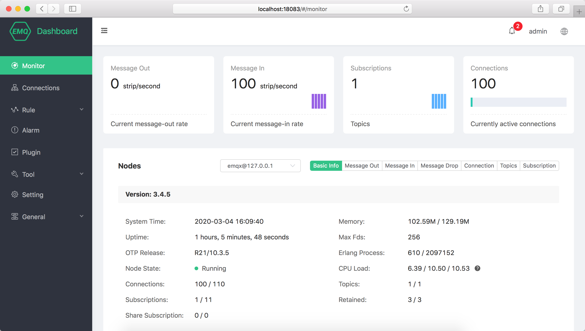

## Monitor

On the monitoring page, you can view the running status of the current
cluster. The functional area from top to bottom of the interface is as
follows:

### Running Status

There are four cards at the top of the page, which includes the
message-out rate of the cluster, the message-in rate, the number of
subscriptions, and the current number of connections.

### Node

Click the node drop-down list to switch to view the basic information of
the node, including EMQX version, runtime, resource occupation,
connection, and subscription data. Some data is defined as follows:

  - Memory: The current memory/maximum memory used by the Erlang VM,
    **where the maximum memory is automatically applied to the system by
    EMQX depending on the resource usage**.
  - Max Fds: Allow the current session/process to open the number of
    file handles. If this value is too small, it will limit the EMQX
    concurrency performance. When it is far less than the maximum number
    of connections authorized by the license, please refer to the tuning
    or contact the EMQ technical staff to modify;
  - Erlang Process、Connections、Topics、Subscriptions、Retained、Share
    Subscription: It is divided into two groups by `/` which are the
    current value and the maximum
value.

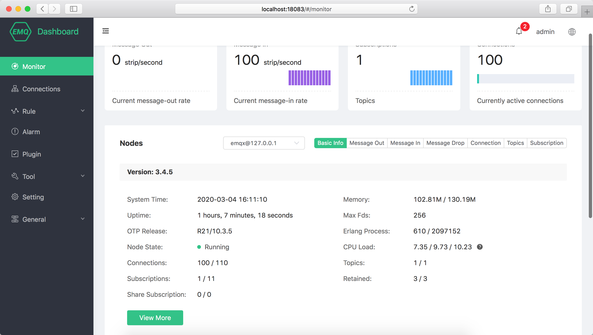

### Recent status

Click the button group on the right side of the node data area to switch
to the recent cluster data graph. The graph values are the actual values
during the sampling
period:

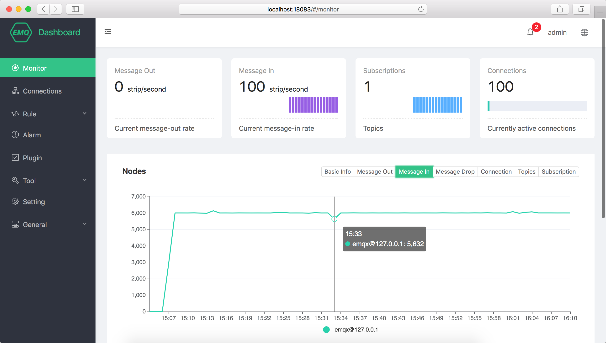

### Nde details

Click the **View More** button below the node data to open the node
details page, view the **basic information** of the current node, the
**listener** and connection status, and **metrics**.

#### Listener

The listener is the list of the current EMQX listening network ports.
The field information is as follows:

  - Protocol: listening network/application protocols, including
    protocol and function info:
      - mqtt:ssl: MQTT TCP TLS protocols, the default is 102400
      - mqtt:tcp: MQTT TCP protocols, the default is 102400
      - <http:dashboard>: HTTP protocol used by Dashboard, the default
        is 512
      - <http:management>: HTTP protocol used by EMQX REST API, the
        default is 512
      - mqtt:ws :MQTT over WebSocket, the default is 102400
      - mqtt:wss: MQTT over WebSocket TLS, the default is 102400
  - Address: Listen to the bound network address and port. Listen to all
    IP addresses by default;
  - Acceptors: listening the processor thread pool;
  - Connect: It contains a set of current/maximum values. The current
    value is the actual number of established connections. The maximum
    value is the maximum number of connections configured in the
    configuration file. **If any listener exceeds the maximum value, a
    new connection cannot be established.**

#### About the maximum number of connections

The actual maximum connection depends on the license and configuration:

1.  The number of connections per listening protocol in the node cannot
    exceed the maximum number of connections in the configuration file;
2.  The total number of MQTT/MQTT over WebSocket protocol connections in
    the cluster cannot exceed the upper limit of the license.

Of course, system tuning and hardware will also affect the maximum
number of connections. Please refer to tuning or contact EMQ technicians
for
confirmation.

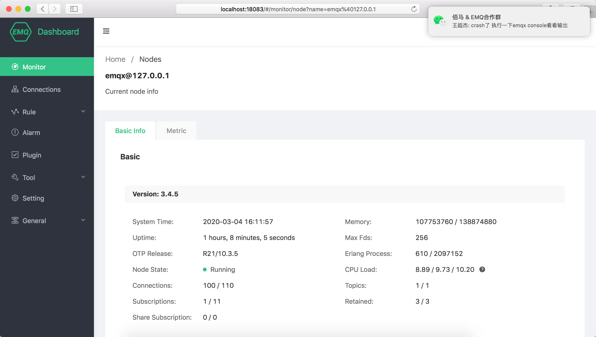

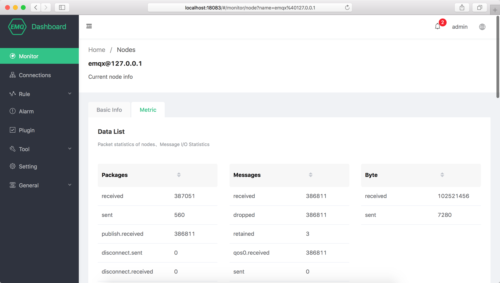

### License

You can view the license information of the cluster by monitoring the
license card at the bottom of the page:

  - Customer: Name of the company or department of the same business
    contract customer.
  - License usage: License specification and current usage.
  - Issuance of email: Same email address as a business contract
    customer.
  - License Edition: License edition, trial or official.

EMQ will issue a mailbox through email notification before the
certificate expires. Please pay attention to receiving information so as
not to miss the renewal time, which will affect the
business.

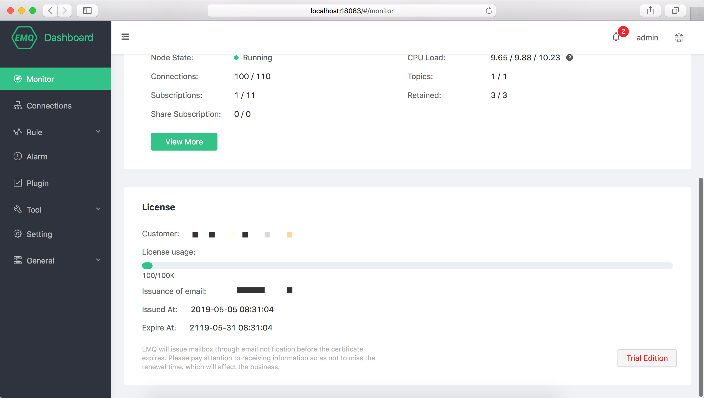

## Connections

### Current Connections

The client list page displays a list of currently connected
clients.Several important information in the list is as follows:

  - Client ID、Username: MQTT client ID and MQTT username, respectively.
    Click the **Client ID** to view the client details and subscription
    info.
  - IP Address: The client address + port.
  - Disconnect/Clean Session: For an online client, the connection will
    be disconnected and the session will be cleared. If the client is
    not online, clicking Clear Session will clear the session such as
    the client's subscription
relationship.

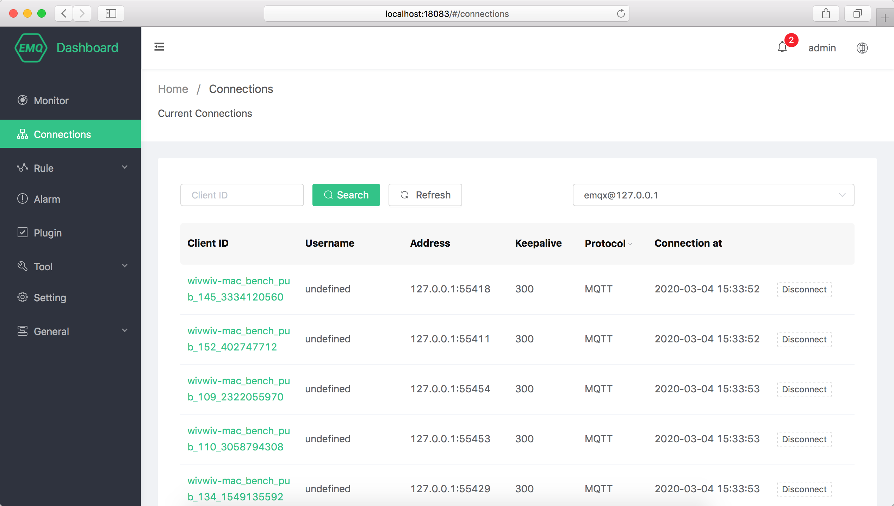

### Basic Info

Click the **Client ID** to view the client details and subscription
list. The basic information includes the selected client connection info
and session info and includes key business information such as message
traffic and message
statistics.


### Subscription

The subscription contains information about the topics to which the
selected client has subscribed:

  - Unsubscribe: Clicking the Unsubscribe button will delete the
    subscription relationship between the device and the topic. This
    operation is insensitive to the device.
  - Add: Specify a topic for the selected client proxy
subscription.

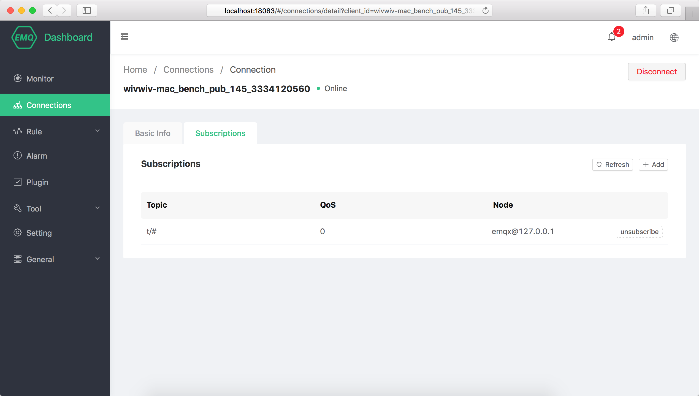

## Rule

### Rule Engine

Use SQL to set rules to filter, encode, decode, and modify message data,
and seamlessly forward processed data to data destinations such as
databases, stream processing, and API gateways.

The Rule Engine not only provides a clear and flexible configurable
business integration solution, but also simplifies the business
development process, improves user usability, and reduces the degree of
coupling between business systems and EMQX. Excellent infrastructure.

  - ID: Unique ID within the cluster, which can be used in CLI and REST
    API.
  - Topic: The MQTT topic or EMQX event topic that the Rule matches.
  - Monitor: Click to display the execution statistics of the selected
    Rule, including the number of rule hits and executions, and the
    number of success/failed actions
triggered.

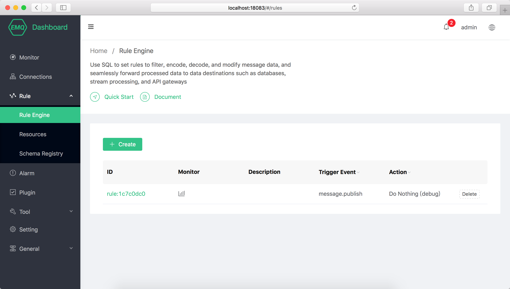

### Create Rule

EMQX will trigger the Rule Engine when the message is published and the
event is triggered, and the rules meeting the triggering conditions will
execute their respective SQL statements to filter and process the
context information of the message and event.

With the Actions, the Rule Engine can store the message processing
results of a specified topic to the database, send them to the HTTP
Server, forward them to the Kafka or RabbitMQ, and republish them to a
new topic or another broker cluster like Azure IoT Hub. Each rule can
allocate multiple Actions.

1.  Select the messages published to t/\# and select all fields:

<!-- end list -->

``` sourceCode sql
SELECT * FROM "message.publish" WHERE topic =~ 't/#'
```

2.  Select the message published to the t/a topic, and select the "x"
    field from the message payload in JSON format:

<!-- end list -->

``` sourceCode sql
SELECT payload.x as x FROM "message.publish" WHERE topic =~ 't/a'
```

The Rule Engine uses the **Events** to process the built-in events of
EMQX. the built-in events provide more sophisticated message control
and client action processing capabilities, which can be used in the
message arrival records of QoS 1 and QoS 2, the device up and down line
records and other businesses.

1.  Select the client connected event, filter the device with Username
    'emqx' and select the connection
information:

<!-- end list -->

``` sourceCode sql
SELECT clientid, connected_at FROM "client.connected" WHERE username = 'emqx'
```

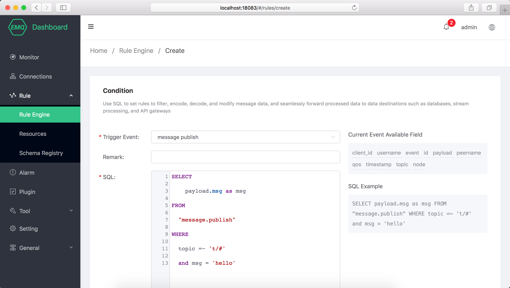

## Resource

The resource instances (such as database instance and Web Server )
required by the Rule Engine action. Before creating a rule, you need to
create the resources required for the relevant action and ensure that
the resources are available.

### Resource list

  - ID: Unique ID within the cluster, which can be used in CLI and REST
    API.
  - Status: After the resource is created, each node in the cluster will
    establish a connection with the resource, click to expand the
    resource status on the node.
  - Delete: The resources being used by the Rule Engine cannot be
    deleted. Please delete the rules that depend on the selected
    resource before
deleting.

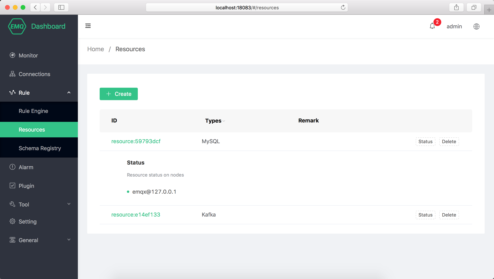

### Create Resource

Click the **Create** to open the resource creation dialog. Select the
resource type and enter the corresponding connection information to
create the resource. Click **Test** to check the resource connectivity
before
creation.

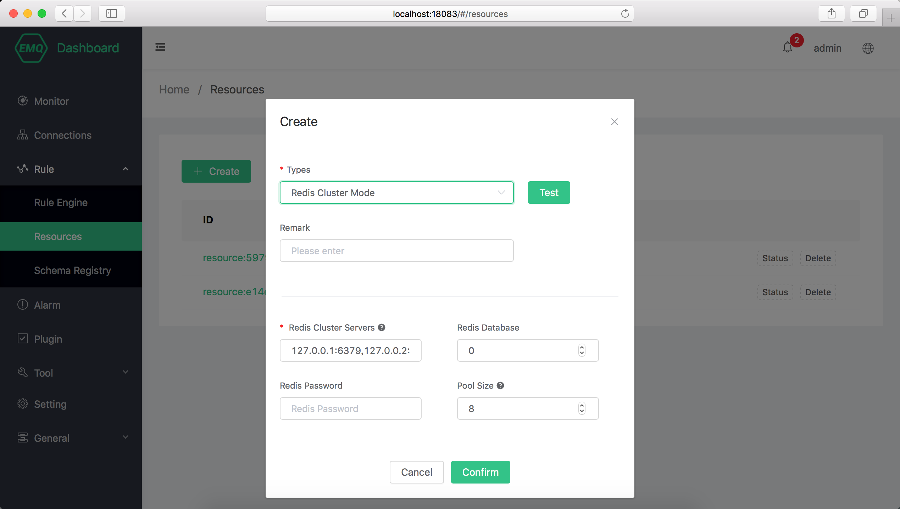

## Schema Registry

Schema Registry supports Protobuf, Avro, and private message encoding
parsing and processing, and can implement complex operations like
message encryption, message compression, and binary-JSON message
conversion.

## Alarm

The alarm shows the basic alarm information of EMQX, including current
alarm and historical alarm. More advanced alarm, log and monitoring
management is provided by EMQX Control Center, please contact EMQ
technicians if
necessary.

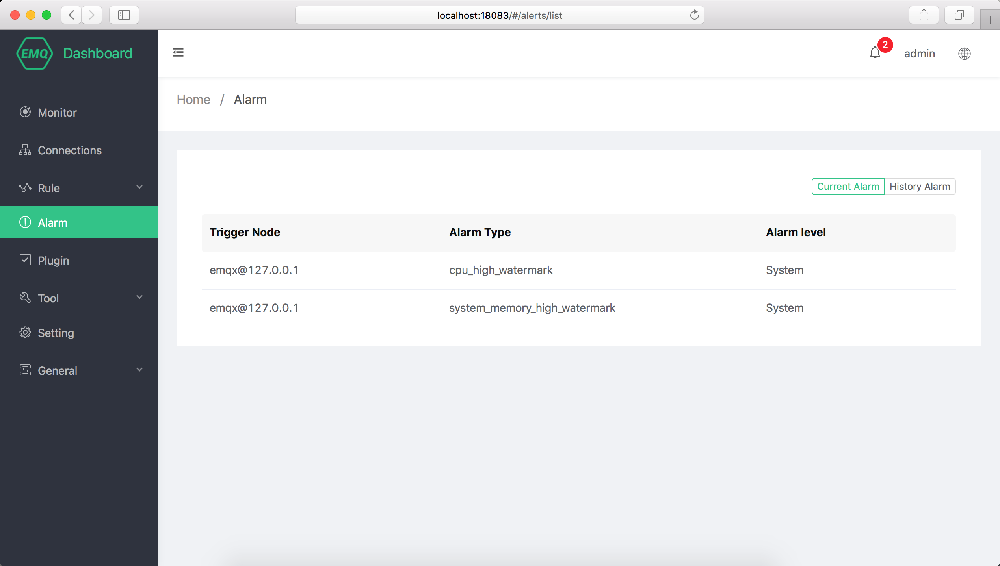

## Plugin

View the list of EMQX built-in plugins.

Unlike the command line plugin management, the plugin starts and stop
operations on the Dashboard are synchronized to the cluster. If the
plugin fails to start, check whether the configuration of each node in
the cluster is correct. If any node fails to start, the plugin cannot be
successfully
started.

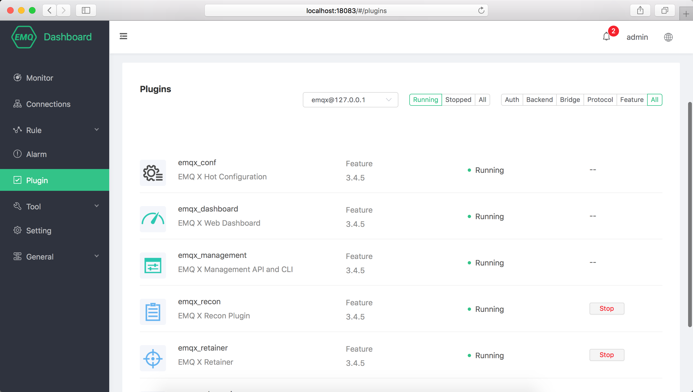

## Tool

It provides MQTT over WebScoket client test tool, which can realize the
publish and subscribe test of multiple mqtt connections at the same
time.

## Setting

Provides parameter configuration for the EMQX cluster and supports hot
configuration. You can join and leave the cluster on the Dashboard.

### Basic

Some basic configuration items that can be hot updated in`emqx.conf` are
opened in the settings. You can complete most configuration items such
as whether to enable anonymous authentication, ACL cache events, and ACL
cache switches without restarting EMQX.

The basic settings are organized in zones. By default, the external zone
is associated with the listener on port
1883.

<!--  -->

### Cluster

The cluster setting cannot change the cluster mode, but it can be used
for manual cluster invitation nodes to join the cluster, and change the
cluster parameter parameters such as static cluster and DNS cluster.

## General

### Application

In order to invoke the certificate of REST API, the application can
query and adjust EMQX cluster information through REST API, and manage
and operate the equipment.

After the application is created successfully, click the Application ID
in the **AppID** column of the application list to view the AppID and
Secret. You can edit the application status and expiration time, and
create or delete an application.

### Users

Dashboard user account management, you can create, edit, delete users,
if you forget the user password, you can reset the password through CLI.
