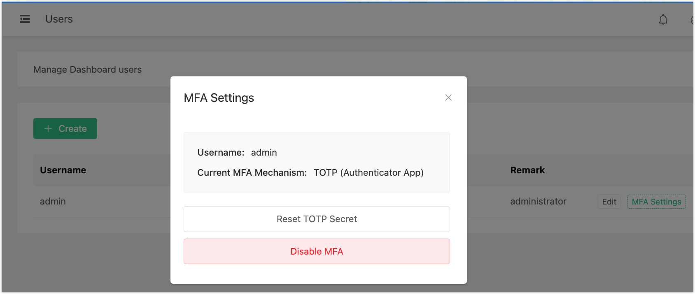
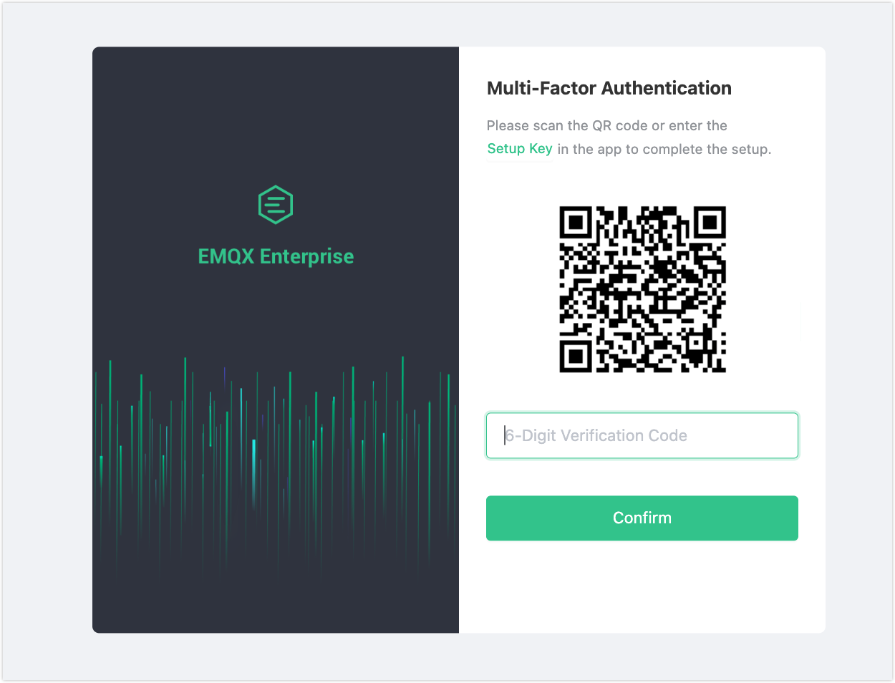

# Dashboard Multi-Factor Authentication

Multi-Factor Authentication (MFA) adds a second layer of security to Dashboard login. After entering a username and password, users must provide a time-based one-time password (TOTP) generated by an authenticator app. This protects the Dashboard even if account credentials are compromised.

MFA is compatible with any TOTP-compliant authenticator app, including:

- Google Authenticator
- Microsoft Authenticator
- Authy

The issuer name displayed in the authenticator app is **EMQX**.

Admins can enable MFA per user, or enforce it for all SAML SSO users via the `force_mfa` parameter in the SAML module. For user account creation and management, see [Dashboard Users and Role Management](./dashboard-users.md).

This page covers MFA setup and usage from both the admin and user perspectives.

## Key Concepts

- **MFA**: A security feature that requires two forms of verification: the user's password and a second factor, such as a TOTP generated by an authenticator app.
- **TOTP**: A temporary verification code generated by an authenticator app (such as Google Authenticator), based on a shared secret between the app and the server.
- **QR Code**: A graphical representation of the shared secret, which can be scanned by an authenticator app to simplify the setup process.

## How MFA Works

MFA in EMQX Dashboard follows a state machine. Each user's MFA status transitions through the following states:

```
No MFA
  │
  ▼ (admin enables, or force_mfa applies)
Setup Required
  │
  ▼ (user scans QR code)
Setup In Progress
  │
  ▼ (user verifies TOTP code)
Enabled
  │
  ▼ (admin disables)
Disabled
```

When MFA is in the **Enabled** state for a user, the login flow requires three pieces of information: username, password, and the current TOTP code. The server issues a short-lived **MFA state token** (a JWT with a 5-minute TTL) after the password step succeeds. This token is used to authenticate the subsequent MFA verification request.

:::tip

MFA state tokens expire after 5 minutes. If the user does not complete the MFA step within that window, they must restart the login process.

:::

## Enable and Configure MFA

MFA is disabled by default. Only users with the `administrator` role can enable or disable MFA for other users.

### Enable MFA via the Dashboard

1. In the Dashboard, click **General** -> **Users** in the left navigation menu.
2. On the **Users** page, click **MFA Settings** next to the user you want to enable MFA for.
3. In the **MFA Settings** dialog, click **Enable MFA**.

After enabling, the user will be prompted to complete MFA setup on their next login.

:::tip

If you enable MFA for your own account via the Dashboard, the system immediately prompts you to complete MFA setup in the current session (see [First-Time Setup](#first-time-setup)).

If an admin enables MFA for another user, the setup step is deferred until that user's next login.

:::

### Disable MFA via the Dashboard

Admins can disable MFA for any user. Once disabled, the user can log in with username and password alone.

1. On the **General** -> **Users** page, click **MFA Settings** next to the target user.
2. In the **MFA Settings** dialog, click **Disable MFA**.

:::tip

Even when the SAML module has `force_mfa=true`, an admin can still disable MFA for an individual SSO user. The setting takes effect on that user's subsequent logins.

:::

### Reset the TOTP Secret

If a user needs to reset their TOTP setup (for example, if the authenticator app is uninstalled or the secret is compromised), the admin can reset their TOTP secret via the **MFA Settings** dialog.

1. On the **General** -> **Users** page, click **MFA Settings** next to the target user.
2. In the **MFA Settings** dialog, click **Reset TOTP Secret**.

   

   A confirmation prompt appears, informing you that the reset will invalidate the previous secret. The user will need to set up a new TOTP secret on their next login.

3. Click **OK** to confirm. After the reset, the user must follow the first-time MFA setup process again (scan a new QR code or enter the new secret into their authenticator app).

### Check MFA Status

Admins can view the MFA status of any user on the **General** -> **Users** page. Each user entry shows whether MFA is enabled and whether setup is required.

## Log In with MFA

Once MFA is enabled for an account, follow these steps to log in to the EMQX Dashboard.

### First-Time Setup

On the first login after MFA is enabled, you need to set up your authenticator app.

1. **Enter your username and password** on the login page as usual.

2. **Scan the QR code or enter the Setup Key**: after the initial password verification, the Dashboard prompts you to scan the QR code or manually enter the setup key into your authenticator app to complete setup.

   :::warning Note

   Store the secret or backup codes in a safe place. If the authenticator app is lost, an admin must reset your MFA secret. See [Reset the TOTP Secret](#reset-the-totp-secret).

   :::

3. **Enter the verification code from the app**: the app generates a time-based code for future logins. Enter the 6-digit code and click **Confirm**.

   Codes are only valid for a short time (typically 30 seconds), so enter the code promptly.



### Subsequent Logins

After completing the initial setup, use your authenticator app to log in.

1. **Enter your username and password** on the login page.
2. **Enter the TOTP code**: after password verification, you are prompted for the current TOTP code from your authenticator app.
3. **Login successful**: if the code is valid, you are logged in to the Dashboard.
4. **Invalid code**: if the code is incorrect or expired, an error message is shown. Enter the current code displayed in your authenticator app and try again.

## MFA with SAML SSO

When the SAML module is configured with `force_mfa=true`, every new SSO user is required to set up MFA on their first login. The SAML login redirect includes a `login_meta` field indicating the required action:

- `mfa_setup_required: true` — the user must complete MFA setup before accessing the Dashboard.
- `mfa_required: true` — MFA is already configured and the user must submit a TOTP code.

The setup and login flows for SSO users are identical to those described in [First-Time Setup](#first-time-setup) and [Subsequent Logins](#subsequent-logins).

:::tip

An admin can disable MFA for an individual SSO user even when `force_mfa=true` is set at the module level. See [Disable MFA via the Dashboard](#disable-mfa-via-the-dashboard).

:::

## Security Notes

- MFA state tokens (issued after password verification) expire after **5 minutes**.
- TOTP secrets are stored server-side in Mnesia and replicated across all cluster nodes.
- Pending MFA sessions that are never completed are cleaned up automatically every 5 minutes.

:::warning Note

TOTP codes are valid for a short window around their 30-second period. Ensure that the server clock and the authenticator device clock are synchronized to avoid verification failures.

:::
