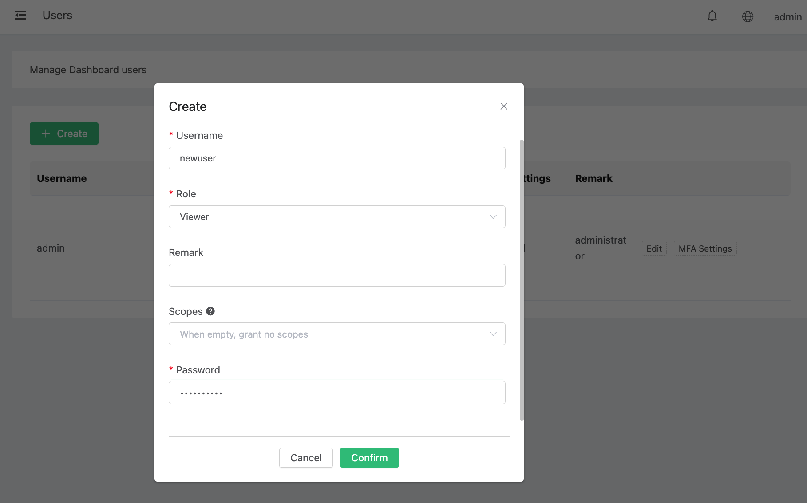

# Dashboard Users and Role Management

EMQX Dashboard supports multi-user access with role-based access control (RBAC). Each Dashboard account is assigned a role that determines what it can view and modify. This page describes how to manage Dashboard users and roles via the Dashboard.

## Roles

EMQX Dashboard has two built-in roles:

| Role | Description |
|------|-------------|
| `administrator` | Full access to all Dashboard features and REST APIs. Can manage users, modules, rules, clients, and all cluster configurations. |
| `viewer` | Read-only access. Can view monitoring data, client lists, subscriptions, and statistics, but cannot modify any configuration. |

:::tip
The default `admin` account has the `administrator` role and cannot be deleted. Make sure to change its password before deploying in production.
:::

## User Management

This section covers creating, viewing, updating, and deleting Dashboard users, and changing passwords. All operations require the `administrator` role.

### Create a User

1. Click **Users** from the left navigation menu.

2. Click **Create**.

3. Fill in the username, password, role, and optional description.

   | Field | Description |
   |-------|-------------|
   | Username | Alphanumeric characters, underscores, and hyphens are allowed. |
   | Password | Must be 8-64 characters and contain at least 2 of the following: letters, numbers, special characters. ASCII only. |
   | Role | `administrator` or `viewer`. Defaults to `viewer`. |
   | Description | Optional description or label for the user. |
   | Enable MFA | When enabled, the user will be prompted to set up MFA on their first login. See [Dashboard Multi-Factor Authentication](./dashboard-mfa.md). |

4. Click **Confirm**.

   

### List Users

Click **Users** from the left navigation menu to view all Dashboard users and their roles.

### Update User

1. Click **Users** from the left navigation menu.
2. Click the **Edit** button for the target user.
3. Update the role or description and click **Confirm**.

You cannot update the username or password through this operation. To change a password, see [Change Password](#change-password).

### Delete User

1. Click **Users** from the left navigation menu.
2. Click the **Delete** button for the target user.
3. Click **Confirm** in the confirmation dialog.

::: warning Important Notice
The built-in `admin` user cannot be deleted. Attempting to delete it will return an error.
:::

:::warning Important Notice
Deleting a user immediately removes their MFA configuration and invalidates all their active tokens. Any active sessions for that user will be terminated.
:::

### Change Password

Users can change their own passwords. Administrators can change the password for any user.

1. Click **Users** from the left navigation menu.
2. Click the **Edit** button for the target user.
3. Enter the new password and click **Confirm**.

**Password requirements:**
- 8 to 64 characters
- Must contain at least 2 different character types from: letters, numbers, special characters
- ASCII characters only

## Category-Based Permission Control

In addition to the role-based access control described above, EMQX Enterprise supports category-based fine-grained permission control for Dashboard users. This allows administrators to narrow a user's access beyond their role by assigning specific permission categories (scopes).

### Permission Categories

EMQX defines a vocabulary of 9 permission categories:

| Category | Applies to | Description |
|----------|-----------|-------------|
| `banned` | API keys + Dashboard users | Blacklist management |
| `rule_engine` | API keys + Dashboard users | Rule engine and actions |
| `resources` | API keys + Dashboard users | Connectors and bridges |
| `plugins` | API keys + Dashboard users | Plugin management |
| `modules` | API keys + Dashboard users | Module configuration |
| `others` | API keys + Dashboard users | Miscellaneous endpoints |
| `user_management` | Dashboard users only | Manage other Dashboard accounts |
| `mfa_management` | Dashboard users only | Manage other users' MFA |
| `app_management` | Dashboard users only | Manage API keys |

Categories 1–6 (pre-existing business categories) apply to both API keys and Dashboard users. Categories 7–9 are exclusive to Dashboard users and cannot be assigned to API keys.

### Role-Scope Compatibility

| Role | Allowed Scopes | Role Default (no explicit scopes) |
|------|---------------|-----------------------------------|
| `administrator` | All 9 categories | Pre-upgrade behaviour: access to all endpoints |
| `viewer` | 4 common + 3 dashboard-only categories. `user_management` and `app_management` are **not** allowed for viewers. | 4 common + `mfa_management`. GET-only endpoints remain accessible because GET bypasses the scope layer. |

The self-service paths — a user changing their own password, managing their own MFA, and logging out — are always permitted regardless of scopes.

### Set Scopes for a User

When creating or updating a user, administrators can set an optional `scopes` field to restrict the user's permissions:

- **Omitted** (no change / use role default): The user receives the pre-upgrade role-based behaviour.
- **Empty array `[]`**: The user is denied access to all scope-gated endpoints (self-service paths remain available).
- **Non-empty array**: The user can only access endpoints that belong to the listed categories.

:::tip Example
To create a viewer who can only see monitoring data and manage their own MFA:
```
scopes: ["modules", "mfa_management"]
```
:::

:::warning Important Notice
Viewers cannot be assigned `user_management` or `app_management`. Attempting to do so will return an error.
:::

### Default Administrator Protection

The default administrator account configured by `dashboard.default_user.login` has additional safeguard:

- It cannot be demoted to the `viewer` role.
- It cannot have an explicit `scopes` field (it always holds the full category set).
- It cannot be deleted.

These protections ensure the cluster always has a break-glass administrator account that can recover from accidental permission misconfigurations.

## SSO Users

When a user logs in through SAML Single Sign-On (SSO) for the first time, EMQX automatically creates a Dashboard account for that user with the `viewer` role.

- SSO users are assigned a random internal password and cannot log in with a username and password directly.
- Administrators can change an SSO user's role through the Dashboard Users page.
- See the [SAML 2.0 Single Sign-On](../modules/saml_sso.md) documentation for configuration details.

:::tip
To grant an SSO user administrator access, edit the user on the **Users** page and change their role to `administrator`.
:::
