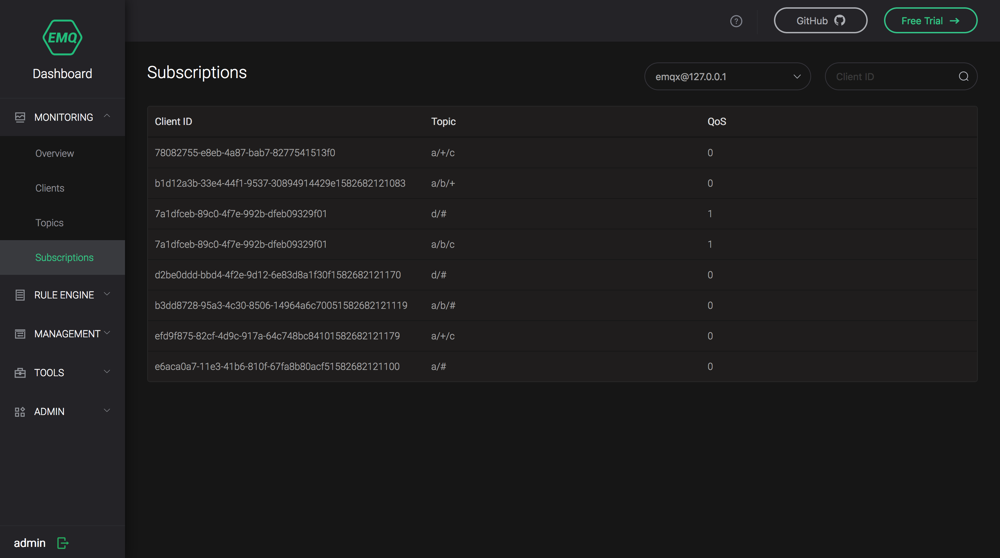
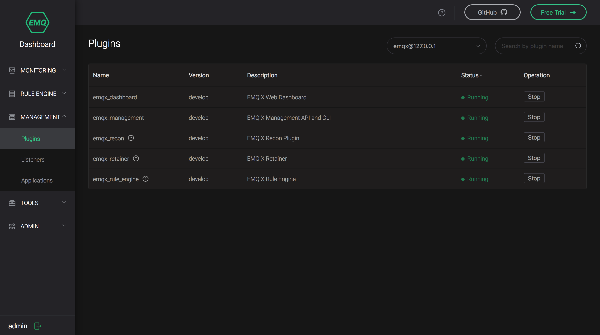
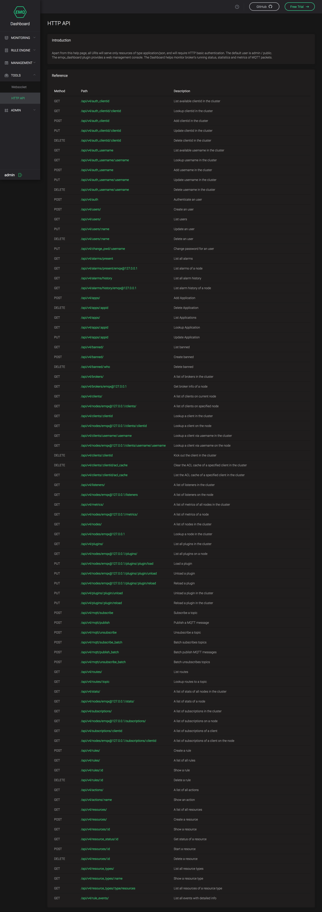

---
# 编写日期
date: 2020-02-25 17:15:26
# 作者 Github 名称
author: tigercl
# 关键字
keywords:
# 描述
description:
# 分类
category: 
# 引用
ref: undefined
---

# Dashboard

## Introduction

EMQ X Broker provides Dashboard to facilitate users to manage equipment and monitor related indicators. Through Dashboard, you can view the basic information of the server, load and statistical data, you can view the connection status of a client and even disconnect it, and you can also dynamically load and unload specified plug-ins. In addition, EMQ X Dashboard also provides a visual operation interface of the rule engine, and also integrates a simple MQTT client tool for user testing.

## Start Dashboard

The EMQ X Dashboard function is implemented by the [emqx-dashboard](https://github.com/emqx/emqx-dashboard) plugin, which is enabled by default, and it will be automatically loaded when the EMQ X Broker starts. If you wish to disable the Dashboard function, you can modify `{emqx_dashboard, true}` in  `data/loaded_plugins` to `{emqx_dashboard, false} `.

```bash
{emqx_dashboard, true}.
```

## View Dashboard

EMQ X Dashboard is a web application, and you can access it directly through the browser without installing any other software.

When EMQ X Broker runs successfully on your local computer and EMQ X Dashboard is enabled by default, you can visit http://localhost:18083 to view your Dashboard. The default user name is admin and the password is public .

## Configure Dashboard

You can view or modify the configuration of EMQ X Dashboard in  `etc/plugins/emqx_dashboard.conf`. Note that `etc` here does not refer to the system directory, see [directory structure](directory.md#) for details.

EMQ X Dashboard configuration items can be divided into two parts of default user and listener:

**Default User** 

EMQ X Dashboard can configure multiple users, but only the default user can be configured in the configuration file.

It should be noted that once you change the password of the default user through Dashboard, the relevant information of the default user will be based on your latest changes on the Dashboard, and the default user configuration in the configuration file will be ignored.

**Listeners**

EMQ X Dashboard supports both HTTP and HTTPS Listeners, but only HTTP Listeners with a listening port of 18083 are enabled by default. For the introduction of Listeners, please refer to [Configuration Instructions](config.md#).

For the detailed configuration item description of Dashboard, please refer to [Configuration Item](../configuration/configuration.md).

## Dashboard interface


In order to enable users to quickly locate and switch the current position during operation and browsing, EMQ X Dashboard adopts the mode of side navigation. By default, Dashboard includes the following first-level navigation items:

| Navigation  | Description                                                  |
| ----------- | ------------------------------------------------------------ |
| MONITORING  | Provide display pages for server and client monitoring information |
| RULE ENGINE | Provide a visual operation page of the rule engine           |
| MANAGEMENT  | Provide management pages for extensions of plugins and applications |
| TOOLS       | Provide WebSocket client tool and HTTP API quick check page  |
| ADMIN       | Provide Dashboard user management and display settings pages |

### MONITORING

EMQ X Dashboard provides a very rich data monitoring project, that completely covers the server and client. All of this information will be reasonably displayed to users on the page under `MONITORING`.

#### Overview

As the default display page of Dashboard, `Overview` provides detailed information of EMQ X Broker ’s current nodes and key information of other nodes in the cluster to help users quickly get the status of each node.


#### Clients

The `Clients` page provides a list of clients connected to the specified node, and also supports direct client search via `Client ID`. In addition to viewing the basic information of the client, you can also click the `Kick Out` button on the right side of each record to kick out the client. Note that this operation will disconnect the client and terminate its session.

The `Clients` page uses a snapshot to display the client list. Therefore, when the client status changes, the page does not automatically refresh, and you need to manually refresh the browser to get the latest client data.


If you can not get the information you need in the client list, you can click `Client ID` to view the detailed information of the client.


We divided the various fields in the client details into connection, session and metrics. The following is the description of each field:

Connection

| Field             | Description                                                  |
| ----------------- | ------------------------------------------------------------ |
| Node              | Name of the node to which the client connects                |
| Client ID         | Client ID                                                    |
| Username          | The user name used when the client connects, for security reasons, the password will not be displayed |
| Protocol          | The protocol name and version used by the client             |
| IP Address        | The client's network IP address, which can be IPv4 or IPv6   |
| Port              | Client source port                                           |
| Is Bridge         | Indicate whether the client connects via bridge              |
| Connected At      | Client connection time                                       |
| Disconnected At   | Client offline time                                          |
| Connection Status | Client connection status                                     |
| Zone              | Indicates the configuration group used by the client         |
| Keepalive         | Keep-alive time, unit: second                                |

**Session**

| Field                         | Description                                   |
| ---------------------------------- | ------------------------------------------------ |
| Clean Session                      | Indicates whether the client has used a brand new session |
| Expiry Interval                    | Session expiration interval, unit: seconds                   |
| Created At                         | Session creation time                |
| Subscriptions Count                | Current number of subscriptions      |
| Maximum Subscriptions Count        | Maximum number of subscriptions allowed |
| Inflight Window Size                | Current inflight window size, please refer to [InFlight Window and Message Queue](../advanced/inflight-window-and-message-queue.md#) |
| Maximum Inflight Window Size        | Maximum size of inflight window  |
| Message Queue Size                 | Current message queue size, please refer to [InFlight Window and Message Queue](../advanced/inflight-window-and-message-queue.md#) |
| Maximum Message Queue Size         | Maximum size of message queue |
| Uncomfirmed PUBREC Packets         | Number of unconfirmed PUBREC messages |
| Maximum Uncomfirmed PUBREC Packets | Maximum number of unconfirmed PUBREC messages allowed |

Metric

| Field                         | Description                         |
| ---------------------------------- | -------------------------------------- |
| Number of Bytes Received           | Number of bytes received by EMQ X Broker (same below) |
| Number of TCP Packets Received     | Number of TCP Packets Received |
| Number of MQTT Packets Received    | Number of MQTT Packets Received |
| Number of PUBLISH Packets Received | Number of PUBLISH Packets Received |
| Number of Bytes Sent               | Number of Bytes Sent     |
| Number of TCP Packets Sent         | Number of TCP Packets Sent |
| Number of MQTT Packets Sent        | Number of MQTT Packets Sent |
| Number of PUBLISH Packets Sent     | Number of PUBLISH Packets Sent |

In the `Subscriptions` tab of the client details, you can view the subscription information of the current client, and create or cancel subscriptions:


#### Subscriptions

The `Subscriptions` page provides all subscription information under the specified node, and supports users to query all subscriptions of the specified client through the `Client ID`.



### RULE ENGINE

The rule engine of EMQ X Broker can flexibly process messages and events, such as converting the message into a specified format and storing it in a database table or resending it to the message queue. In order to facilitate users to better use the rules engine, EMQ X Dashboard provides corresponding visual operation pages, and you can click the `RULE ENGINE` navigation item to access these pages.

Due to the complexity of the related concepts of the rule engine, the operations involved may occupy a considerable amount of space. Considering your reading experience, we will introduce the rule engine through additional documents of  [rule-engine](../rule/rule-engine.md#).

### MANAGEMENT

Currently, the EMQ X Dashboard's `MANAGEMENT` navigation item mainly includes an monitoring management page for extension plug-in  and management page of AppID and AppSerect for HTTP API authentication.

#### Plugins

The `Plugins` page lists all the plug-ins that EMQ X Broker can find, including the official plug-ins of EMQ X and the plug-ins that you developed in accordance with the official standards of EMQ X. You can check the current running status of the plug-ins and start and stop the plug-ins at any time on this page.


You can see that in addition to [emqx-dashboard](https://github.com/emqx/emqx-dashboard), EMQ X Broker will also start  other 4 plugins by default:



#### Applications

The `Applications` page lists the currently created applications. You can perform operations such as creating applications, temporarily disabling or starting access permissions for an application on this page. EMQ X Broker will create a default application with AppID of `admin` and AppSecret of `publish` for users to access for the first time:


You can click the `New App` button in the upper right corner of the `Application` page to create a new application, where AppID and AppSecret are required. After the creation is complete, you can click the `View` button to view the application details, and AppSecret will also be displayed in the details. The following is a description of the relevant fields:

| Field        | Description                                                  |
| ------------ | ------------------------------------------------------------ |
| AppID        | It is used to distinguish different applications, so it is not repeatable. When creating an application, Dashboard will automatically generate a random suggested application ID for you |
| AppName      | It can be repeated, but for your own convenience, we do not recommend using a duplicate application name |
| AppSecret    | The application key assigned by EMQ X Broker that can be viewed in the application details |
| Expired date | The expiration time of the application, the default is to never expire |
| Remark       | Your description of the application, facilitate later management |
| Status       | There are only two types of application status: Allowed and Denied. In Denied status, EMQ X Broker will deny the access request of HTTP API using the AppID and App Secret |

### TOOLS

Currently, the `TOOLS`  navigation item of EMQ X Dashboard mainly includes WebSocket client tool page and HTTP API quick check page.

#### Websocket

The `Websocket` page provides you with a simple but effective WebSocket client tool, which includes connection, subscription and publishing functions. At the same time, you can view the message data you send and receive, we hope it can help you quickly complete test verification of certain scenarios or functions:


#### HTTP API

The `HTTP API` page lists all the HTTP APIs currently supported by EMQ X Broker and their descriptions:



### ADMIN

#### Users

You can view and manage users who can access and operate Dashboard on the `Users` page:


#### Settings

Currently, EMQ X Dashboard only supports the modification of the topic and language settings:


#### Help

If you encounter any problems in using EMQ X Broker, we provide you with links to FAQ and other documents on the `Help` page. If our existing documents still cannot solve your problem, you can go to our open source community on Github to consult our technical staff.


